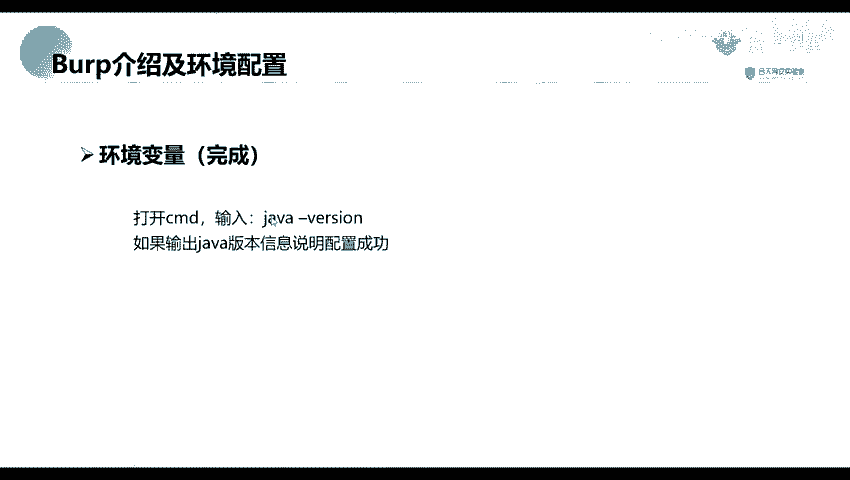

# 网络安全入门：P17：Burp Suite介绍及环境配置 🛠️

在本节课中，我们将要学习渗透测试中一个极其重要的工具——Burp Suite。我们将了解它是什么，如何配置其运行所需的Java环境，并简要概述其核心功能。

## 第一部分：Burp Suite介绍与环境配置

上一节我们介绍了课程的整体安排，本节中我们来看看渗透测试的神器Burp Suite。


Burp Suite是一个集成化的渗透测试工具。它集合了多种渗透测试组件，使我们能够以自动化或手动方式更有效地完成对Web应用的渗透测试和攻击。在渗透测试过程中，Burp Suite可以使我们的工作变得更容易和方便。只要我们熟悉这个工具的使用，相关工作就可以变得很轻松以及高效。


由于它是由Java语言编写的，得益于Java语言自身的跨平台性，这个软件的使用可以更加方便。例如，我们可以在Windows、Linux以及macOS（苹果系统）上进行使用。

因为它由Java编写，所以我们需要配置Java环境。

## 第二部分：Java环境配置

由于Burp Suite依赖Java环境，因此我们需要先确保系统已正确安装并配置Java。Java环境配置在之前的课程中已有详细讲解，这里我们简单回顾一下关键步骤。

以下是配置Java环境变量的基本流程：

1.  下载并安装Java开发工具包（JDK）。
2.  右键点击“此电脑”，选择“属性”，然后进入“高级系统设置”。
3.  点击“环境变量”按钮。
4.  在“系统变量”部分，新建一个变量。
    *   **变量名**：`JAVA_HOME`
    *   **变量值**：JDK的安装路径（例如：`C:\Program Files\Java\jdk1.8.0_291`）
5.  编辑“系统变量”中的`Path`变量，在其值末尾添加：`;%JAVA_HOME%\bin`

实际上，从JDK 8版本开始，安装程序通常会**自动配置**环境变量。安装后，系统可能已在特定目录（如`C:\Program Files (x86)\Common Files\Oracle\Java`）下完成了配置。

验证环境是否配置成功的方法是打开命令提示符（CMD）窗口，输入以下命令：

```bash
java -version
```

如果命令行成功输出Java的版本信息，则说明环境配置成功。如果未出现版本信息，则需要按照上述步骤进行手动配置。

## 第三部分：课程内容概述

在成功配置环境后，本课程后续将主要涵盖以下两个核心部分：

1.  **Burp Suite的破解与代理抓包**：Burp Suite专业版是收费工具，社区版免费。我们将学习如何使用专业版进行破解，并设置代理以实现对网络流量的抓取和分析。
2.  **常见模块介绍与使用**：我们将深入了解Burp Suite的主要功能模块，并学习其基本操作方法。



---

本节课中我们一起学习了Burp Suite工具的基本概念及其重要性，并完成了运行它所必需的Java环境配置。掌握这些基础是后续进行实际渗透测试操作的关键第一步。下一节，我们将开始学习如何安装、配置并使用Burp Suite进行代理抓包。