# 网络安全系统教程：P18：Burp Suite破解及代理抓包 🛠️

在本节课中，我们将学习Burp Suite Professional的激活方法，并掌握如何配置代理以拦截和修改HTTP/HTTPS网络流量。这是进行Web应用安全测试的基础技能。

## Burp Suite Professional 激活步骤

上一节我们介绍了Burp Suite的基本概念，本节中我们来看看如何激活其专业版。激活过程需要用到下载包中提供的特定文件。

以下是详细的激活步骤：

1.  在下载的文件包中找到 `burploader.jar` 和 `keygen.jar` 两个文件。
2.  双击运行 `burploader.jar` 文件。
3.  程序启动后，会弹出一个窗口，点击其中的 **Run** 按钮。
4.  点击后，会进入Burp Suite Professional的激活界面。
5.  运行 `keygen.jar` 激活程序，复制其生成的 **License** 序列号。
6.  将复制的序列号粘贴到Burp激活界面的 **License Text** 输入框中。
7.  点击激活界面右侧的 **Manual activation** 按钮，进入手动激活流程。
8.  将激活界面 **Manual activation** 步骤中 **Step 2** 的请求码复制下来。
9.  将复制的请求码粘贴到 `keygen.jar` 程序的 **Activation Request** 输入框中。
10. `keygen.jar` 程序会自动在 **Activation Response** 框中生成响应码。
11. 复制全部的响应码，将其粘贴回Burp激活界面 **Manual activation** 步骤的 **Step 3** 输入框中。
12. 点击 **Next** 按钮，即可完成激活。

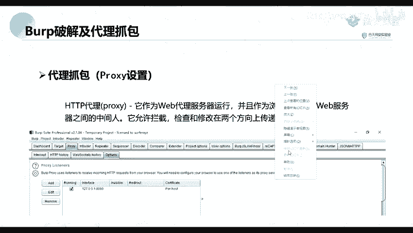

## 代理抓包原理与配置

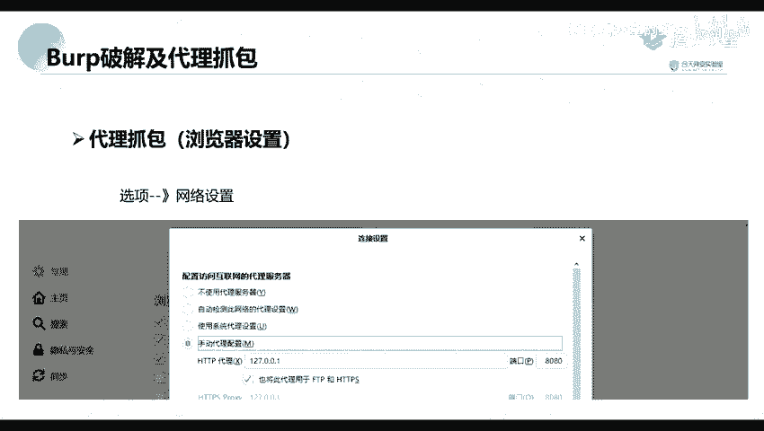

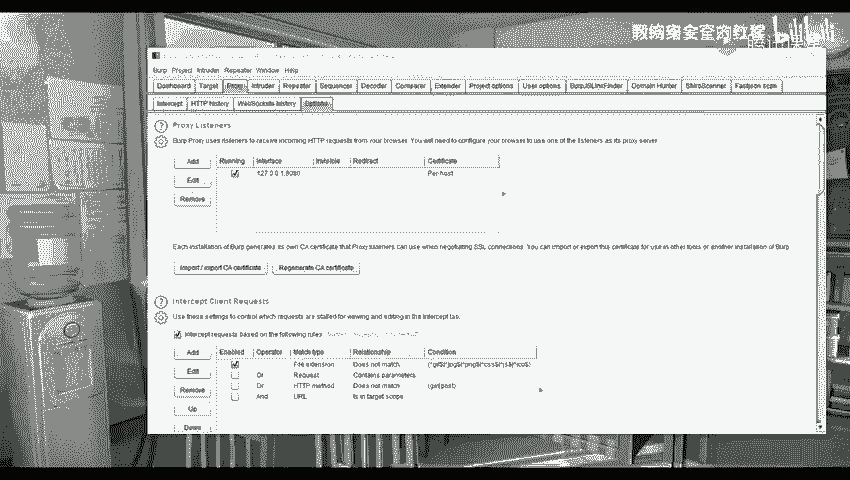

成功激活Burp Suite后，我们就可以使用其核心的代理功能。Burp Suite作为一个中间人代理，能够拦截、查看和修改客户端（如浏览器）与服务器之间的所有HTTP/HTTPS通信数据。

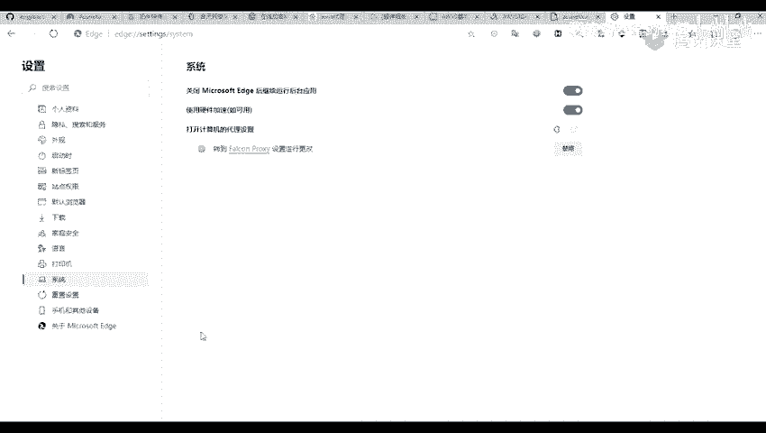

### 代理工作原理

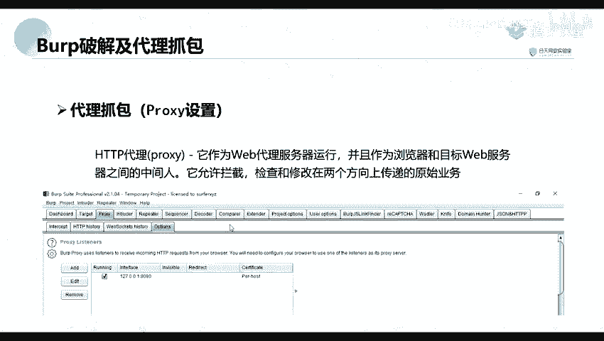

Burp Suite默认监听本机（`127.0.0.1`）的 `8080` 端口。为了让浏览器的流量经过Burp，我们需要将浏览器的代理服务器设置为这个地址和端口。

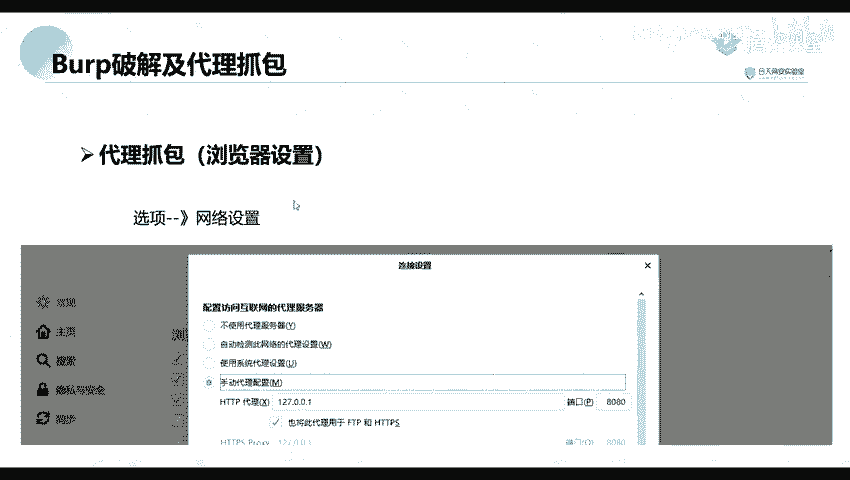

以下是配置浏览器代理的通用方法：

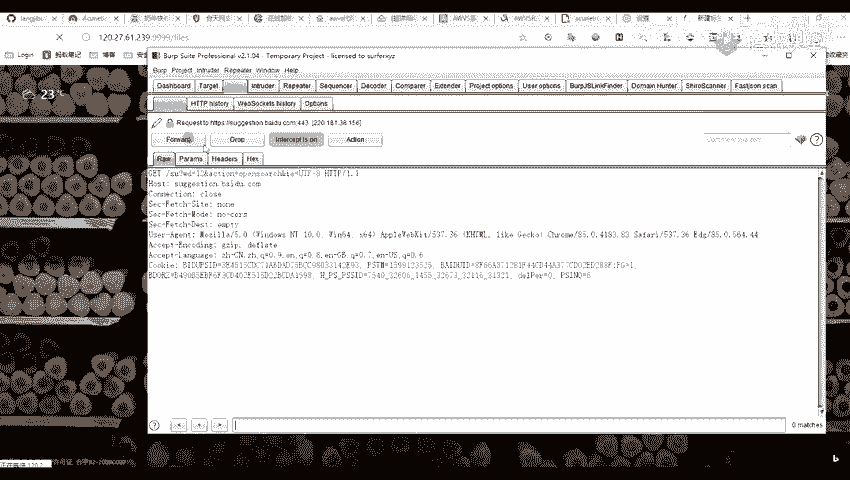

*   **Microsoft Edge / Google Chrome**：进入“设置” > “系统” > “打开计算机的代理设置”，在系统代理设置中配置。
*   **Mozilla Firefox**：进入“选项” > “网络设置”，在底部找到并点击“设置”。选择“手动代理配置”，将HTTP代理设置为 `127.0.0.1`，端口设置为 `8080`。

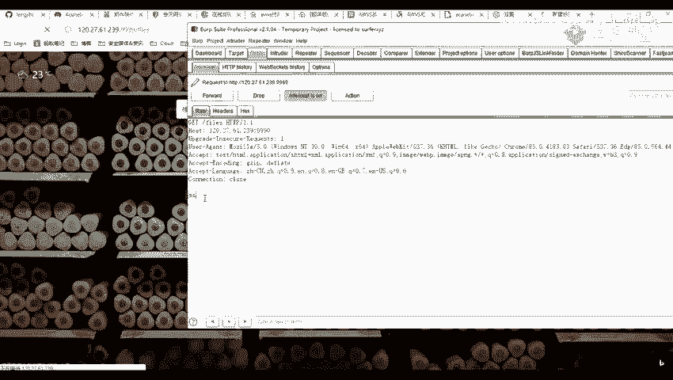

配置完成后，确保Burp Suite **Proxy** 标签页下的 **Intercept** 子标签中，拦截功能处于 **On** 状态。此时，在浏览器中访问任何网址，请求都会被Burp截获并显示在界面中，你可以在此处对请求进行任意修改，再转发给服务器。

### HTTPS流量抓取配置

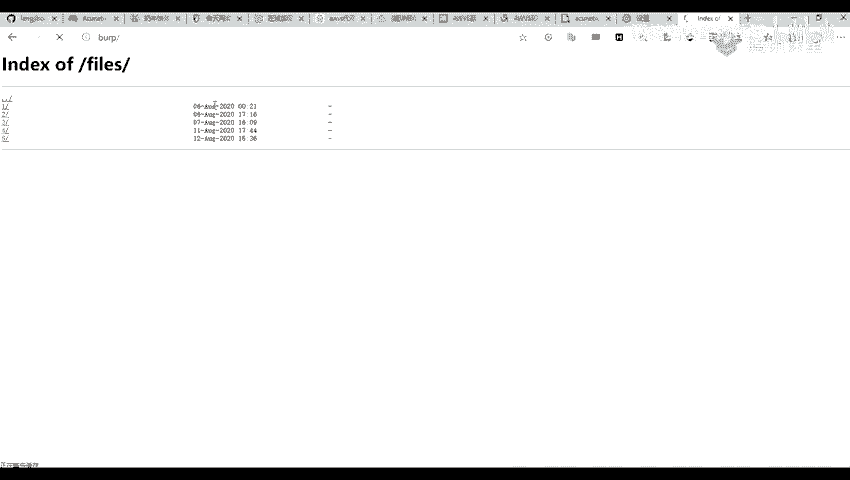

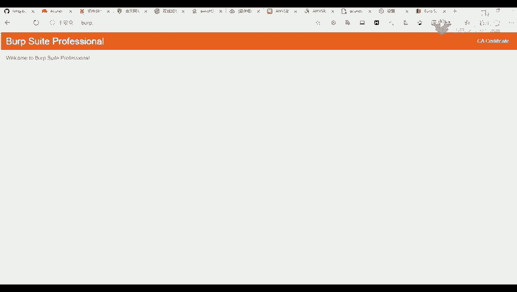

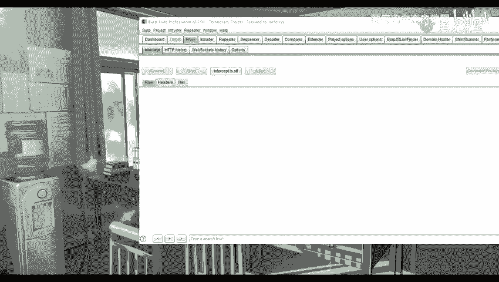

默认情况下，Burp无法直接解密HTTPS流量。要拦截HTTPS请求，需要在浏览器中安装Burp Suite生成的CA证书。

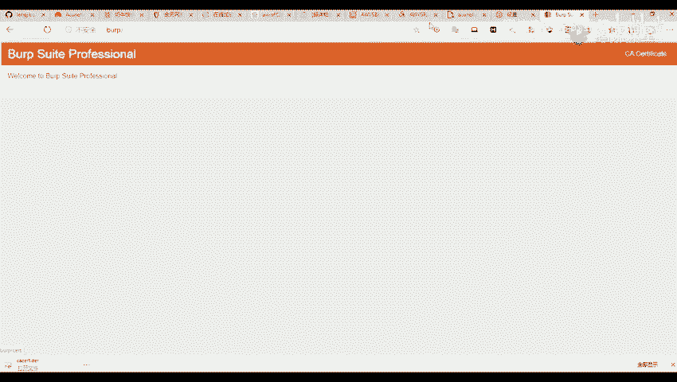

以下是安装CA证书的步骤：

1.  确保浏览器代理已正确指向Burp（`127.0.0.1:8080`）。
2.  在浏览器中访问 `http://burp` 或 `http://127.0.0.1:8080`。
3.  点击页面右上角的 **CA Certificate** 按钮，下载证书文件（通常为`.der`格式）。
4.  在浏览器设置中找到“证书管理”或“隐私与安全”下的证书管理入口。
5.  在“证书管理器”中，选择“授权中心”或“受信任的根证书颁发机构”选项卡。
6.  点击“导入”按钮，选择刚才下载的证书文件，并按照提示完成导入。
7.  导入成功后，你可以在证书列表中看到颁发者为 **PortSwigger CA** 的证书。
8.  完全关闭浏览器并重新打开，即可开始拦截HTTPS站点的流量。

### 使用插件简化代理切换

为了在日常浏览和测试之间快速切换代理设置，可以使用浏览器插件来管理代理。

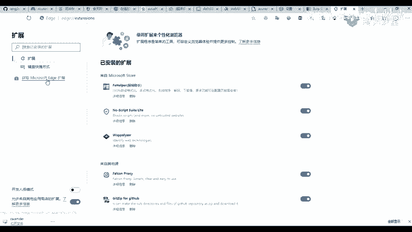

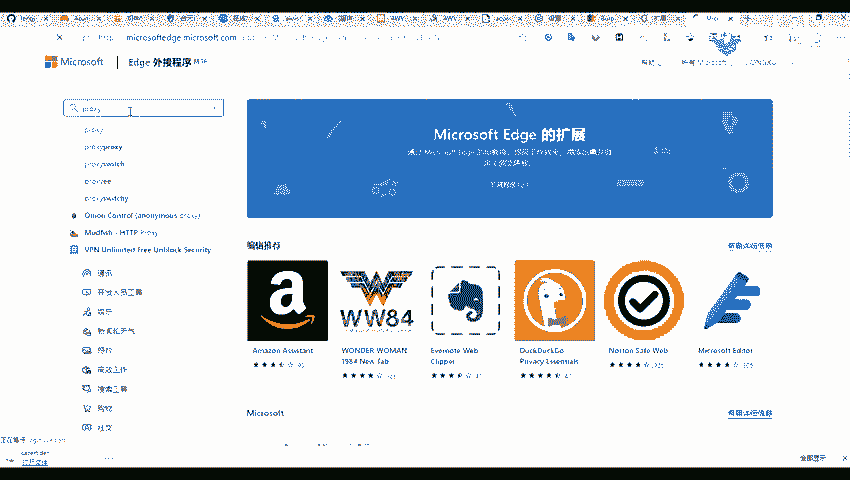

以下是使用代理切换插件的建议：

1.  在浏览器的扩展商店中搜索代理管理插件，例如 **SwitchyOmega**。
2.  安装插件后，新建一个情景模式（如命名为“Burp”）。
3.  在该情景模式的设置中，选择代理协议为 **HTTP**，代理服务器填写 `127.0.0.1`，端口填写 `8080`。
4.  保存设置后，你可以通过点击插件图标，一键在“直接连接”和“Burp代理”模式之间切换，极大提高测试效率。

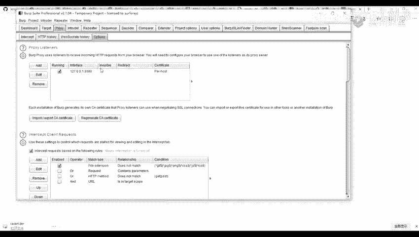

本节课中我们一起学习了Burp Suite Professional的详细激活流程，理解了代理抓包的基本原理，并掌握了配置浏览器代理、安装CA证书以抓取HTTPS流量以及使用插件简化操作的方法。这些是后续进行Web漏洞探测、渗透测试的必备基础。