# 网络安全系统教程：P19：Burp Suite模块介绍及应用 🛠️

在本节课中，我们将学习Burp Suite这一核心渗透测试工具的主要模块及其基本应用。Burp Suite包含多个功能模块，我们将重点介绍其中最常用的几个，并通过实例演示其操作，帮助你理解如何利用这些模块进行基础的Web安全测试。

## 仪表盘与核心模块概览 📊

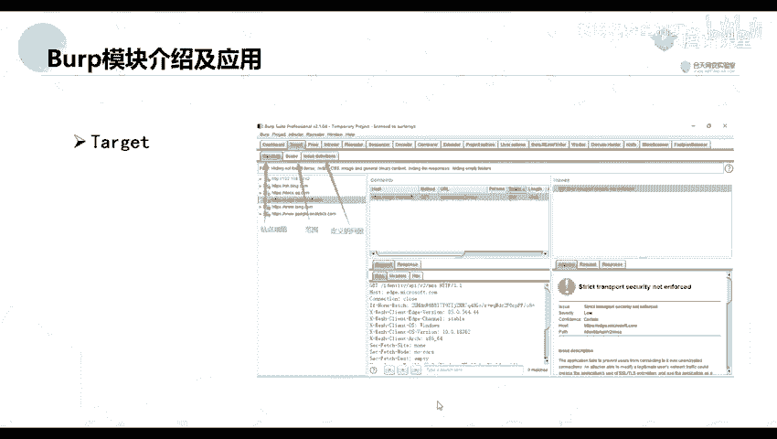

上一节我们了解了Burp Suite的基本定位，本节中我们来看看它的主界面和核心功能模块。

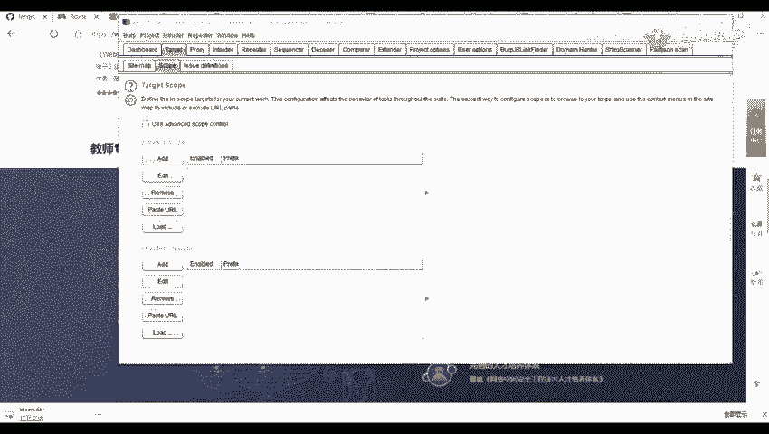

Burp Suite的主界面被称为仪表盘（Dashboard），它集成了多个功能窗口。以下是其主要组成部分：

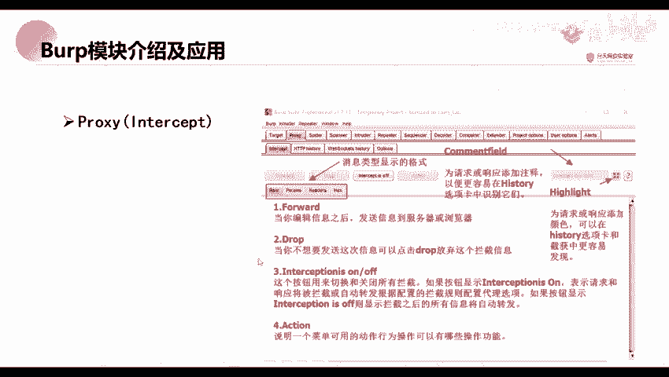

*   **Target（目标）**：此模块包含站点地图（Site map）和范围（Scope）设置。站点地图用于展示通过爬虫（Spider）发现的网站目录结构，范围则用于定义测试的目标边界。
*   **Proxy（代理）**：这是最核心的模块之一，用于拦截、查看和修改浏览器与服务器之间的HTTP/HTTPS流量。其子功能包括拦截开关（Intercept is on/off）、放行（Forward）、丢弃（Drop）以及查看历史请求（HTTP history）。
*   **Intruder（入侵者）**：该模块用于对Web应用程序进行自动化攻击，例如暴力破解（Brute-force）、模糊测试（Fuzzing）等。它允许用户自定义攻击载荷（Payload）和攻击模式。
*   **Repeater（重放器）**：此模块用于手动修改并重新发送单个HTTP请求，是分析应用程序响应、测试参数变化的常用工具。
*   **Scanner（扫描器）**：Burp Suite的主动和被动漏洞扫描器，能自动检测常见的安全漏洞。
*   **Extender（扩展）**：支持加载自定义插件以扩展Burp Suite的功能。
*   **Logger（日志）**：记录所有通过Burp Suite的流量，便于调试和审计。
*   **Project options / User options（项目/用户选项）**：用于配置项目和用户级别的各种设置。

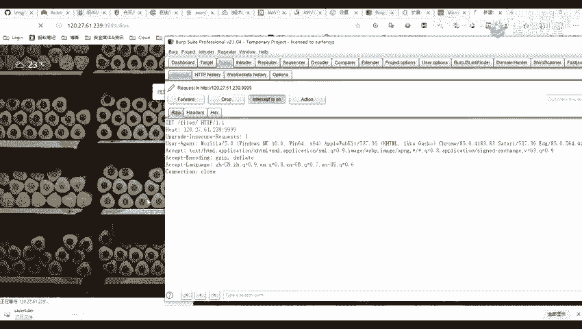

## 代理模块详解 🔄

代理模块是Burp Suite的流量枢纽。我们通过设置浏览器代理，将所有请求先发送到Burp Suite进行处理。

### 拦截与控制

在Proxy -> Intercept标签页下，可以控制请求的拦截。

*   **拦截开关（Intercept is on/off）**：控制是否拦截经过的请求。开启时，请求会被暂停以供查看和修改；关闭时，请求直接通过。
*   **放行（Forward）**：将当前拦截的请求发送给目标服务器。
*   **丢弃（Drop）**：放弃发送当前拦截的请求。
*   **动作（Action）**：提供更多操作选项，如将请求发送到其他模块（如Intruder, Repeater）。

### 历史记录与过滤

所有流经Burp Suite的请求都会被记录在Proxy -> HTTP history中。这个视图提供了丰富的过滤功能，方便我们筛选和分析。

以下是HTTP历史记录表的主要列及其含义：

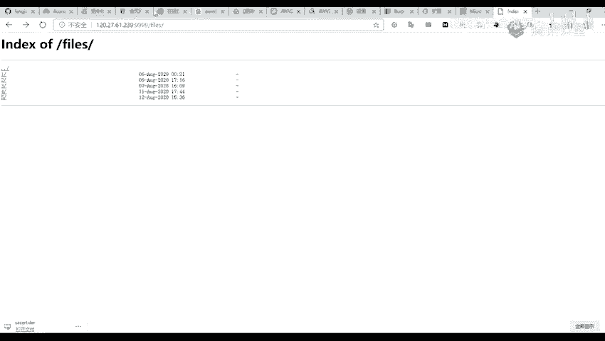

*   **#**：请求序号。
*   **Host**：目标服务器的主机名或IP地址。
*   **Method**：HTTP请求方法，如GET或POST。
*   **URL**：请求的路径和参数。
*   **Params**：指示请求是否包含参数。
*   **Edited**：指示请求是否被手动修改过。
*   **Status**：HTTP响应状态码（如200， 404）。
*   **Length**：响应内容的字节大小。
*   **MIME type**：响应内容的类型（如text/html， application/json）。
*   **Extension**：文件扩展名。
*   **Title**：HTML页面的标题。
*   **Comment**：用户添加的注释。
*   **SSL**：是否使用SSL/TLS加密。
*   **IP**：目标服务器的IP地址。
*   **Cookies**：请求中包含的Cookies。
*   **Time**：请求发生的时间。
*   **Listener port**：Burp Suite监听的代理端口。

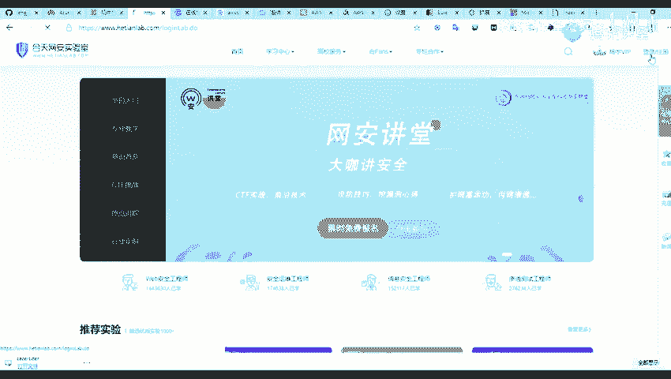

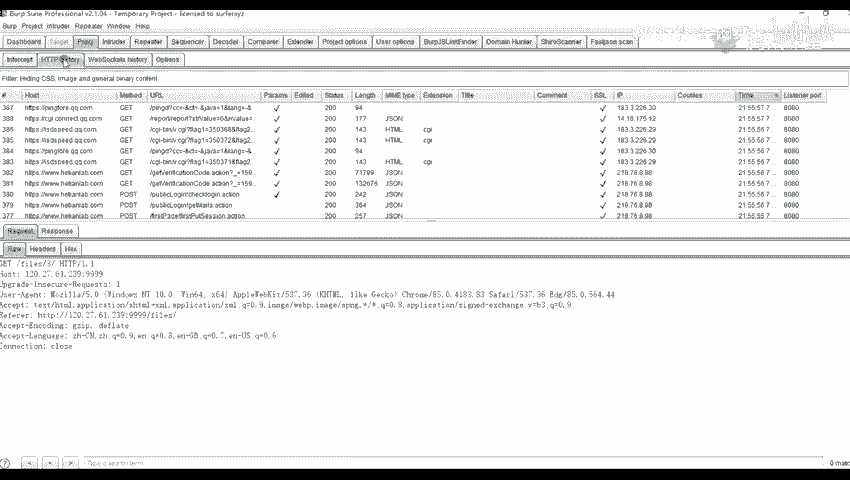

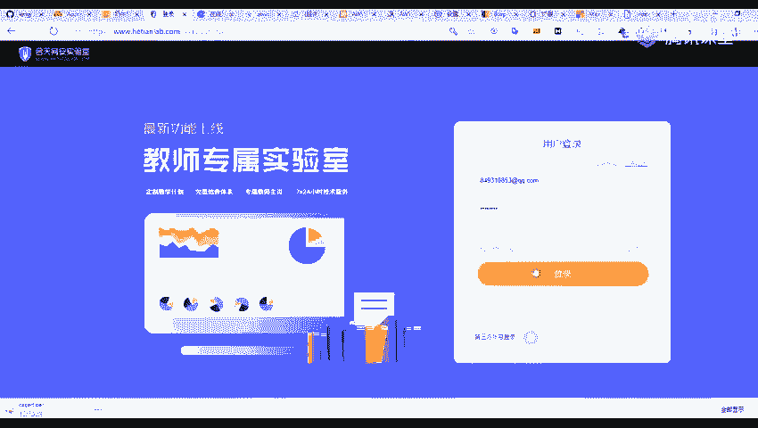

你可以通过顶部的过滤器（Filter）按钮，按请求类型、MIME类型、状态码等条件对历史记录进行筛选。

## 入侵者模块实战 ⚔️

入侵者模块用于自动化定制攻击。最常见的用途是进行暴力破解攻击。

### 发送请求到Intruder

首先，需要将一个包含参数的请求（如登录请求）发送到Intruder模块。通常的做法是在Proxy历史记录或Repeater中，右键点击目标请求，选择 `Send to Intruder`。

### 配置攻击位置与类型

在Intruder的 `Positions` 标签页，需要定义攻击的位置（即需要爆破的参数）。Burp Suite会自动用`§`符号标记出它认为的可变参数，你也可以手动清除并重新添加。

攻击类型（Attack type）有四种：

1.  **Sniper（狙击手）**：使用一个Payload集合，依次对每个标记位置进行测试。适用于逐个测试参数。
2.  **Battering ram（攻城锤）**：使用一个Payload集合，同时对所有标记位置插入相同的值进行测试。
3.  **Pitchfork（草叉）**：为每个标记位置配置一个独立的Payload集合，攻击时会并行遍历这些集合。例如，用户名字典A和密码字典B会按顺序一一对应进行组合尝试（A1+B1， A2+B2...）。
4.  **Cluster bomb（集束炸弹）**：为每个标记位置配置独立的Payload集合，并尝试所有可能的组合（笛卡尔积）。例如，用户名字典A（3个值）和密码字典B（3个值）会产生3*3=9次请求。这是暴力破解用户名和密码最常用的模式。

### 配置攻击载荷

在 `Payloads` 标签页，为每个标记位置（Payload set）设置具体的测试数据。可以手动添加、从文件加载或使用内置的Payload生成器。

*   **Payload set**：选择当前正在配置哪个标记位置的Payload。
*   **Payload type**：选择Payload的类型，如简单列表（Simple list）、数字（Numbers）、暴力破解（Brute forcer）等。
*   **Payload Options**：根据选择的类型，在此处添加具体的测试值。

配置完成后，点击右上角的 `Start attack` 按钮开始攻击。攻击结果会以表格形式展示，可以通过长度（Length）、状态码（Status）等字段的差异来判断哪些Payload可能成功了。

## 重放器模块应用 🔁

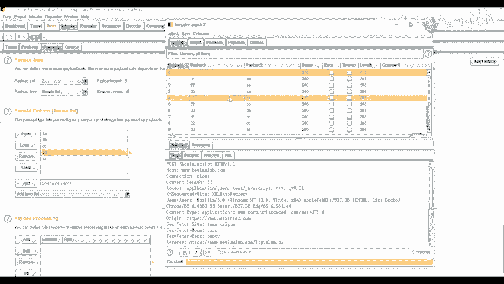

重放器模块是手动测试的利器。它允许你修改一个请求的任何部分，并反复发送，同时观察服务器的响应变化。

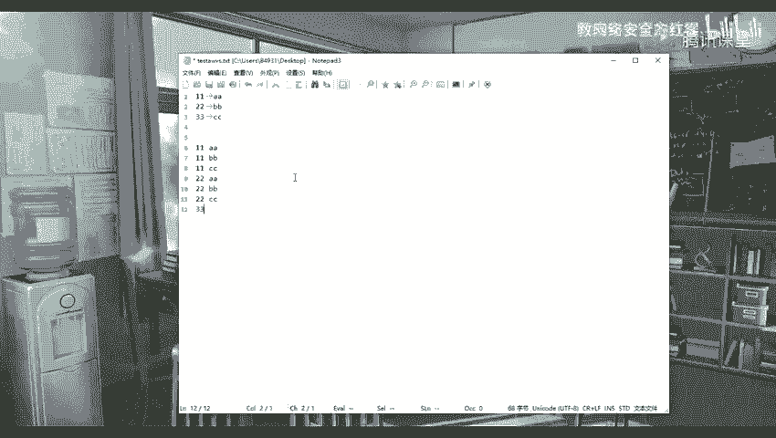

### 基本操作

1.  将任意请求（从Proxy、Target或Intruder）通过右键菜单发送到Repeater。
2.  在Repeater界面，左侧是请求编辑器，右侧是响应查看器。
3.  在请求编辑器中修改参数、方法、头部等信息。
4.  点击 `Send` 按钮发送修改后的请求。
5.  在右侧查看服务器的响应，分析结果。

### 实用功能

*   **历史记录**：顶部会保留本次会话中发送过的所有请求记录，可以点击回溯。
*   **撤销/重做**：请求编辑器支持撤销（Ctrl+Z）和重做（Ctrl+Y）修改。
*   **对比**：可以将不同请求的响应进行对比，高亮显示差异。

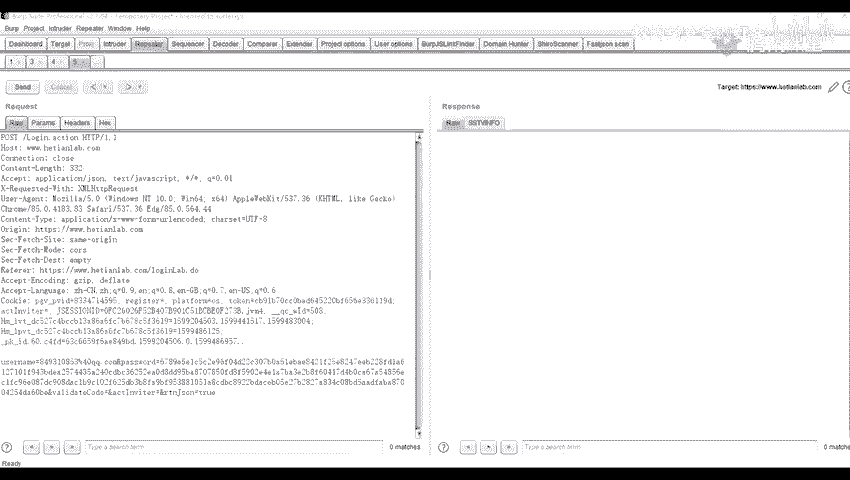

本节课中我们一起学习了Burp Suite的核心模块：仪表盘、代理、入侵者和重放器。你掌握了如何利用代理拦截流量，使用入侵者进行自动化攻击测试，以及通过重放器手动深入分析请求与响应。这些是Web渗透测试中最基础且最重要的操作技能，请务必通过实践加以巩固。