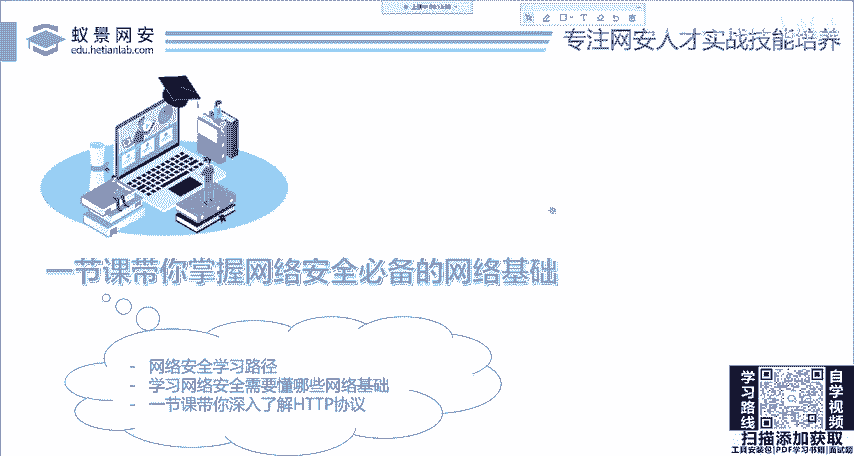
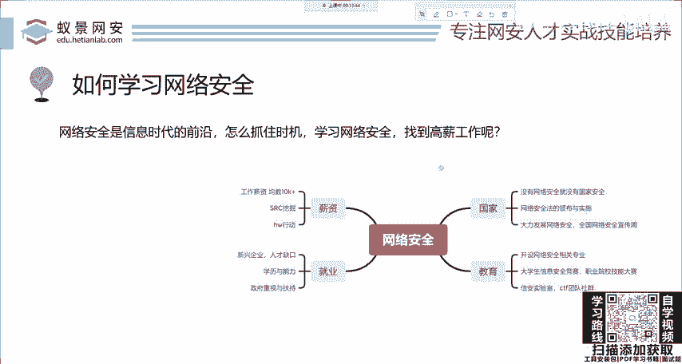
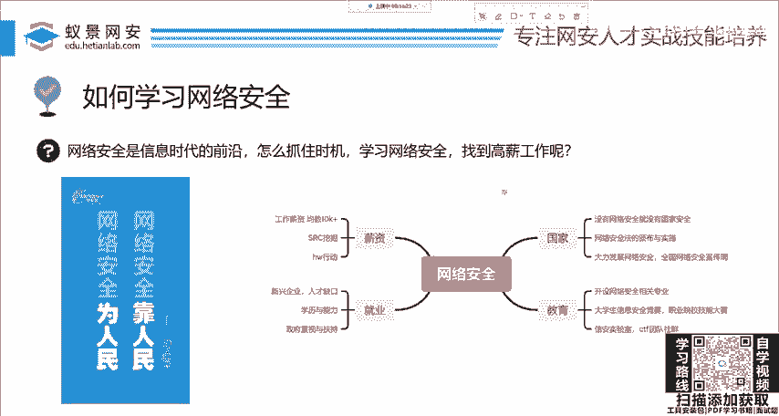
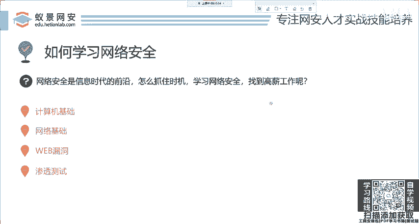
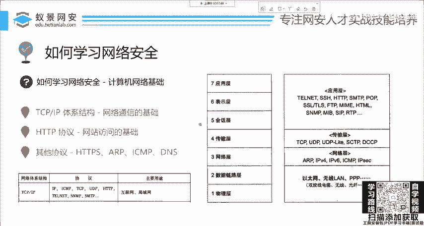

# 网络安全系统教程：1：HTTP基础-计算机网络基础 🛡️

在本节课中，我们将要学习网络安全最基础的入门知识——计算机网络基础，特别是HTTP协议。这是理解网站如何工作、如何发现和利用网站漏洞的第一步。

## 课程概述

网络安全是信息时代的前沿领域，无论是大学招聘、CTF比赛还是漏洞赏金计划，都提供了丰厚的机会。许多同学希望学习网络安全，但往往找不到系统、正确的学习路径。本课程旨在提供一个清晰、循序渐进的学习框架。





## 学习路径：从基础到实战

以下是学习网络安全的四个关键步骤，它们构成了一个完整的学习路径。

1.  **计算机技术基础**：这是所有IT领域学习的基石，包括操作系统等基础原理。
2.  **网络基础**：这是本节课的核心内容，理解网络通信的原理是后续学习的基础。
3.  **网站漏洞与渗透测试**：在掌握网络基础后，可以学习如何发现和利用网站漏洞。
4.  **内网渗透**：这是更高级的技术，涉及对内部网络的深入探测和攻击。

上一节我们介绍了整体的学习路径，本节中我们来看看其中的核心基础——网络技术。

## 聚焦网络基础：学什么？

大学里的《计算机网络》教材内容非常全面，但对于网络安全初学者而言，我们无需掌握所有深奥的理论和协议。许多协议在实际的漏洞挖掘工作中并不常用，可以在需要时再深入学习。



对于网络安全，我们需要重点关注的是**TCP/IP体系结构**以及相关的核心协议。

### TCP/IP体系结构

TCP/IP是网络通信的基石。在这个四层模型中：
*   **传输层**：包含了**TCP**协议，负责提供可靠的、面向连接的数据传输。
*   **网络层**：包含了**IP**协议，负责将数据包从源主机路由到目标主机。

正是传输层和网络层的协同工作，构成了我们上网的基础。没有这个结构，网络通信将无法进行。

### HTTP协议：网站访问的核心

在应用层，有一个至关重要的协议——**HTTP**。它是我们访问网站的技术基础。没有HTTP，你就无法浏览网页、获取图片或提交表单。

理解HTTP协议为什么如此重要？试想一下，大部分漏洞挖掘（如SRC漏洞）的目标都是网站。如果你不清楚网站如何被访问、服务器如何响应请求，你将无从下手进行安全测试或攻击。

除了HTTP，网络中还包含其他重要协议，如HTTPS、FTP、ICMP、DNS等。大家可以在后续学习中逐步了解。

接下来，我们将跟随课程，一步步打通网络基础的思路。



## 核心概念：HTTP协议

HTTP是一种无状态的、应用层的协议，它定义了客户端（如浏览器）与服务器之间交换信息的格式。一个最简单的HTTP请求和响应过程可以用以下模型表示：

```
客户端 (浏览器) --[HTTP请求]--> 服务器
客户端 (浏览器) <--[HTTP响应]-- 服务器
```

一个典型的HTTP请求报文结构如下：
```http
GET /index.html HTTP/1.1
Host: www.example.com
User-Agent: Mozilla/5.0
```
其中：
*   `GET` 是请求方法。
*   `/index.html` 是请求的资源路径。
*   `HTTP/1.1` 是协议版本。
*   `Host`、`User-Agent` 是请求头字段。

一个典型的HTTP响应报文结构如下：
```http
HTTP/1.1 200 OK
Content-Type: text/html
Content-Length: 1234

<!DOCTYPE html><html>...</html>
```
其中：
*   `HTTP/1.1 200 OK` 是状态行（版本、状态码、原因短语）。
*   `Content-Type` 等是响应头字段。
*   `<!DOCTYPE html>...` 是响应体（即返回的网页内容）。

## 总结



本节课中，我们一起学习了网络安全学习的起点——计算机网络基础。我们明确了系统学习的四个步骤，并聚焦于最核心的网络知识：TCP/IP体系结构和HTTP协议。理解这些基础概念，是后续学习网站漏洞挖掘、渗透测试等技术的必要前提。记住，扎实的基础是通往高阶技术的桥梁。