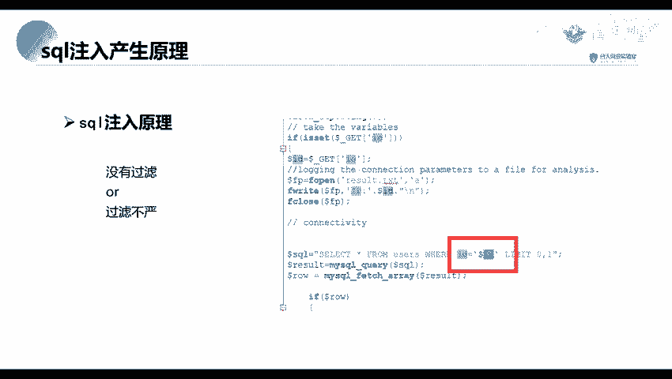
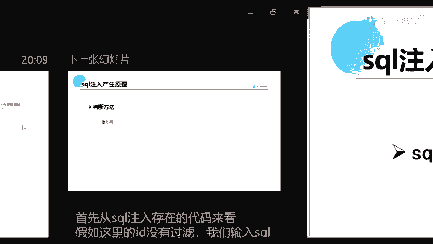
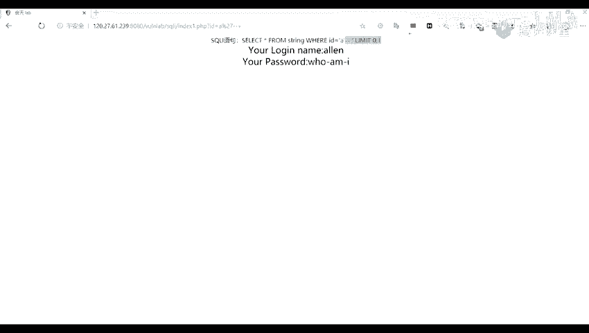

# 网络安全系统教程：P20：SQL注入产生原理

## 概述
在本节课中，我们将要学习SQL注入漏洞的产生原理。这是网络安全中一个历史悠久且至关重要的攻击方式。我们将从代码层面理解其成因，并学习如何初步判断一个网站是否存在SQL注入漏洞。

## 目录结构
以下是本节课的主要内容结构：
1.  SQL注入的产生原理
2.  SQLMap的介绍与安装
3.  SQLMap的功能与应用

上一节我们介绍了课程的整体安排，本节中我们来看看第一部分：SQL注入的产生原理。

## SQL注入的产生原理

SQL注入漏洞自1998年圣诞节大火事件以来，一直长盛不衰。时至今日，我们依然能经常发现此类漏洞。





那么，什么是SQL注入漏洞呢？
**SQL注入**是指攻击者将恶意的SQL查询语句或其他SQL语句，插入或添加到应用程序的用户输入参数中，并将这些参数传递给后台的SQL服务器加以解析并执行的攻击方式。

简单来说，就是攻击者可以**将输入的数据当作SQL代码传递给后台数据库去执行**。

你可能对此感到有些抽象，不过没关系，后续我们会有实验环节来逐步演示这个漏洞。

下面，我们从代码层面来分析其注入原理。

漏洞的产生，主要是由于程序**没有对用户输入进行过滤**，或者**过滤不严格**。这意味着程序可能直接执行了我们输入的参数，或者我们可以通过一些技巧绕过其过滤机制。

我们从以下代码中可以看到：

```php
$id = $_GET['id'];
$sql = "SELECT * FROM users WHERE id = $id";
```

这段代码通过`GET`方法获取一个名为`id`的参数，但**没有对获取到的`id`值进行任何过滤**。那么，攻击者就可以在`id`参数中**构造一些SQL语句**，来查询他们想要的数据。

如果你学习过数据库和SQL语句，应该可以理解这个原理。这本质上是将用户输入的数据拼接进了SQL命令中。

因为我们本节课的重点是工具使用，所以不会对原理进行过于深入的探讨。

## SQL注入漏洞的判断方法

通常，我们使用**单引号**来判断一个网站是否存在SQL注入漏洞。

以下是一个真实网站的例子：

1.  正常输入时，网站返回正常内容。
    *   例如，访问 `http://example.com/page.php?name=admin`，页面显示正常。
    *   此时后台SQL可能为：`SELECT * FROM users WHERE name = 'admin'`
2.  在参数后添加一个**单引号**，观察返回内容。
    *   例如，访问 `http://example.com/page.php?name=admin'`
    *   此时后台SQL变为：`SELECT * FROM users WHERE name = 'admin''`
    *   由于多了一个单引号，SQL语句语法错误，页面可能会返回数据库报错信息，或者显示与正常页面不同的内容。
3.  为了确认，可以尝试**闭合**这个单引号。
    *   例如，访问 `http://example.com/page.php?name=admin' -- `
    *   此时后台SQL变为：`SELECT * FROM users WHERE name = 'admin' -- '`
    *   `--` 是SQL中的注释符，它会将其后面的所有内容注释掉。这样，多出的单引号就被注释了，SQL语句语法正确，页面可能恢复正常显示。

通过对比添加单引号前后的页面差异，我们可以初步判断该处是否存在SQL注入漏洞。

### 数字型与字符型注入

SQL注入主要分为两种类型：

1.  **数字型注入**
    *   参数值没有被引号包围。
    *   后台SQL示例：`SELECT * FROM news WHERE id = 1`
    *   测试时，可以尝试输入 `1 and 1=1` 和 `1 and 1=2` 观察页面变化。
2.  **字符型注入**
    *   参数值被单引号或双引号包围。
    *   后台SQL示例：`SELECT * FROM users WHERE name = 'admin'`
    *   测试方法就是我们上面提到的，通过添加单引号、注释符来破坏和修复SQL语句结构。

简单来说，我们的目标就是**通过输入特殊字符，改变原有SQL语句的逻辑**，从而让数据库执行我们期望的指令。而注释符（如`--`、`#`）是“抹掉”后续多余代码、使新构造的SQL语句语法正确的关键。



## 总结
本节课中，我们一起学习了SQL注入漏洞的核心原理。我们了解到，SQL注入是由于程序未对用户输入进行严格过滤，导致用户输入被拼接进SQL命令并执行。我们还学习了通过**单引号法**来初步判断漏洞是否存在，并区分了**数字型**和**字符型**注入。理解这些基本原理，是后续学习利用工具进行自动化注入的基础。下一节，我们将介绍功能强大的SQL注入工具——SQLMap。