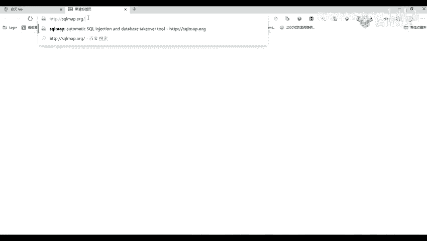
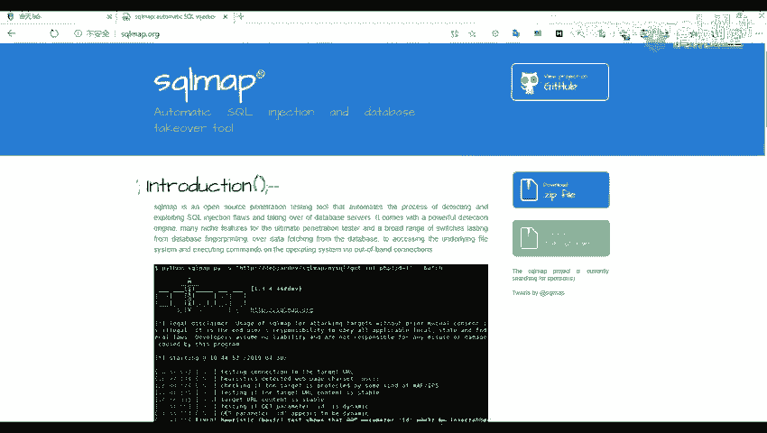
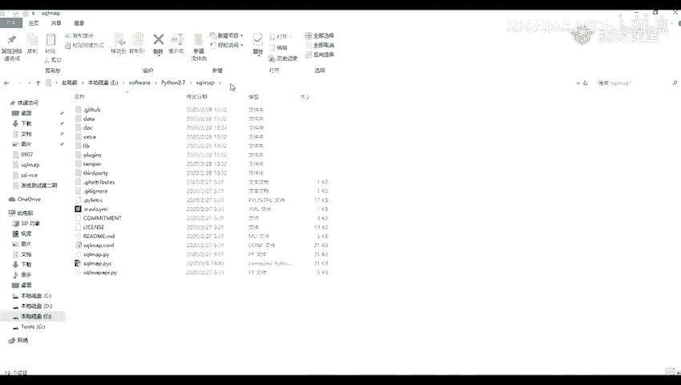
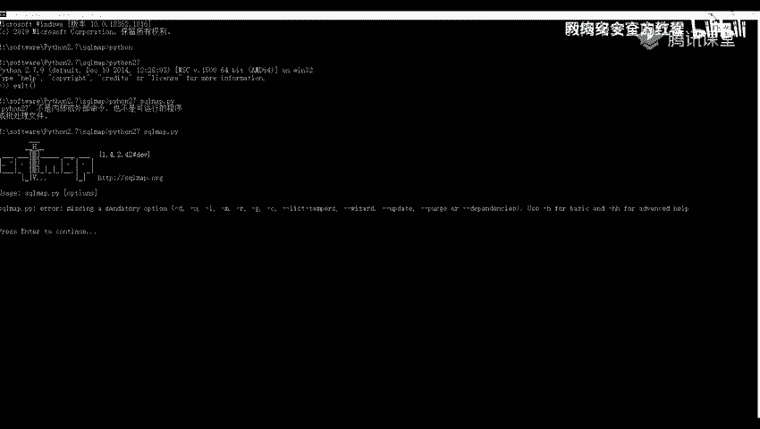
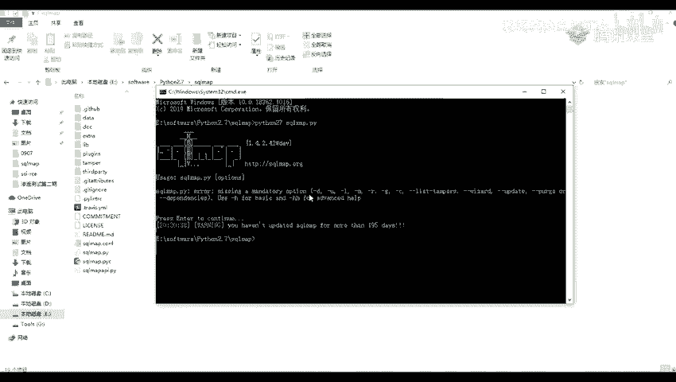

# 网络安全系统教程：P21：sqlmap介绍与安装 🛠️

在本节课中，我们将要学习一个强大的渗透测试工具——sqlmap。我们将了解它的定义、功能，并掌握在Windows系统上安装和配置它的方法。

## 概述

sqlmap是一个开源的渗透测试工具，它可以用来进行自动化的检测，并利用SQL注入漏洞获取数据库服务器的权限。它是用Python语言编写的，因此使用前需要安装Python环境。

## 什么是sqlmap？



sqlmap是一个自动化检测和利用SQL注入漏洞的工具。其核心功能是通过我们之前演示的SQL注入漏洞，来获取数据库服务器的访问权限。



## 安装准备

由于sqlmap使用Python语言编写，所以我们需要先安装Python环境。假设你已经在之前的课程中完成了Python的安装，这里将不再演示安装过程。

以下是获取sqlmap的两种主要途径：

1.  **官方网站**：你可以访问sqlmap的[官方网站](http://sqlmap.org/)下载最新版本的压缩包。
2.  **GitHub仓库**：sqlmap的官方代码仓库也托管在[GitHub](https://github.com/sqlmapproject/sqlmap)上，那里提供了安装方法、使用说明和版本信息。

为了方便，我也在课程资料中提供了下载链接。下载后，你会得到一个压缩包，解压后即可使用，无需激活。

## 安装与配置步骤

解压后，你会看到sqlmap的目录结构。核心的运行脚本是 `sqlmap.py` 文件。虽然可以直接进入目录运行，但每次操作比较麻烦。我们可以为它创建一个桌面快捷方式，以便快速启动。

以下是创建快捷方式的详细步骤：



1.  在桌面空白处点击右键，选择“新建” -> “快捷方式”。
2.  在“创建快捷方式”对话框中，我们需要指定命令行的路径。请输入 `cmd` 作为项目的位置。
3.  点击“下一步”，为快捷方式命名，例如“sqlmap”，然后点击“完成”。
4.  右键点击新创建的“sqlmap”快捷方式，选择“属性”。
5.  在“快捷方式”标签页中，找到“起始位置”一栏。
6.  将你的sqlmap解压目录的完整路径填写到“起始位置”中。
7.  点击“应用”，然后点击“确定”。

完成以上步骤后，双击桌面上的“sqlmap”快捷方式，将会直接打开一个命令行窗口，并且工作目录已经切换到你的sqlmap文件夹路径下。

## 验证安装

在通过快捷方式打开的命令行窗口中，我们可以验证sqlmap是否能够正常运行。

首先，输入命令检查Python环境。根据你的Python版本，可能需要输入 `python` 或 `python2`。例如：
```bash
python2 --version
```
确认Python可用后，运行sqlmap的主程序文件来查看版本信息：
```bash
python2 sqlmap.py --version
```
如果配置正确，命令行将显示sqlmap的版本号，这表明安装成功。

另一种验证方法是，直接进入sqlmap的目录，在地址栏输入 `cmd` 并回车，然后在打开的命令行中执行上述 `python2 sqlmap.py --version` 命令。



## 可能遇到的问题

在验证时，如果遇到“python2不是内部或外部命令”的错误，通常是因为Python环境变量没有正确配置。请确保你的Python安装路径已添加到系统的PATH环境变量中。配置好环境变量后，问题即可解决。




## 总结


本节课中，我们一起学习了sqlmap工具。我们了解了它是一个用于自动化检测和利用SQL注入漏洞的Python工具。接着，我们详细讲解了如何在Windows系统上通过下载压缩包、解压，并创建命令行快捷方式来完成sqlmap的安装与配置。最后，我们学会了如何验证安装是否成功。掌握这些步骤，你就为后续使用sqlmap进行实战演练做好了准备。