# 网络安全系统教程：P25：12. Meterpreter指令操控电脑权限 🖥️🔧


在本节课中，我们将学习Meterpreter后渗透工具的核心指令，了解如何利用它来操控目标电脑的权限，执行文件操作、信息收集和系统控制等任务。

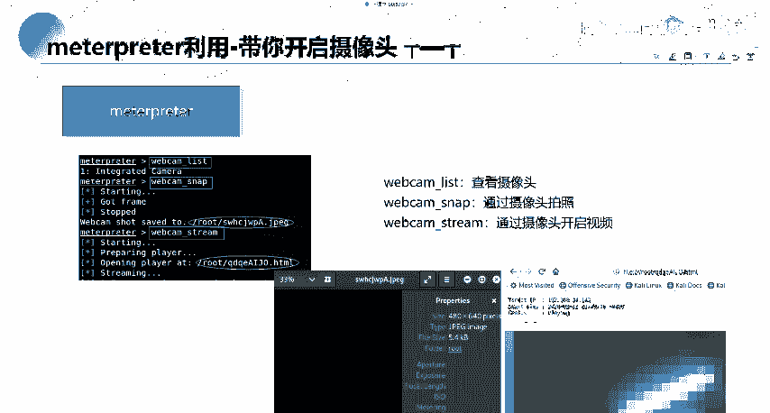

## 概述

上一节我们介绍了如何建立Meterpreter会话。本节中，我们来看看进入Meterpreter后，我们可以执行哪些具体指令来操控目标系统。

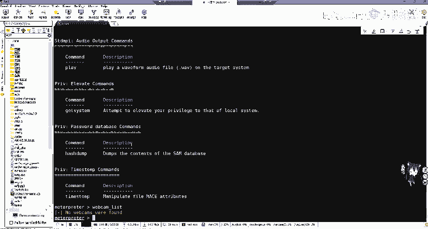

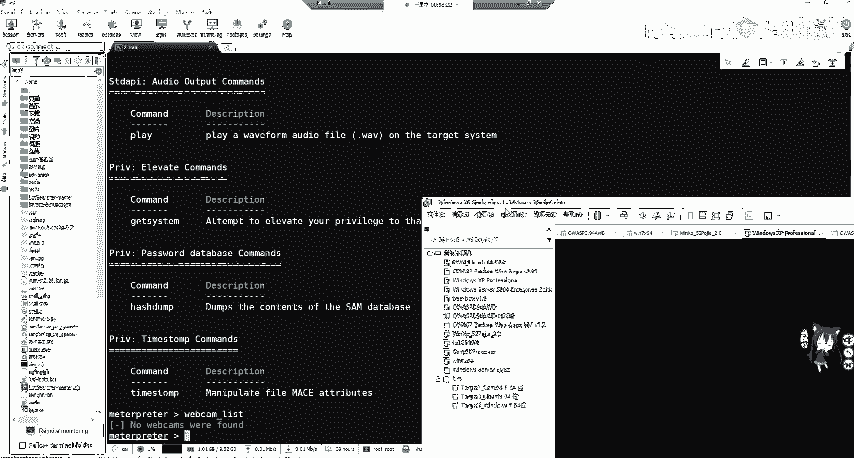

## 会话升级与帮助

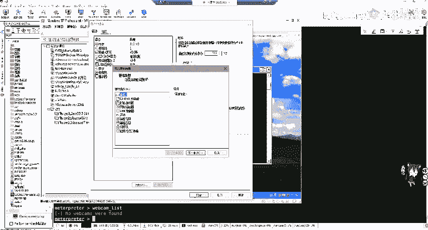

如果我们获得的是一个Shell或功能受限的Meterpreter会话，可以使用 `sessions -u` 命令尝试将其升级为功能完整的Meterpreter会话。

```bash
sessions -u <session_id>
```

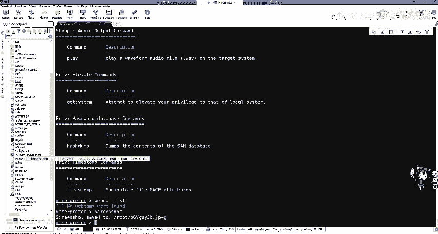

进入Meterpreter后，输入 `?` 或 `help` 可以查看所有可用命令列表。

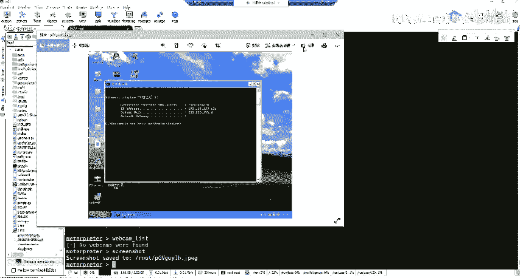

## 多媒体设备操控

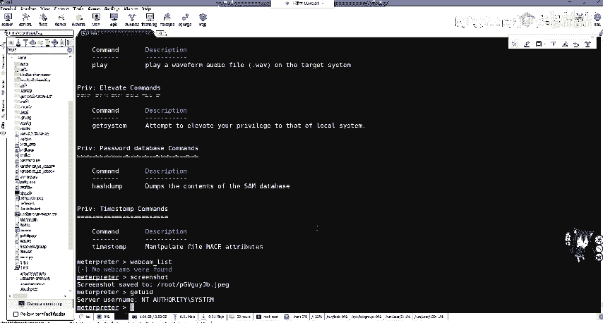

以下是Meterpreter中操控摄像头和屏幕的相关命令。

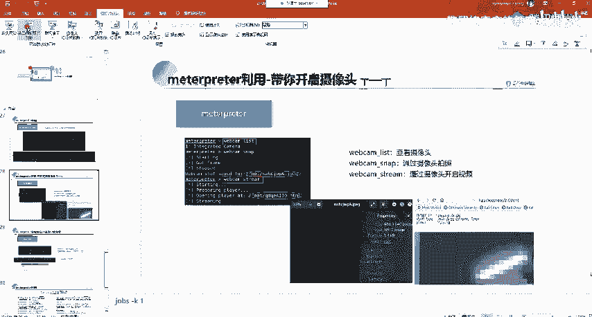

*   **`webcam_list`**：列出目标系统上的摄像头设备。
*   **`webcam_snap`**：使用默认摄像头拍摄一张照片。
*   **`webcam_stream`**：开启摄像头实时视频流，通常通过一个Web接口访问。
*   **`screenshot`**：对目标系统的屏幕进行截屏。
*   **`screenshare`**：实时查看并共享目标系统的屏幕。

**注意**：要成功操控摄像头，需要确保目标系统（如虚拟机）已正确连接并启用了摄像头设备。

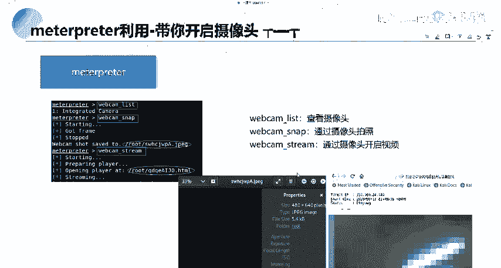

## 系统信息与进程管理

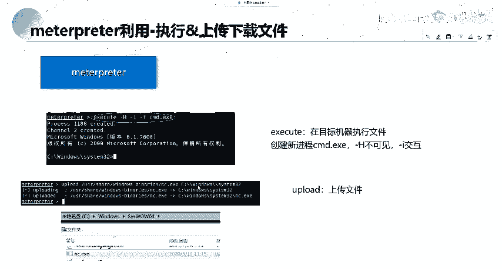

接下来，我们学习如何查看系统信息和进程。

*   **`getuid`**：查看当前Meterpreter会话的用户权限（UID）。例如，`NT AUTHORITY\SYSTEM` 代表管理员权限。
*   **`sysinfo`**：查看目标系统的详细信息，如计算机名、操作系统、架构等。
*   **`ps`**：列出目标系统上正在运行的所有进程。

## 命令行交互与文件传输

Meterpreter可以让我们与目标系统的命令行进行交互，并传输文件。

*   **`shell`**：直接获取目标系统的命令行（如Windows的cmd或Linux的bash）。
*   **`execute`**：执行指定的命令或程序。例如，`execute -f cmd.exe` 可以打开一个新的命令提示符。
*   **`upload`**：将文件从攻击机上传到目标机。
    ```bash
    upload /local/path/to/file.exe C:\\target\\path\\file.exe
    ```
*   **`download`**：将文件从目标机下载到攻击机。
    ```bash
    download C:\\target\\file.exe /local/path/
    ```

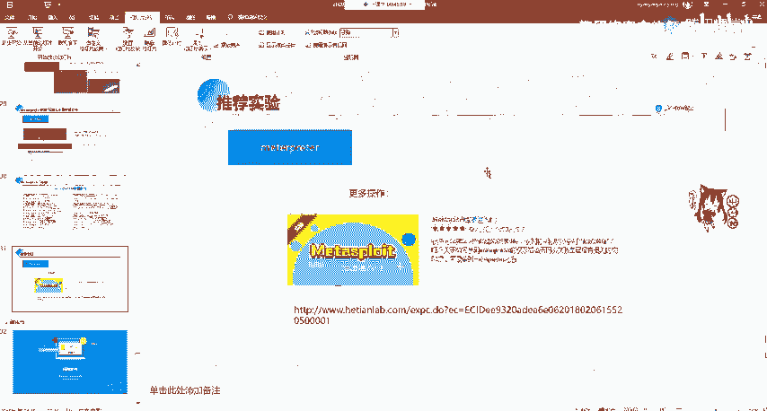

## 常用命令回顾与注意事项

以下是Meterpreter中最常用的一些命令总结。

*   **`background`**：将当前会话放到后台运行。
*   **`sessions`**：列出所有活跃的会话。
*   **`exit` / `quit`**：终止当前Meterpreter会话。
*   **`help`**：显示帮助信息。
*   **`getuid`**：检查权限。
*   **`upload`/`download`**：文件传输。
*   **`portfwd`**：端口转发。

**重要提示**：命令 `run killav` 旨在关闭杀毒软件，但对于现代杀毒软件（如Windows Defender）通常无效，实际渗透测试中作用有限。

## 获取Meterpreter的其他途径

除了利用MSF的漏洞利用模块直接获取Meterpreter，还可以通过其他方式，例如：
*   利用Web应用漏洞（如SQL注入、文件上传）。
*   攻击其他服务漏洞（如Tomcat、WebLogic的已知CVE漏洞）。
*   利用社会工程学等手段。

## 总结

本节课中我们一起学习了Meterpreter的核心指令，涵盖了会话管理、信息收集、系统操控和文件传输等关键操作。掌握这些命令是进行有效后渗透测试的基础。需要强调的是，仅靠理论无法精通，必须结合实践，在安全的实验环境（如虚拟机或在线靶场）中反复操作，并养成记录和总结的习惯，才能巩固知识。