# 网络安全系统教程：P27：Cobaltstrike简介 🛡️

在本节课中，我们将要学习Cobaltstrike（简称CS）的基本概念、核心功能以及如何搭建其服务端与客户端。Cobaltstrike是一款功能强大的团队协作渗透测试工具，掌握它是进行高效安全测试的关键一步。

## 什么是Cobaltstrike？

Cobaltstrike（简称CS）是一款团队作战渗透测试神器。请注意，这不是指射击游戏CS，而是指渗透测试工具。Cobaltstrike分为客户端及服务端。服务端可以对应多个客户端，而一个客户端又可以连接多个服务端。

CS集成了渗透测试中经常使用的多种功能，包括：
*   端口转发与扫描
*   多模式的端口监听
*   Windows可执行程序生成
*   Windows动态链接库生成
*   Java应用程序生成
*   Office宏代码生成

同时，它也能帮助我们克隆浏览器相关信息、克隆钓鱼网站等。

Cobaltstrike经常与Metasploit框架进行联动，因为两者都是优秀的渗透测试框架。将它们结合使用，可以显著提升渗透测试的效率。

## Cobaltstrike与Metasploit的关系

上一节我们介绍了Cobaltstrike是什么，本节中我们来看看它与另一个知名工具Metasploit的关系。Metasploit（MSF）是一款开源的渗透测试框架，我们在之前的课程中已经讲过。我们通常使用的`msfconsole`是其命令行接口。

Metasploit也具有图形化界面，即Armitage。Armitage可以看作是Cobaltstrike的早期版本。而Cobaltstrike则是Armitage的增强版，并且是商业收费软件。

在CS 2.0版本时，它还依托于Metasploit框架的Armitage。但从3.0版本之后，Cobaltstrike已经成为一个独立使用的平台。本教程使用的是CS 4.0版本。

## Cobaltstrike的目录结构

了解一个工具，通常从它的目录结构开始。Cobaltstrike的目录结构位于工具包内，你可以将其整个文件夹上传到你的VPS（公网服务器，如阿里云ECS）上运行。如果没有公网VPS，也可以在Kali Linux本地运行服务端。

以下是Cobaltstrike的主要目录和文件说明：

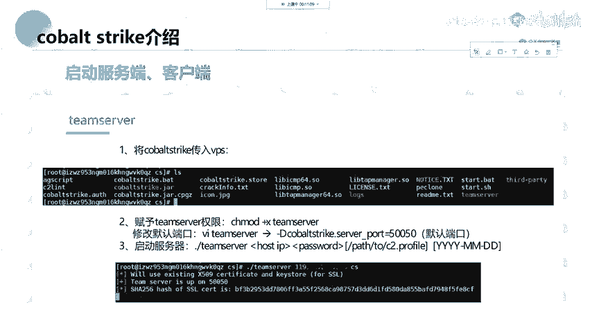

*   **aggressor**：CS的拓展应用脚本目录。CS支持插件和脚本拓展，文件以`.cna`结尾。
*   **c2lint**：用于检查profile配置错误或异常的工具。
*   **teamserver**：服务端主程序。
*   **cobaltstrike.jar**：客户端程序（Java包）。
*   **logs**：日志文件目录。
*   **update**：用于更新Cobaltstrike。
*   **third-party**：第三方工具目录。

## 服务端部署与启动

Cobaltstrike的服务端只能运行在Linux操作系统上，并且需要预先安装Java环境。如果你使用Kali Linux，Java通常已经预装好了。如果是自己购买的VPS，可能需要手动安装。

在Linux上安装JDK（以`yum`包管理器为例）：
```bash
yum install -y java-1.8.0*
```
`-y`参数表示默认同意所有安装选项。使用`yum`源安装后，环境变量通常会自动配置好。

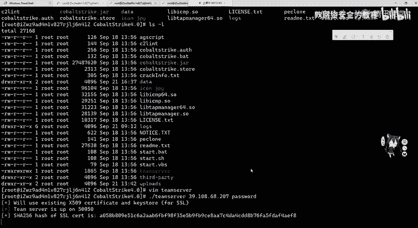

安装好Java后，将整个Cobaltstrike文件夹上传到服务器，并给`teamserver`文件添加可执行权限：
```bash
chmod +x teamserver
```
你可以使用`vim`编辑`teamserver`脚本，修改其默认监听端口（默认为50050）。

启动服务端的命令如下：
```bash
./teamserver <服务器公网IP> <连接密码>
```
例如：
```bash
./teamserver 123.123.123.123 password
```
执行后，服务端将在50050端口运行。

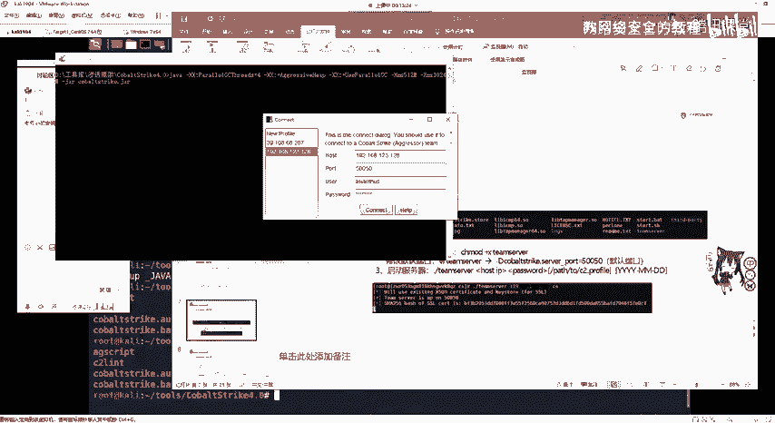

## 客户端连接

客户端程序可以在本地运行。在Cobaltstrike文件夹中，有`cobaltstrike.bat`（Windows）和`cobaltstrike.sh`（Linux）脚本用于启动客户端。

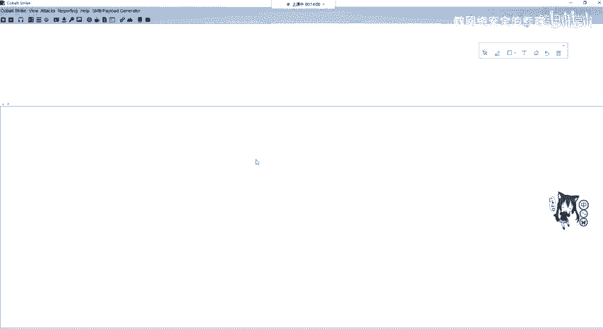

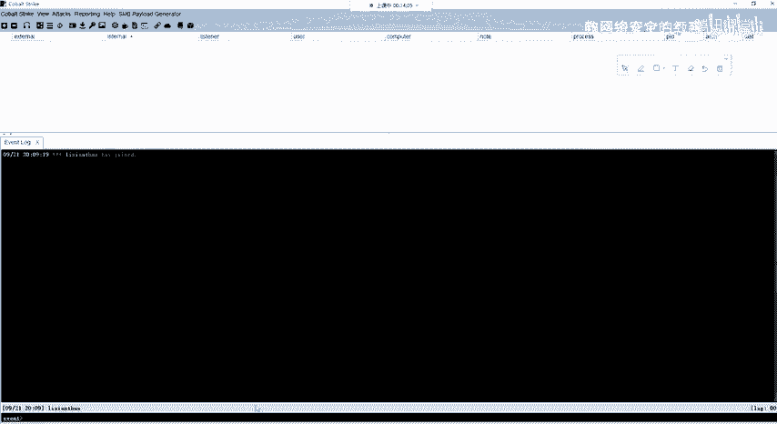

以Windows为例，双击`cobaltstrike.bat`启动客户端。在连接界面中，需要填写以下信息：
*   **Host**：服务器的IP地址和端口（如 `123.123.123.123:50050`）
*   **User**：用户名（可任意设置，用于区分多个客户端用户）
*   **Password**：启动服务端时设置的密码

填写完毕后，点击“Connect”即可连接到服务端。一个客户端可以连接多个服务端，只需在菜单栏点击“Cobalt Strike” -> “New Connection”即可新建连接。

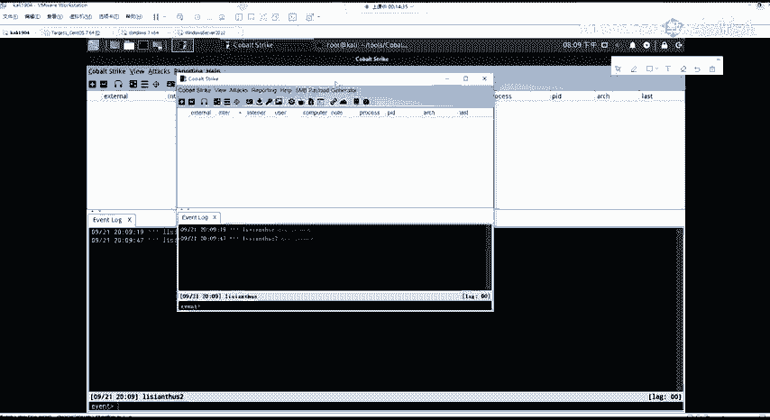

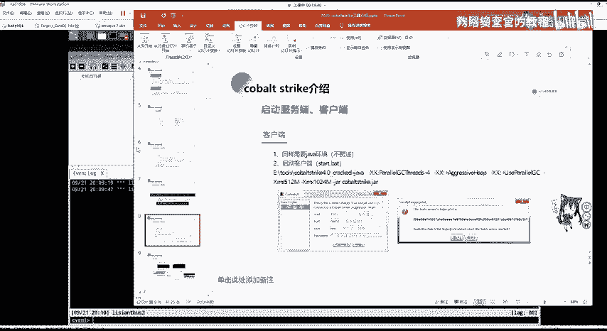

## Cobaltstrike的常用功能界面

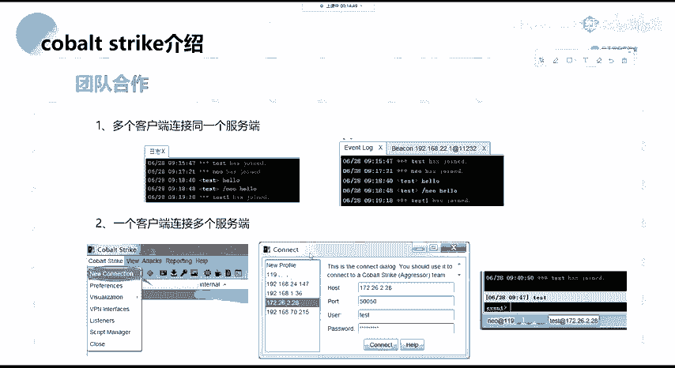

成功连接后，我们将看到Cobaltstrike的主界面。其快捷工具栏主要分为五大类，分别对应不同的核心操作模块，例如监听器管理、攻击载荷生成、目标主机交互、凭证管理和视图切换等。我们将在后续课程中详细讲解每个功能的具体用法。

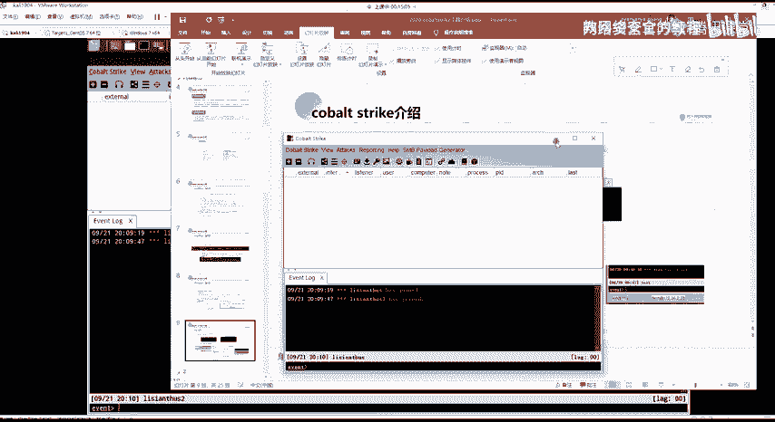

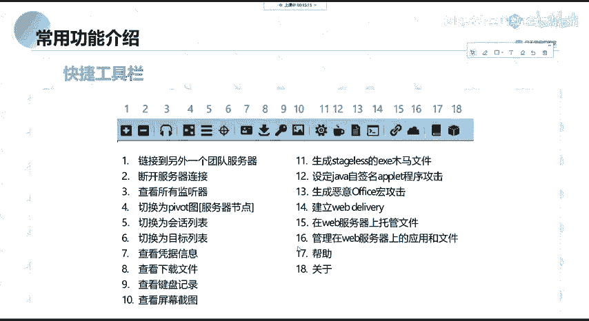

---

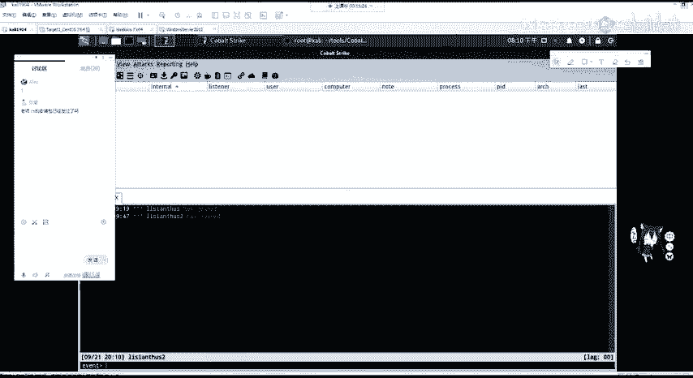

本节课中我们一起学习了Cobaltstrike的基本定义、它与Metasploit的历史渊源、目录结构、服务端在Linux上的部署与启动方法，以及客户端如何连接服务端。理解这些基础是后续开展实战渗透测试的前提。