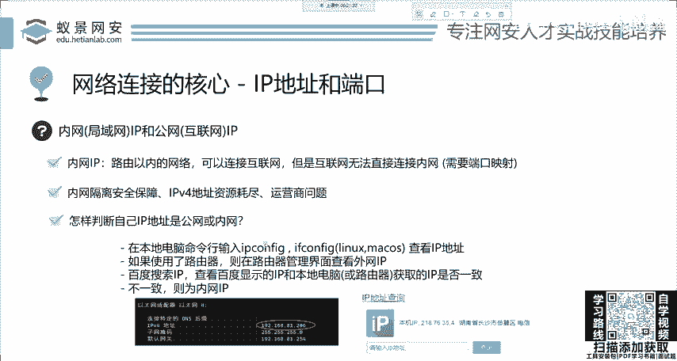
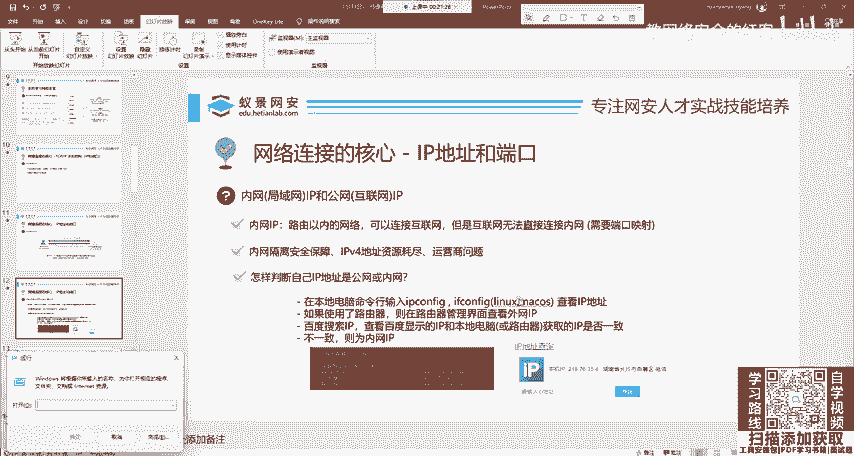
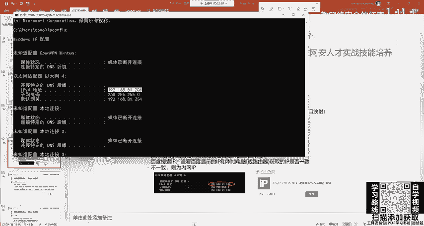
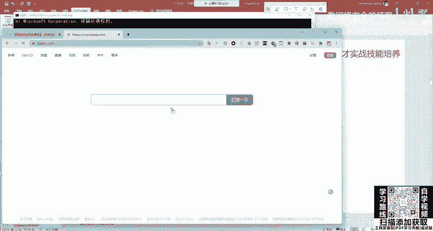
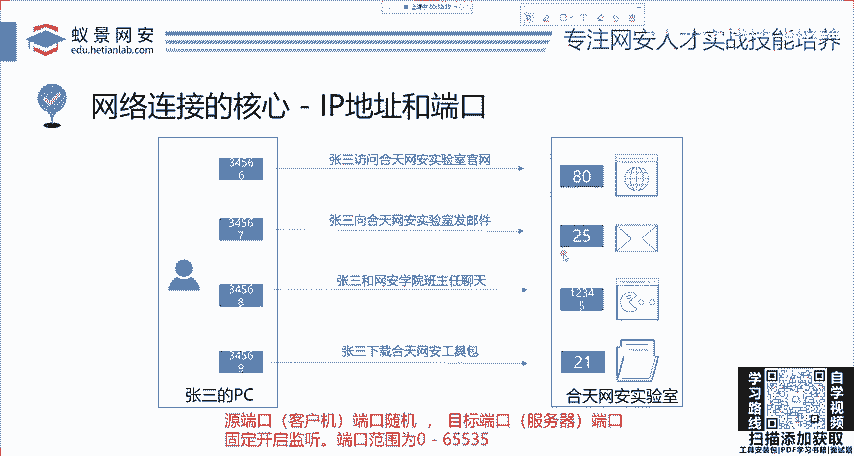

# 网络安全基础：2：HTTP基础 - IP地址与端口

## 概述
在本节课中，我们将学习网络通信中最基础的两个概念：**IP地址**和**端口**。它们是理解后续所有网络协议和网络安全知识的基石。我们将从它们的基本定义出发，逐步探讨其在网络中的作用、分类以及实际应用。

---

## TCP/IP体系结构简介
上一节我们介绍了课程的整体框架，本节中我们来看看网络通信的基石——TCP/IP体系结构。首先需要明确，**TCP/IP不是一个单一的协议，而是一个包含了许多协议的协议族**。它涵盖了从传输层、会话层到更高层的众多协议，例如TCP、IP以及HTTP等。

这个体系结构的核心寻址机制，就是我们接下来要详细讲解的**IP地址**和**端口**。

---

## IP地址：网络中的“家庭住址”
IP地址的作用，类似于现实世界中的家庭住址。家庭地址让快递员能够找到你，而**IP地址则是在互联网中寻找计算机或其他电子设备（如交换机、路由器）的唯一标识**。

### IP地址的工作原理
例如，用户“张三”想要访问“和田网安实验室”的网站。他需要知道网站的域名：`www.hetianlab.com`。这个域名并不能直接被网络设备识别，需要通过**DNS（域名系统）** 服务将其解析为对应的IP地址。DNS是TCP/IP协议族中的一个关键服务。一旦获得了目标服务器的IP地址，张三的计算机就能找到并访问它。

这个过程简化来说就是：**任何网络访问的前提，是能够找到目标设备的IP地址**。无论是玩网络游戏连接服务器，还是访问网站，本质都是通过IP地址建立连接。

### 内网IP与公网IP
在网络安全领域，理解内网IP和公网IP的区别至关重要。

*   **内网IP（局域网IP）**：官方解释是路由器以内的网络使用的IP地址。设备可以通过内网IP连接互联网，但互联网上的设备**无法直接通过这个内网IP地址访问到它**。
*   **公网IP（互联网IP）**：在互联网中全球唯一的IP地址。拥有公网IP的设备可以直接与互联网上的任何资源进行双向通信。

#### 如何判断自己的IP类型
以下是判断你当前使用的是内网IP还是公网IP的方法：

1.  查看本地IP地址：
    *   打开命令行工具（如CMD或终端）。
    *   输入命令 `ipconfig`（Windows）或 `ifconfig`（Linux/Mac）。
    *   在输出信息中找到“以太网适配器”或“无线局域网适配器”下的 `IPv4 地址`。常见的如 `192.168.x.x`、`10.x.x.x`、`172.16.x.x` 到 `172.31.x.x`。
2.  查看公网IP地址：
    *   打开浏览器，访问百度，搜索关键词“IP”。
    *   搜索引擎会显示你当前在互联网上看到的公网IP地址。

**如果步骤1和步骤2查到的两个IP地址不同，那么你的电脑使用的就是内网IP。** 目前绝大多数家庭和学校网络分配的都是内网IP，这主要由于公网IPv4地址资源紧张。

#### 公网IP与内网IP的区别与比喻
两者的关系可以用一个简单的比喻来理解：

*   **公网IP**好比**你所在小区的地址**。
*   **内网IP**好比**你家的具体门牌号**。

你可以自由地从家里（内网）出发前往外界（互联网）。但是，外界的访客（如快递员）想要进入你家，必须先到达小区地址（公网IP），然后通过小区的门岗/路由器进行转发，才能找到你的具体门牌号（内网IP+端口）。**内网设备可以主动访问公网，但公网无法直接访问一个纯内网设备**。

#### 公网IP的典型应用
公网IP在日常中有广泛的应用：
*   **远程监控**：直接远程访问家庭摄像头的实时画面。
*   **远程开机与访问**：从外部网络唤醒或远程控制家中的电脑。
*   **主机游戏联机**：更稳定地进行点对点游戏联机。
*   **搭建个人服务器**：在家中搭建网站、博客或文件服务器供外界访问。

---

## 端口：设备上的“应用程序门牌号”
在理解了IP地址（找到哪栋楼）之后，我们来看看端口。为什么需要端口？因为一台计算机（一个IP地址）上通常会运行多个网络应用程序（如浏览器、微信、邮件客户端）。

**端口是应用程序在计算机上的唯一逻辑标识，用于区分同一台设备上的不同网络服务。** IP地址和端口必须结合使用，形影不离。`IP地址` 负责定位到具体的设备，`端口号` 负责定位到该设备上的具体服务。

### 端口的工作原理
让我们继续以“张三访问和田网安实验室”为例。假设实验室服务器的IP地址是 `203.0.113.1`，并且这台服务器同时提供了多种服务：
*   网站服务（HTTP）
*   邮件服务（SMTP）
*   在线聊天服务（自定义）
*   文件下载服务（FTP）

如果只有IP地址，数据包到达服务器后，服务器将无法判断该把数据交给网站程序还是邮件程序。此时，端口就起到了关键作用。

以下是不同服务通常监听的默认端口：
*   访问网站 → 目标 **80端口** (HTTP)
*   发送邮件 → 目标 **25端口** (SMTP)
*   进行聊天 → 目标 **12345端口** (示例)
*   下载文件 → 目标 **21端口** (FTP)

同时，张三自己的电脑在发起这些连接时，也会随机开启一个**本地端口**（例如 `54321`），用于接收返回的数据。这样，一次完整的网络通信就由 **`源IP:源端口`** 到 **`目标IP:目标端口`** 唯一确定了。

### 端口号范围与约定
端口号是一个16位的整数，其范围是：
**`0 ~ 65535`**
这意味着理论上每台设备可以有超过6万个逻辑端口。

这些端口通常分为三类：
1.  **公认端口（0-1023）**：分配给系统或知名服务，如 `80`(HTTP)、`443`(HTTPS)、`21`(FTP)、`25`(SMTP)。
2.  **注册端口（1024-49151）**：分配给用户进程或应用程序。
3.  **动态/私有端口（49152-65535）**：通常用作客户端的临时端口。

**需要注意的是，默认端口只是约定俗成，实际可以修改。** 你可以将网站服务配置在 `8080` 端口，将SSH服务配置在 `2222` 端口，只要该端口未被其他程序占用即可。

---

## 总结
本节课中，我们一起学习了网络通信的两个最核心概念：
1.  **IP地址**：它是网络设备的唯一逻辑地址，用于在网络中定位目标。我们重点区分了**公网IP**（可直接被互联网访问）和**内网IP**（位于路由器后，需通过地址转换才能访问互联网）。
2.  **端口**：它是设备上应用程序的唯一逻辑标识，与IP地址结合使用（`IP:Port`），精确地将网络数据递送给指定的服务。端口号范围是 `0-65535`。

理解“IP地址找到设备，端口找到服务”这一基本原理，是后续学习HTTP协议、网络扫描、漏洞分析乃至所有网络安全技术的必备基础。下一节，我们将基于IP和端口的知识，深入探讨**HTTP协议**的具体细节。