# 网络安全系统教程：P30：17. CS联动MSF之Socks代理

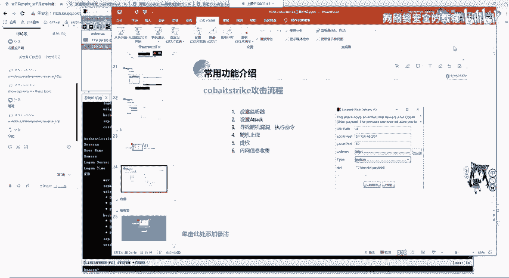

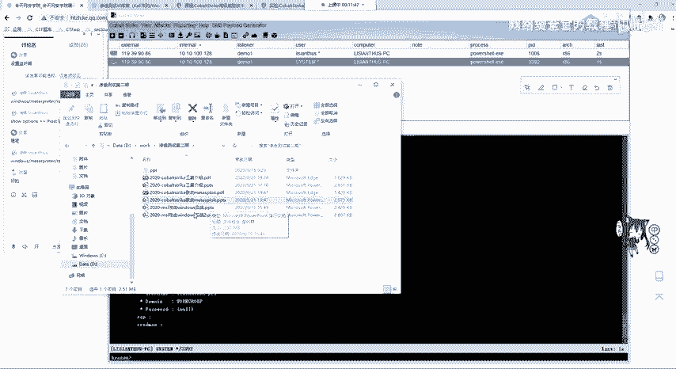

## 概述
在本节课中，我们将学习如何利用Cobalt Strike（CS）与Metasploit（MSF）进行联动，重点掌握通过CS建立Socks代理来穿透网络边界、访问内网资源的技术。这是内网渗透测试中的一项核心技能。

## 环境拓扑介绍
在深入技术细节之前，我们先来了解本次课程所使用的实验环境拓扑，这有助于理解后续的代理流程。

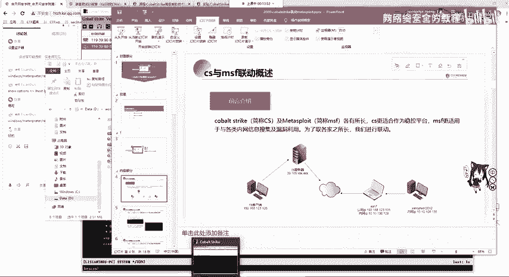

以下是本次实验的网络环境结构图：

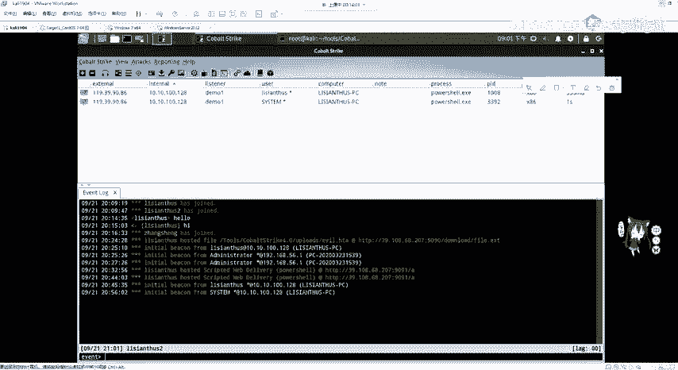


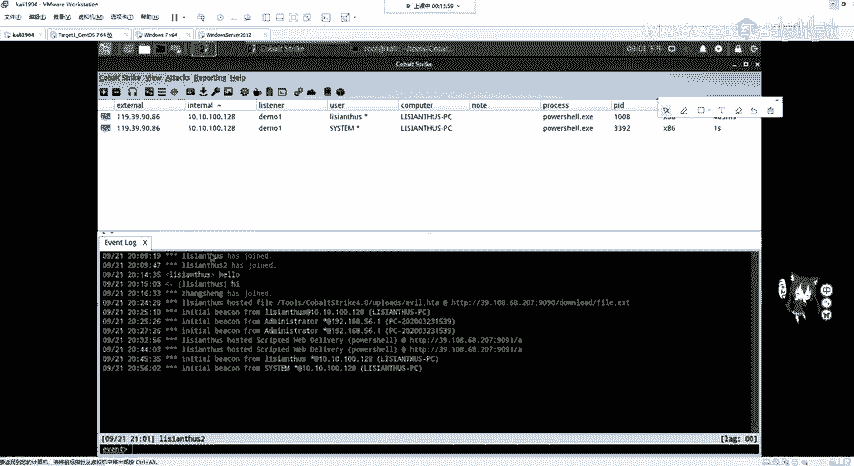

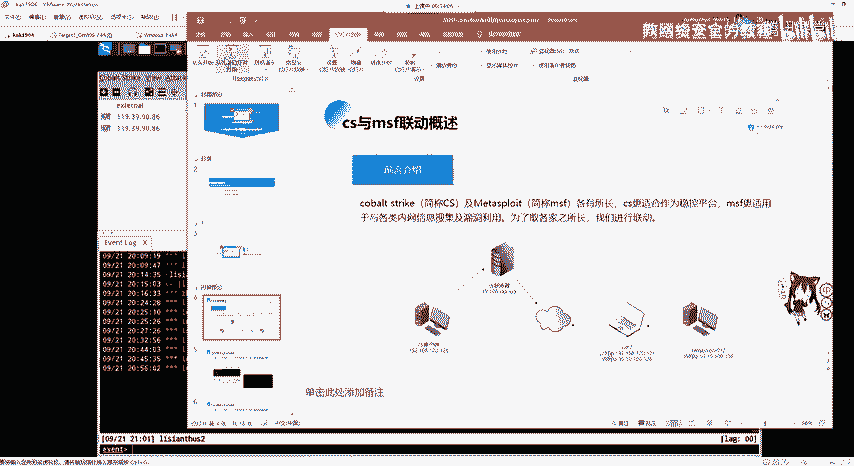

具体环境配置如下：
*   **CS客户端**：有两个，分别运行在Windows和Kali Linux系统上，用于连接CS服务器。
*   **CS服务器**：部署在公网VPS上，IP地址为 `39.108.x.x`，是本次攻击的控制中心。
*   **跳板机（Windows 7）**：配置了双网卡。
    *   网卡1（外网）：IP为 `192.168.123.131`，可连接互联网及CS服务器。
    *   网卡2（内网）：IP为 `10.10.100.128`，连接内部网络。
*   **内网目标机**：IP为 `10.10.100.135`，仅在内网可达，无法从外网直接访问。

核心挑战在于，攻击者（CS客户端/服务器）无法直接访问位于 `10.10.100.0/24` 网段的内网目标。Socks代理的作用就是解决这个问题。

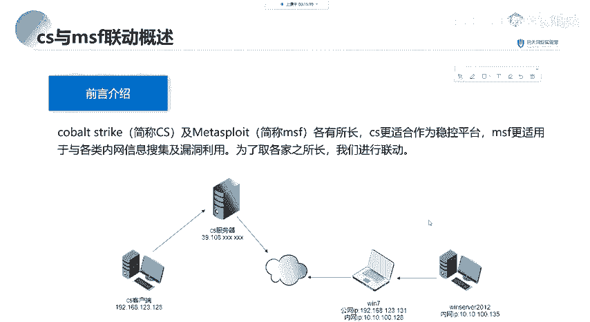

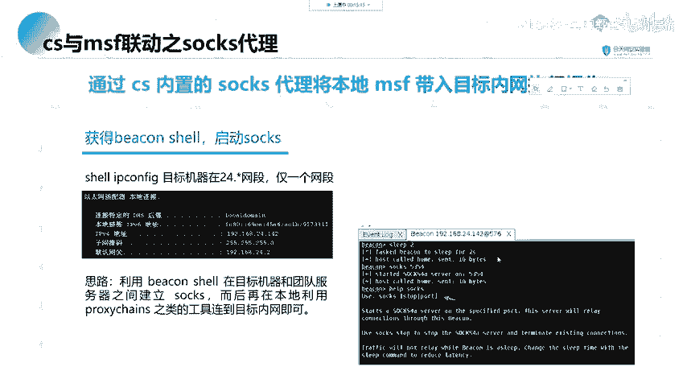

## CS与MSF的定位
上一节我们介绍了环境，本节我们来看看CS和MSF这两个工具各自的优势。理解它们的定位对于有效联动至关重要。

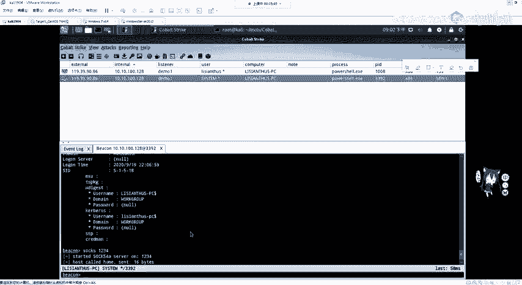

CS和MSF各有所长：
*   **Metasploit（MSF）**：功能非常强大，模块极其丰富，包括辅助扫描、漏洞利用、编码器等，更适合进行内网信息收集和漏洞利用。
*   **Cobalt Strike（CS）**：模块相对较少，但更擅长作为团队协作的“稳控”平台，管理主机上线、进行横向移动和持久化控制。


因此，一个常见的协作模式是：**利用CS作为稳定的控制通道，再通过代理将MSF带入内网，利用其强大的模块进行深度渗透。**

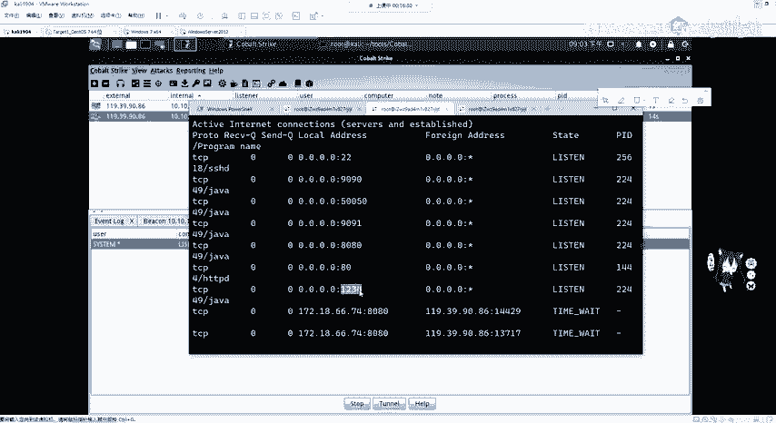

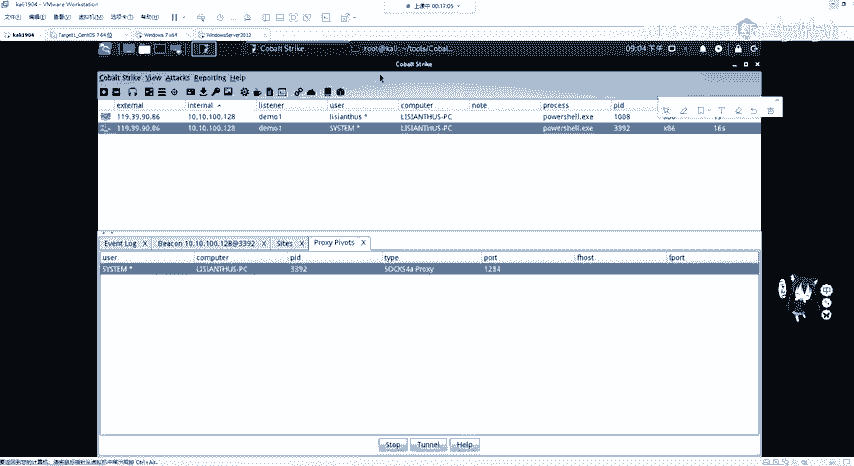

## 在CS中开启Socks代理
了解了工具定位后，我们开始实践。本节的核心操作是在CS服务器上建立Socks代理服务。

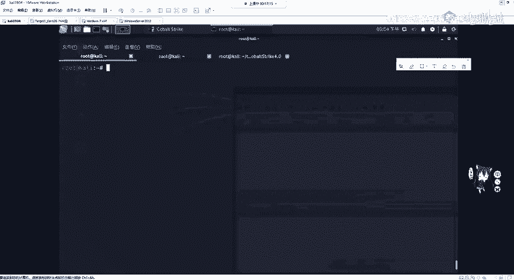

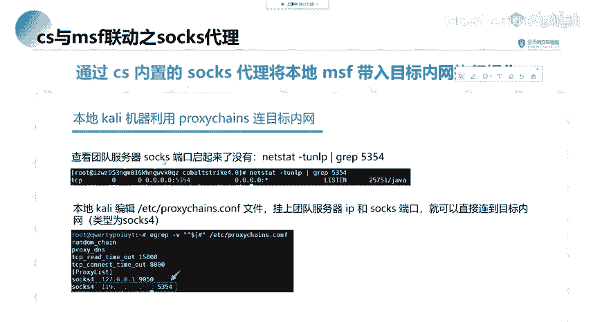

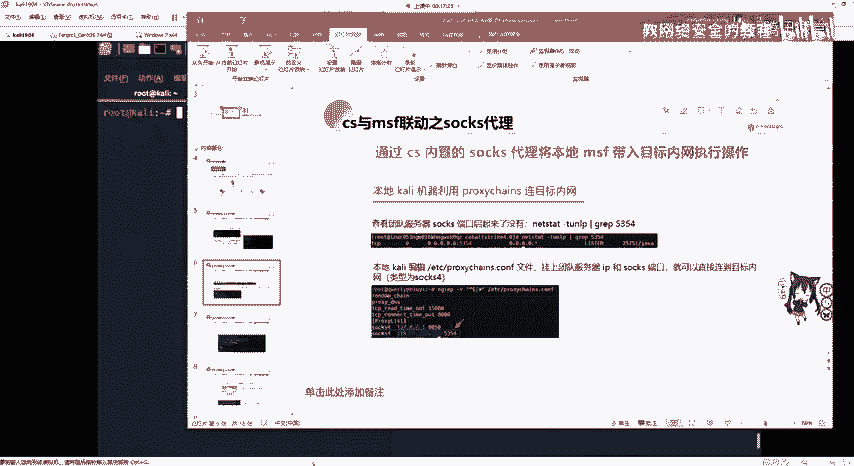

在CS的Beacon控制台中，使用 `socks` 命令即可开启代理。其基本语法为：
```bash
socks <端口号>
```
例如，执行 `socks 1234` 将在CS服务器上启动一个监听在1234端口的Socks4a代理服务。

执行后，你可以在CS客户端的 `View -> Proxy Pivots` 中看到已启动的代理服务。同时，在CS服务器（VPS）上使用 `netstat` 命令检查，也能确认1234端口处于监听状态。

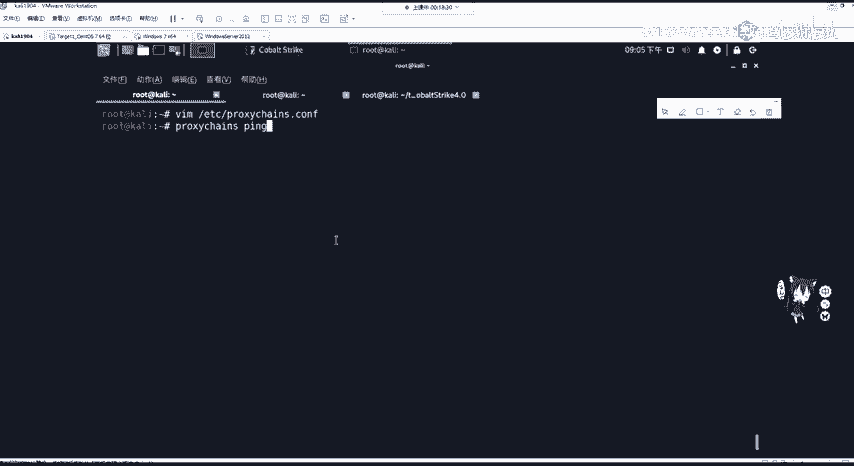

**关键点**：所有代理服务都开启在**CS服务器（VPS）** 上，而不是本地客户端。我们的后续工具都需要去连接这个VPS上的代理端口。

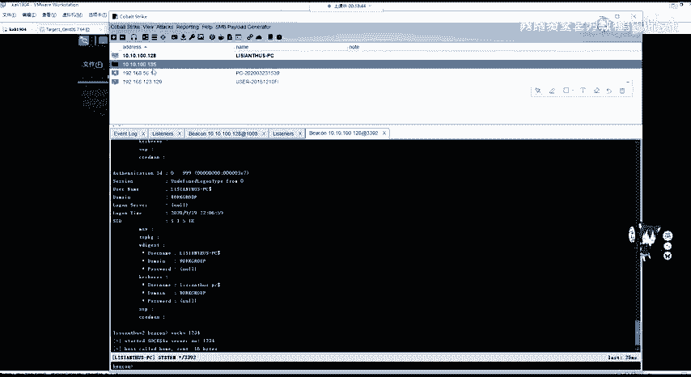

## 使用Proxychains连接代理
代理服务已经就绪，接下来我们需要让其他工具通过这个代理来发送流量。在Linux（如Kali）中，我们使用 `proxychains` 工具。

以下是配置和使用 `proxychains` 的步骤：
1.  **编辑配置文件**：配置文件通常位于 `/etc/proxychains.conf` 或 `/etc/proxychains4.conf`。
2.  **添加代理设置**：在文件末尾的 `[ProxyList]` 部分，添加Socks4代理配置。格式为：
    ```
    socks4 <CS服务器IP> <代理端口>
    ```
    例如：`socks4 39.108.6.207 1234`
3.  **通过代理执行命令**：在任何命令前加上 `proxychains`，该命令的流量就会通过配置的代理发出。

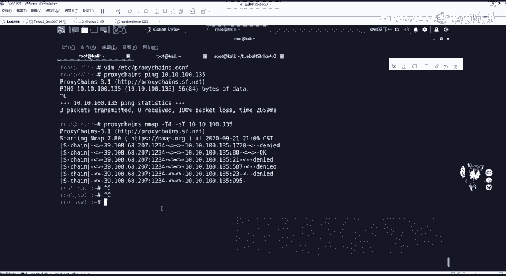

让我们通过一个例子来理解它的作用。假设我们想扫描内网目标 `10.10.100.135`。

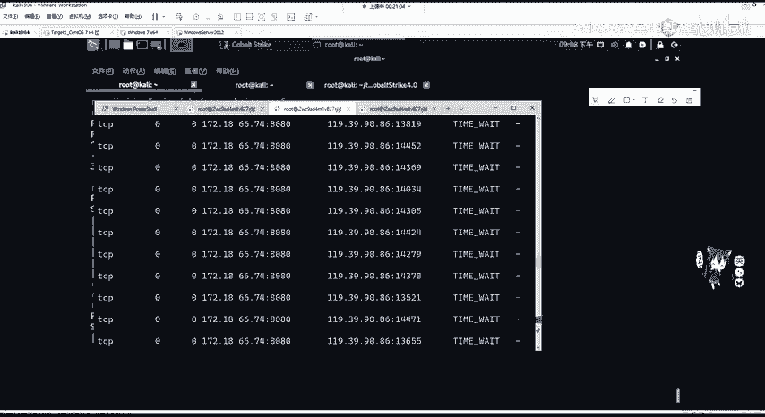

直接执行 `nmap 10.10.100.135` 会失败，因为路由不可达。但使用代理后：
```bash
proxychains nmap -sT -Pn 10.10.100.135 -p 22,80,135,445,3306,3389
```
*   `-sT`：TCP连接扫描（Socks代理基于TCP）。
*   `-Pn`：跳过主机发现（Ping探测无法通过Socks代理）。
*   `-p`：指定扫描端口，减少流量，加快速度（因为代理转发速度较慢）。

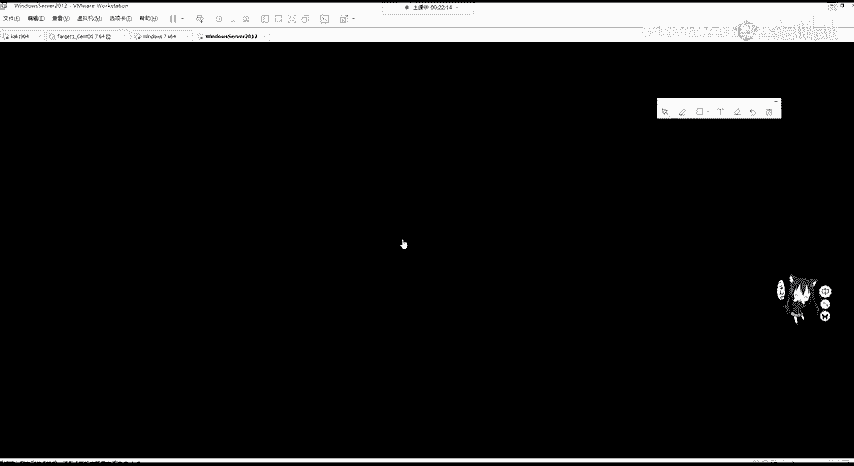

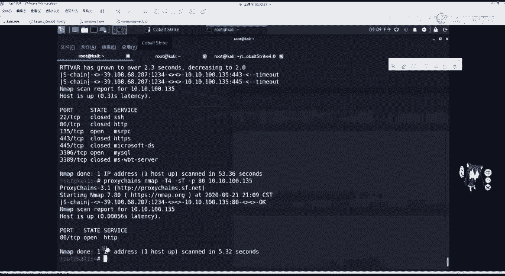

同样，我们可以通过代理连接内网的Windows机器（使用 `proxychains` 结合 `winexe` 或 `pth-winexe` 等工具）或访问内网Web服务。

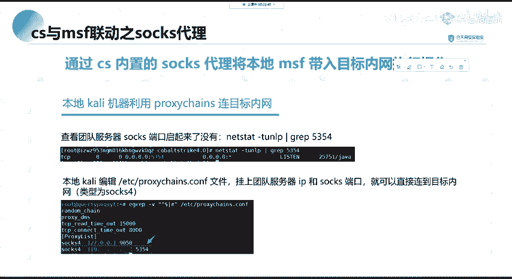

**注意**：由于流量需要经过“本地 -> 公网VPS -> 跳板机 -> 内网目标”的曲折路径，通过代理执行操作的速度会明显变慢，且可能产生延迟或误报。

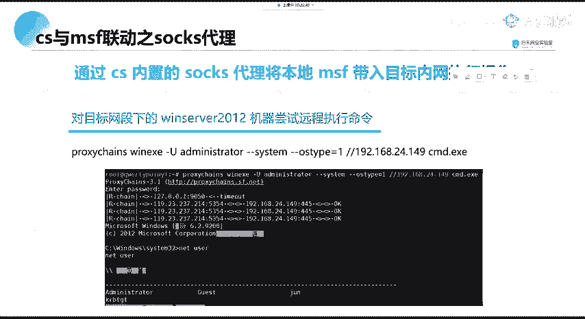

## 将MSF全局挂载到代理
上一节我们学会了为单条命令设置代理，但MSF中有大量交互式操作，频繁使用 `proxychains` 不方便。本节我们学习如何将整个MSF框架的流量都导向代理。

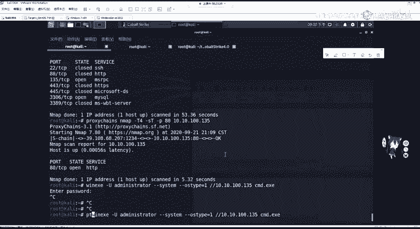

CS为我们提供了更便捷的方式。在 `View -> Proxy Pivots` 界面中，找到你启动的代理，点击 `Tunnel` 按钮。

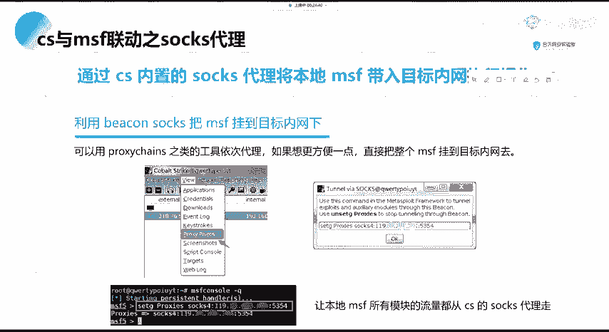

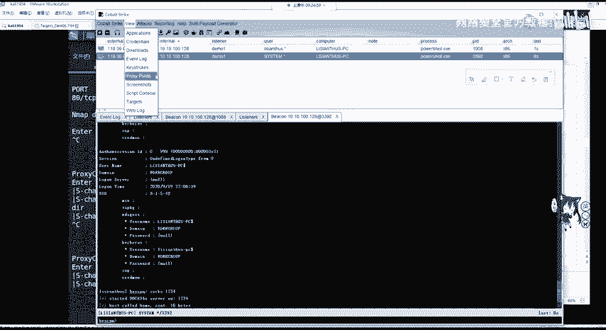


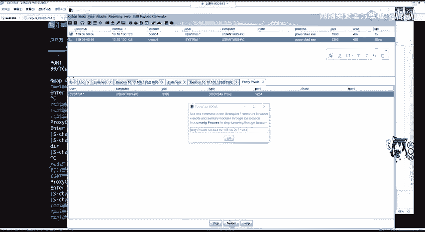

CS会生成一段用于MSF的配置命令，内容类似于：
```bash
setg Proxies socks4:39.108.6.207:1234
setg ReverseAllowProxy true
```
1.  启动MSF控制台（`msfconsole`）。
2.  将上面生成的命令直接粘贴并执行。这样，**整个MSF会话**的出口流量都会通过CS建立的Socks代理发出。
3.  之后，你就可以像在本地一样使用MSF的所有模块来攻击内网目标了，例如：
    ```bash
    use auxiliary/scanner/smb/smb_ms17_010
    set RHOSTS 10.10.100.135
    run
    ```

**重要提示**：
*   通过代理进行漏洞利用（如反弹Shell）速度极慢，成功率低，不推荐。
*   命令 `set ReverseAllowProxy true` 虽然允许通过代理反弹Shell，但在实际高延迟代理环境中基本不可行。
*   此方法最适合用于**扫描、信息收集**等对实时性要求不高的操作。

## 总结
本节课中我们一起学习了CS与MSF联动中Socks代理的关键技术。

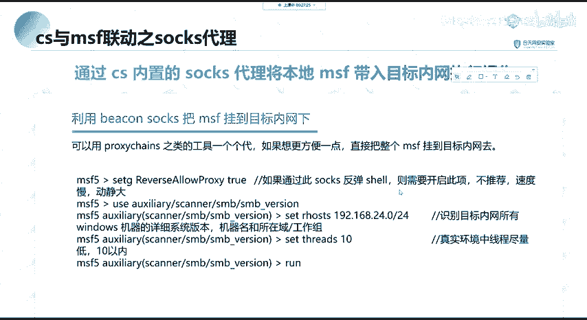

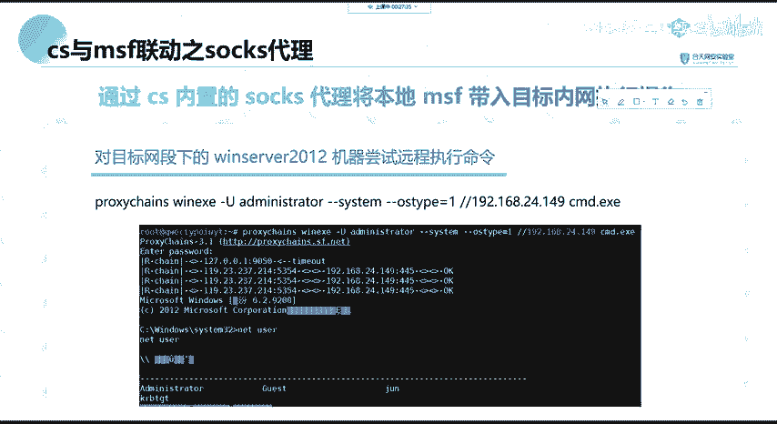

我们首先明确了CS作为稳控平台、MSF作为利用工具的角色分工。然后，通过搭建清晰的实验环境，理解了代理在穿透网络隔离中的必要性。核心实践部分分为两步：一是在CS上使用 `socks` 命令启动代理服务；二是学习如何使用 `proxychains` 为单条命令配置代理，以及如何将整个MSF框架挂载到代理上，从而使其能够扫描和探测内网资产。

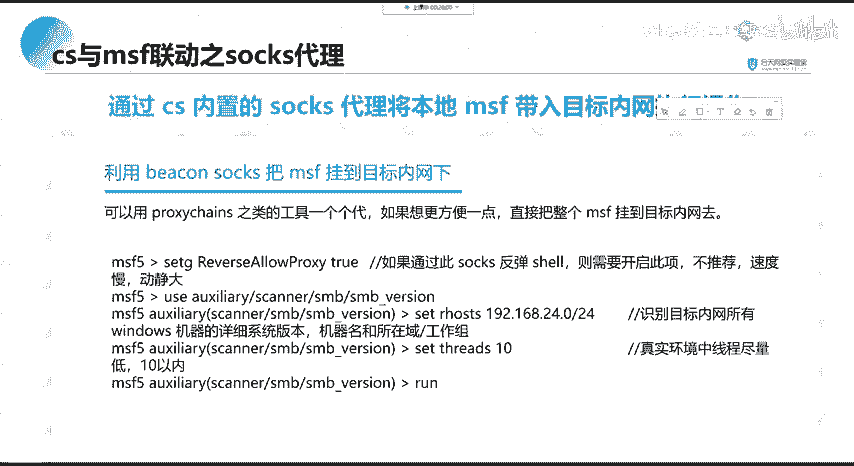

记住，代理是内网横向移动的桥梁，但也会带来速度延迟。在实际渗透测试中，需要根据网络状况灵活选择使用代理进行扫描，还是通过已控主机进行“跳板”攻击。