# 网络安全系统教程：P32：19.课后作业练习 📝

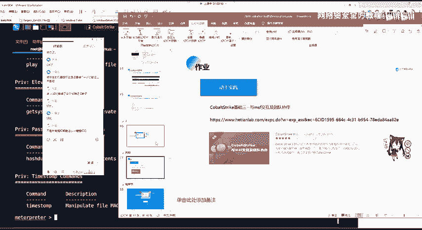

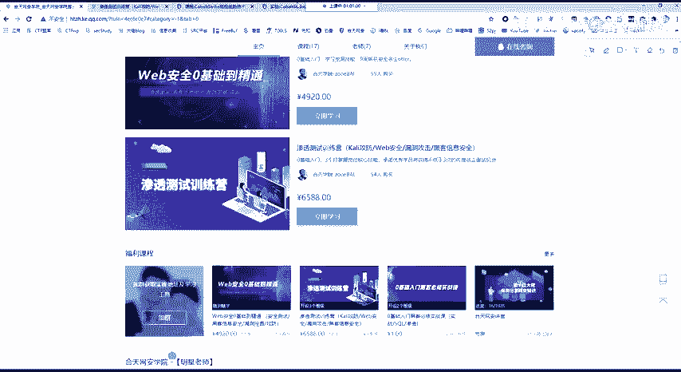

在本节课中，我们将布置两项课后作业，以巩固所学的渗透测试知识。作业旨在通过动手实践，帮助大家加深对Metasploit框架（MSF）和公网环境搭建的理解。

---

上一节我们介绍了渗透测试中的一些高级工具和概念，本节中我们来看看具体的实践任务。

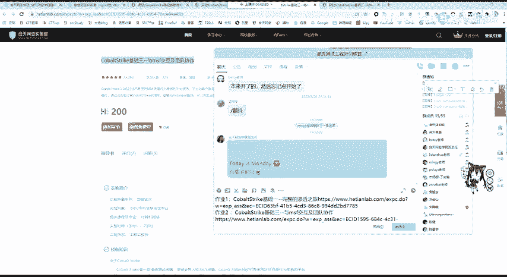

以下是两项课后作业：

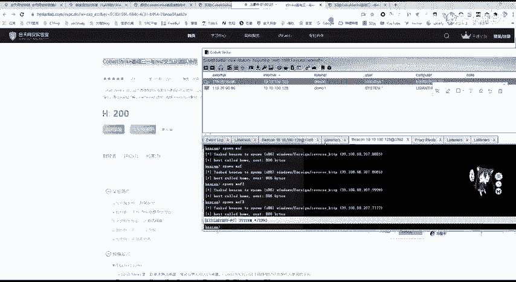

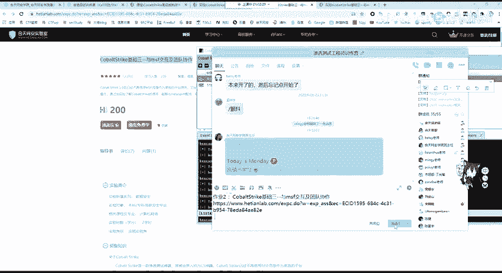

1.  **完成“和厅网安实验室”的完整渗透测试实验**。该实验基于版本3.0，是一个完整的渗透测试流程练习。由于原课程群内文档可能遗失，实验资料已直接提供。请按照指导完成该实验。
2.  **在公网VPS上搭建并尝试渗透测试环境**。建议有能力的学习者购买一台VPS服务器进行实践。对于在校大学生或24岁以下用户，可以关注阿里云等平台的学生优惠或疫情期间的免费试用活动。不推荐购买国外VPS，因为网络延迟可能影响操作体验。请在公网环境中尝试搭建和测试。

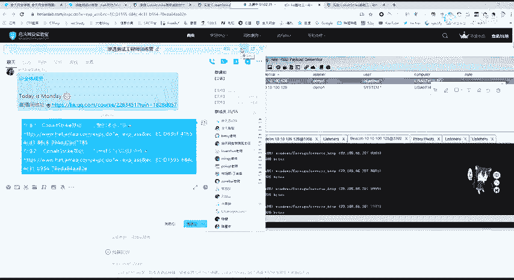

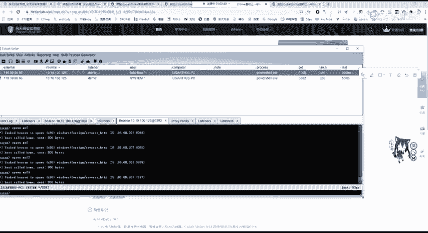

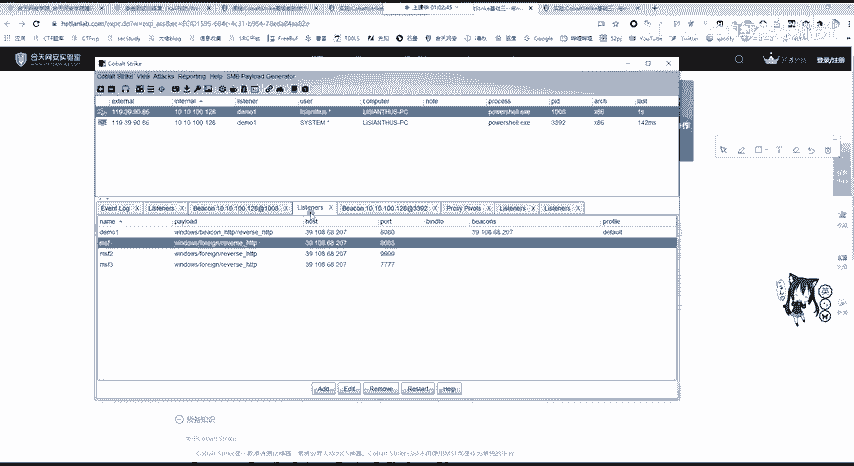

---

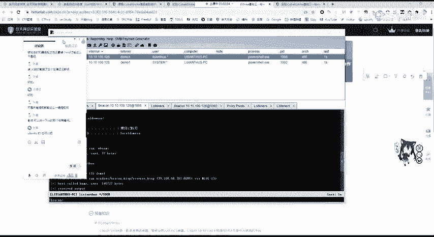

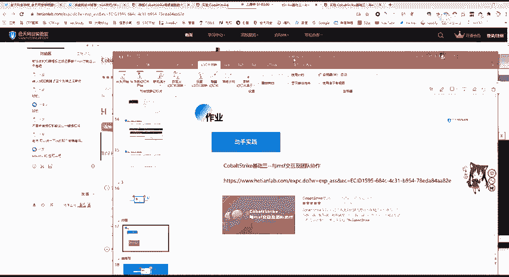

在实践过程中，有同学提到了关于“CS红病毒”的问题，这里进行统一解答。

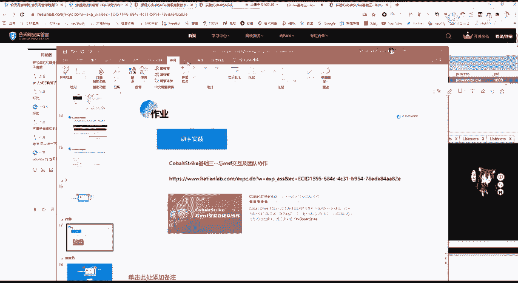

“红病毒”通常指利用Cobalt Strike（CS）等工具生成的恶意脚本或宏代码。例如，在PPT或Office文档中插入恶意宏（Macro）。生成方式为：在Cobalt Strike客户端中创建攻击载荷（Payload），生成相应的脚本（如VBA宏代码），然后将该脚本放入Office文档中执行。

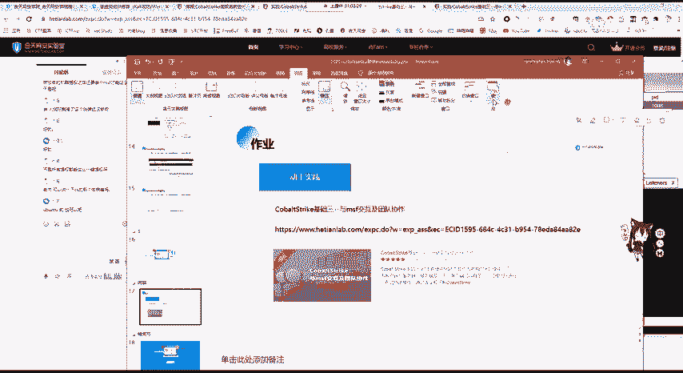

**核心操作代码示意（生成攻击载荷）**：
```
攻击 -> 生成后门 -> Windows可执行文件（或Office宏）
```

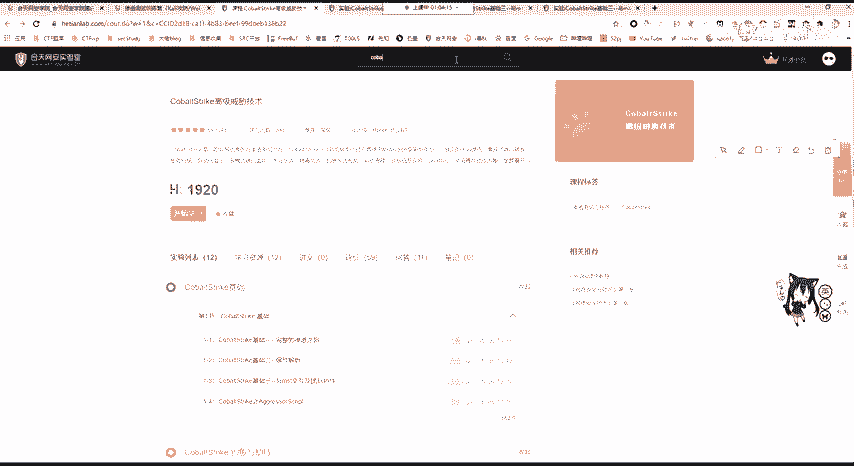

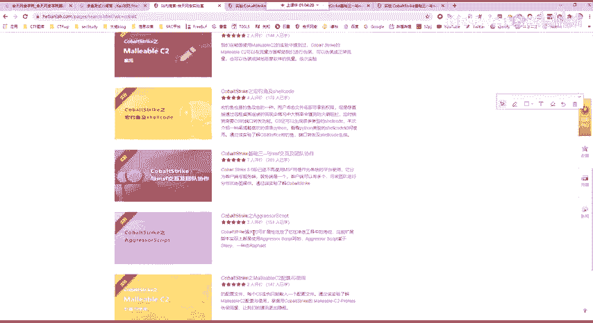

**重要提醒**：此类技术在实际应用中会被安全软件（如Windows Defender、各类杀毒软件）严格拦截。现代Office软件默认会以“受保护的视图”打开来自网络的文件，阻止宏自动运行。因此，这项技术目前在实际渗透测试中利用条件较为苛刻，且仅供合法授权的安全测试与研究使用。

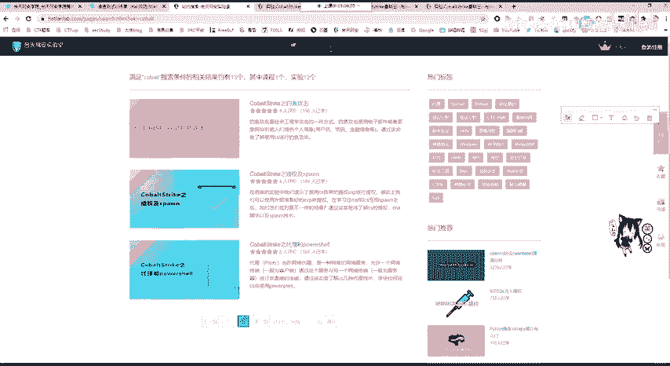

关于Cobalt Strike与Metasploit的联动，课程实验库中可能有相关实验（例如利用MSF进行渗透），大家可以自行查找练习。其核心是理解漏洞利用与权限维持的过程。

---

如果大家在完成作业时遇到任何问题，可以在课程群内提问或私信老师。学习技术贵在动手实践，只听不练很难真正掌握渗透测试的技能，也无法达到就业要求。务必多操作、多思考。

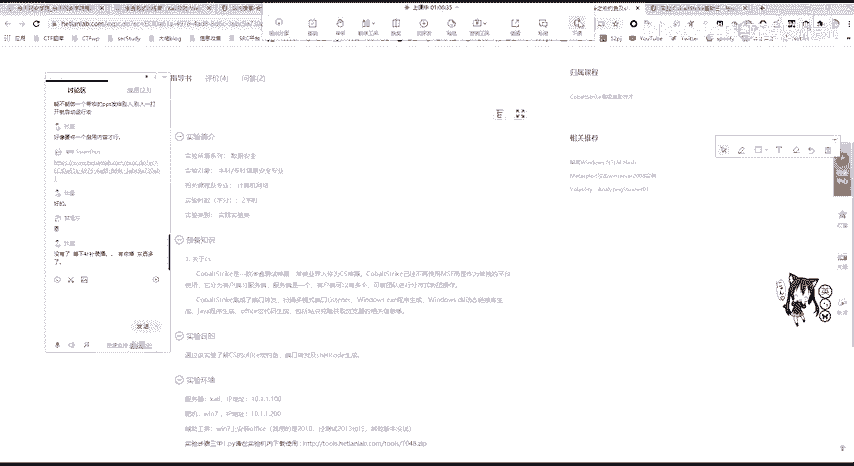

本节课中我们一起学习了课后作业的安排，并解答了关于Cobalt Strike生成物的疑问。记住，实践是巩固知识、迈向职业化的关键一步。本次课程到此结束，大家早点休息，我们下次再见。