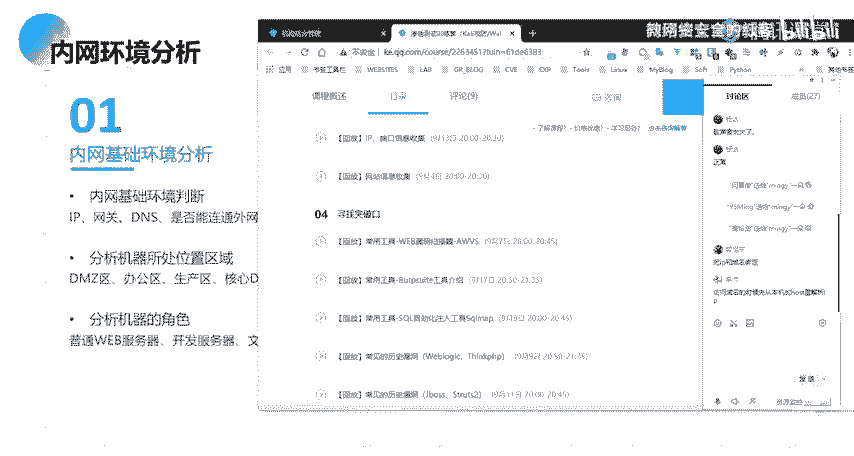
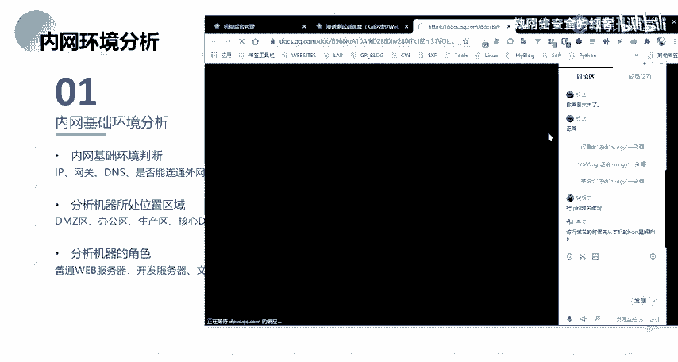
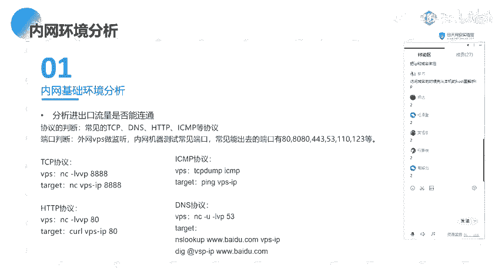
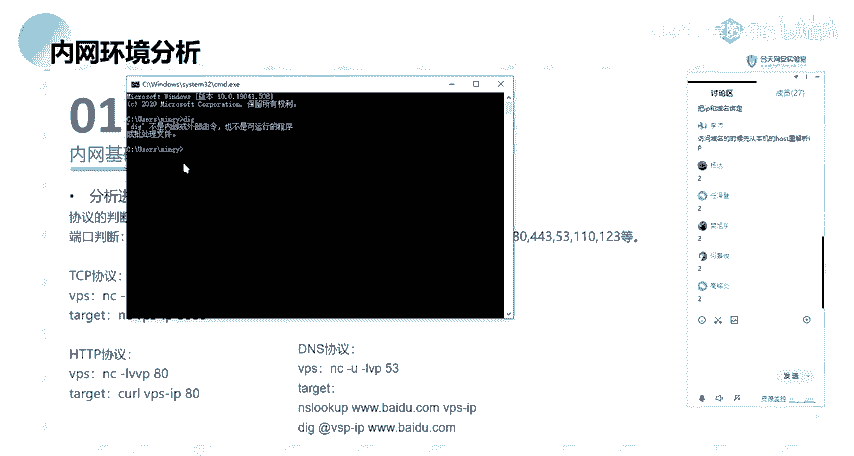

# 网络安全系统教程：20：内网环境分析 🕵️

在本节课中，我们将学习内网渗透的第一步——内网信息收集。我们将从理解内网环境分析开始，逐步介绍如何判断和分析我们进入的内网环境，为后续的渗透工作打下基础。

## 内网环境分析概述

在开始具体的信息收集之前，我们需要先对内网环境有一个宏观的分析。这有助于我们理解目标网络的结构，并确定后续行动的优先级和方向。

上一节我们介绍了内网渗透的基本概念，本节中我们来看看如何进行内网环境分析。以下是内网环境分析涉及的几个核心方面：

### 1. 内网基础环境判断

首先，我们需要对当前所在机器的网络基础信息进行收集和判断。这是了解内网的第一步。

*   **IP地址与网段**：获取当前机器的IP地址，并分析其所属的网段信息。这有助于我们了解内网的网络划分。
*   **网关与DNS**：确定网络的网关地址和DNS服务器地址。这些信息对于理解网络拓扑和进行后续的横向移动至关重要。
*   **网络连通性**：判断当前机器能否访问互联网（外网）。这决定了我们能否使用反弹Shell等需要外网连接的技术。
*   **网络连接与端口**：分析当前机器开放了哪些端口，以及有哪些外部连接。这能揭示机器运行的服务和潜在的通信关系。
*   **本机Hosts文件**：检查 `C:\Windows\System32\drivers\etc\hosts` 文件。该文件用于本地域名解析，优先级高于DNS服务器，可能包含重要的内部域名映射关系。
*   **代理设置**：检查机器是否配置了代理服务器。代理可能是我们访问外网或内网其他区域的跳板。
*   **域环境判断**：判断当前机器是否加入了域（Domain），并获取域名。这是区分工作组和域环境的关键，直接影响后续的信息收集方法。

### 2. 分析机器所处区域

了解机器在内网中所处的逻辑区域，有助于评估其重要性和可能存在的安全策略。

*   **DMZ区（隔离区）**：放置对外提供服务的服务器（如Web服务器）。通常位于防火墙之间，可能同时被内网和外网访问。
*   **办公区**：员工日常办公使用的计算机区域。
*   **生产区**：运行业务核心应用和数据库服务器的区域，存储关键数据。
*   **核心区**：存放最敏感数据和服务的区域，访问控制最为严格。

### 3. 分析机器角色

确定当前机器在内网中扮演的角色，可以帮助我们寻找有价值的信息和下一步的攻击路径。

*   **Web服务器**：可能存有网站源码、配置文件（含数据库连接信息）。
*   **开发/测试服务器**：可能存有项目源代码、测试账号密码等敏感信息。
*   **文件服务器**：可能存有公司内部文档、数据备份等。
*   **代理服务器**：可作为网络跳板，访问其他隔离区域。
*   **DNS服务器**：掌握内网域名解析信息。
*   **数据库服务器**：存储核心业务数据。

### 4. 分析进出口流量

判断当前机器能否与外界通信，以及允许哪些协议和端口的流量通过。

*   **协议判断**：测试常见的网络协议是否能够出网。
    *   **TCP**：使用 `nc` 命令连接外网IP和端口进行测试。
    *   **HTTP**：尝试访问外网 `http` 服务。
    *   **ICMP**：使用 `ping` 命令测试，在外网VPS上用 `tcpdump` 抓包验证。
    *   **DNS**：使用 `nslookup` (Windows) 或 `dig` (Linux) 查询外网域名，在外网VPS的53端口监听验证。

*   **端口判断**：测试特定端口（如80、443、53等）是否被防火墙允许出站连接。

## 总结

本节课中，我们一起学习了内网环境分析的核心内容。我们首先明确了内网信息收集是内网渗透的第一步。接着，我们从四个维度详细探讨了如何分析内网环境：
1.  判断基础网络信息（IP、网关、DNS、是否在域内等）。
2.  识别机器所在的逻辑区域（如DMZ区、办公区）。
3.  分析机器扮演的角色（如Web服务器、文件服务器）。
4.  测试网络的出口策略（哪些协议和端口可以出网）。

掌握这些分析方法，能够帮助我们在进入内网后快速定位自身位置，评估环境，并规划出有效的后续渗透测试路径。下一节，我们将开始学习具体的工作组信息收集技术。