# 网络安全系统教程：P35：域内信息收集 🕵️♂️

在本节课中，我们将学习域环境下的信息收集技术。上一节我们介绍了工作组环境，本节中我们来看看域环境与工作组的区别，并掌握在域内进行信息收集的核心命令和方法。

## 概述

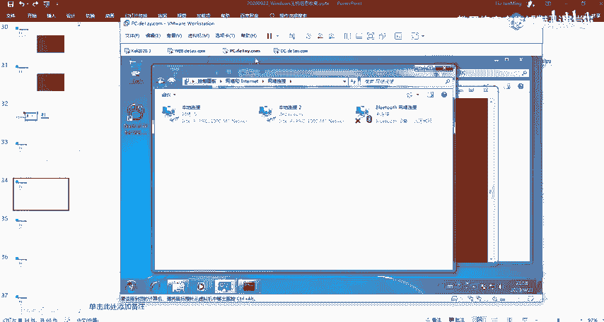

域是一个有安全边界的计算机集合。它与工作组类似，都是多台计算机的逻辑组织，但域提供了更强大的集中管理能力。在域中，一个域的用户无法直接访问另一个域的资源，这构成了安全边界。域通过域控制器（DC）来集中管理域内所有用户账号和安全信息。

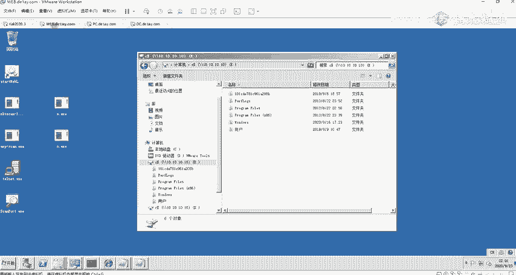

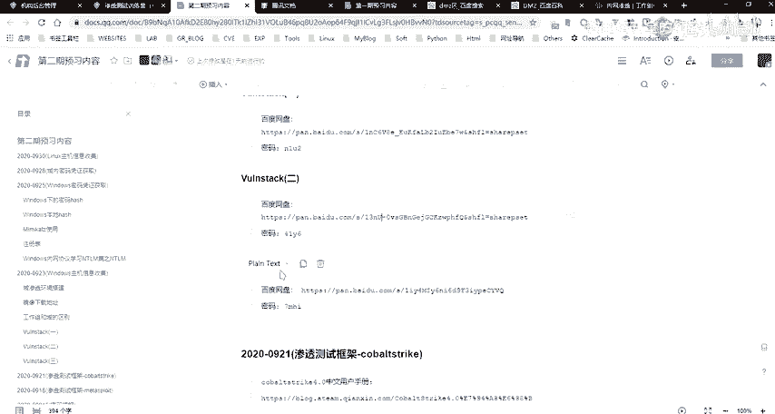

## 域与工作组的区别

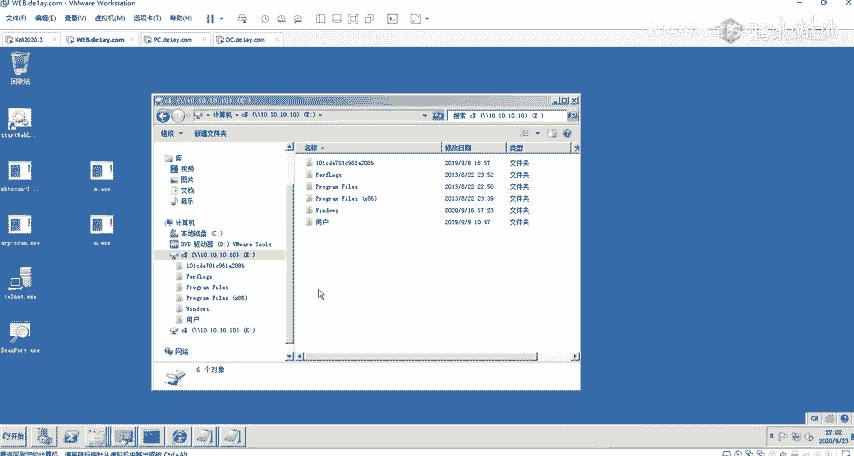

域相比工作组，其主要优点在于能够批量管理和控制域内的所有计算机。工作组适合小规模、分散的管理，而域适合需要集中控制的中大型网络环境。

## 域的核心概念

上一节我们介绍了工作组，本节中我们来看看域的几个核心概念。

### 域控制器（DC）

域控制器是域架构的核心，至少有一台。它保存着整个域的活动目录（AD）数据库，其中包含了所有域用户、计算机账号和安全策略信息。在渗透测试中，获取域控制器的权限通常是最高目标，因为这意味着控制了整个域。

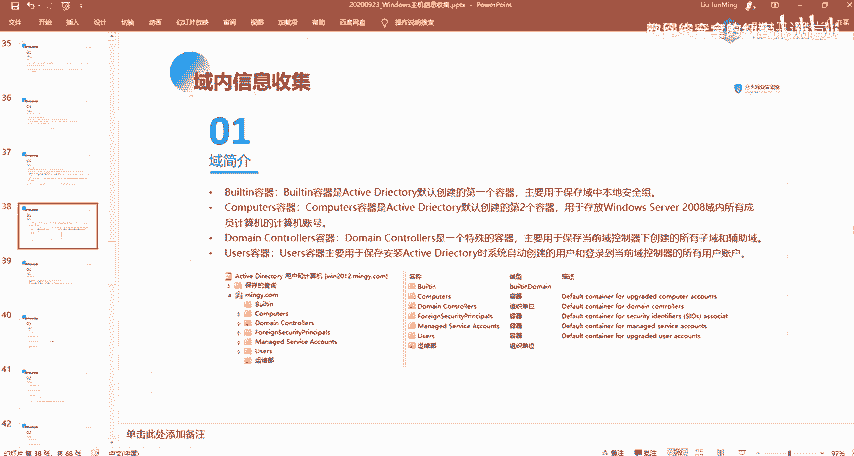

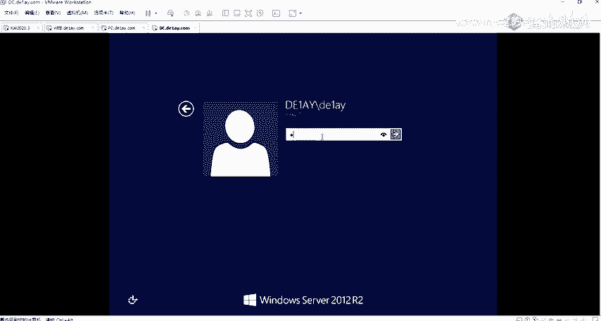

### 活动目录（AD）

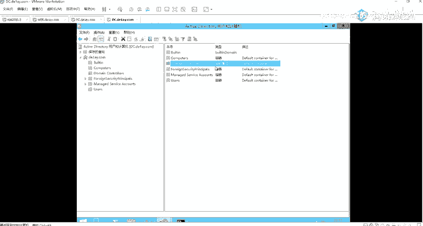

活动目录是域环境中提供目录服务的组件。所有网络对象（如用户、计算机、共享资源）的信息都以结构化的方式存储其中。其服务器就是域控制器。

### 域内默认容器

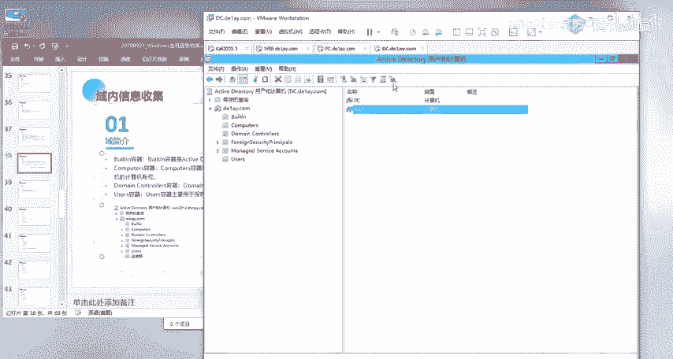

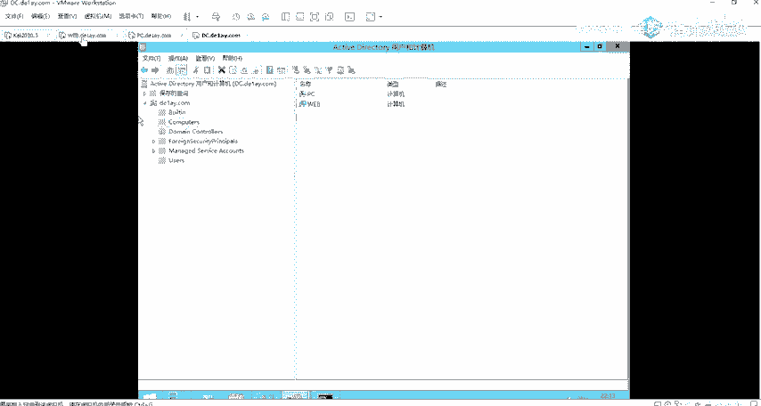

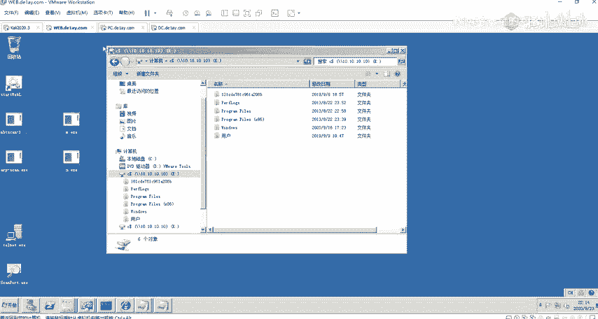

在活动目录中，存在一些默认容器，用于分类存储信息。以下是几个重要的默认容器：

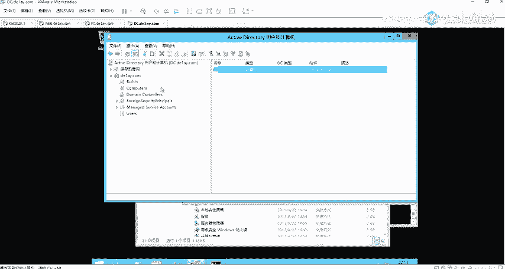

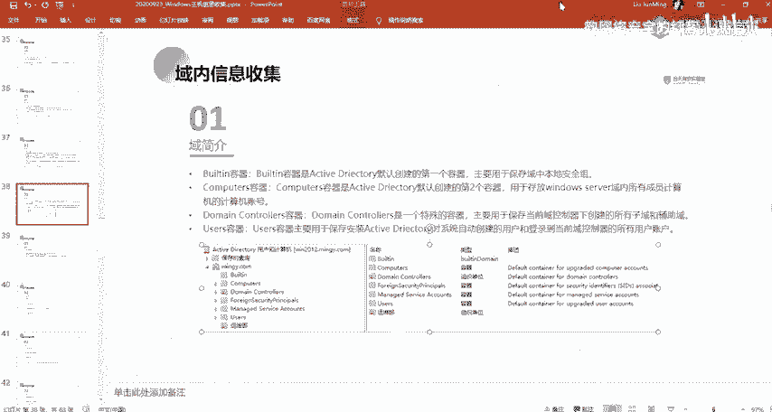

*   **Builtin容器**：保存域内默认创建的本地安全组，例如 **Administrators**（管理员组）和 **Users**（普通用户组）。
*   **Computers容器**：存放域内所有成员计算机的计算机账号。
*   **Domain Controllers容器**：存放域控制器本身的计算机账号。
*   **Users容器**：保存域用户账号。

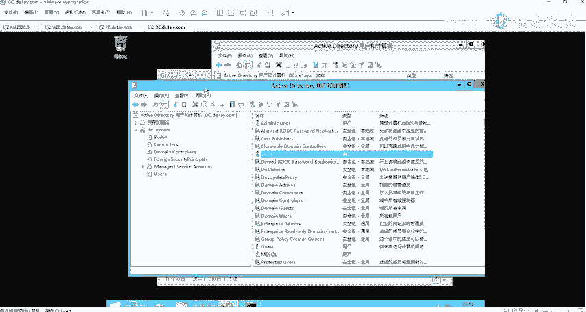

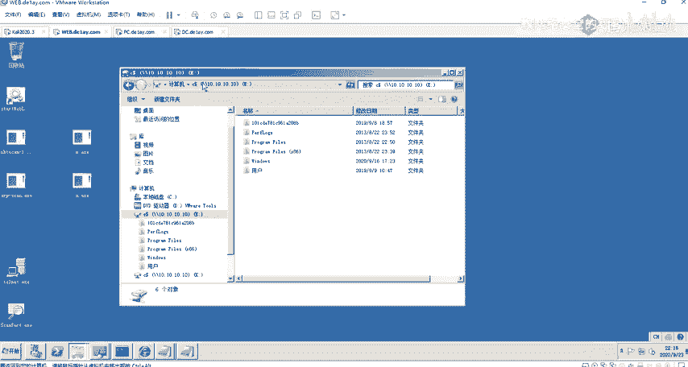

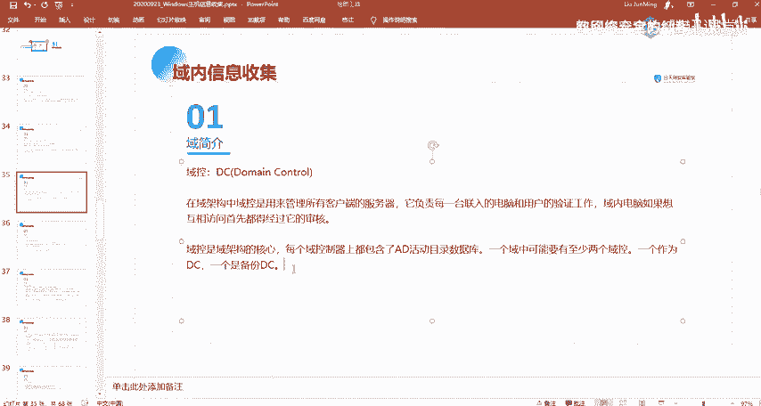

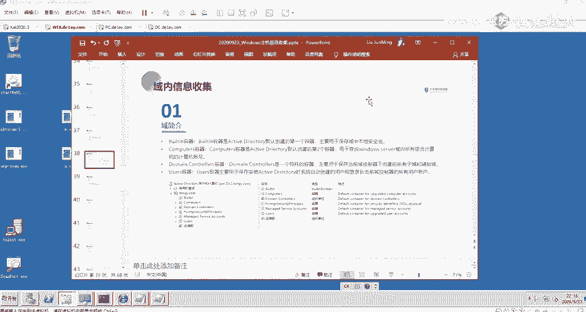

### DNS服务器的作用

域控制器通常也充当DNS服务器。域内计算机依靠DNS服务来通过主机名定位其他计算机和域控制器本身。因此，DNS服务器（其IP地址通常就是域控制器的IP）在域环境中至关重要。

## 域内信息收集命令

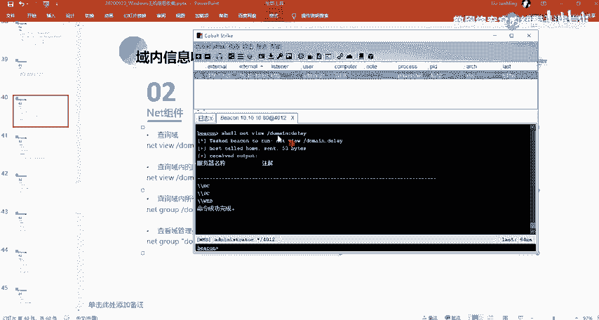

在了解了域的基本概念后，本节中我们来看看如何利用系统命令在域内收集信息。以下是常用的域信息收集命令及其用途：

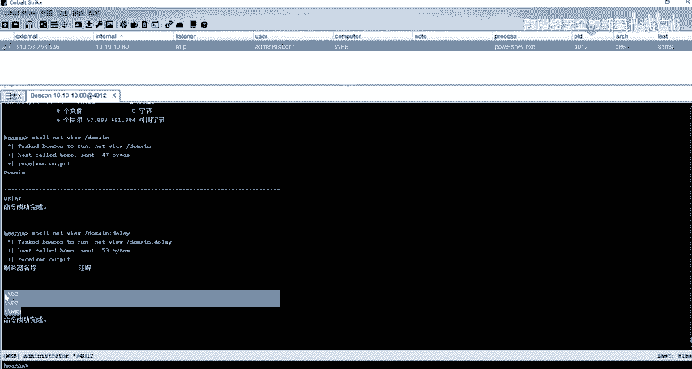

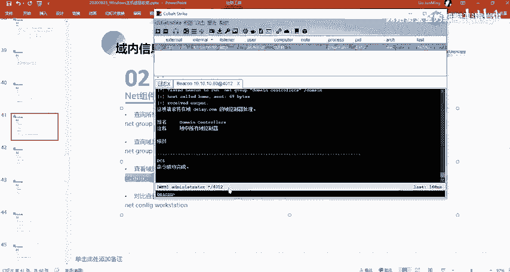

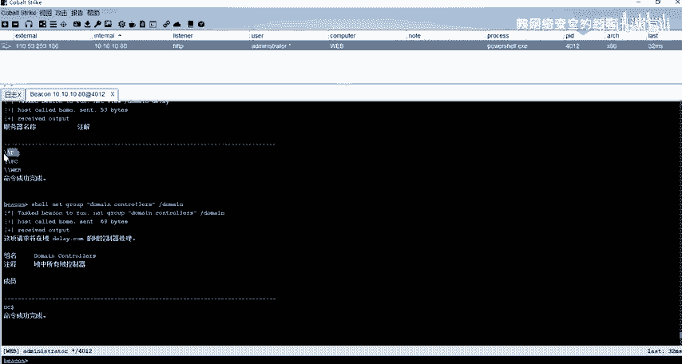

*   **`net view /domain`**：查询当前主机所在的域名。
*   **`net view /domain:域名`**：列出指定域中的所有计算机。例如：`net view /domain:DE1AY`。
*   **`net group “domain controllers” /domain`**：查询域内的域控制器列表。
*   **`net user /domain`**：查询域内的所有用户账号。
*   **`net group /domain`**：查询域内的所有组。
*   **`nltest /dclist:域名`**：查询指定域的域控制器主机名。
*   **`nslookup -type=SRV _ldap._tcp.域名`**：通过DNS查询定位域控制器。

## 定位域控制器的方法

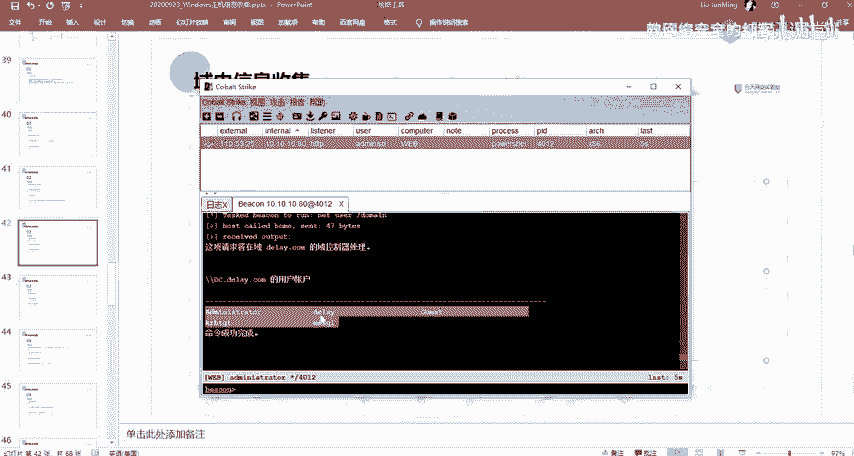

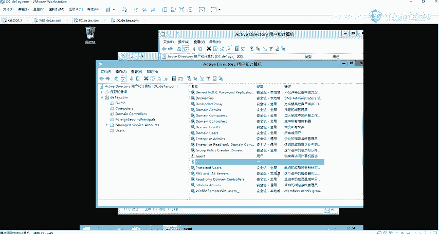

在渗透测试中，快速定位域控制器是关键步骤。以下是几种定位方法：

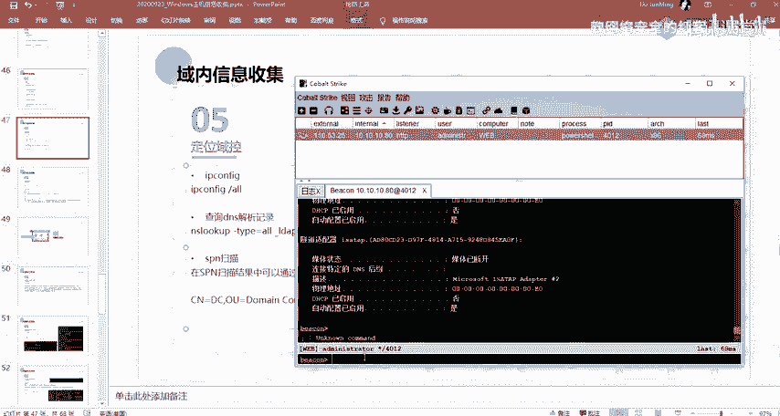

*   **通过DNS解析**：直接解析域控制器的常见主机名，如 `DC`、`DOMAINCONTROLLER` 等。命令：`nslookup dc.域名`。
*   **查询域控制器组**：使用命令 `net group “domain controllers” /domain`。
*   **端口扫描**：域控制器通常会开放 **389端口**（LDAP服务）和 **53端口**（DNS服务）。扫描到同时开放这两个端口的主机，很可能是域控制器。
*   **SPN扫描**：扫描服务主体名称（SPN），域控制器的SPN记录通常包含 `LDAP/DC.域名` 等信息。

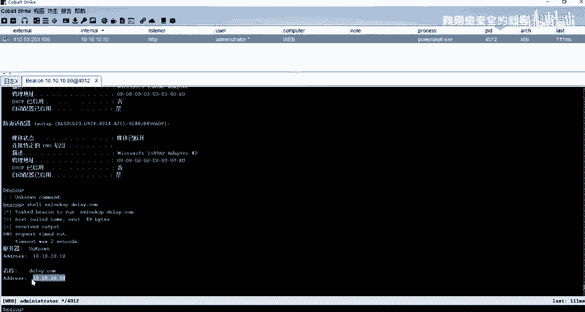

## 总结

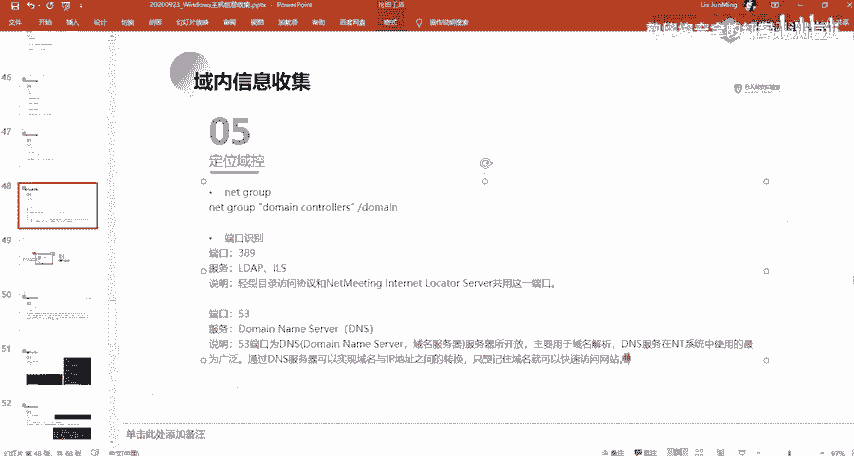

本节课中我们一起学习了域环境的基本概念和信息收集技术。我们了解了域与工作组的区别，认识了域控制器、活动目录等核心组件，并掌握了使用 `net`、`nltest`、`nslookup` 等命令在域内收集计算机、用户、组以及定位域控制器的方法。这些是内网渗透测试中域环境侦查的基础技能。