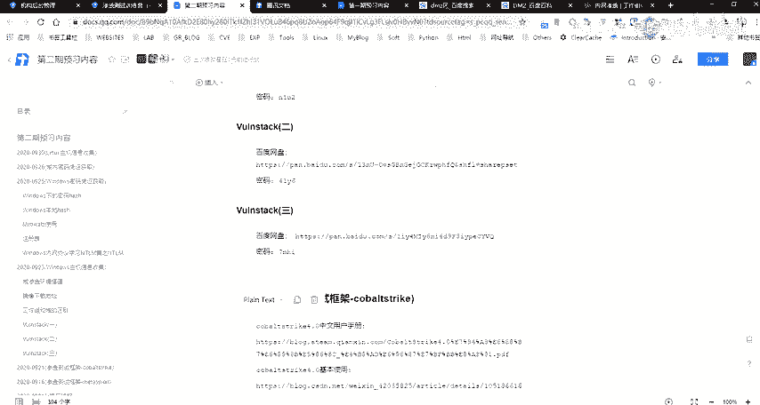
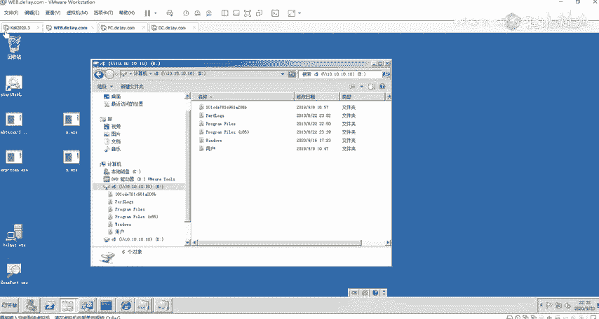

# 网络安全系统教程：P36：内网存活探测

## 概述
在本节课中，我们将学习网络安全渗透测试中的一个重要环节——内网存活探测。我们将了解其核心概念、常用协议以及实践工具，帮助你掌握如何发现内网中的活动主机。

---

## 课程内容回顾与本节引入
上一节我们介绍了渗透测试的基础知识。本节中，我们来看看如何在内网环境中探测存活的主机。这是信息收集阶段的关键步骤，能帮助我们绘制内网地图，为后续攻击做准备。

由于课程时间安排，本节关于内网存活探测的详细操作演示将不展开讲解。讲师提供了详细的PPT资料供学员课后学习。本节重点在于理解核心概念和方法论。

内网存活探测涉及利用多种网络协议来发现活跃的主机。虽然内容看起来较多，但核心原理并不深奥。初学者跟随课程逐步学习，遇到问题及时提问，完全可以掌握。

---

## 核心概念：探测协议与原理
内网存活探测主要通过分析主机对特定网络协议请求的响应来实现。关键在于理解不同协议的特点和适用场景。

以下是几种常用的探测协议及其原理：

*   **NetBIOS协议**：这是一种在局域网内进行名称解析和服务的协议。通过查询NetBIOS名称表，可以快速发现内网主机。
    *   **常用工具/命令**：`nbtstat`, `NBTscan`, Metasploit框架中的 `nbns` 模块。
*   **ICMP协议**：最常用的存活探测协议，通过发送ICMP Echo请求（即ping包）并等待回复来判断主机是否在线。
    *   **常用工具/命令**：`ping` 命令，`nmap -PE`。
*   **ARP协议**：在数据链路层工作的协议，用于将IP地址解析为MAC地址。扫描本地子网时效率极高。
    *   **常用工具/命令**：`arp-scan`, `nmap -PR`。
*   **TCP/UDP端口扫描**：通过向目标主机的特定端口发送TCP SYN包或UDP包，根据响应（如SYN-ACK、ICMP不可达）来判断主机存活及端口状态。
    *   **常用工具/命令**：`nmap` (如 `nmap -sn` 进行主机发现，`-sS` 进行TCP SYN扫描)。

---

## 学习方法与实践环境搭建
理论学习需要结合实践才能巩固。建议大家在课后搭建实验环境进行实际操作。

以下是搭建本地渗透测试实验环境的步骤：

1.  **获取靶机环境**：下载现成的虚拟机靶机镜像（例如包含多个漏洞系统的OVA/OVF文件），这比从头安装配置操作系统更节省时间。
2.  **安装攻击机**：准备一个Kali Linux虚拟机作为攻击机，其中集成了大部分所需的测试工具。
3.  **配置网络**：将靶机和攻击机的网络模式设置为同一网络（如“桥接模式”或“自定义的特定VMnet”），确保它们可以相互通信。
4.  **启动与测试**：启动所有虚拟机，并尝试从Kali Linux攻击机ping通靶机，验证网络连通性。

> **注意**：网络配置的具体步骤若遇到问题，可以在课程群内提问。讲师或同学会提供帮助。

---

## 课程总结与后续安排
本节课我们一起学习了内网存活探测的核心概念。我们了解到，探测主要依赖于NetBIOS、ICMP、ARP、TCP/UDP等协议，并可以使用 `nmap`、`NBTscan`、`arp-scan` 等工具高效完成。

由于课时限制，本节课的演示部分转为自学内容。讲师已将详细的命令、使用截图和结果分析汇总在PPT中，供大家课后研究。请大家利用课间时间消化已学内容，并在本地环境进行实践操作。

下节课将按照原定计划继续新的主题。如果大家对内网探测这部分内容有强烈的讲解需求，讲师可能会额外安排时间进行深入探讨。学习过程中有任何疑问，请随时在群内提出。

---
**下课。大家早点休息。**