# 网络安全系统教程：P37：Windows Hash简介

在本节课中，我们将要学习Windows系统中的密码凭证获取。主要内容分为三部分：首先介绍Windows哈希的概念，然后讲解系统用户密码凭证的获取方法，最后探讨其他凭证（如软件和RDP连接密码）的获取技术。

## 🧩 第一部分：什么是Windows哈希？

上一节我们概述了课程内容，本节中我们来看看Windows哈希的具体含义。

Windows哈希可以简单理解为Windows系统加密后的密码口令。例如，一个明文密码 `admin` 经过特定的加密算法处理后，会生成一串固定长度的哈希值。

Windows系统主要使用两种方法对用户密码进行哈希处理：
*   **LM哈希**：全称为Lan Manager Hash。
*   **NT哈希**：全称为NTLM Hash（NT Lan Manager Hash）。

以下是关于这两种哈希的重要说明：
1.  **LM哈希**的密码最大长度为14个字符。如果密码超过14位，系统将无法使用LM哈希进行加密。此外，LM哈希本身存在安全缺陷，因此在较新的Windows系统中已默认禁用。
2.  **NT哈希**是目前主流使用的加密方式。它还有不同的版本（如NTLMv1和NTLMv2），其加密方法和安全性有所区别。关于NTLM的认证协议，我们将在后续课程中详细介绍。

因此，在后续内容中，我们将主要关注**NT哈希**。

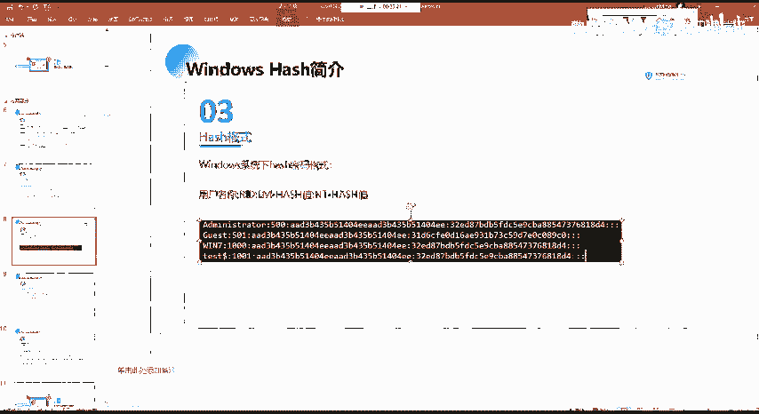

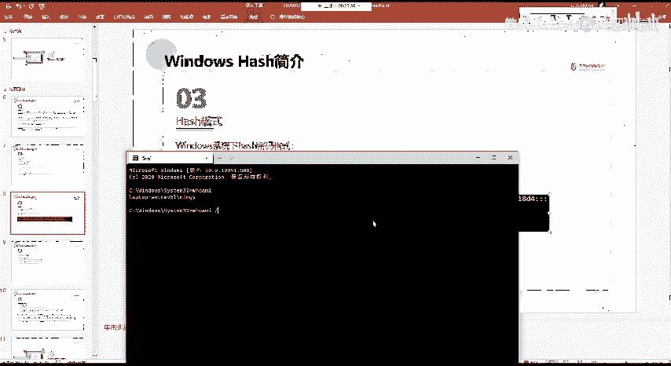

## 🔢 Windows哈希的存储格式

了解了哈希的基本类型后，我们来看看它在系统中是如何存储的。

Windows系统存储的密码哈希默认由两部分组成：LM哈希和NT哈希，中间用冒号分隔。其完整格式如下：

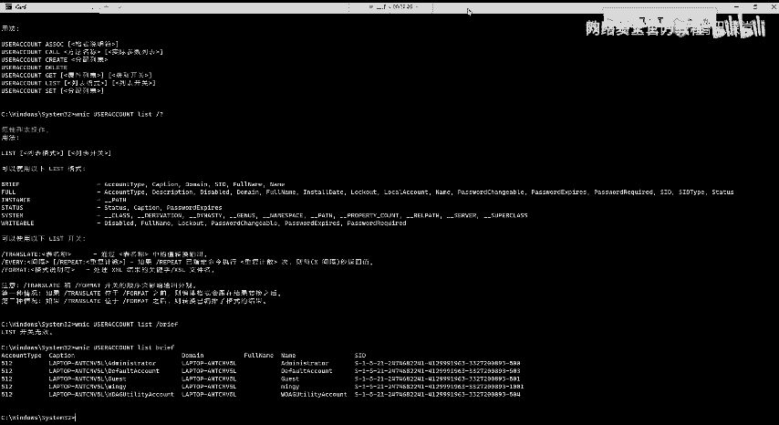

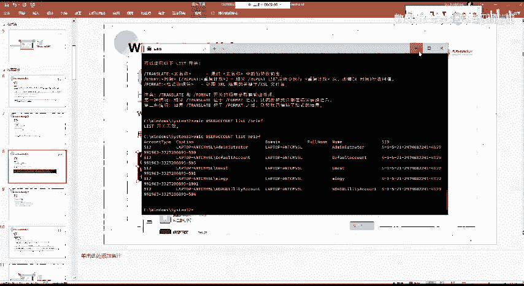

`用户名:RID:LM哈希:NT哈希:::`

以下是每个部分的解释：
*   **用户名**：系统账户的名称。
*   **RID**：相对标识符，是用户SID（安全标识符）的最后一部分，用于在系统中唯一标识一个用户。例如，内置管理员账户的RID通常是500。
*   **LM哈希**：如果系统启用或支持，此处为LM哈希值；否则可能为一串固定的空值（如`aad3b435b51404eeaad3b435b51404ee`）。
*   **NT哈希**：用户密码经过NT哈希算法加密后的值。

我们可以通过系统命令查看用户的SID和RID。例如，使用 `whoami /user` 命令可以查看当前用户的SID。

```
C:\> whoami /user
用户信息
----------------
用户名          SID
=============== ==============================================
mydomain\user1  S-1-5-21-3623811015-3361044348-30300820-1013
```
在这个例子中，SID末尾的 `1013` 就是该用户的RID。

## 🔐 Windows认证基础

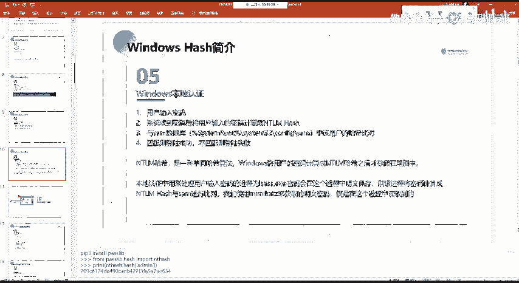

在探讨如何获取哈希之前，需要理解Windows的认证机制。Windows认证主要分为三种类型：

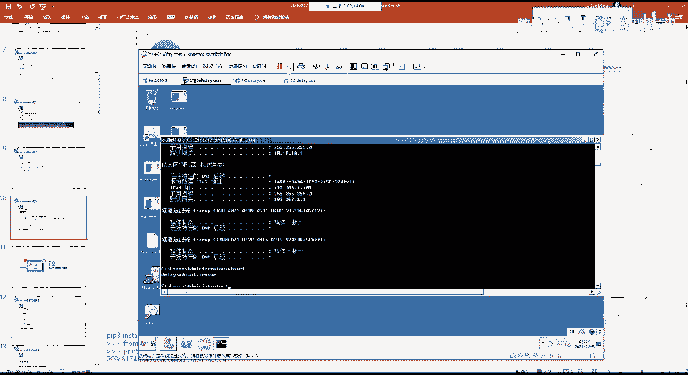

1.  **本地认证**：用户直接在计算机上输入用户名和密码登录系统。
2.  **网络认证**：用户通过网络远程访问工作组中的其他计算机资源（如文件共享）。
3.  **域认证**：用户登录到域环境中的计算机。

本节我们重点讲解与哈希获取最相关的**本地认证**过程。

本地认证的流程可以分为以下几个关键步骤：
1.  **用户输入密码**：用户在登录界面输入用户名和明文密码。
2.  **系统计算哈希**：系统接收到明文密码后，会使用NT哈希算法（或LM哈希，如果启用且密码符合条件）将其计算成哈希值。计算公式可以简化为：`NT_Hash = MD4(UTF-16-LE(password))`。
3.  **哈希比对**：系统从本地的SAM（Security Account Manager）数据库中读取对应用户存储的NT哈希值。SAM数据库文件位于 `%SystemRoot%\system32\config\SAM`，受系统保护。
4.  **验证结果**：系统比较计算出的哈希值与SAM中存储的哈希值。如果两者匹配，则登录成功；否则失败。

在这个过程中，有一个关键进程 **`lsass.exe`**（本地安全机构子系统服务）。它负责处理用户的登录凭证，包括在内存中短暂保存明文密码、计算哈希值以及执行比对工作。这也使得它成为攻击者获取凭证的重要目标。

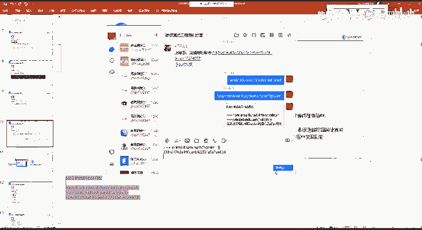

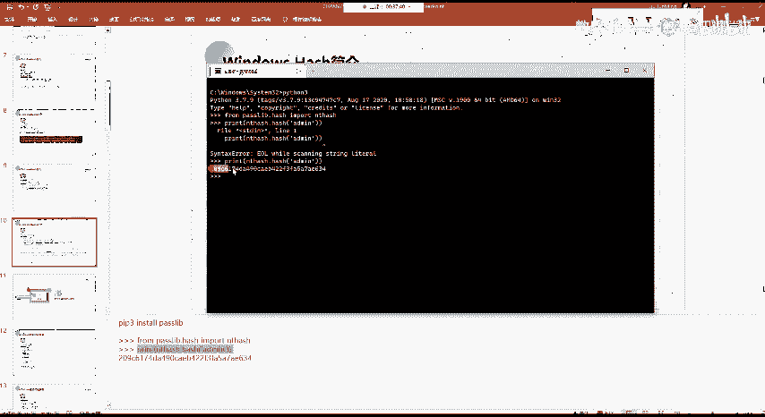

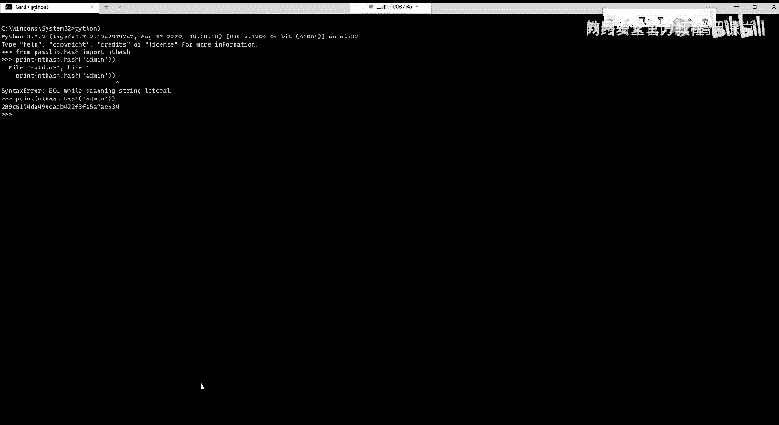

## 💻 哈希值的生成与破解示例

我们可以通过工具模拟生成NT哈希。例如，使用Python的`passlib`库：

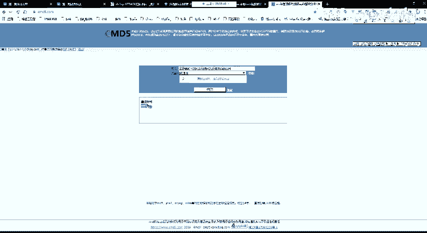

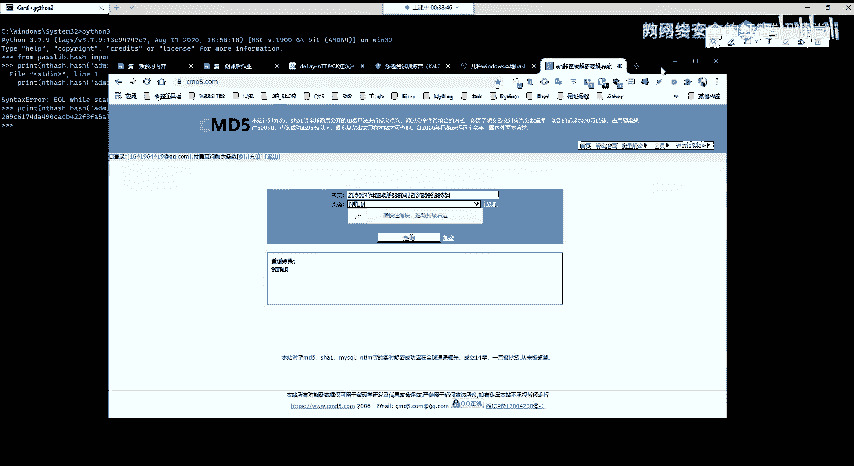

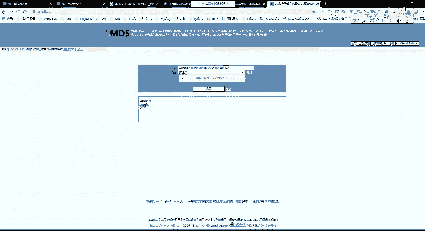

```python
from passlib.hash import nthash
# 计算字符串“admin”的NT哈希
hash_value = nthash.hash("admin")
print(hash_value) # 输出：209c6174da490caeb422f3fa5a7ae634
```

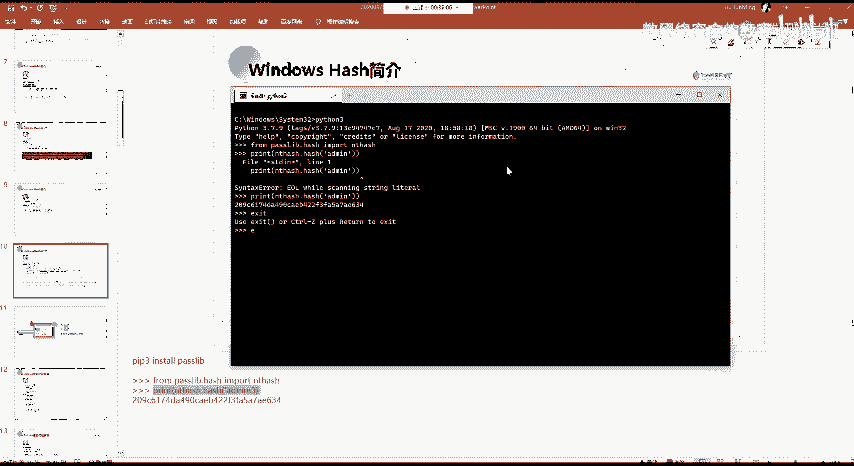

得到的NT哈希值 `209c6174da490caeb422f3fa5a7ae634` 是单向加密的，无法直接反向计算出原始密码。但是，对于弱密码，可以通过“彩虹表”或在线哈希数据库进行查询破解。例如，在cmd5等网站上查询该哈希，很可能直接得到明文密码 `admin`。

**重要提示**：此示例仅用于教学理解哈希的单向性和弱密码的风险。在实际系统中，获取其他用户的哈希值通常需要管理员权限。

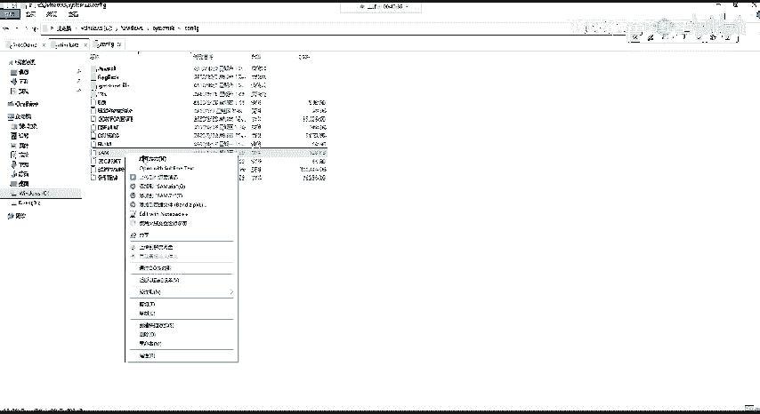

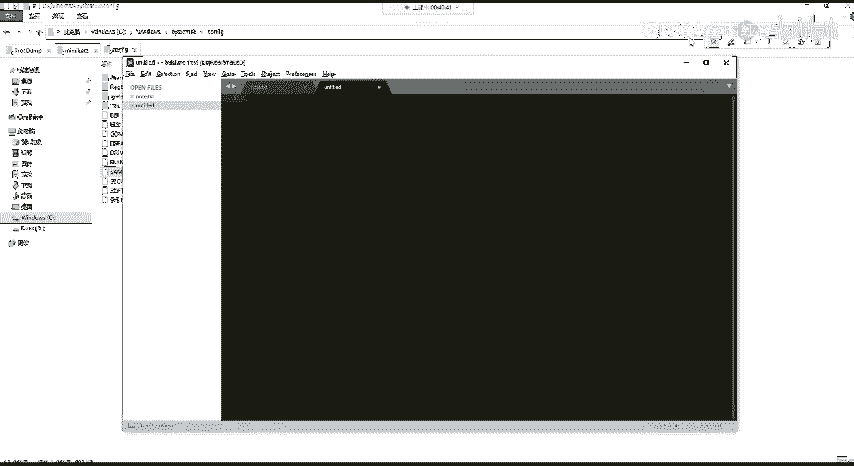

## 📝 课程总结

本节课中我们一起学习了Windows密码哈希的核心知识：
*   **Windows哈希**是加密后的密码凭证，主要分为存在缺陷的LM哈希和当前主流的NT哈希。
*   **哈希存储格式**为 `用户名:RID:LM哈希:NT哈希:::`，其中RID是用户的唯一标识。
*   **本地认证流程**涉及系统将用户输入的密码计算为NT哈希，并与SAM数据库中的存储值进行比对。
*   **关键进程`lsass.exe`**在认证过程中管理凭证，是内存中获取明文密码的潜在来源。
*   哈希是单向加密，但弱密码的哈希值可通过查表方式破解，强调了使用强密码的重要性。

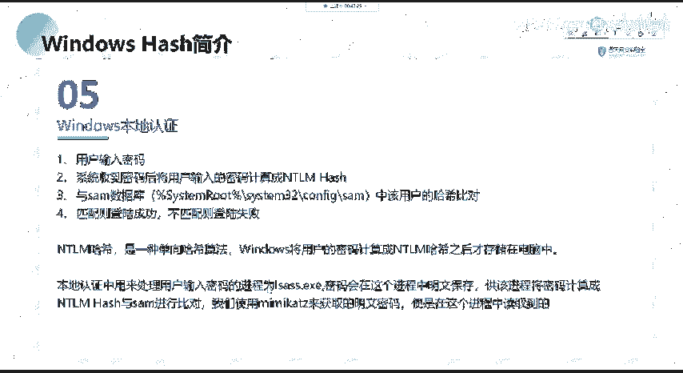

理解这些基础概念是后续学习如何从Windows系统获取这些哈希凭证的前提。在接下来的章节中，我们将实践多种获取这些哈希值的方法。