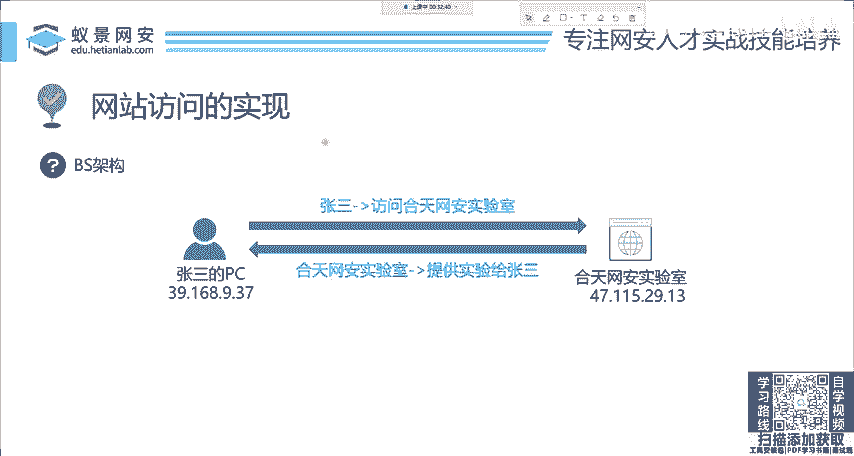
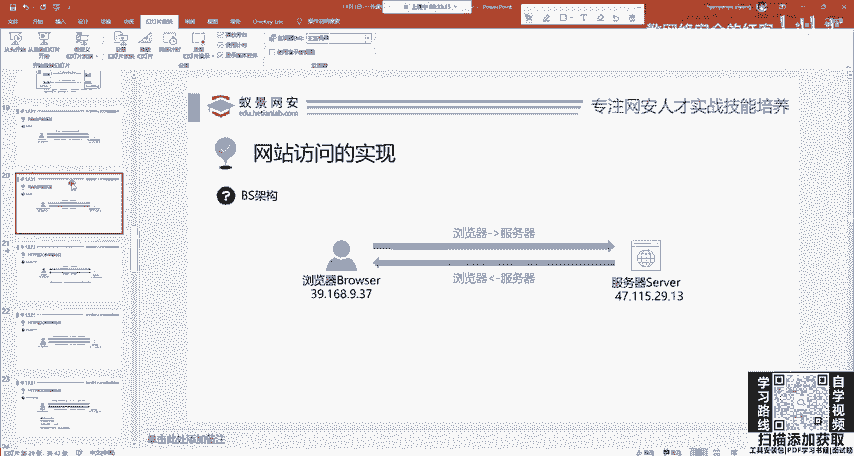
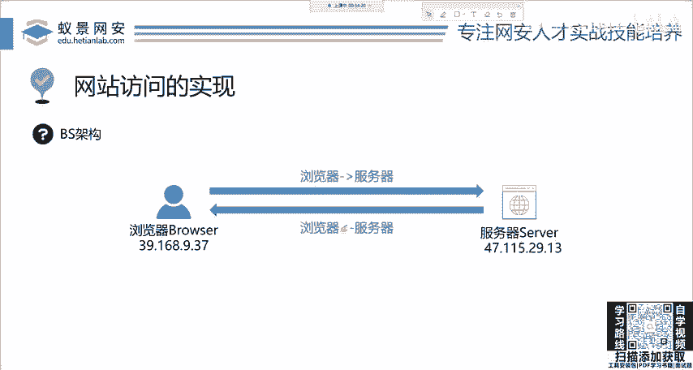
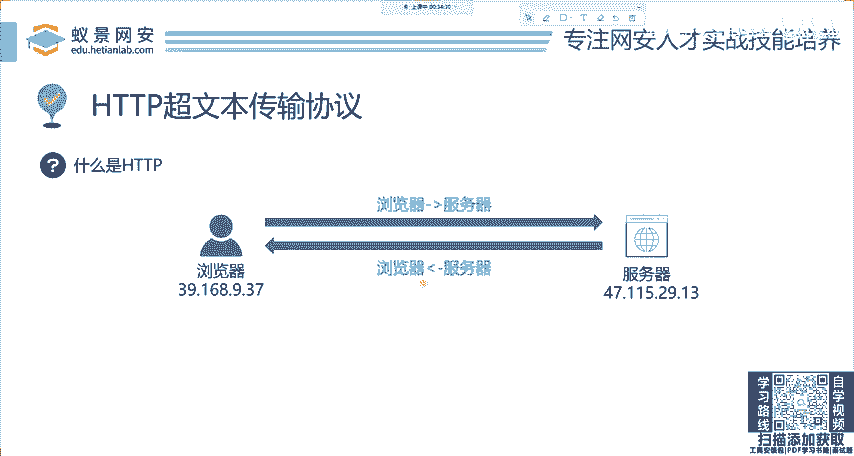
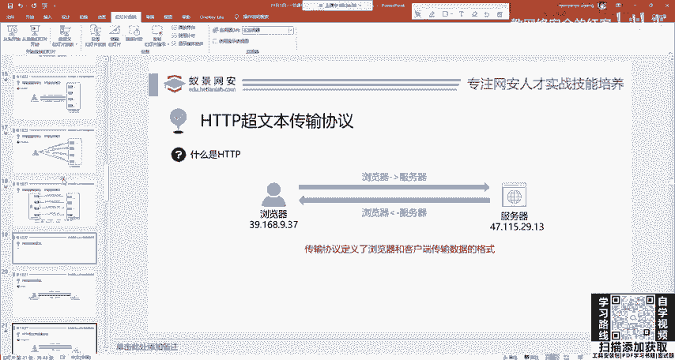
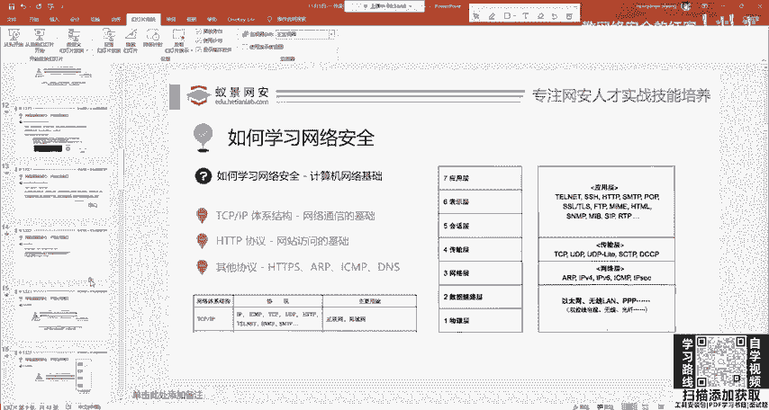
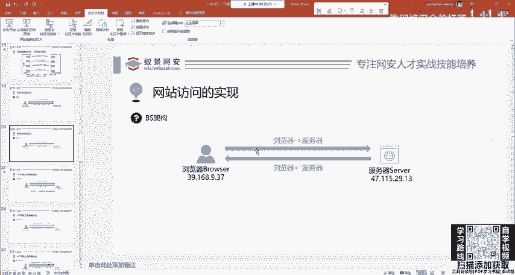

# 网络安全系统教程：P3：HTTP基础-网站访问的实现

## 概述
在本节课中，我们将学习网站访问的基础——HTTP协议。我们将从浏览器与服务器的交互过程开始，理解为什么需要协议，并最终掌握HTTP协议的基本概念和作用。

---

## 端口的概念
上一节我们介绍了IP地址，本节中我们来看看端口。端口是网络通信中的一个重要概念。

IP地址和端口共同确定了网络中的具体服务。IP地址定位到主机，端口则定位到主机上的具体应用程序。

**核心概念**：`IP地址:端口号` 的组合唯一标识一个网络服务端点。

这个IP和端口知道这些就足够了。

---

## 网站访问的实现
理解了网络通信的基础后，我们来看看网站访问是如何实现的。

访问网站时，例如打开百度，你会打开浏览器，输入 `www.baidu.com` 然后回车。这个过程引入了两个核心角色：
*   **浏览器**：客户端，用于发起访问请求。
*   **服务器**：服务端，例如百度的服务器，用于处理和响应请求。

浏览器与服务器构成了网站访问的基础架构。

回顾我们之前讲的内容，张三的浏览器访问天网安实验室的服务器，就是这样一个过程：
1.  浏览器向服务器发起**请求**。
2.  服务器向浏览器发回**响应**。
3.  响应信息包含了网站的内容，例如搜索结果、视频或图片。

---

## HTTP协议简介
现在，我们遇到了一个新概念：HTTP协议。

HTTP协议的中文名称是**超文本传输协议**。

首先，我们需要理解为什么要引入协议。网络工程师设计这么多协议，并非为了增加学习难度。

设想张三访问网站，他发送的信息必须让服务器能够理解。这就像人与人交流，需要一种共同的语言。如果一个人说英语，另一个人说中文，双方就无法沟通。

因此，协议规定了计算机网络传输的统一标准和规范。它确保了通信双方能够正确理解彼此发送的数据。

**核心概念**：HTTP协议是浏览器与服务器之间进行通信所遵循的**规则和标准**。

---

## 总结
本节课中，我们一起学习了网站访问的基础知识。我们明确了端口的作用，理解了浏览器与服务器交互的基本模型，并重点介绍了HTTP协议——它作为网络通信的“共同语言”，确保了数据能够被正确发送和理解。掌握这些概念是后续学习网络安全技术的重要基石。