# 网络安全系统教程：P40：27.PPTP口令获取 🔑

在本节课中，我们将要学习如何获取Windows系统中存储的PPTP VPN连接口令。PPTP是一种点对点隧道协议，常用于远程访问企业内网。掌握此方法有助于理解凭证存储机制及内网渗透的入口点。

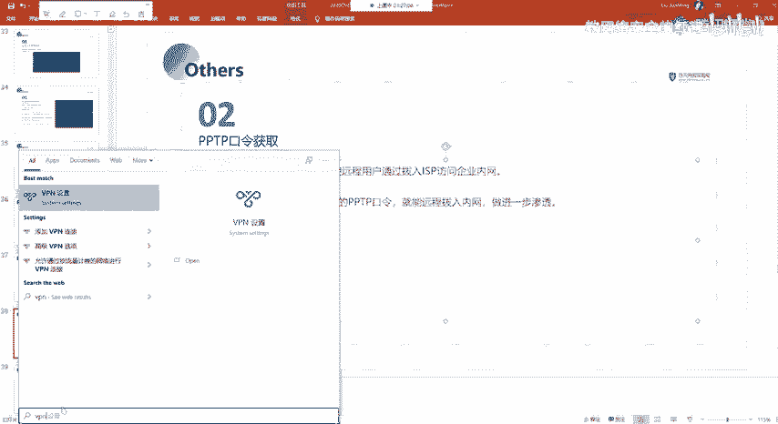

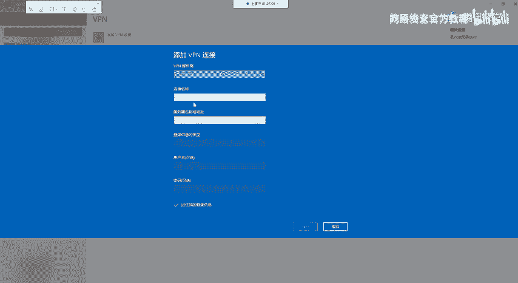

上一节我们介绍了其他类型的凭证获取方法，本节中我们来看看针对PPTP协议的口令获取技术。

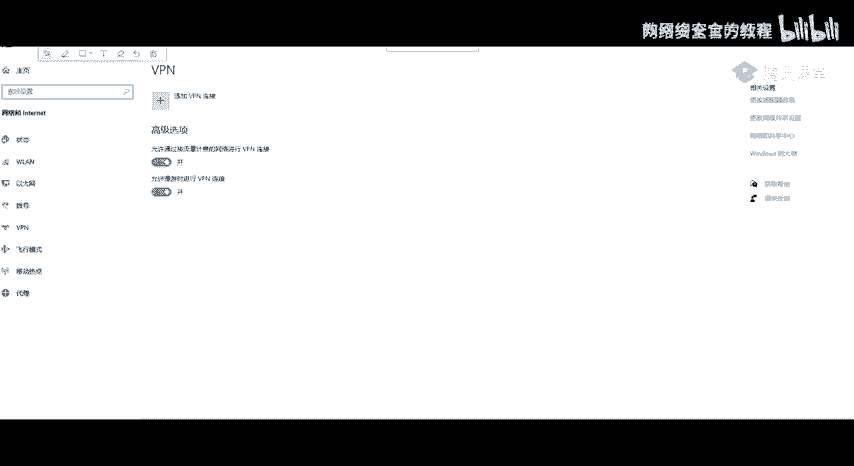

## PPTP协议简介

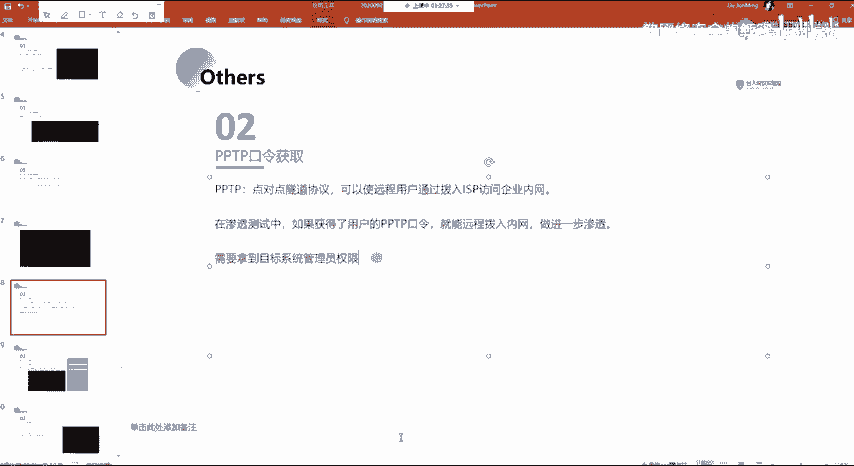

PPTP是点对点隧道协议。在Windows系统上，用户可以通过拨号连接ISP来访问企业内网，这种连接通常基于PPTP协议。配置VPN连接后，系统会保存相关的连接信息。

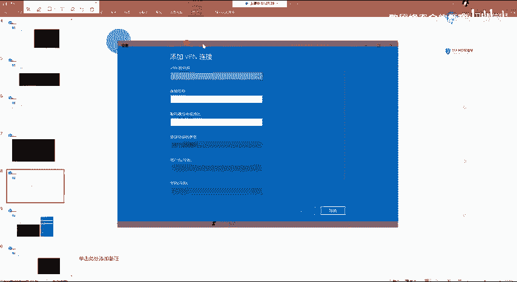

如果获取到存有PPTP连接信息的机器，并且该连接信息未被清除，我们就可以尝试获取其连接密码。成功获取密码后，便能通过该PPTP隧道连接到目标服务器，从而进入另一个网络环境。

## 获取PPTP配置信息

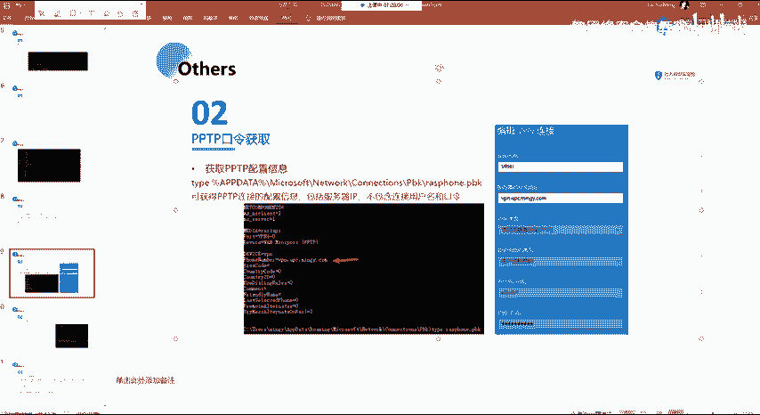

第一步是定位PPTP连接的配置文件。该文件存储了VPN的连接配置。

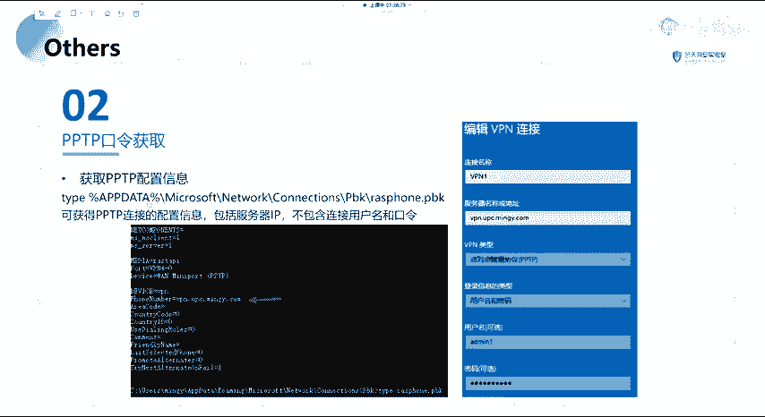

配置文件位于以下路径：
```
C:\Users\<用户名>\AppData\Roaming\Microsoft\Network\Connections\Pbk\rasphone.pbk
```


此`rasphone.pbk`文件存储了VPN连接的配置信息。但需要注意的是，此配置文件本身通常不直接包含用户名和密码，即使包含，也不会是明文存储。

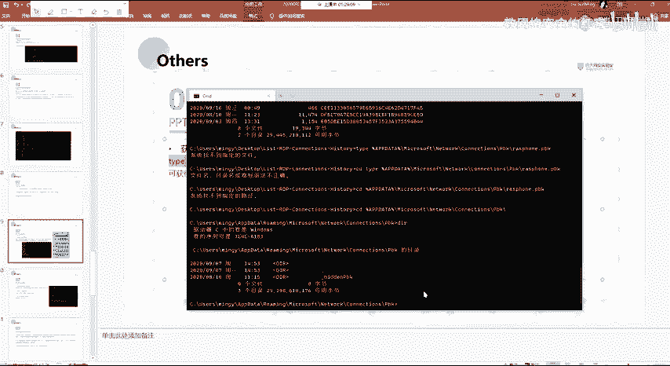

## 使用Mimikatz获取PPTP口令

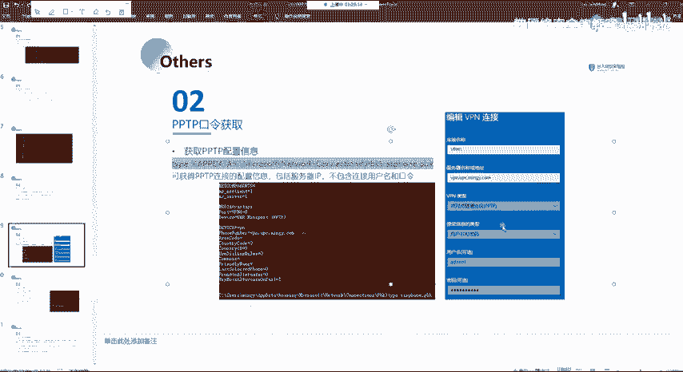

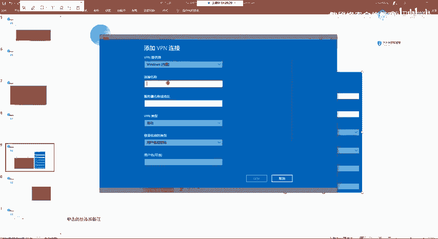

为了获取加密存储的PPTP口令，我们需要使用专门的工具。Mimikatz的`lsa secrets`模块可以用于提取此类凭证。

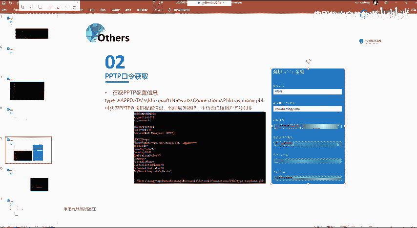

以下是核心操作步骤：

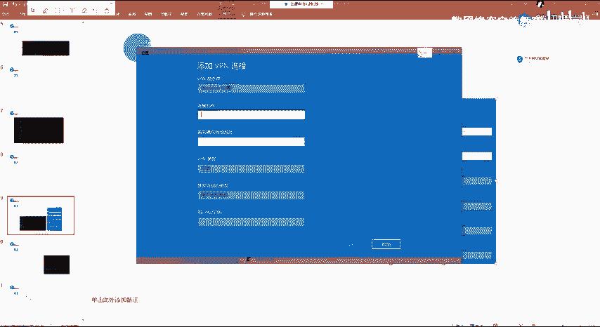

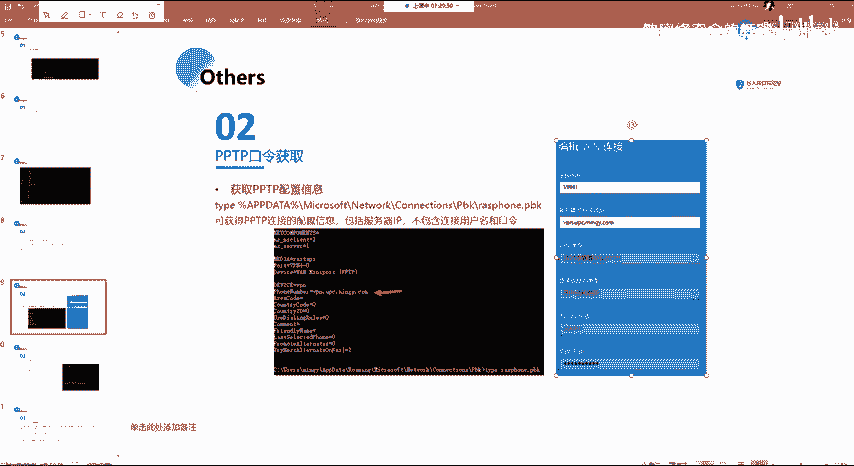

1.  以管理员权限运行Mimikatz。
2.  使用以下命令提取Secrets：
    ```cmd
    privilege::debug
    sekurlsa::msv
    ```
3.  在输出信息中查找与PPTP或VPN相关的凭据。

执行命令后，工具会尝试解密并显示系统中存储的各类凭证。在输出结果中，我们可以找到PPTP连接对应的用户名和明文密码。

例如，可能得到如下结果：
```
Username : admin
Password : admin123!@#
```
这便是在配置VPN时输入的用户名和密码。

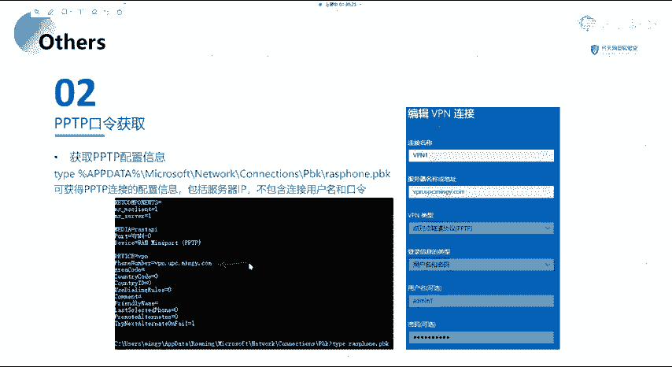

## 利用获取的口令进行连接

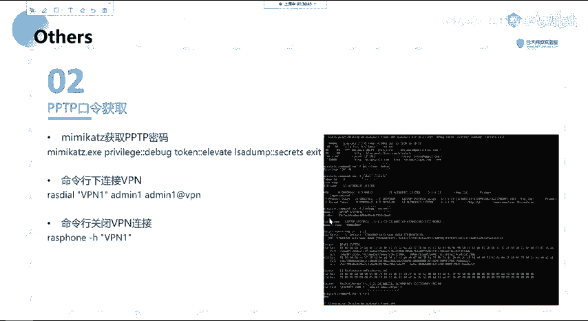

成功获取PPTP连接的用户名和密码后，我们便可以利用这些信息建立VPN连接，从而接入目标网络。

在Windows系统上，可以使用以下命令创建连接（具体参数需根据配置填写）：
```cmd
rasdial <连接名称> <用户名> <密码>
```
连接建立后，即可访问目标内网资源。

若要断开连接，使用命令：
```cmd
rasdial <连接名称> /disconnect
```

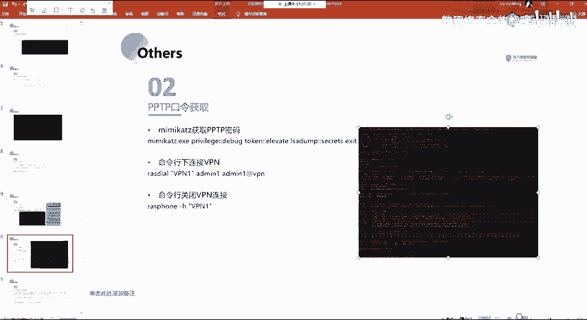

通过这种方式，我们从一个网络环境进入了另一个网络段，这是内网渗透中常见的横向移动方法。

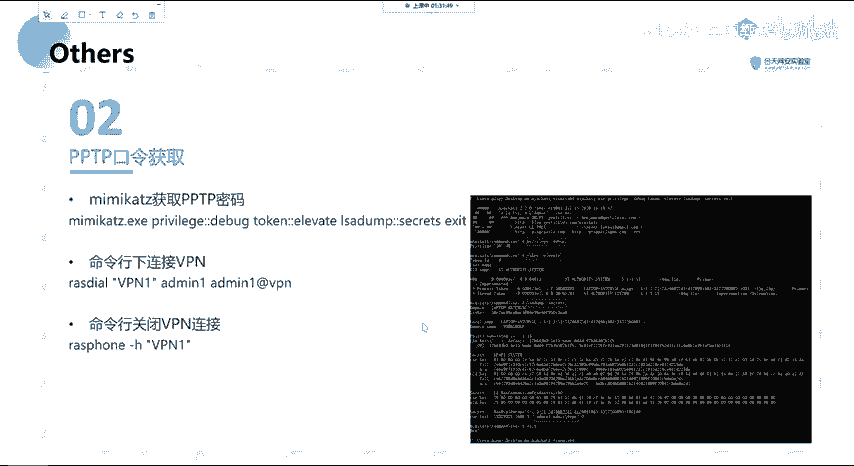

## 总结

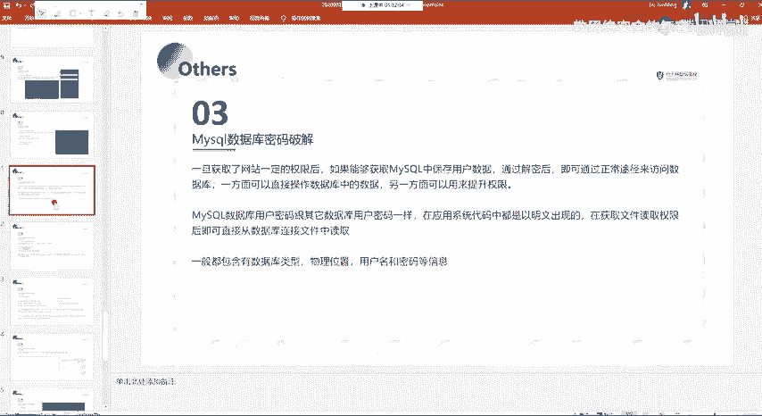

本节课中我们一起学习了PPTP口令获取的全过程。我们首先了解了PPTP协议的基本概念，然后找到了存储其配置信息的文件路径。接着，我们使用Mimikatz工具提取了系统中加密存储的PPTP连接口令，并最终演示了如何利用获取到的凭证建立VPN连接，从而访问目标网络。理解这一流程对于认识Windows系统凭证存储安全性和内网渗透测试具有重要意义。