# 网络安全系统教程：P41：MySQL数据库密码破解 🔑

## 概述
在本节课中，我们将学习如何破解MySQL数据库的用户密码。这是渗透测试中获取数据库访问权限的关键步骤。我们将了解MySQL密码的存储方式、加密机制，并学习使用多种工具进行密码破解。

## MySQL数据库密码存储原理
上一节我们介绍了数据库在渗透测试中的重要性，本节中我们来看看MySQL数据库是如何存储用户密码的。

MySQL数据库的用户信息，包括用户名和密码，通常以明文形式存在于系统代码中。一旦我们获得了目标系统的读取权限，就可以直接从数据库中读取这些信息。

MySQL数据库主要使用三种类型的文件来存储数据。我们需要重点关注与用户相关的文件，以获取数据库的访问凭证。

以下是MySQL数据库中与用户相关的核心文件：
*   **user.frm**：存储用户表的框架结构。
*   **user.MYD**：存储用户表的实际数据，**包括用户名和加密后的密码**。
*   **user.MYI**：存储用户表的索引信息。

其中，`user.MYD`文件是我们需要重点关注的，因为它包含了root用户及其他所有用户的密码哈希值。

## MySQL密码加密方式
了解了密码存储的位置后，我们需要知道MySQL是如何加密这些密码的。

MySQL的密码加密方式在版本4.1前后有所不同。目前广泛使用的是4.1及之后的版本，其加密方法为MySQL的SHA1加密。

MySQL数据库内置了两个相关函数，我们可以利用它们来查询或生成密码哈希。例如，使用`PASSWORD()`函数可以生成指定字符串的MySQL加密哈希值。

```sql
SELECT PASSWORD('root');
```
执行上述SQL语句，会返回字符串`‘root’`经过MySQL加密后的哈希值。如果我们从`user.MYD`文件中获取到的哈希值与此结果匹配，那么我们就知道其对应的明文密码是`‘root’`。

## 获取密码哈希值
那么，如何获取到存储在文件中的密码哈希值呢？


首先，在获得目标机器权限后，我们需要定位MySQL的数据目录（通常是`/var/lib/mysql/mysql/`），找到`user.MYD`文件。然后，将该文件下载到本地。

接着，使用支持二进制模式查看的编辑器（如WinHex、`hexdump`命令或`xxd`命令）打开这个文件。在文件中搜索特定的模式，即可找到类似`*81F5E21E35407D884A6CD4A731AEBFB6AF209E1B`的哈希值，这就是加密后的密码。

## 密码破解方法
获取到密码哈希值后，我们就可以尝试进行破解。以下是几种常用的破解方法。

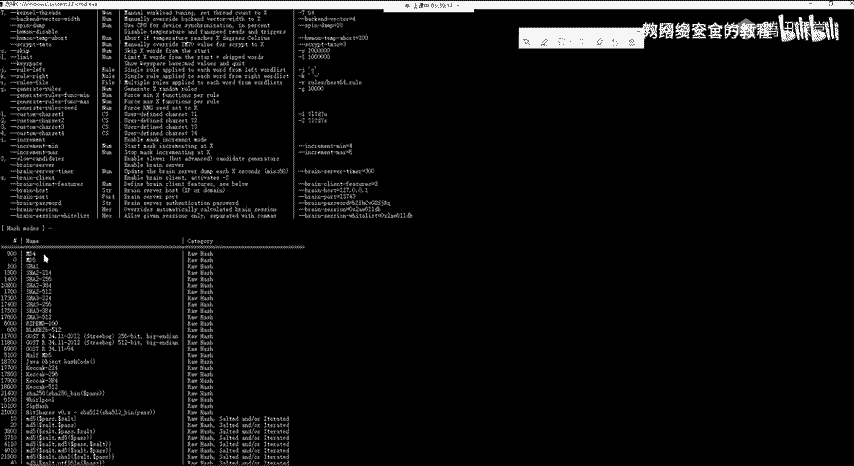

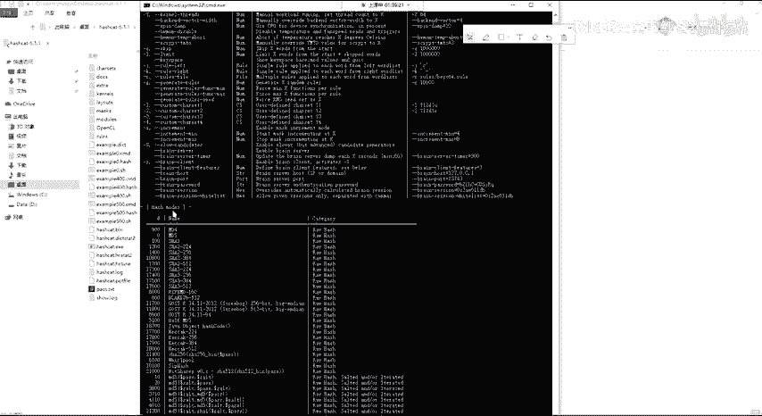

### 方法一：在线网站破解
在线破解网站是最直接、最常用的方法之一。操作简单，适合快速验证。

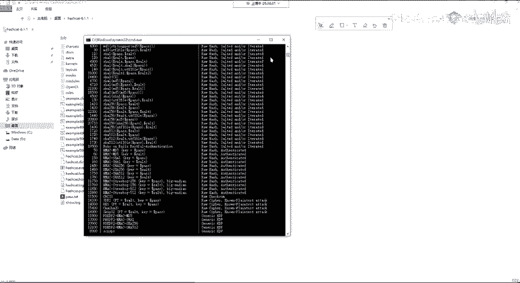

以下是操作步骤：
1.  访问一个可靠的在线哈希破解网站（如CrackStation、HashKiller）。
2.  将获取到的MySQL密码哈希值粘贴到查询框中。
3.  选择或输入哈希类型（通常为MySQL 4.1/5）。
4.  提交查询，网站会尝试在其彩虹表中匹配并返回明文密码。

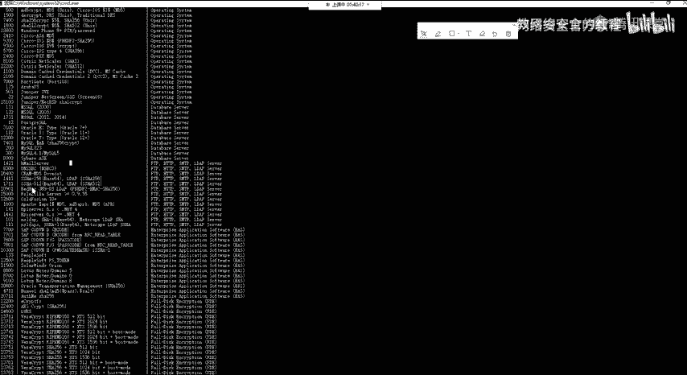

### 方法二：使用Hashcat工具破解
如果在线网站无法破解，我们可以使用功能强大的本地破解工具Hashcat。

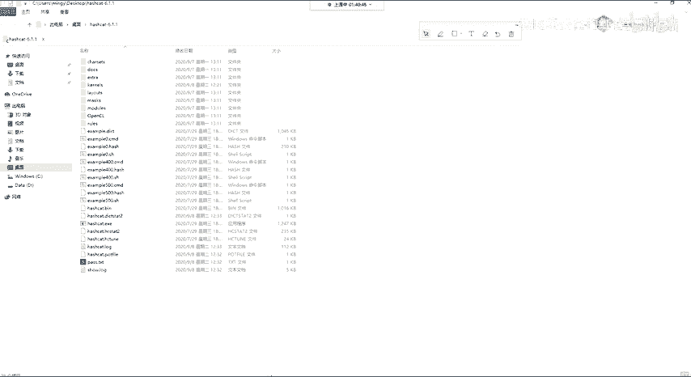

Hashcat支持多种哈希算法的破解。要破解MySQL哈希，我们需要使用以下命令格式：

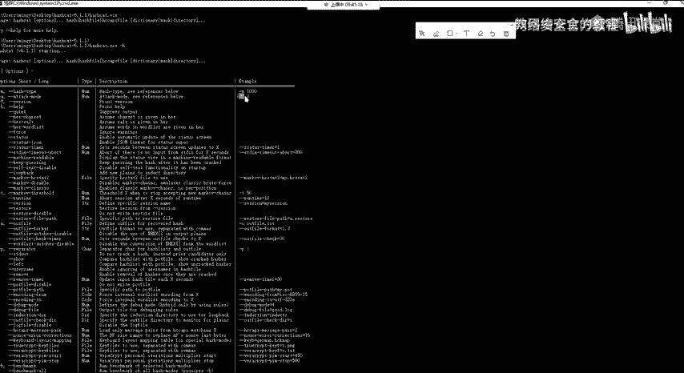

```bash
hashcat -m 300 -a 3 <hash_value>
```
**参数解释**：
*   `-m 300`：指定哈希类型为MySQL 4.1/5（对应编号300）。
*   `-a 3`：指定攻击模式为暴力破解（Brute-Force）。
*   `<hash_value>`：替换为实际的MySQL密码哈希值。

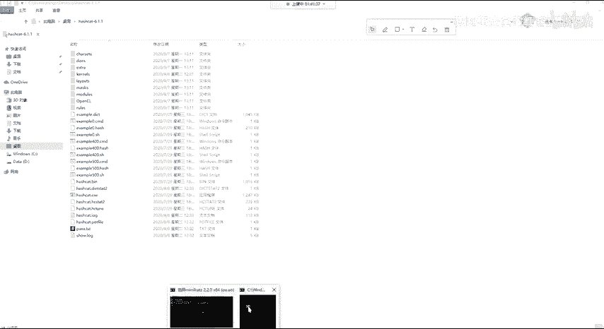

有时，使用GPU破解可能会遇到驱动或兼容性问题。可以添加`--force`参数忽略警告，或使用`--opencl-device-types 1`指定使用CPU进行破解。

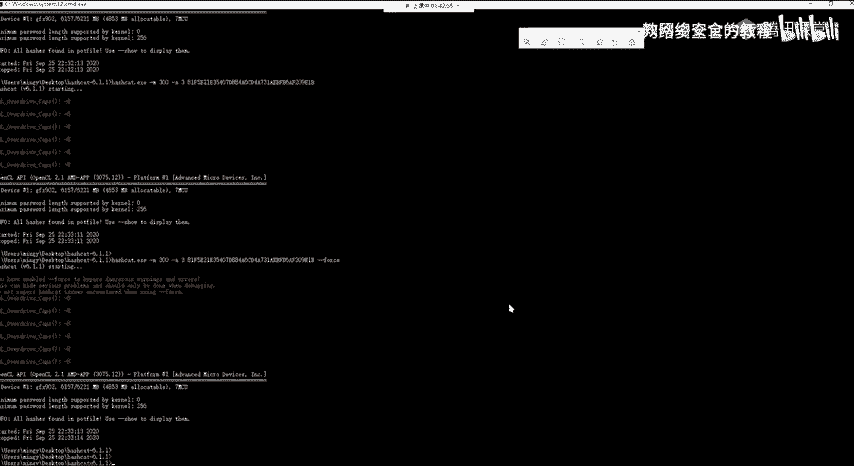

运行成功后，Hashcat会输出破解结果，显示哈希值对应的明文密码。

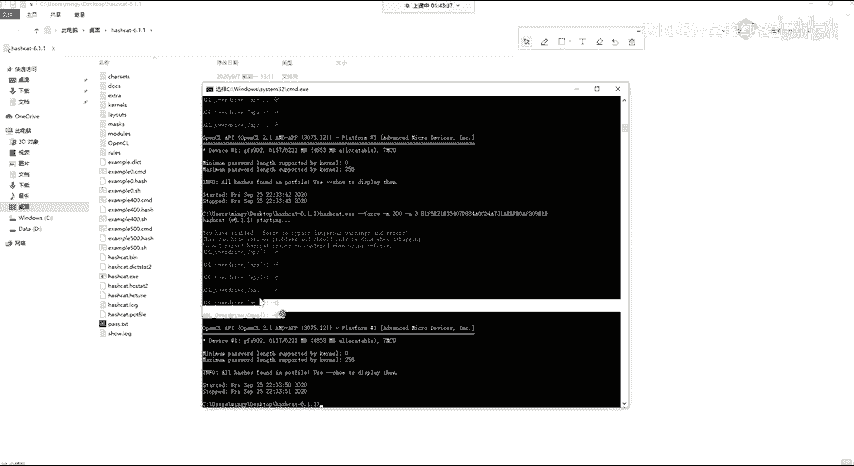

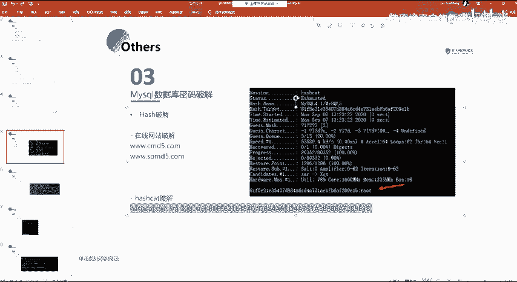

### 方法三：使用John the Ripper工具破解
John the Ripper是另一款经典的密码破解工具，同样支持MySQL哈希。

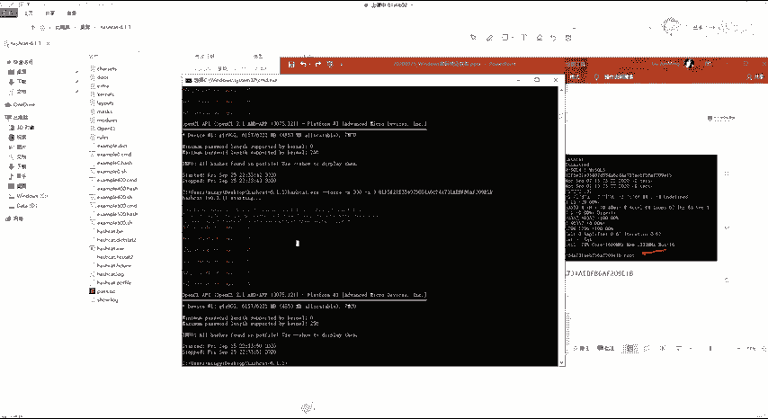

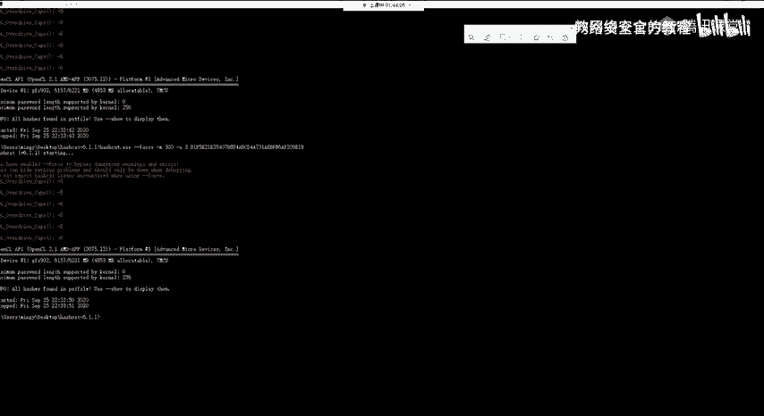

使用John破解MySQL密码的基本命令如下：

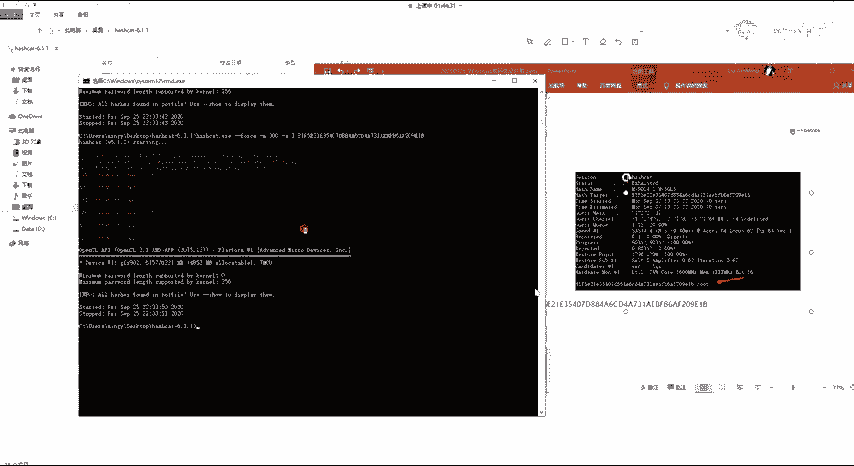

```bash
john --format=mysql-sha1 <hash_file>
```
**参数解释**：
*   `--format=mysql-sha1`：指定哈希格式为MySQL SHA1。
*   `<hash_file>`：将哈希值保存到一个文本文件中，并指定该文件路径。

John会使用自带的字典或规则进行破解，并将结果输出在终端。

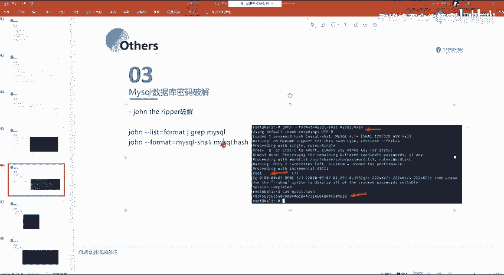

## 总结
本节课中我们一起学习了MySQL数据库密码破解的全过程。我们首先了解了密码在`user.MYD`文件中的存储位置，然后学习了MySQL 4.1/5版本使用的SHA1加密方式。接着，我们掌握了从目标系统获取密码哈希文件的方法。最后，我们实践了三种破解方法：利用在线网站进行快速查询、使用功能强大的Hashcat进行暴力破解，以及使用经典的John the Ripper工具。掌握这些技能，对于深入进行渗透测试和漏洞评估至关重要。