# 网络安全系统教程：P42：29.常用软件密码获取 🔑

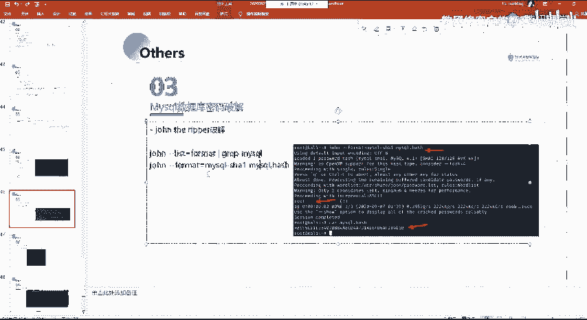

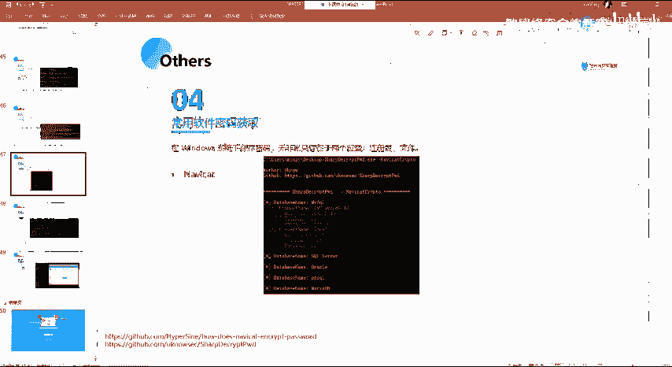

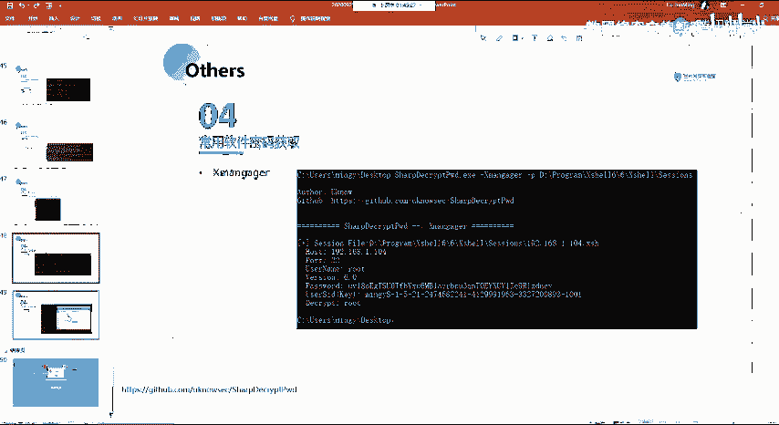

在本节课中，我们将学习如何获取Windows系统中常用软件（如数据库连接工具、远程管理工具等）保存的密码。理解密码的存储位置和获取方法，是渗透测试和漏洞评估中的重要环节。

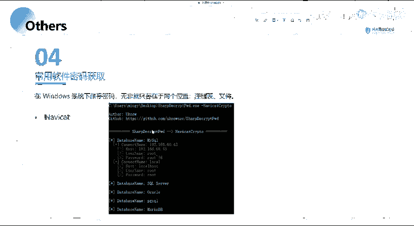

## 概述

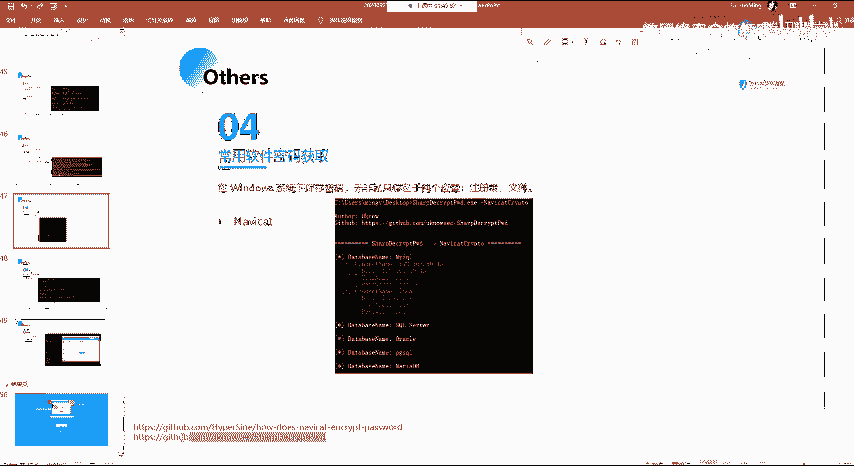

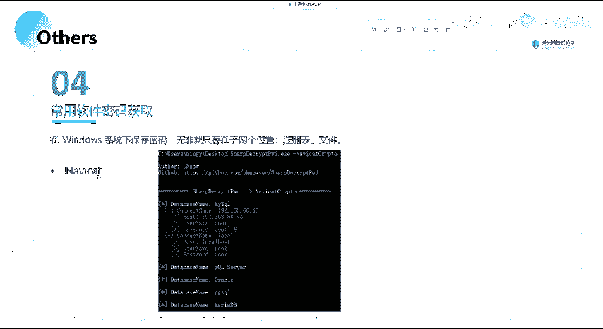

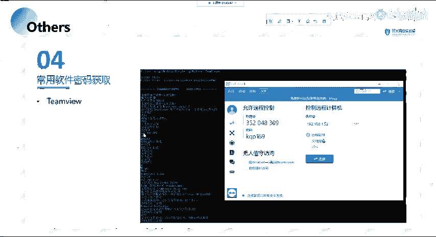

Windows系统上的软件通常会为用户提供保存密码的功能，以方便下次登录。这些密码并非完全不可见，它们通常存储在系统的特定位置，例如注册表或配置文件中。本节课将介绍一个实用工具，并讲解其背后的基本原理。

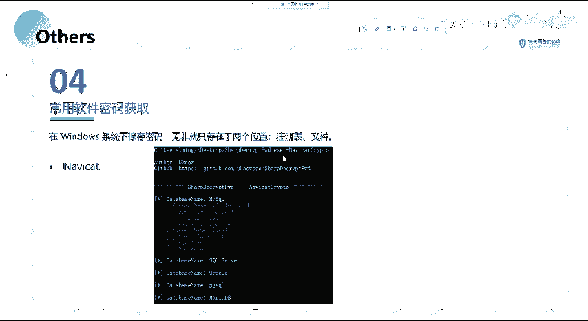

## 密码存储位置

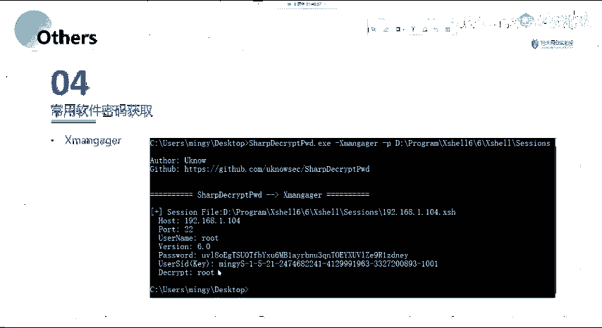

上一节我们介绍了密码安全的基本概念，本节中我们来看看Windows系统中密码的具体存储方式。

核心观点是：在Windows系统上保存的密码，主要存储在以下两个位置：
1.  **系统注册表**
2.  **应用程序的配置文件**

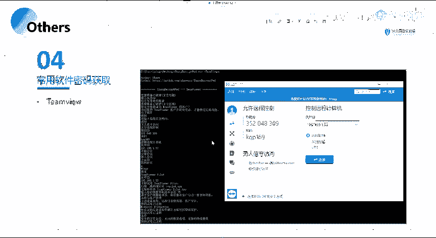

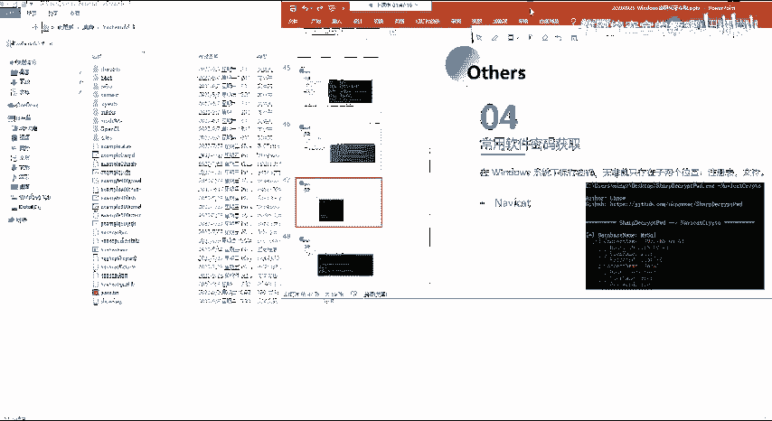

例如，Xshell（一款SSH连接工具）安装后，会生成一个会话配置文件。用户保存的密码会经过加密后存储在该文件中。其默认存储路径通常类似于：
```
C:\Users\[用户名]\Documents\NetSarang Computer\7\Xshell\Sessions\
```

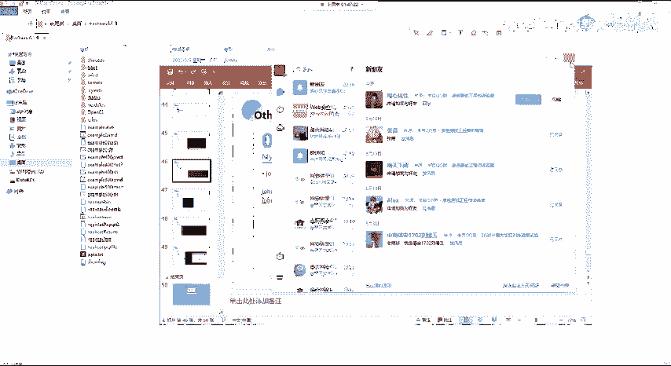

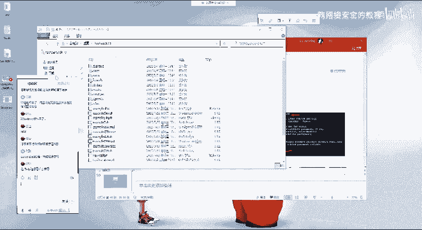

## 密码获取工具：LaZagne

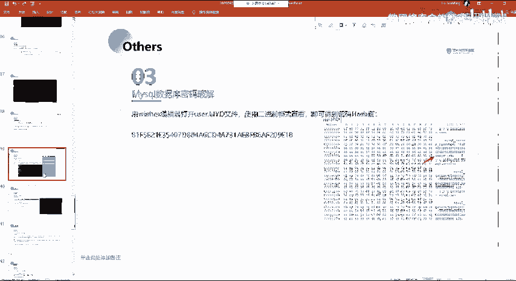

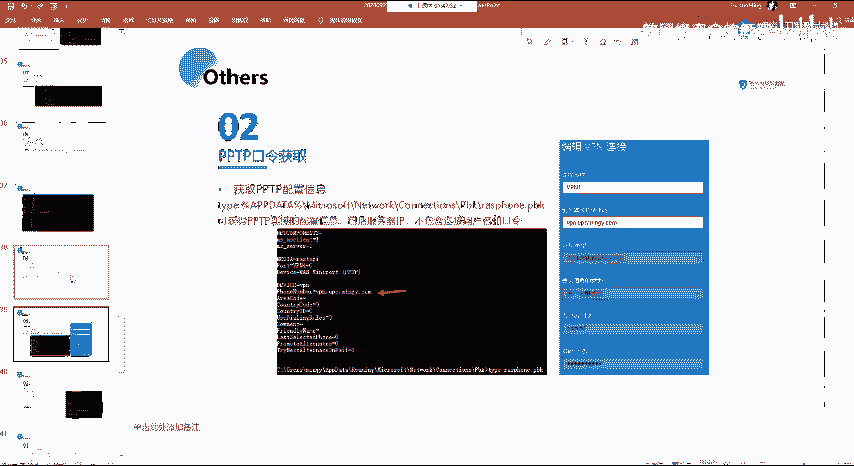

为了从这些存储位置提取密码，我们可以使用一个名为 **LaZagne** 的强大工具。这个工具能够自动扫描系统，获取多种常用软件（如MySQL管理工具、Xmanager、Xshell、FTP客户端等）中保存的密码。

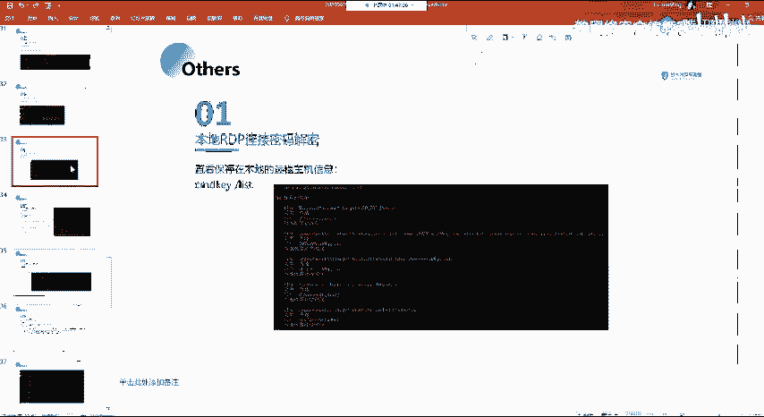

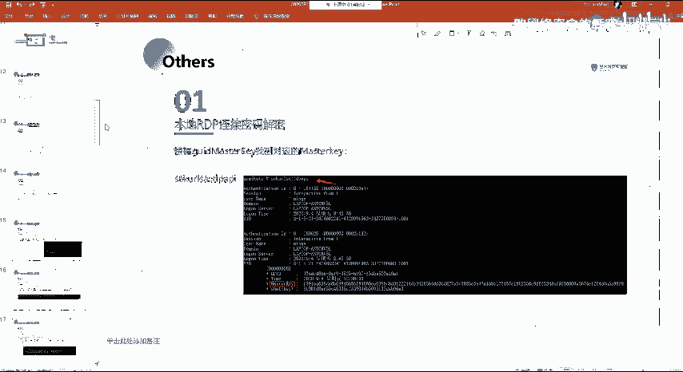

以下是使用LaZagne工具的基本步骤：

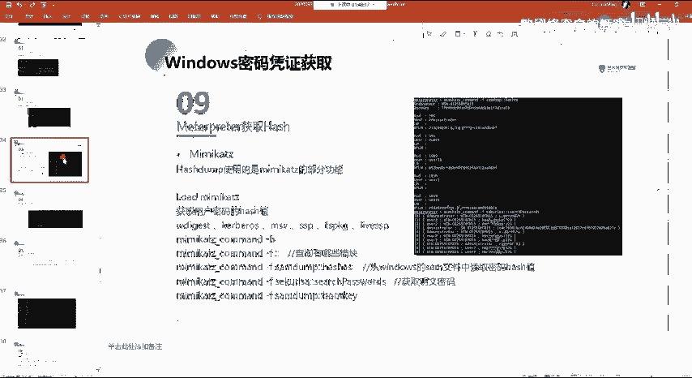

1.  **下载与启动**：获取LaZagne工具，在命令行中运行它。
2.  **指定模块**：使用命令指定要扫描的软件类别，例如 `--all` 扫描所有支持的项目。
3.  **查看结果**：工具会自动解析注册表和配置文件，并将找到的用户名、密码、连接IP等信息以明文形式输出。

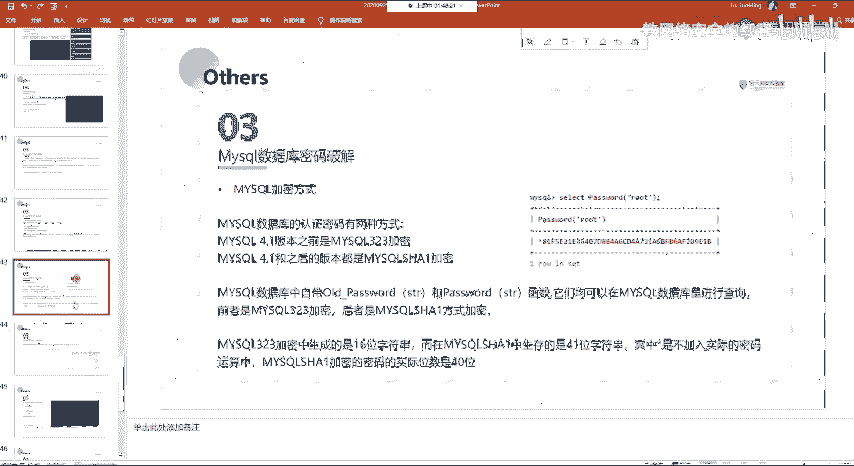

**示例命令（获取所有软件密码）：**
```bash
laZagne.exe all
```

运行后，工具会显示类似以下结构的结果，清晰列出每个会话的详细信息：
*   **Name**: 会话名称
*   **URL/Host**: 连接地址
*   **Login**: 用户名
*   **Password**: 密码

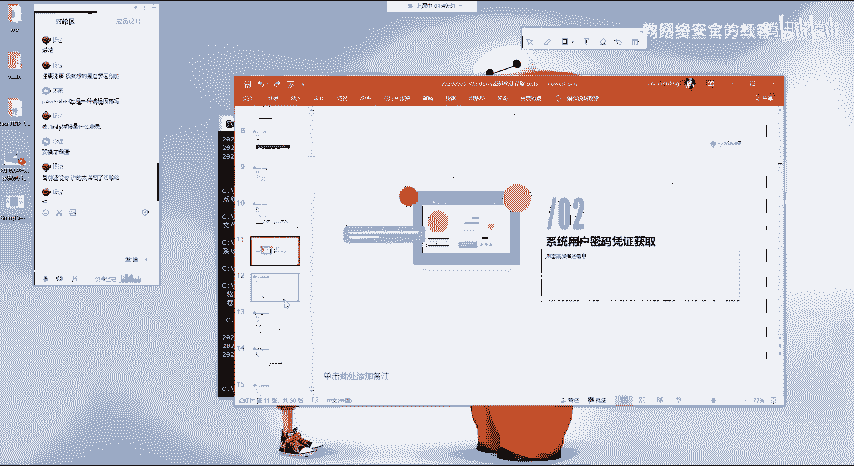

## 课后实践与总结

本节课我们一起学习了Windows系统常用软件密码的存储原理与获取方法。核心在于理解密码存储在**注册表**和**配置文件**中，并利用 **LaZagne** 这类工具进行自动化提取。

由于时间关系，课程中未能对每一种软件进行逐一演示。但所提供的PPT材料中包含了详细的步骤和截图，足以指导大家完成操作。

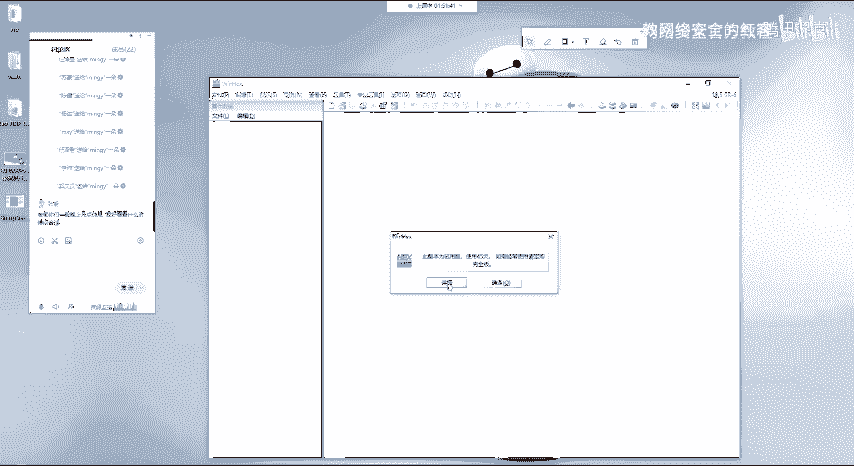

**以下是课后实践建议：**
*   请在个人实验环境中尝试使用LaZagne工具。
*   重点尝试获取Xshell、FTP客户端等工具的保存密码。
*   通过亲手操作，加深对密码存储机制的理解，这比单纯观看演示印象更深刻。

理论知识需要结合实践才能牢固掌握。网络安全技能的学习尤其如此，多动手、多实验是进步的关键。大家课后如有疑问，可以在学习群中提出。本节课到此结束，大家早点休息。