# 网络安全系统教程：46：Linux系统架构信息收集 🐧

在本节课中，我们将学习如何在Linux系统下进行主机信息收集。信息收集是渗透测试和网络安全评估中的关键步骤，能够帮助我们了解目标系统的配置、版本和架构，为后续的深入分析奠定基础。

上一节我们介绍了Windows系统下的信息收集方法，本节中我们来看看在Linux系统中如何执行类似的操作。Linux系统因其稳定性和安全性，被广泛应用于服务器环境，因此掌握其信息收集技术至关重要。

## 系统架构与内核信息

首先，我们来了解如何获取Linux系统的基本架构和内核信息。以下是几个核心命令。

### 1. 使用 `uname` 命令

`uname` 命令是查看系统信息最常用的工具之一。使用 `uname -a` 可以打印出所有相关的系统信息。

```bash
uname -a
```

该命令会输出包括内核名称、主机名、内核发行版、内核版本、机器硬件名称和处理器类型在内的详细信息。`uname` 命令还有其他选项，可以用于查询特定信息。

以下是 `uname` 命令各选项的说明：

*   **`-s`**： 输出内核名称（例如 `Linux`）。
*   **`-n`**： 输出网络节点主机名。
*   **`-r`**： 输出内核发行版本。
*   **`-v`**： 输出内核版本信息。
*   **`-m`**： 输出机器硬件名称。
*   **`-p`**： 输出处理器类型。
*   **`-o`**： 输出操作系统名称。
*   **`-a`**： 输出所有上述信息。

### 2. 查看系统标识文件

Linux系统在 `/etc` 目录下存放了多个用于标识系统版本的文件。

*   **`/etc/issue` 和 `/etc/issue.net`**： 这两个文件包含了在登录提示前显示的系统标识信息。通常用于显示欢迎语和系统版本。

    ```bash
    cat /etc/issue
    cat /etc/issue.net
    ```

*   **Debian/Ubuntu 系系统**： 这类系统通常有一个 `/etc/lsb-release` 文件，其中包含了详细的发行版信息。

    ```bash
    cat /etc/lsb-release
    ```

*   **Red Hat/CentOS 系系统**： 红帽系的Linux发行版则通过 `/etc/redhat-release` 或 `/etc/system-release` 文件来标识。

    ```bash
    cat /etc/redhat-release
    ```

### 3. 查看详细内核版本信息

`/proc/version` 文件提供了更详细的内核信息，包括内核版本、编译该内核所用的GCC编译器版本以及编译时间等。

```bash
cat /proc/version
```

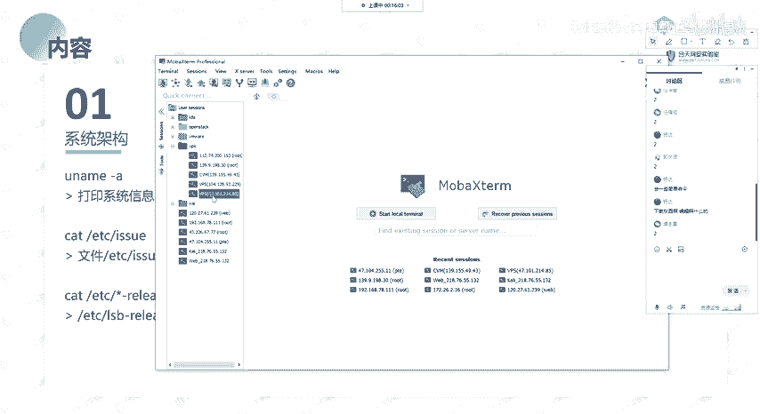

## 硬件与处理器信息

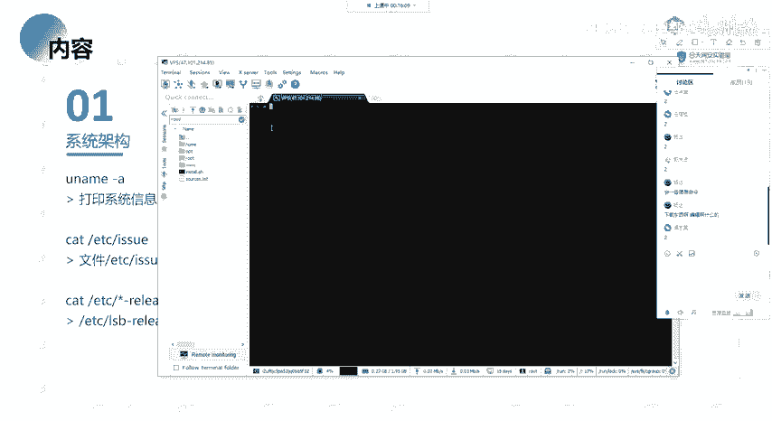

了解系统硬件架构对于判断软件兼容性和寻找潜在漏洞很有帮助。以下是相关命令。

### 1. 查看CPU信息

`/proc/cpuinfo` 文件包含了系统中每个处理器的详细信息，如型号、核心数、频率、支持的指令集等。

```bash
cat /proc/cpuinfo
```

### 2. 查看系统位数

要确定当前Linux系统是32位还是64位，可以使用以下命令：

```bash
getconf LONG_BIT
```
该命令会直接输出 `32` 或 `64`。

## 系统运行时间与负载

系统的运行时间和负载情况可以反映其稳定性和当前压力。

### 1. 查看系统运行时间

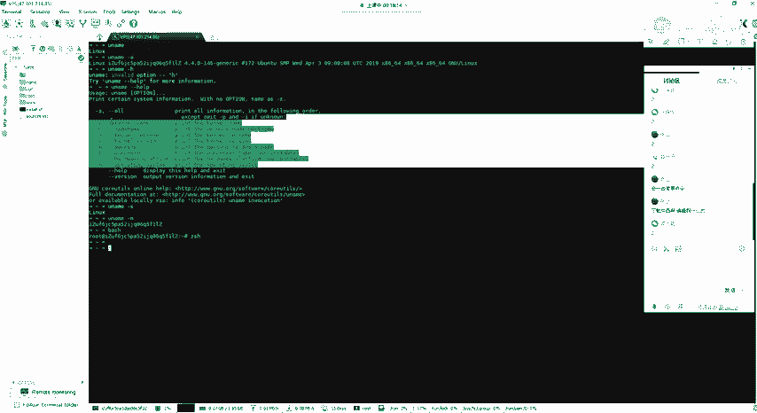

`uptime` 命令可以显示系统已经运行了多长时间、当前有多少用户登录以及系统在过去的1、5、15分钟内的平均负载。

```bash
uptime
```

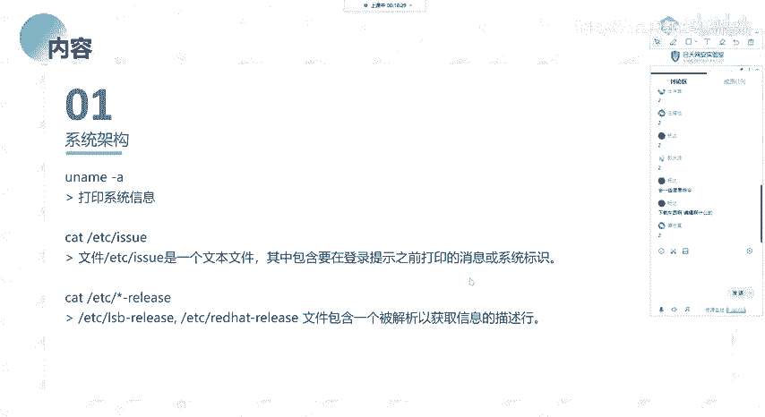

### 2. 查看内存信息

`/proc/meminfo` 文件提供了系统内存的详细使用情况，包括总内存、空闲内存、缓存等。

```bash
cat /proc/meminfo
```
或者使用更简洁的 `free` 命令：

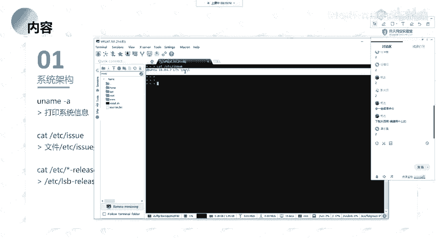

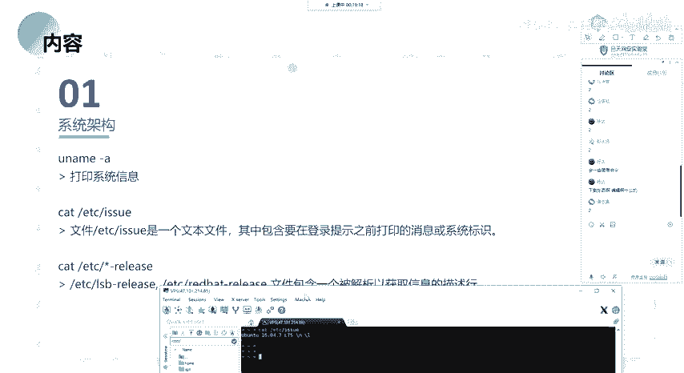

```bash
free -h
```

## 用户与登录信息

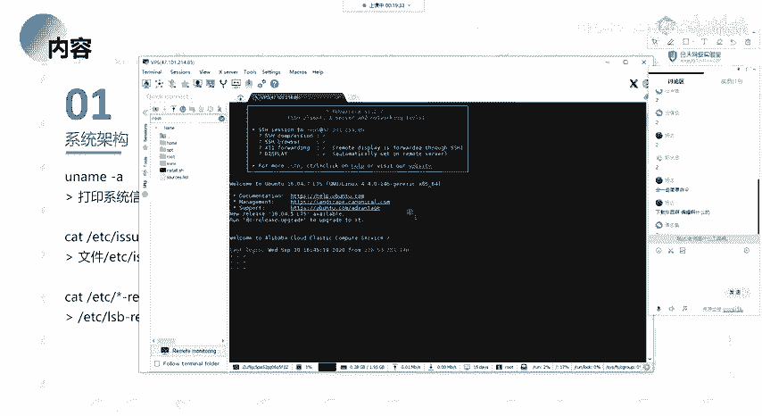

收集当前系统的用户和登录会话信息，有助于了解系统的使用情况。

### 1. 查看当前登录用户

`who` 命令可以列出当前登录到系统的所有用户及其登录终端、登录时间等信息。

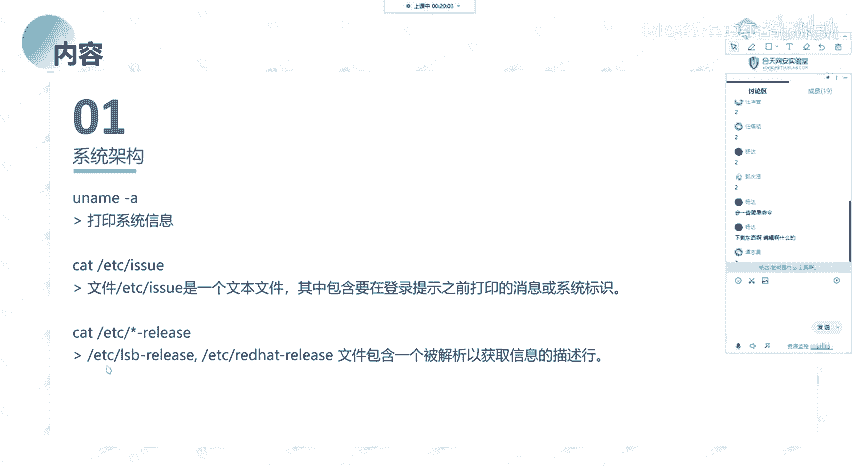

```bash
who
```

### 2. 查看历史登录记录

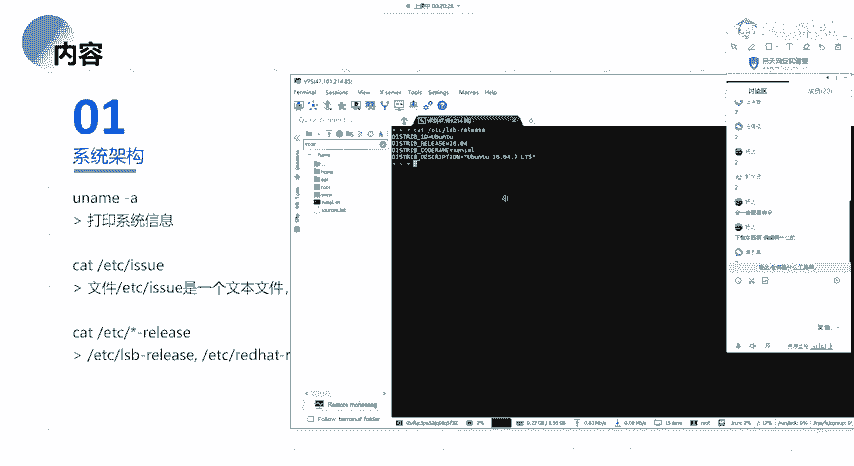

`last` 命令用于显示系统最近的用户登录记录，包括登录用户、登录终端、登录IP地址和登录/退出时间。

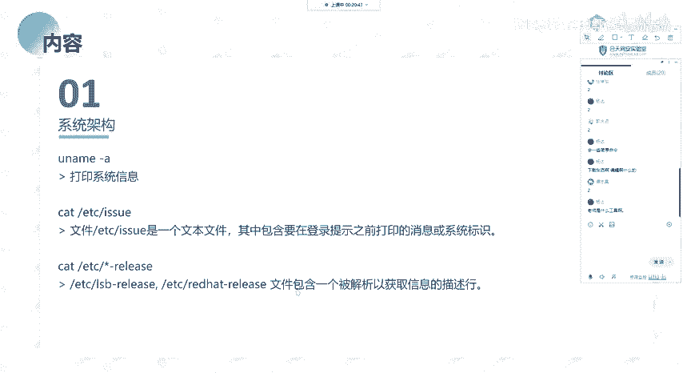

```bash
last
```

## 环境变量与路径

环境变量存储了Shell会话和工作环境的信息，其中可能包含敏感路径或配置。

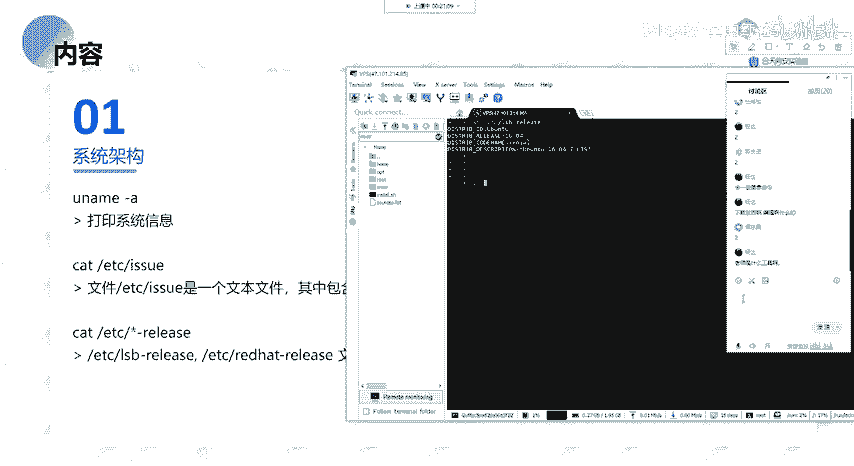

### 1. 查看所有环境变量

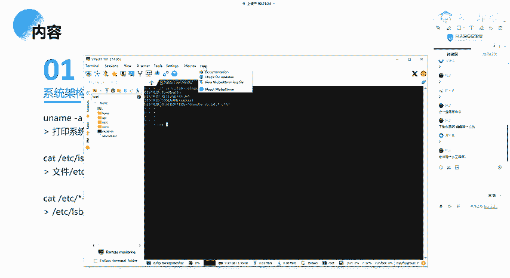

`env` 或 `printenv` 命令可以打印出当前Shell会话中的所有环境变量及其值。

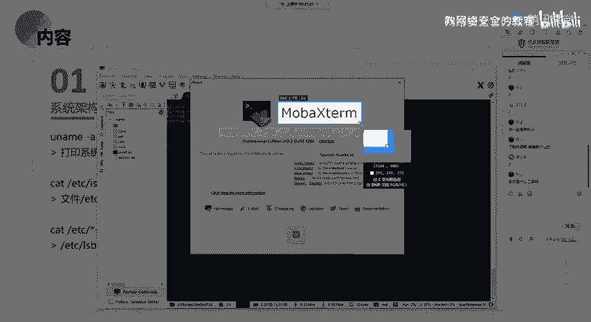

```bash
env
# 或
printenv
```

### 2. 查看特定环境变量

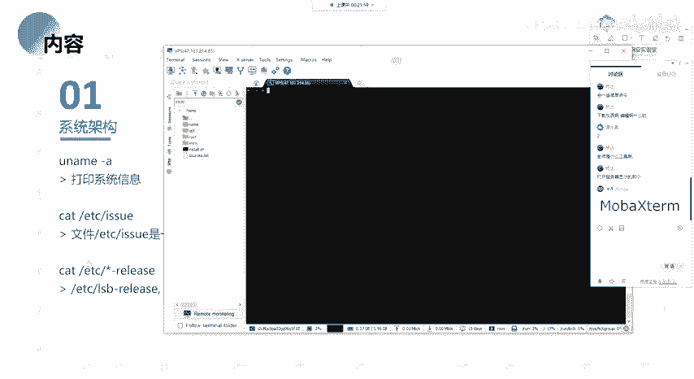

例如，查看当前用户的命令搜索路径：

```bash
echo $PATH
```

## 总结

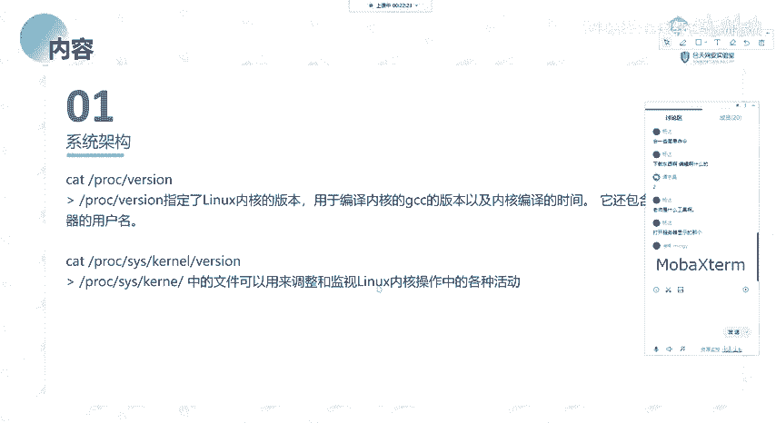

本节课中我们一起学习了在Linux系统下进行信息收集的一系列基本命令。我们从系统架构和内核信息入手，逐步了解了如何获取硬件信息、系统运行状态、用户登录情况以及环境变量等关键数据。这些信息是评估系统安全状况、进行漏洞分析和制定渗透策略的基础。请务必在课后多加练习，熟悉这些命令的输出格式和含义。下一节，我们将探讨Linux系统中进程和网络相关的信息收集技术。