# 网络安全系统教程：P47：34.进程信息 🔍

在本节课中，我们将要学习Linux系统中关于进程信息管理的核心命令。进程是程序在系统中运行时的实例，理解如何查看和管理进程对于系统操作、故障排查和安全分析至关重要。我们将介绍几个关键的命令和目录，帮助你掌握进程信息的获取方法。

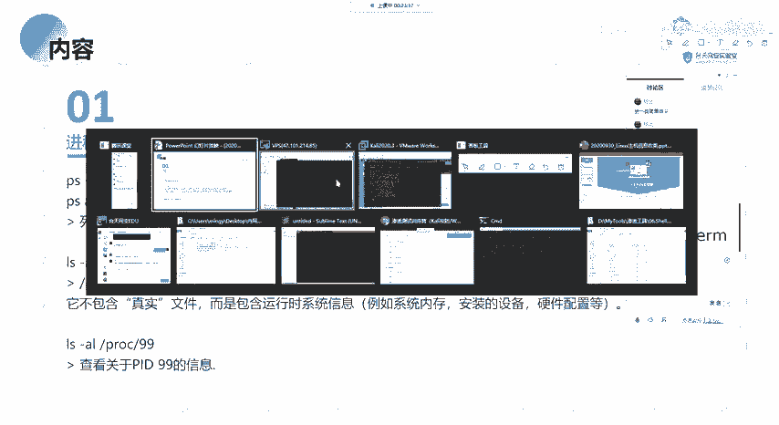

## 查看进程列表 📋

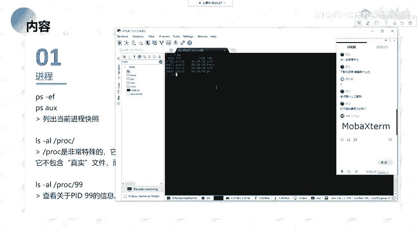

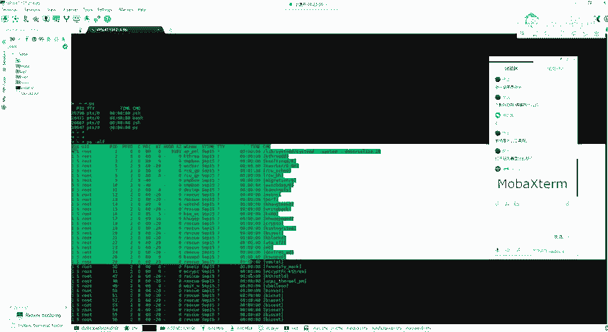

上一节我们介绍了进程的基本概念，本节中我们来看看如何列出系统中的进程。我们通常使用 `ps` 命令来查看当前运行的进程。

以下是常用的 `ps` 命令选项：

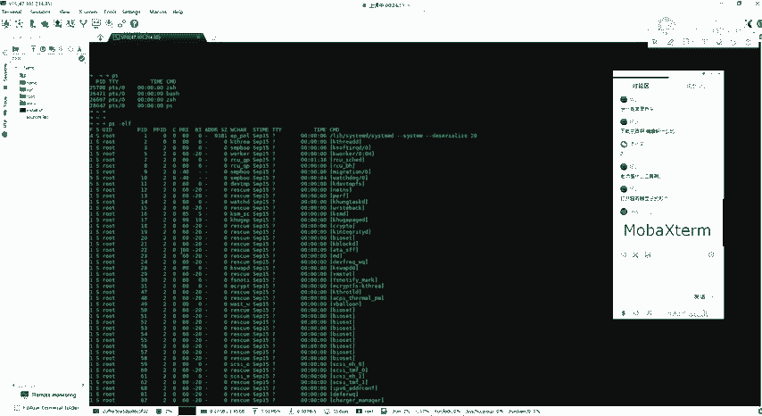

*   `ps -ef`：以完整格式列出所有进程。
*   `ps -aux`：以BSD格式列出所有进程，显示更详细的资源占用信息。

如果直接输入 `ps` 命令，它只会显示与当前终端会话相关的进程。使用 `ps -ef` 或 `ps -aux` 可以查看系统下的所有进程。输出信息中，我们主要关注 **PID（进程ID）** 和 **CMD（启动命令）**。PID是唯一标识一个进程的数字，当我们需要结束某个进程时，必须通过它的PID来操作。

## 筛选特定进程 🎯

直接使用 `ps -ef` 打印的信息可能过多，我们通常需要查看指定的进程信息。这时，可以配合 `grep` 命令进行过滤筛选。

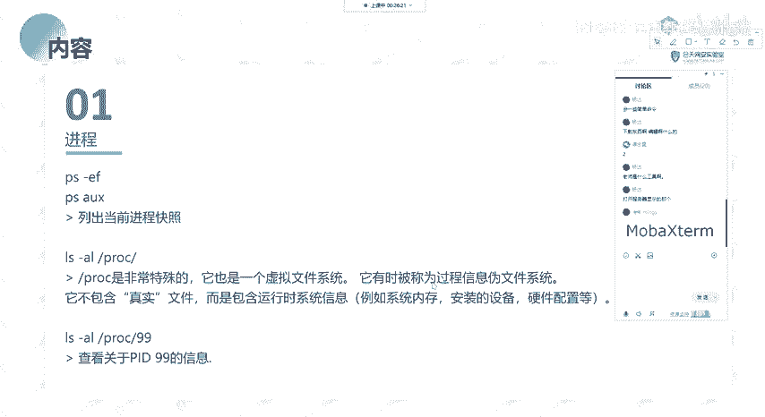

`grep` 是一个功能强大的文本搜索工具。例如，如果我们只想查看包含 `sshd` 字符的进程，可以使用以下命令组合：

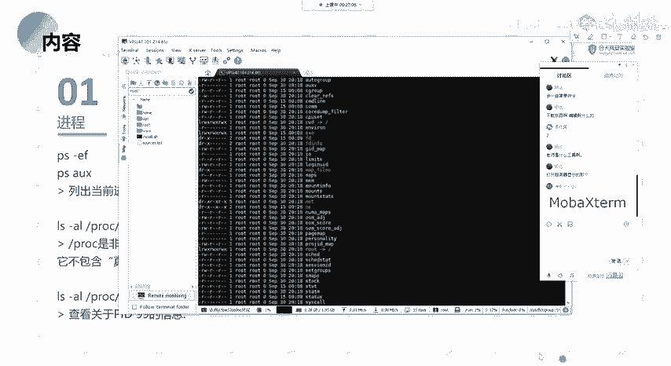

```bash
ps -ef | grep sshd
```

这个命令会在 `ps -ef` 列出的所有信息中，匹配包含“sshd”字符的行并输出。这便于我们有针对性地寻找所需信息。

此外，`ps -ax` 命令的输出内容与上述命令基本一致，没有太大区别。

## 探索 /proc 目录 📁

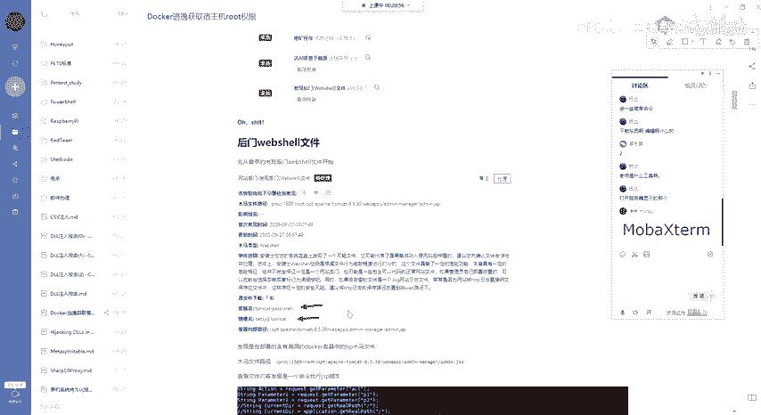

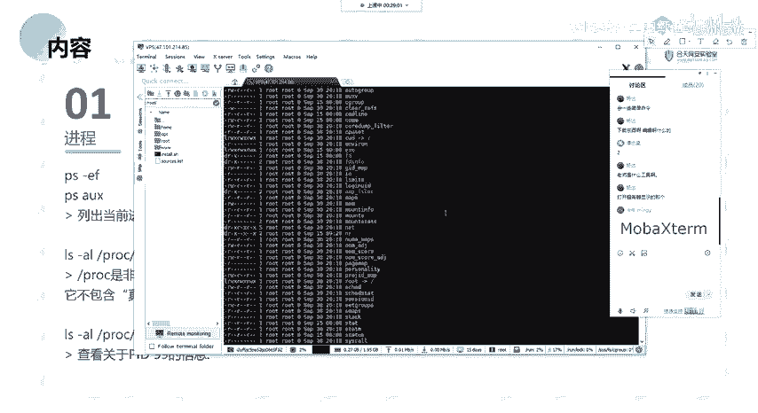

`/proc` 目录是一个特殊的虚拟文件系统。在之前的课程中介绍Linux目录结构时应该提到过它。

在这个目录下，使用 `ls` 命令查看，你会发现许多以数字命名的目录。这些数字对应着系统上正在运行的进程的 **PID**。

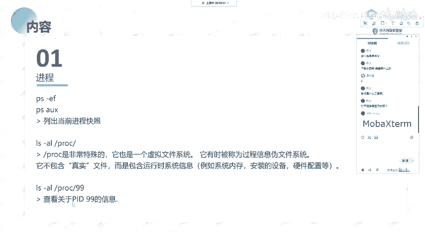

我们可以进入这些以PID命名的目录，查看该进程运行时的相关信息，例如其打开的文件、配置、内存映射等。这在安全分析和故障排查时非常有用。例如，当安全软件报告一个可疑进程的路径为 `/proc/1509/...` 时，`1509` 就是该恶意进程的PID。我们可以通过以下命令查看该进程目录下的信息：

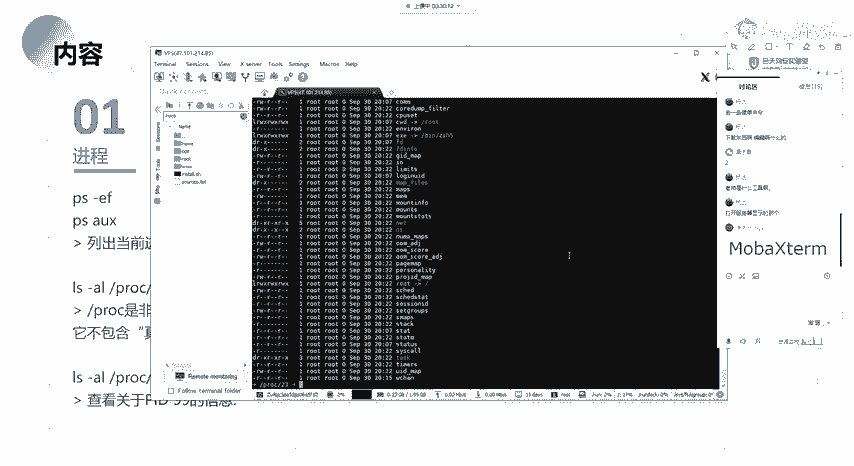

```bash
ls -l /proc/1509
```

## 实时监控进程活动 📊

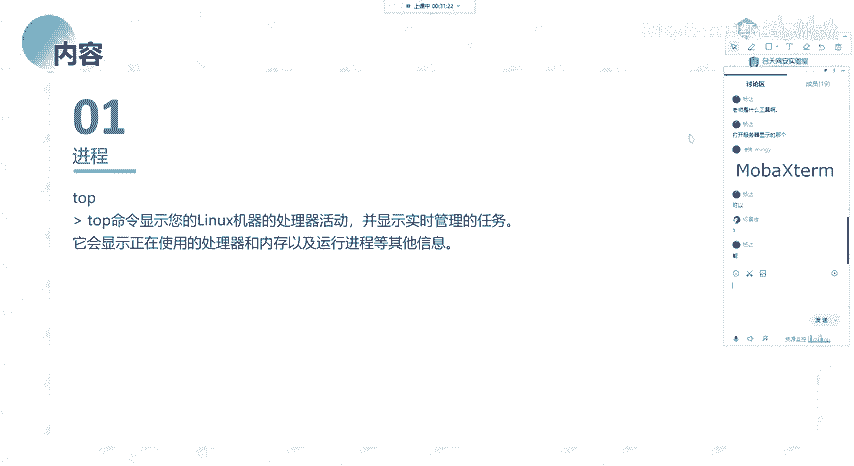

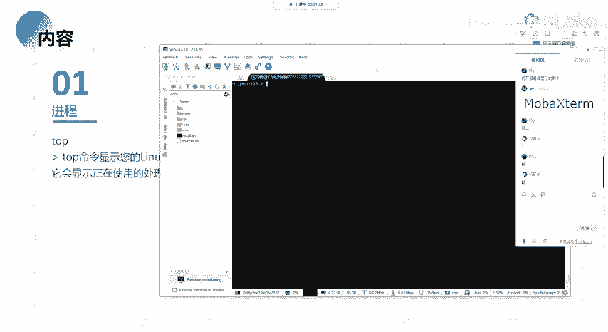

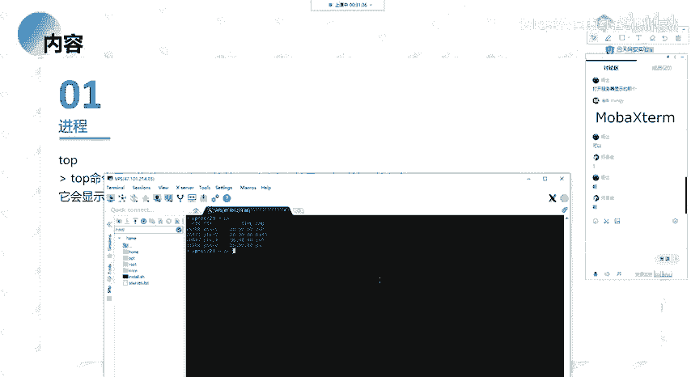

我们前面通过 `ps` 命令查看的是某一时刻的进程快照。而 `top` 命令能够实时动态地显示系统当前运行的进程任务及其资源占用情况，并会持续更新。

`top` 命令常用于系统监控和运维。它可以按照CPU使用率、内存占用大小等进行排序，帮助我们快速找到系统中占用资源最多的程序。

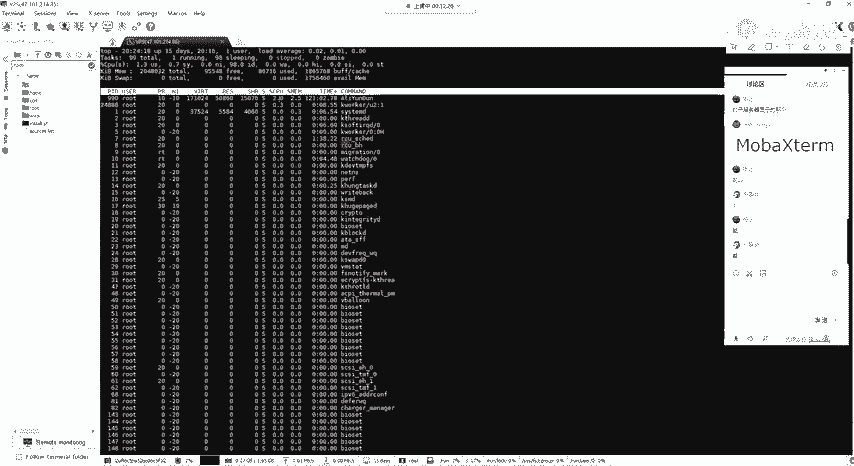

在 `top` 命令的详细输出界面中，我们主要关注以下几列信息：

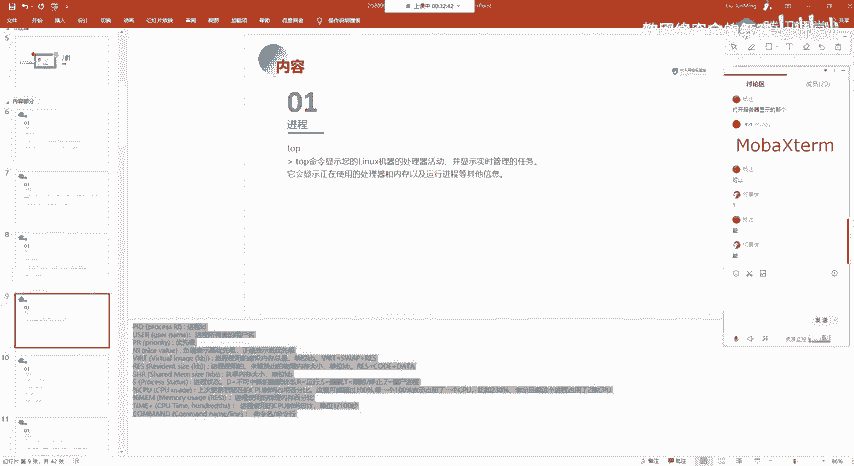

*   **PID**：进程ID。
*   **USER**：进程所有者。
*   **%CPU**：CPU占用百分比。
*   **%MEM**：内存占用百分比。
*   **COMMAND**：启动命令。

---

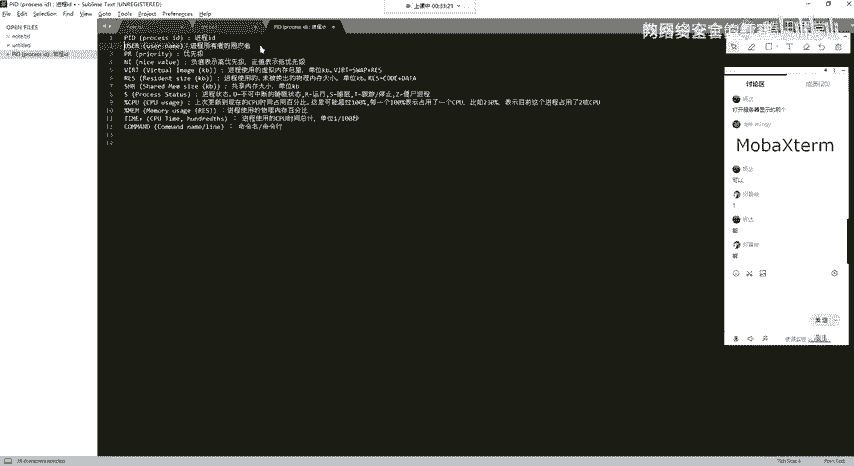

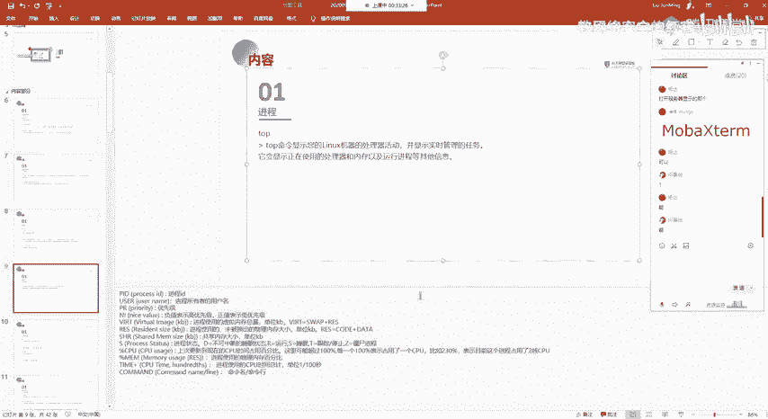

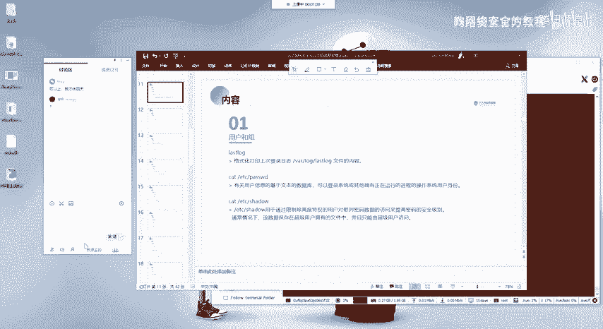

本节课中我们一起学习了Linux下管理进程信息的核心技能。我们掌握了使用 `ps` 命令查看进程列表，使用 `grep` 命令筛选特定进程，了解了 `/proc` 虚拟文件系统如何存储进程的运行时信息，并学会了使用 `top` 命令实时监控系统活动。这些命令是系统操作、性能分析和安全排查的基础工具，熟练掌握它们对后续的学习和工作至关重要。