# 网络安全系统教程：P49：Linux中SSH服务信息 🔐

在本节课中，我们将学习Linux系统中SSH服务的关键信息。SSH是远程登录和管理Linux系统最常用的工具，了解其相关文件和配置对于系统管理和安全至关重要。

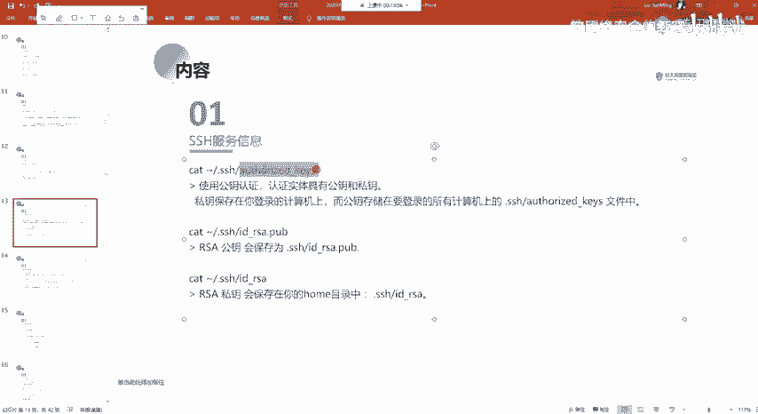

## 概述
本节将介绍SSH服务中几个重要的文件和目录，包括授权密钥文件、已知主机文件以及SSH配置文件。我们将学习如何配置SSH免密登录，并了解如何通过修改配置文件来增强SSH服务的安全性。

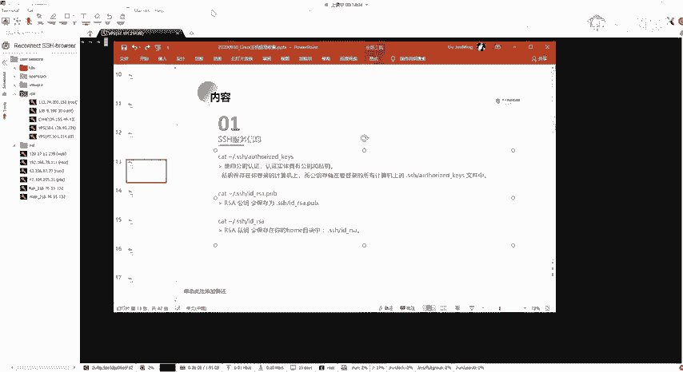

---

## SSH授权密钥目录与文件

上一节我们介绍了SSH的基本概念，本节中我们来看看SSH用于身份验证的核心文件。

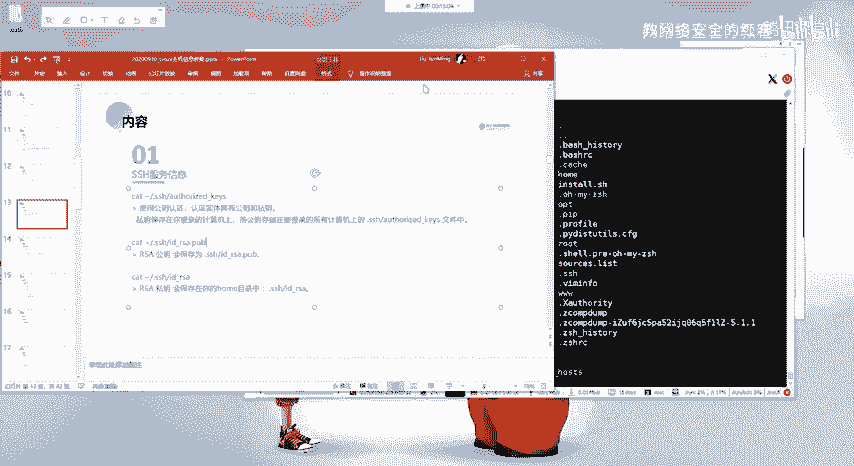

SSH免密登录依赖于公钥和私钥的配对验证。公钥需要放置在目标服务器的特定目录中。

**核心文件路径**：`~/.ssh/authorized_keys`

这个文件通常位于用户的家目录下。以`root`用户为例，我们可以通过以下命令查看：

```bash
cd /root
ls -la
```

使用`ls -la`命令可以查看所有文件，包括以点`.`开头的隐藏文件和目录。其中，`.ssh`目录就是存放SSH相关密钥的地方。

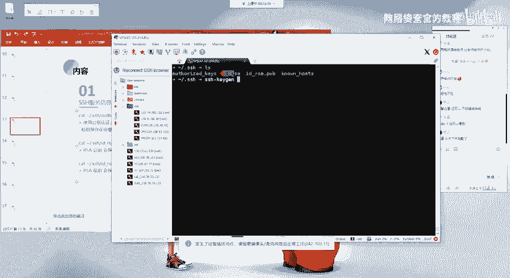

进入该目录并查看文件：

```bash
cd .ssh
ls
```


在`.ssh`目录中，`authorized_keys`文件保存了被允许免密登录到此账户的**公钥**。

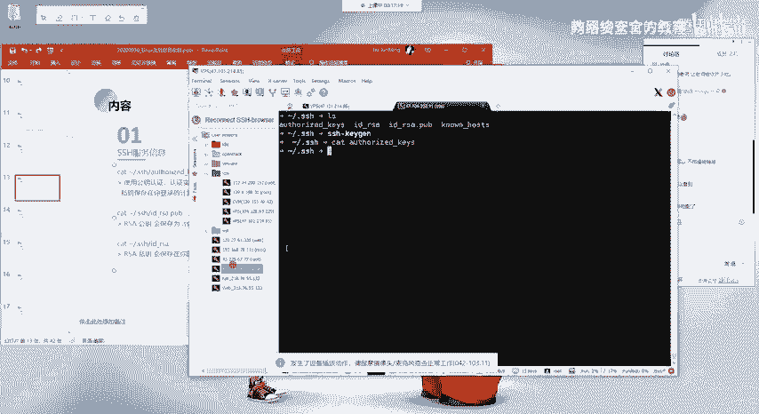

---


## 配置SSH免密登录


理解了密钥的存放位置后，我们来学习如何配置免密登录。其原理是：在客户端生成一对密钥（公钥和私钥），将公钥上传到服务端的`authorized_keys`文件中。

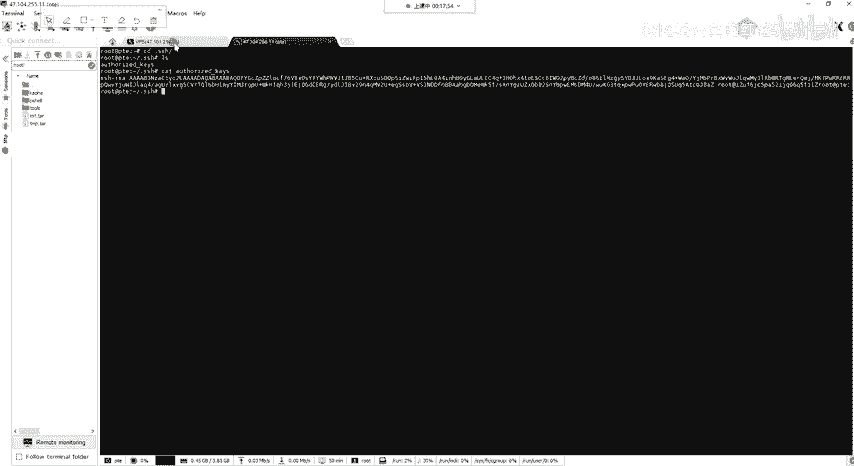

以下是配置免密登录的步骤：

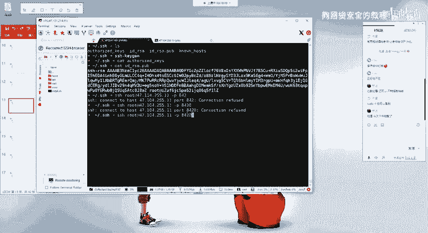

1.  **在客户端生成密钥对**
    在您自己的机器上执行以下命令生成密钥：
    ```bash
    ssh-keygen -t rsa
    ```
    此命令会生成两个文件（默认在`~/.ssh/`目录下）：
    *   `id_rsa`：**私钥**，必须严格保密，仅保存在客户端。
    *   `id_rsa.pub`：**公钥**，可以分发给任何需要登录的服务器。


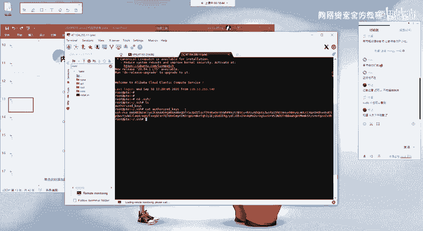

2.  **将公钥上传到服务器**
    需要将生成的公钥内容添加到目标服务器对应用户的`authorized_keys`文件中。
    一个简单的方法是使用`ssh-copy-id`命令：
    ```bash
    ssh-copy-id user@remote_host
    ```
    或者，可以手动将`id_rsa.pub`文件的内容复制并粘贴到服务器`~/.ssh/authorized_keys`文件的末尾。

配置完成后，当您从客户端使用`ssh user@remote_host`命令登录时，将不再需要输入密码。

---

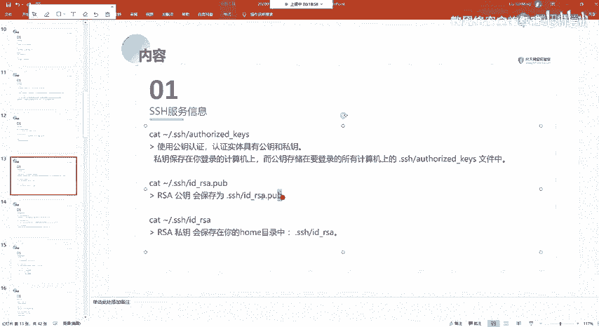

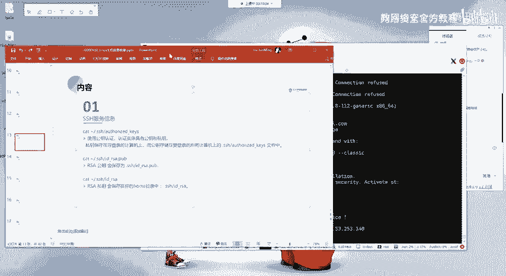

## SSH已知主机文件

当您首次连接到一个新的SSH服务器时，系统会询问是否信任该主机。其公钥信息会被记录下来，以避免中间人攻击。

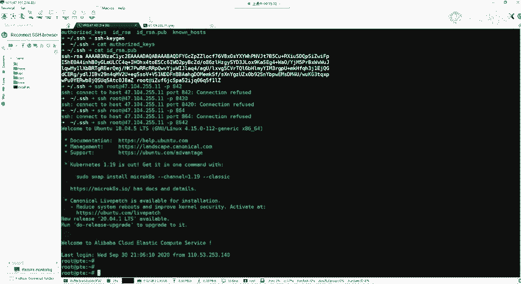

这个信息保存在以下文件中：
**核心文件路径**：`~/.ssh/known_hosts`

此文件记录了所有您曾经连接过的主机的公钥。每次连接新主机时，SSH客户端会检查该主机的公钥是否与`known_hosts`文件中记录的一致。

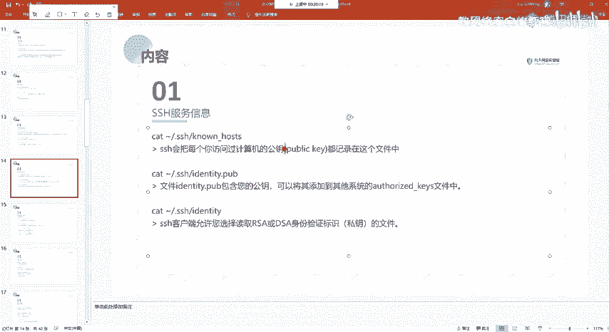

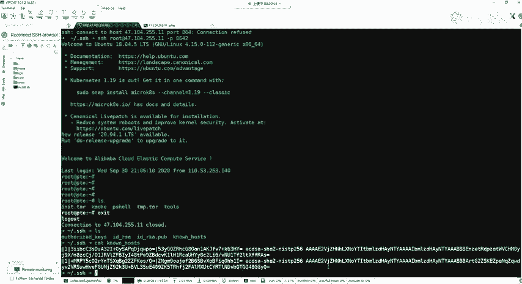

---

## SSH服务端配置文件

为了管理和加固SSH服务，我们需要了解其配置文件。服务端的配置主要集中在一个文件中。


**核心配置文件路径**：`/etc/ssh/sshd_config`

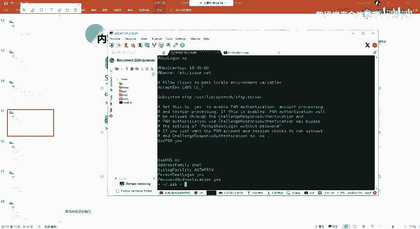

此文件控制着SSH服务端（`sshd`）的行为。修改后需要重启SSH服务才能生效。

以下是几个常见且重要的配置项：

*   **允许Root登录**
    ```bash
    PermitRootLogin yes
    ```
    将此选项改为`yes`，允许root用户直接通过SSH登录。出于安全考虑，生产环境中通常建议设置为`no`或`prohibit-password`（仅允许密钥登录）。

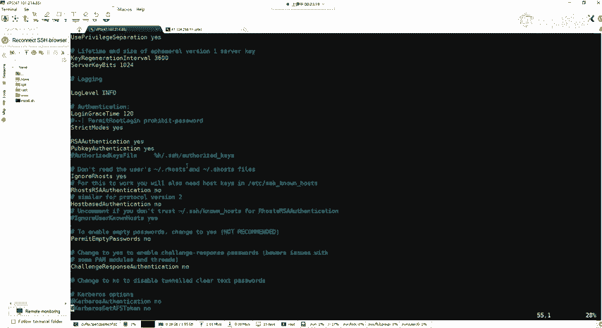

*   **更改默认端口**
    ```bash
    Port 22
    ```
    将`22`改为其他端口号（如`2222`）。这可以显著减少互联网上自动化脚本对SSH端口的暴力破解攻击。

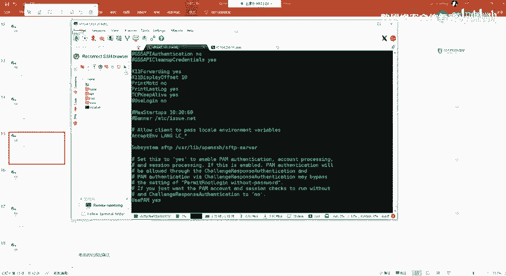

*   **启用公钥认证**
    ```bash
    PubkeyAuthentication yes
    ```
    确保此选项为`yes`，以启用我们上面介绍的免密登录功能。

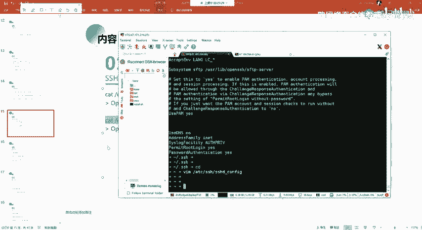

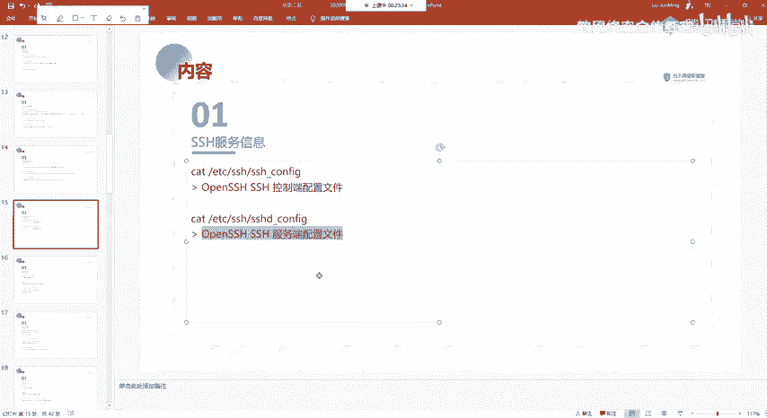

修改配置文件后，使用以下命令重启SSH服务以使更改生效：
```bash
systemctl restart sshd
# 或
service ssh restart
```

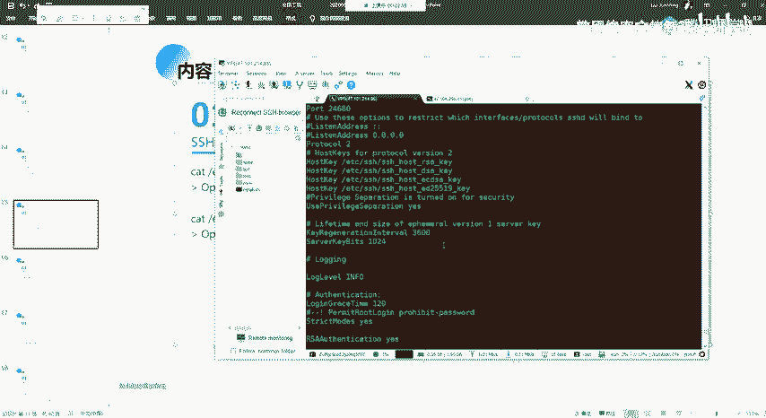

---

## 总结
本节课中我们一起学习了Linux SSH服务的关键信息。我们掌握了：
1.  SSH免密登录的原理和配置方法，核心在于管理`~/.ssh/authorized_keys`文件。
2.  `~/.ssh/known_hosts`文件的作用是存储已验证过的主机密钥，保障连接安全。
3.  通过编辑`/etc/ssh/sshd_config`配置文件，可以控制SSH服务的行为，例如更改默认端口、禁用root密码登录等，这些都是提升服务器安全性的基础操作。


理解并妥善管理这些SSH组件，是进行安全运维和渗透测试的基础技能。