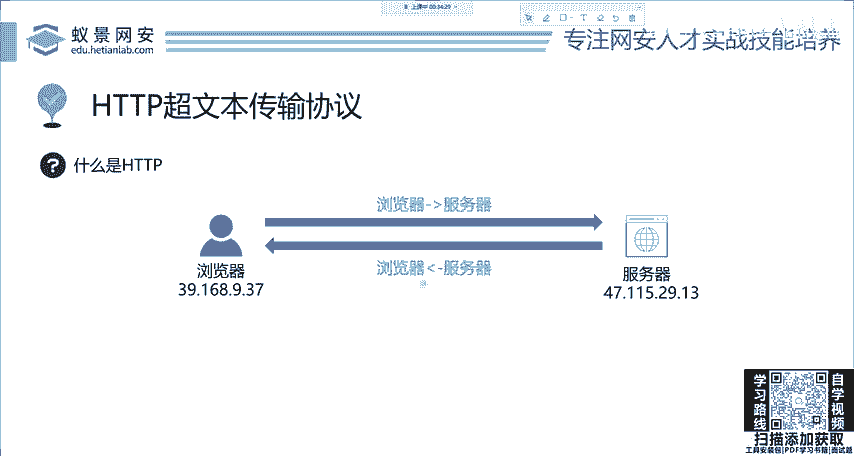
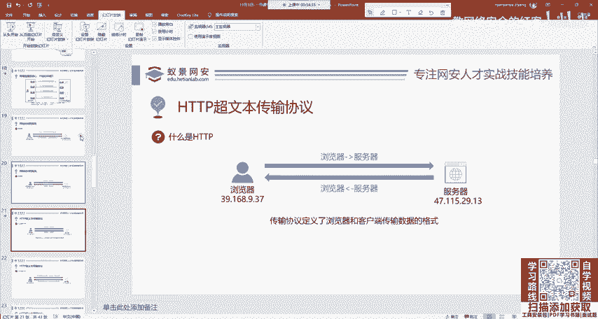
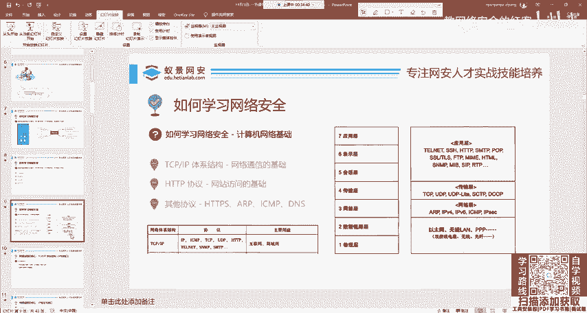
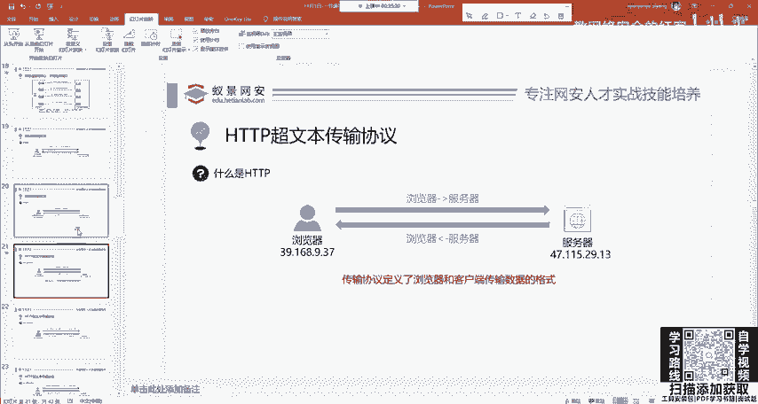
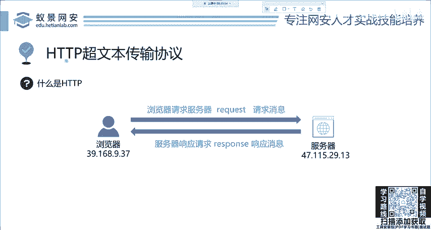
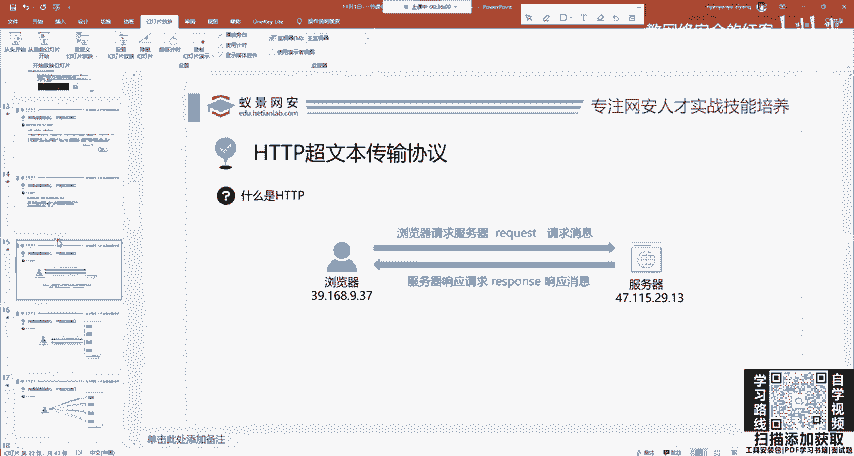
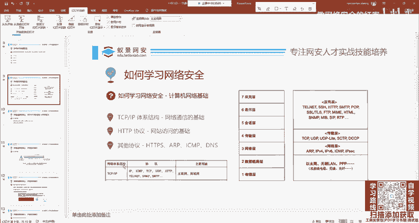
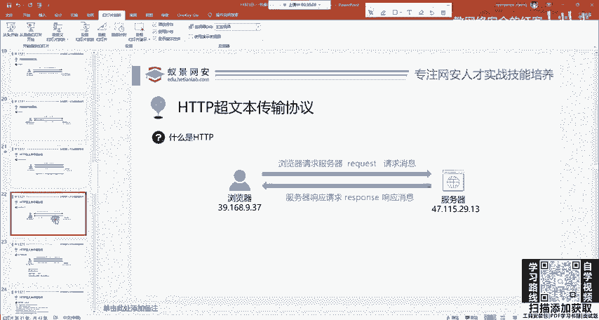
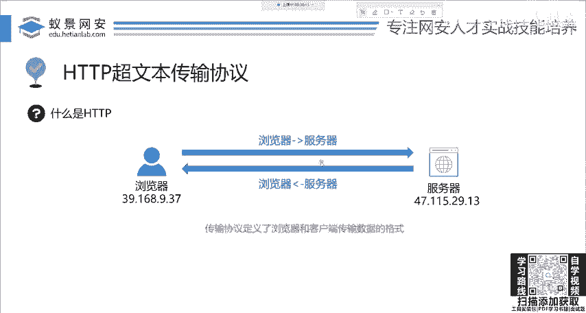
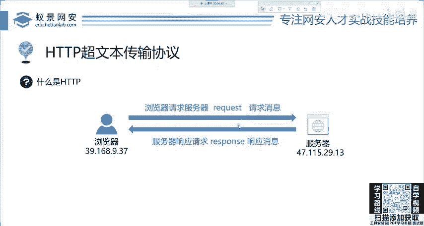

# 网络安全系统教程：P4：HTTP基础 - HTTP是什么 🧱

在本节课中，我们将要学习网络通信的基础——HTTP协议。我们将了解为什么需要协议，HTTP协议在网络体系中的位置，以及其核心的请求与响应模型。



---

## 为什么要引入协议？



首先，我们需要理解为什么要引入协议。网络工程师制定众多协议，是为了建立统一的通信标准。



例如，当用户张三访问一个网站时，他发送的信息必须让服务器能够理解。这就像人与人之间的交流：如果你和一个美国人对话，你们需要约定一种共同的语言，比如英语，才能正常沟通。如果他说英语，你说中文，双方就无法理解彼此。

因此，协议就是**规定了计算机网络中数据传输的统一标准和规范**。HTTP协议正是这样一种规范，它定义了浏览器（客户端）与服务器之间传输数据的格式。

如果某个网站不遵循HTTP协议，那么全世界的标准浏览器都将无法访问它。因为浏览器发送的请求它无法理解，它返回的数据浏览器也无法解析，导致网页无法正常显示。

---



## HTTP协议在网络中的位置

上一节我们了解了协议的必要性，本节中我们来看看HTTP协议具体位于网络体系的哪个层面。

HTTP协议工作在**应用层**。这意味着它是基于**TCP/IP**协议族构建的。从网络体系结构图中可以清楚地看到，HTTP属于TCP/IP体系架构中的应用层部分。

正因为HTTP建立在稳定可靠的TCP/IP基础之上，学习它的格式和规则就相对直接和简单。



---



## HTTP的核心：请求与响应



了解了HTTP的位置后，我们来看其运作的核心机制。HTTP通信基于一个非常简单的模型：**请求（Request）** 和 **响应（Response）**。

*   **请求（Request）**：指客户端（通常是浏览器）向服务器发起一个操作指令。例如，你在浏览器地址栏输入百度的网址并按下回车，浏览器就会向百度的服务器发送一个HTTP请求。
*   **响应（Response）**：指服务器在接收到客户端的请求后，返回处理结果。例如，百度服务器在收到你的请求后，会将搜索页面、图片、文字等内容打包，通过HTTP响应发送回你的浏览器。

这个过程可以概括为以下模型：
```
客户端（浏览器） --发送Request--> 服务器
客户端（浏览器） <--返回Response-- 服务器
```

记住这两个关键术语 **`Request`** 和 **`Response`** 对于后续学习至关重要。



---



## 本节课总结



本节课中，我们一起学习了HTTP协议的基础知识。我们首先探讨了引入协议是为了建立像“共同语言”一样的**统一通信标准**。接着，明确了HTTP协议位于TCP/IP体系结构的**应用层**。最后，我们掌握了HTTP通信的核心模型，即由客户端发起的**请求（Request）**和服务器返回的**响应（Response）**。理解这些概念是后续深入学习HTTP报文细节、方法、状态码以及网络安全相关知识的重要基石。