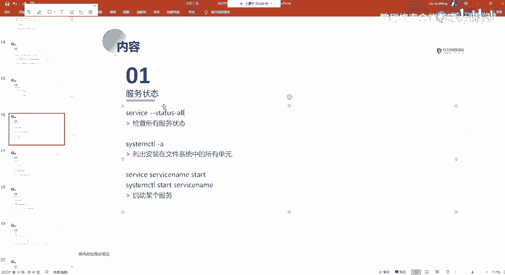
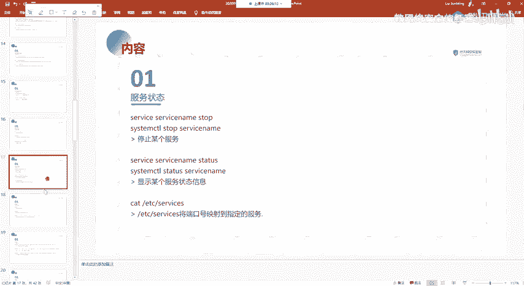

# 网络安全系统教程：P50：37.服务状态信息

在本节课中，我们将学习如何在Linux系统中查看和管理服务的状态。这是系统管理和网络安全排查中的一项基础且重要的技能。

上一节我们介绍了系统进程的相关知识，本节中我们来看看如何管理系统中运行的服务。




## 查看服务状态

在Linux系统中，服务是持续运行在后台的程序，用于提供特定功能。了解哪些服务正在运行是系统管理的第一步。


以下是查看服务状态的两种主要命令。

*   **使用 `service` 命令**：这是一个传统的命令，用于查看和控制服务。通过 `service --status-all` 命令，可以列出系统上所有服务的状态，从而了解哪些服务已开启。
    ```
    service --status-all
    ```
*   **使用 `systemctl` 命令**：这是现代Linux发行版（如Debian、Ubuntu等）统一采用的新命令，用于管理系统服务。它同样可以用于查看服务状态。
    ```
    systemctl status <服务名>
    ```

## 管理服务操作

仅仅查看状态是不够的，我们还需要能够启动、停止或重启服务。`service` 和 `systemctl` 命令都支持这些操作，但语法略有不同。

以下是使用这两个命令进行服务管理的基本操作对比。

*   **启动服务**
    *   `service` 命令：`service <服务名> start`
    *   `systemctl` 命令：`systemctl start <服务名>`
*   **停止服务**
    *   `service` 命令：`service <服务名> stop`
    *   `systemctl` 命令：`systemctl stop <服务名>`
*   **重启服务**
    *   `service` 命令：`service <服务名> restart`
    *   `systemctl` 命令：`systemctl restart <服务名>`
    *   **注意**：重启操作会先停止服务，然后再启动它。
*   **查看服务状态**
    *   `service` 命令：`service <服务名> status`
    *   `systemctl` 命令：`systemctl status <服务名>`

在使用这两个命令时，需要注意区分它们的语法格式。对于现代系统，推荐优先使用 `systemctl` 命令。



本节课中我们一起学习了如何使用 `service` 和 `systemctl` 命令来查看和管理Linux系统中的服务状态。掌握这些命令，是进行系统维护和网络安全基线检查的基础。