# 网络安全系统教程：P51：38. 防火墙基础与 iptables 入门 🔐

在本节课中，我们将要学习 Linux 系统自带的防火墙工具——iptables。我们将了解它的基本概念、核心命令以及如何通过设置规则来控制网络流量，这是保障系统安全的重要一步。


## 概述

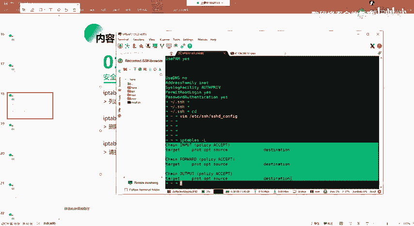

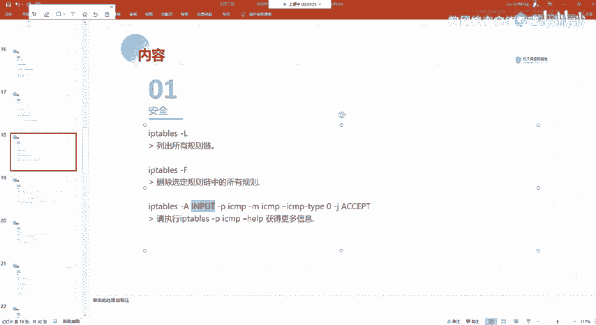

Linux 系统自带一个名为 **iptables** 的防火墙工具。我们可以使用 iptables 来设置相应的安全规则，以控制进出系统的网络数据包，从而增强系统的安全性。

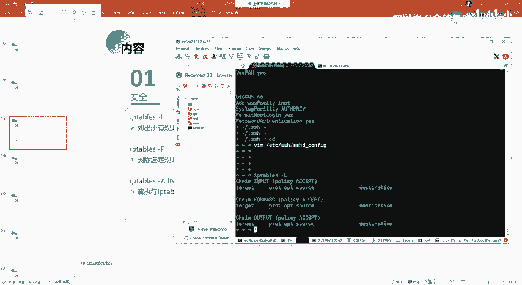

## iptables 基本命令

以下是 iptables 命令的一些基本用法，用于查看和管理防火墙规则。

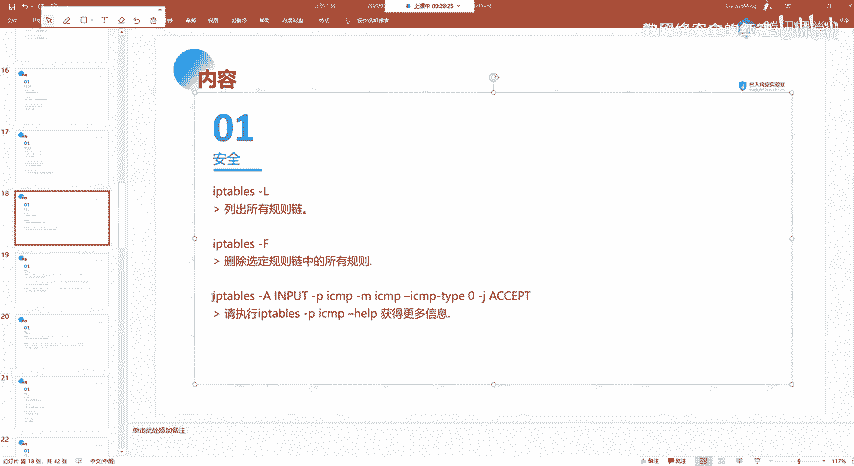

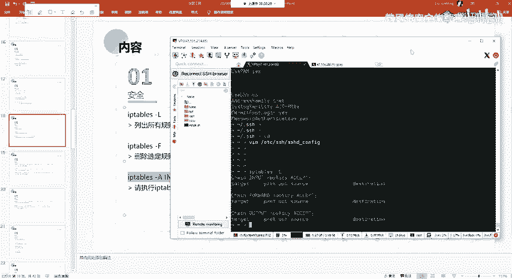

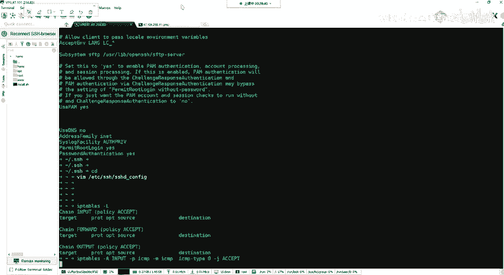

*   **列出所有规则**：使用 `-L` 选项可以列出当前配置的所有规则链及其规则。
    ```bash
    iptables -L
    ```
    执行此命令后，通常会看到 `INPUT`、`FORWARD`、`OUTPUT` 三条默认的链。如果尚未配置任何规则，这些链的内容将是空的。

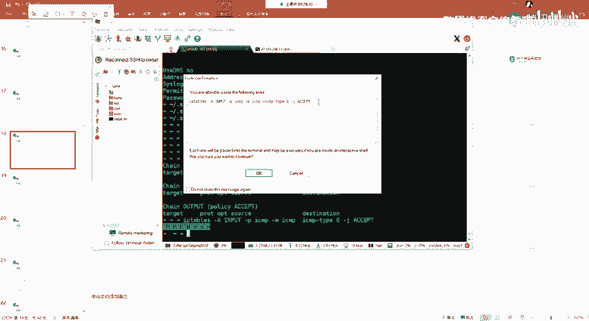

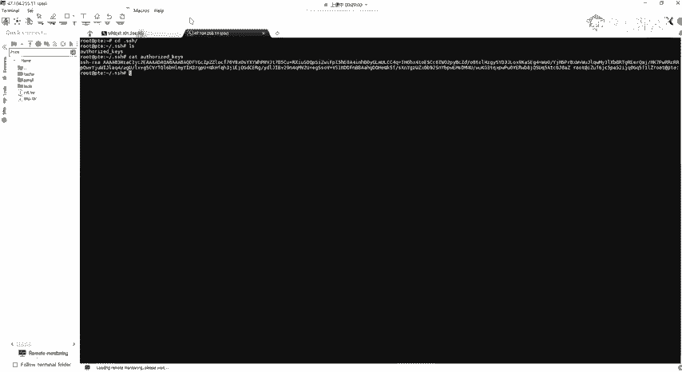

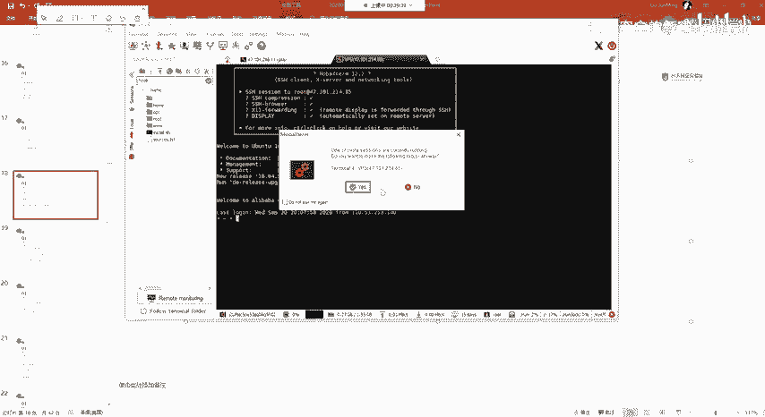

*   **删除规则**：使用 `-F` 选项可以删除选定规则链中的所有规则。
    ```bash
    iptables -F
    ```

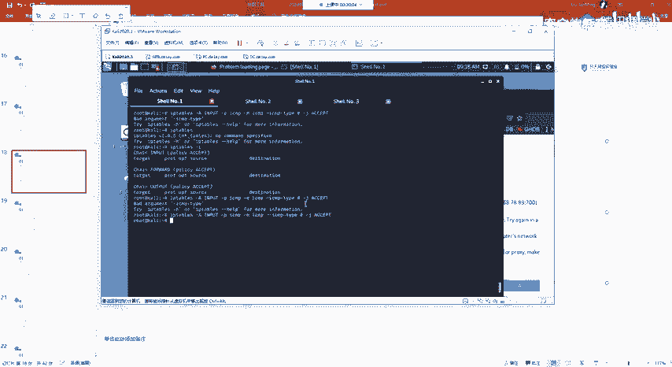

## 添加防火墙规则

上一节我们介绍了如何查看和清空规则，本节中我们来看看如何添加具体的防火墙规则。添加规则的基本命令格式是 `iptables -A`。

*   **允许特定协议**：例如，我们可以添加一条规则，允许所有的 ICMP 协议数据包通过。ICMP 协议常用于 `ping` 命令。
    ```bash
    iptables -A INPUT -p icmp -j ACCEPT
    ```
    *   `-A INPUT`：表示将规则追加到 `INPUT` 链（处理进入系统的数据包）。
    *   `-p icmp`：指定协议为 ICMP。
    *   `-j ACCEPT`：`-j` 代表“跳转目标”，`ACCEPT` 表示允许匹配的数据包通过。
    这条规则的含义是：允许所有进入系统的 ICMP 协议数据包。

*   **允许特定端口的连接**：我们可以设置更具体的规则，例如允许来自远程主机的 TCP 连接访问本机的 80 端口（HTTP服务）。
    ```bash
    iptables -A INPUT -p tcp --dport 80 -j ACCEPT
    ```
    *   `-p tcp`：指定协议为 TCP。
    *   `--dport 80`：指定目标端口为 80。
    *   `-j ACCEPT`：允许匹配的数据包。
    这条规则的含义是：允许所有目标端口为 80 的 TCP 连接进入系统。

    同理，如果要设置允许从本机某个端口发出的连接，则需要操作 `OUTPUT` 链。

## 注意事项与高级学习

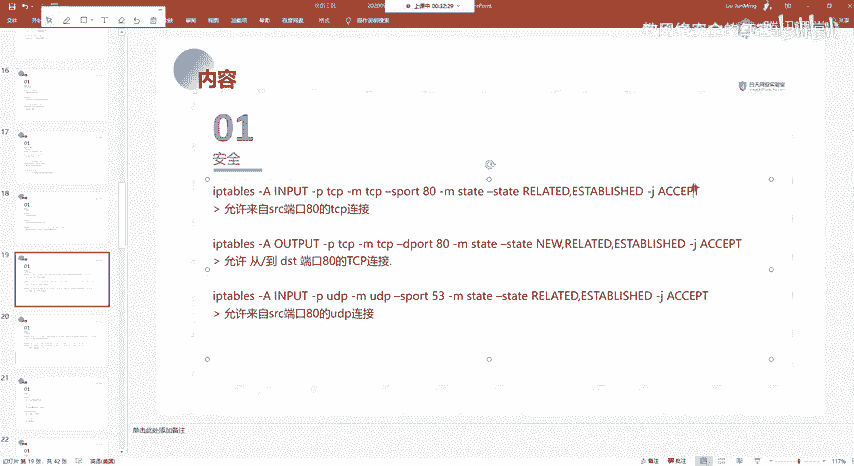

在使用 iptables 命令时，有几点需要特别注意。同时，防火墙规则的配置本身是一门较深的学问。

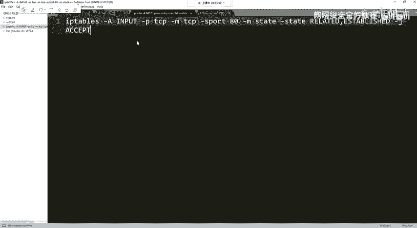

*   **谨慎复制命令**：在复制命令时，需特别注意标点符号（如逗号、短横线 `-`）必须是英文半角字符。中文符号会导致命令执行失败。建议初学者手动输入命令以加深印象。
*   **规则复杂性**：iptables 的规则链和配置策略比较复杂，本节课仅介绍了最基础的概念和用法。关于更详细的匹配条件、动作（如 `DROP` 拒绝、`REJECT` 拒绝并回复）、表（如 `filter`, `nat`）以及规则顺序等高级内容，需要大家在课后进行更深入的学习和实践。

## 总结

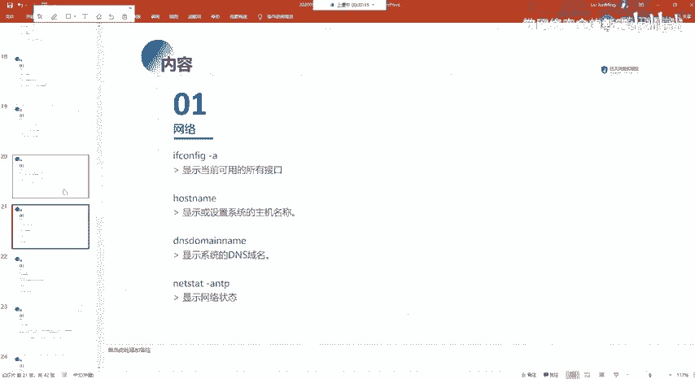

本节课中我们一起学习了 Linux 防火墙的基础知识。我们认识了 **iptables** 工具，掌握了使用 `-L` 查看规则、使用 `-F` 清空规则以及使用 `-A` 添加基本规则（如允许 ICMP 和特定 TCP 端口）的方法。理解并正确配置防火墙是构建安全系统环境的关键技能之一。