# 网络安全系统教程：P52：网络相关信息

## 概述
在本节课中，我们将学习如何查看和配置Linux系统中的网络信息。掌握这些基础命令和配置文件，是进行网络诊断、服务部署和安全分析的第一步。

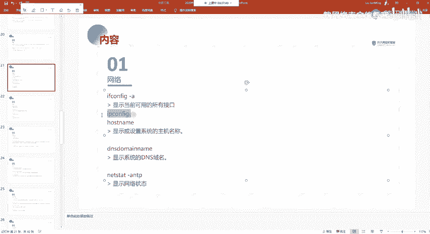

---


## 查看网络接口信息
上一节我们介绍了系统基础信息，本节中我们来看看如何获取网络相关的信息。查看网络接口的IP地址、子网掩码等是最常见的操作。

在Linux和Windows系统中，查看网络接口的命令有所不同，请注意区分。
*   **Linux系统**：使用 `ifconfig` 命令。
*   **Windows系统**：使用 `ipconfig` 命令。

在Linux系统中，我们可以使用 `ifconfig -a` 命令来查看所有网络接口的详细信息。

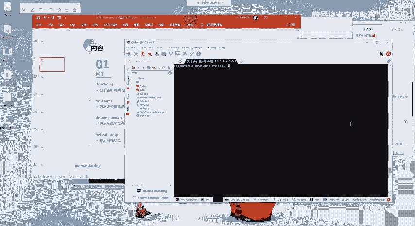


---

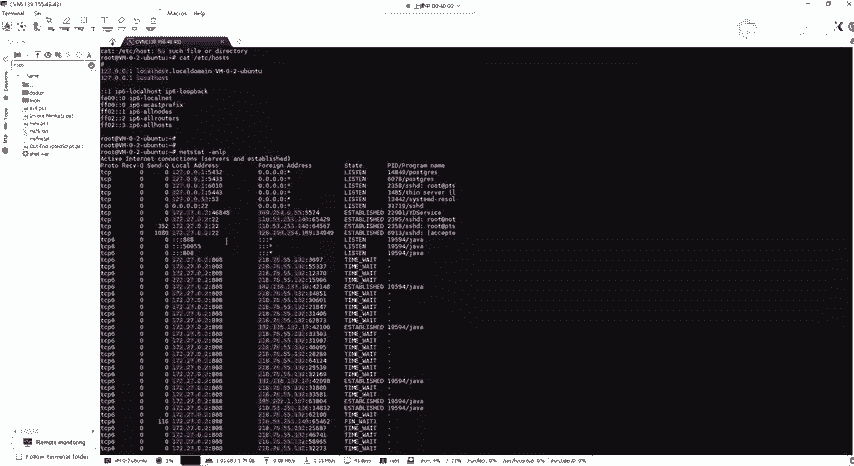

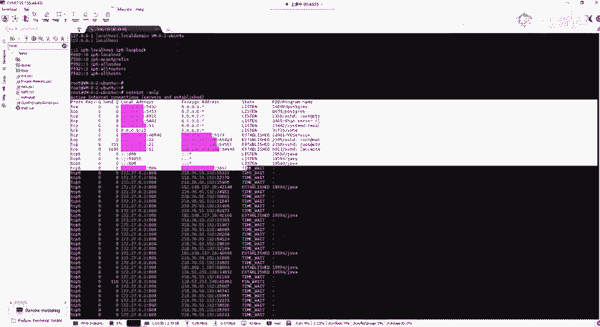

## 查看主机名与域名
了解当前系统的主机名和域名对于网络定位和配置服务非常重要。

以下是相关命令：
*   **查看主机名**：使用 `hostname` 命令。
*   **查看DNS域名**：使用 `dnsdomainname` 命令。

系统的主机名和本地域名解析记录通常存储在 `/etc/hosts` 文件中。例如，`127.0.0.1 localhost` 这条记录表示本地回环地址指向主机名 `localhost`。

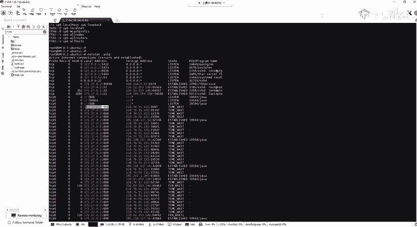


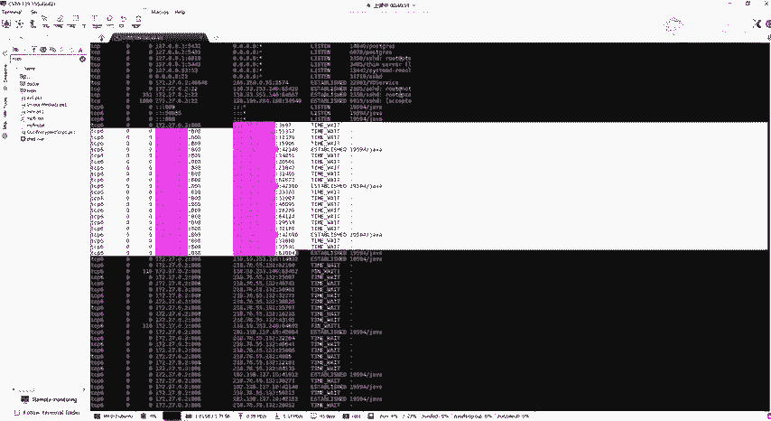

---

## 网络连接状态与端口管理
`netstat` 是一个功能强大的网络统计工具，常用于查看网络连接、路由表和网络接口状态。

### 查看所有监听端口
使用 `netstat -tulpn` 命令可以查看所有正在监听的TCP/UDP端口及其详细信息。


命令输出包含几个关键部分：
*   **Local Address**：本地IP地址和端口号，表示本机开放了哪些端口。
*   **Foreign Address**：外部IP地址和端口号，表示有哪些外部连接连入了本机端口。
*   **State**：连接状态，`LISTEN` 表示端口正在监听等待连接。
*   **PID/Program name**：占用该端口的进程ID和程序名称。


### 查看特定端口的连接
例如，要查看SSH服务（默认端口22）的状态，可以使用 `netstat -tulpn | grep :22` 命令进行过滤。


### 管理端口进程
如果发现某个端口被未知进程占用，或需要关闭某个服务，可以通过进程ID（PID）来结束它。
1.  首先使用 `netstat -tulpn` 找到目标端口对应的PID。
2.  然后使用 `kill [PID]` 命令结束该进程。例如：`kill 31719`。
3.  结束后，该端口将不再处于监听状态。

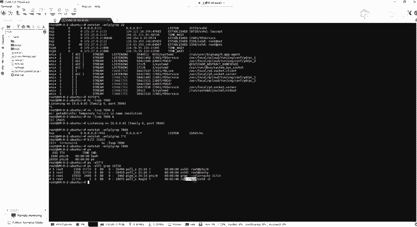

若要进一步查看某个PID具体对应什么程序以及如何启动的，可以使用 `ps -ef | grep [PID]` 命令。


---

## 网络配置文件解析
除了使用命令，直接编辑网络配置文件是进行持久化网络配置的主要方式。


### 1. DNS配置文件 (`/etc/resolv.conf`)
当你能 `ping` 通IP地址但无法 `ping` 通域名时，通常是DNS解析出了问题。此时可以检查或临时配置DNS服务器。

编辑 `/etc/resolv.conf` 文件，添加 `nameserver` 记录指向公共DNS服务器（如 `114.114.114.114` 或 `8.8.8.8`）。


```bash
# 示例：编辑resolv.conf文件
sudo vim /etc/resolv.conf
# 添加以下内容
nameserver 114.114.114.114
```


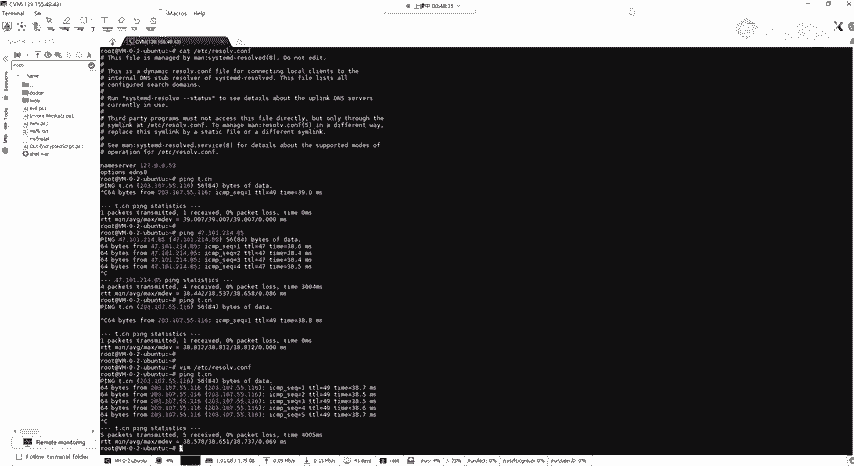

### 2. 主机名映射文件 (`/etc/hosts`)
此文件用于在本地手动建立IP地址与主机名/域名的映射关系，优先级高于DNS查询。

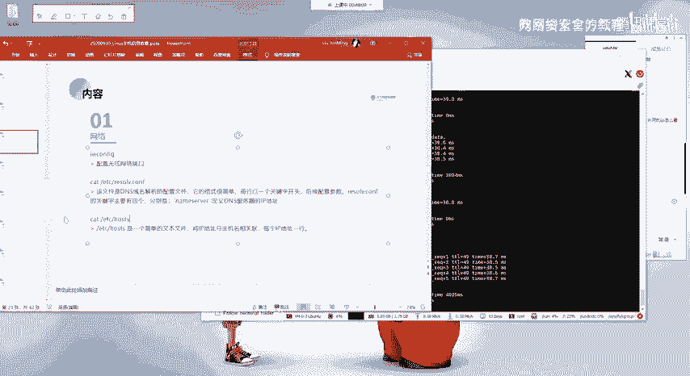


### 3. 网络接口配置文件
这是配置静态IP地址的关键文件。不同Linux发行版的配置文件路径可能不同。


**Debian/Ubuntu/Kali 等系统**：
主配置文件通常为 `/etc/network/interfaces`。

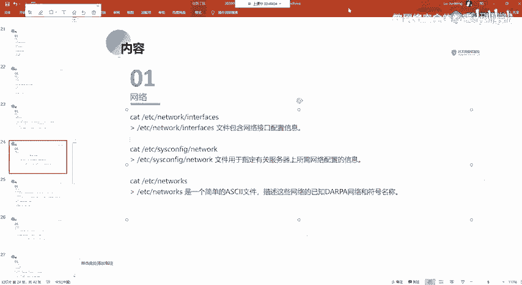


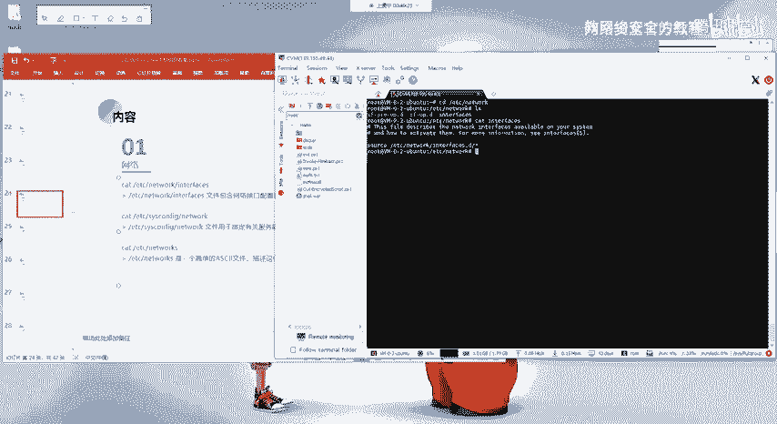

配置静态IP的示例：
```bash
# 编辑网络接口配置文件
sudo vim /etc/network/interfaces
# 添加以下配置（假设网卡名为 eth0）
auto eth0
iface eth0 inet static
    address 192.168.1.100   # 静态IP地址
    netmask 255.255.255.0   # 子网掩码
    gateway 192.168.1.1     # 网关地址
```

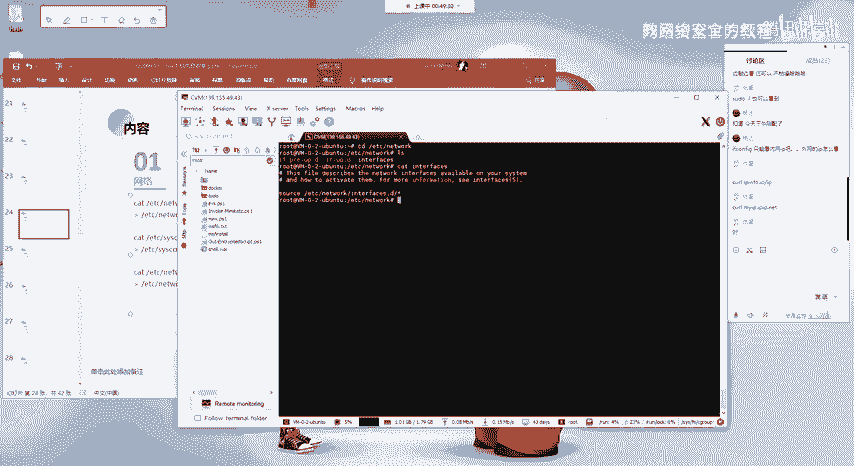

配置完成后，使用 `sudo service networking restart` 或 `sudo systemctl restart networking` 重启网络服务使配置生效。


**RHEL/CentOS/Fedora 等系统**：
配置文件位于 `/etc/sysconfig/network-scripts/` 目录下，通常以 `ifcfg-[网卡名]` 命名（例如 `ifcfg-eth0`）。

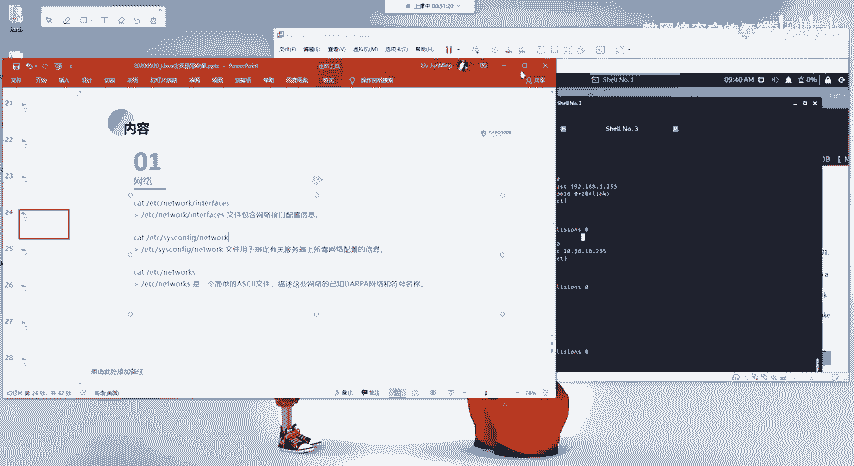
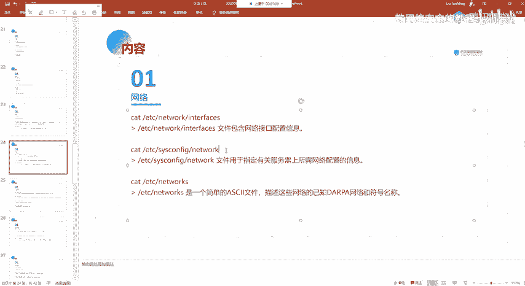

---


## 总结
本节课中我们一起学习了Linux系统中与网络相关的核心知识和操作。
1.  我们学会了使用 `ifconfig` 和 `hostname` 等命令查看基本的网络接口和主机信息。
2.  重点掌握了 `netstat` 命令的用法，用于查看端口监听状态、网络连接以及管理相关进程。
3.  理解了关键的网络配置文件：`/etc/resolv.conf` 用于配置DNS，`/etc/hosts` 用于本地主机名解析，以及不同发行版的网络接口配置文件用于设置静态IP。
这些是进行网络配置、故障排查和安全评估的基础技能，请务必熟练掌握。