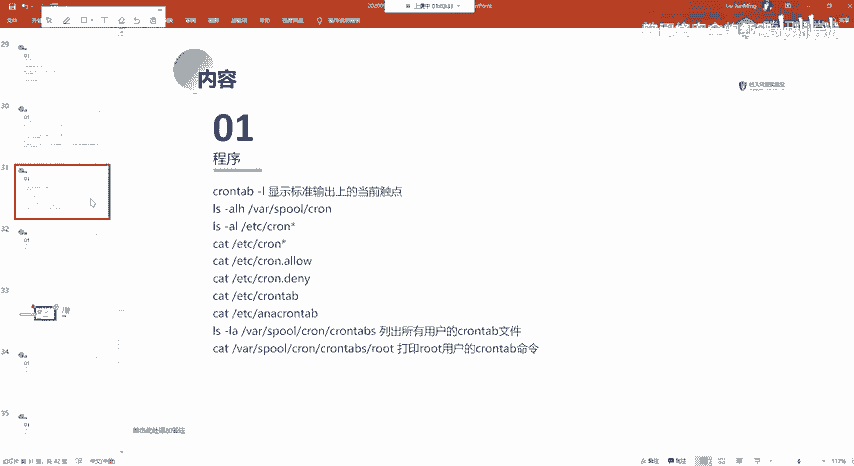
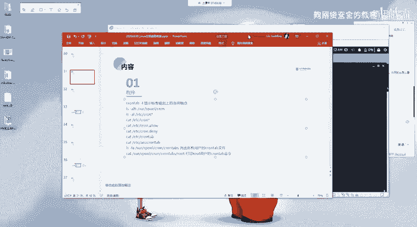
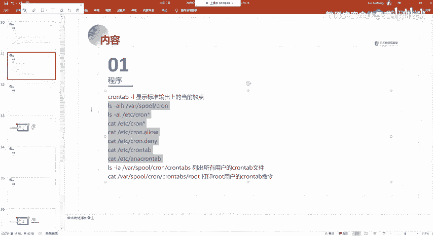
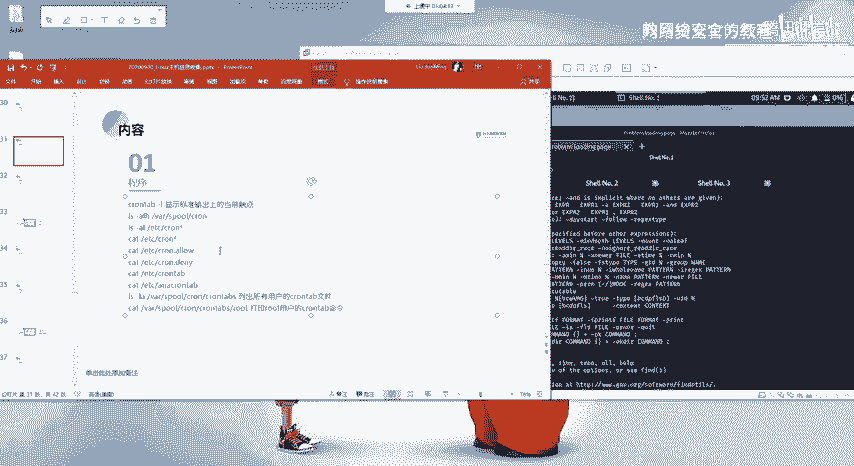
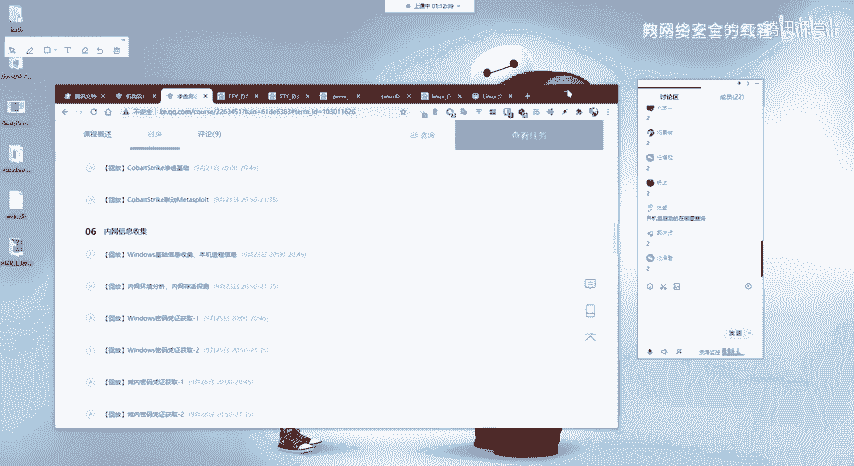
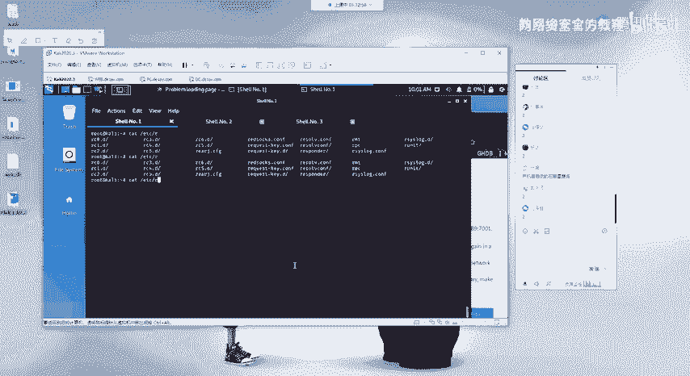
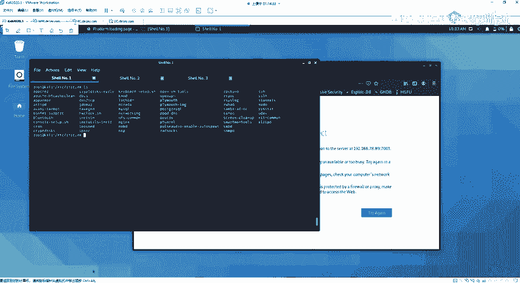
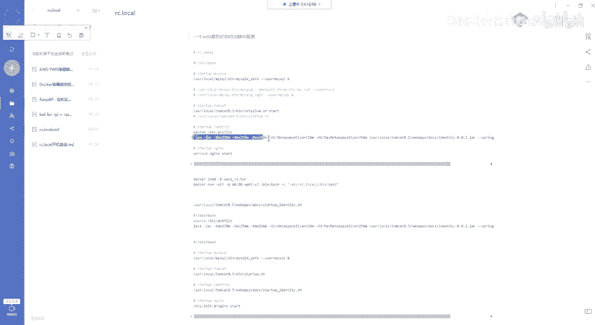
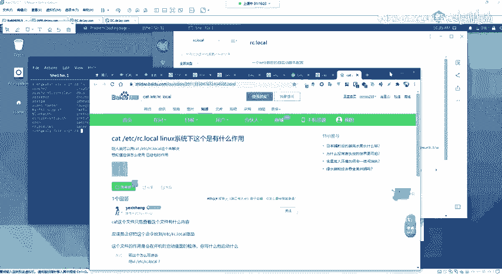
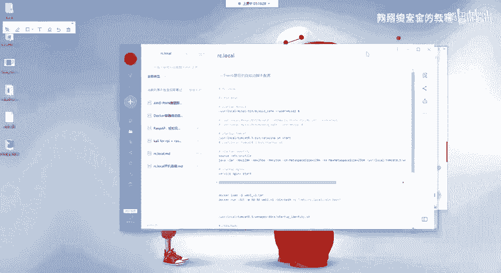

# 网络安全系统教程：P54：程序相关信息







## 概述
在本节课中，我们将学习Linux系统中与程序相关的信息收集方法，特别是定时任务（crontab）的配置与查看。这对于理解系统自动化任务、排查安全风险以及进行渗透测试中的权限维持至关重要。



---

## 定时任务（crontab）简介
上一节我们介绍了系统服务信息，本节中我们来看看如何管理系统的定时任务。定时任务（crontab）是Linux系统中用于在预定时间自动执行命令或脚本的工具。

### 定时任务的基本概念
定时任务允许用户或系统管理员安排程序在特定时间（如每分钟、每小时、每天）自动运行。其核心配置通过`crontab`命令和相关文件进行管理。

### 定时任务的配置文件
以下是系统中与定时任务相关的主要文件和目录：

1.  **系统级定时任务文件**：
    *   **`/etc/crontab`**：这是系统全局的定时任务配置文件。我们可以通过`cat`命令查看其中的任务信息。
        ```bash
        cat /etc/crontab
        ```

2.  **用户级定时任务目录**：
    *   **`/var/spool/cron/crontabs/`**：此目录下存放了各个用户的个人定时任务文件。每个文件以对应用户名命名。
        *   例如，`root`用户的定时任务记录在`/var/spool/cron/crontabs/root`文件中。
        *   如果存在名为`kali`的用户，其定时任务则记录在`/var/spool/cron/crontabs/kali`文件中。
    *   要查看特定用户的定时任务，可以使用`crontab -l -u [用户名]`命令。例如，查看root用户的任务：
        ```bash
        crontab -l -u root
        ```

3.  **定时任务控制目录**：
    *   **`/etc/cron.d/`**、**`/etc/cron.hourly/`**、**`/etc/cron.daily/`**、**`/etc/cron.weekly/`**、**`/etc/cron.monthly/`**：这些目录用于存放更精细控制的定时任务脚本。`cron.d`用于管理员放置额外的crontab文件，而`hourly`、`daily`等目录则分别对应每小时、每天等周期运行的任务。
    *   **`/etc/cron.allow`** 和 **`/etc/cron.deny`**：这两个文件用于控制允许或拒绝哪些用户使用`crontab`命令。`allow`表示允许，`deny`表示拒绝。

---

## 定时任务在安全中的应用
了解定时任务的配置对于网络安全至关重要。攻击者常利用定时任务实现权限维持（提权后）或执行反向Shell等操作。

*   **权限维持**：在获得系统访问权限后，攻击者可能会写入一个定时任务，定期执行一个恶意脚本或后门程序，以确保在系统重启或清理后仍能保持访问。
*   **执行反向Shell**：正如之前课程中利用Redis未授权访问漏洞所演示的，攻击者可以通过写入定时任务来反弹一个Shell连接，从而获得对目标服务器的控制。

---

## 关于Linux命令学习的建议
本节课的内容主要围绕Linux命令展开，可能会显得有些枯燥。但请理解，Linux系统的操作核心就是命令行。以下是一些学习建议：



*   **无需死记硬背**：不必强求记住所有命令及其参数。重要的是对它们的功能和用途有一个基本印象。
*   **实践与搜索**：亲手敲击命令实践一遍，建立初步印象。当后续真正需要用到时，再通过搜索引擎（如百度）或教程网站（如菜鸟教程）查询具体用法即可。
*   **建立知识框架**：学习的重点是培养认知和解决问题的习惯。你需要知道“遇到某类问题，应该去查找哪个方面的命令或配置”。例如，知道程序自启动与`/etc/init.d/`或`rc.local`文件有关。
*   **掌握核心结构**：对于Linux学习，理解其树状的目录结构（从根目录`/`开始）以及常用目录（如`/etc`, `/var`, `/home`）的用途，比记忆大量命令更为重要。



---

## 补充：开机自启动配置
有同学问到开机自启动的配置，这里简要补充两种常见方法：



1.  **使用 `/etc/init.d/` 目录**：
    系统服务通常将启动脚本放在`/etc/init.d/`目录下。你可以参考现有服务脚本的写法，将自己的程序编写成服务脚本并放置于此，然后使用`update-rc.d`或`chkconfig`命令将其设置为开机启动。这种方法相对复杂。

2.  **使用 `/etc/rc.local` 文件**：
    这是一个更简单的方法。`/etc/rc.local`文件会在系统启动的最后阶段执行。
    *   首先，确保该文件具有可执行权限：
        ```bash
        chmod +x /etc/rc.local
        ```
    *   然后，编辑该文件，在`exit 0`行之前添加你需要开机自启动的命令。
        ```bash
        # 示例：启动一个自定义脚本或服务
        /path/to/your/script.sh &
        /usr/local/bin/your_service start
        ```

---





## 总结
本节课我们一起学习了Linux系统中程序相关信息的管理，重点包括：
1.  定时任务（crontab）的概念及其在系统自动化与安全攻防中的重要性。
2.  定时任务的主要配置文件位置：`/etc/crontab`（系统级）和`/var/spool/cron/crontabs/`（用户级）。
3.  查看定时任务的命令：`crontab -l -u [用户名]`。
4.  学习了关于Linux命令学习的正确方法与心态，强调理解重于记忆。
5.  补充介绍了实现开机自启动的两种途径：`/etc/init.d/`服务脚本和`/etc/rc.local`文件。



通过本节课，你应该对如何查找和管理系统自动运行的任务有了清晰的认识，这是内网信息收集和后续安全评估中非常基础且重要的一环。下一章节，我们将开始学习“通道构建”，即如何通过各种代理技术建立从外网访问内网的通道。