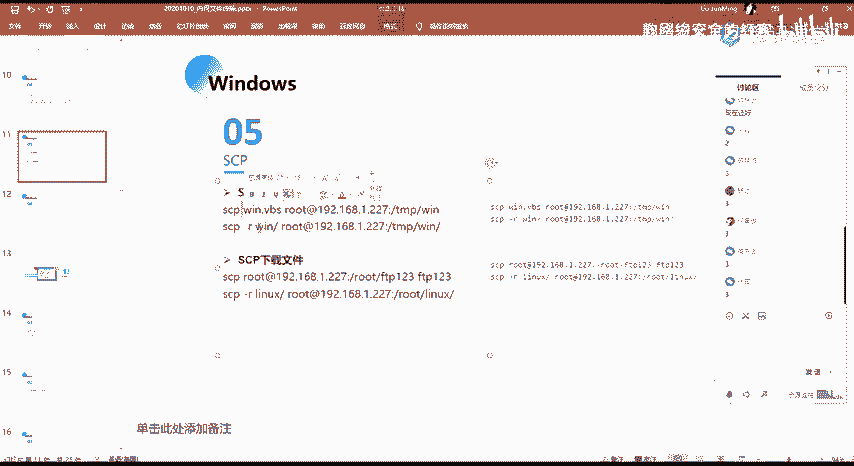
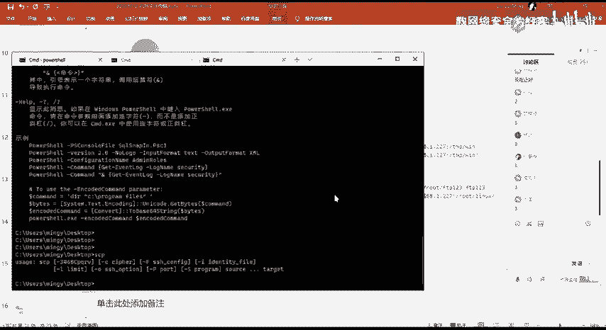
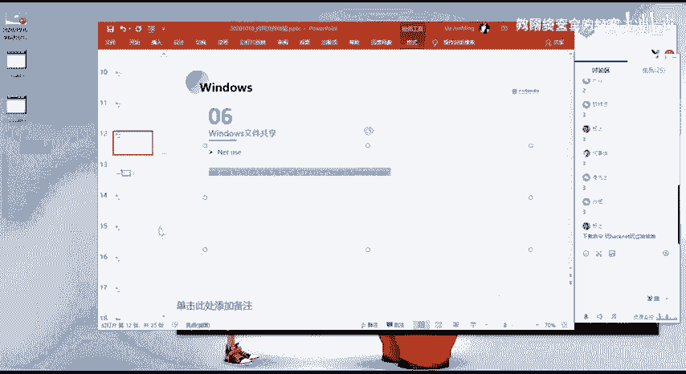
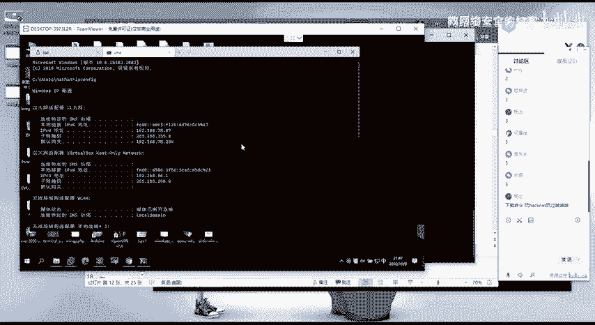
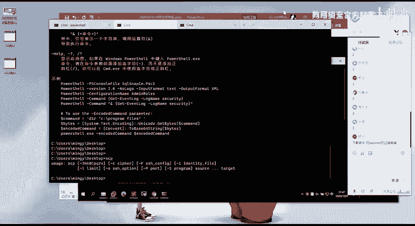
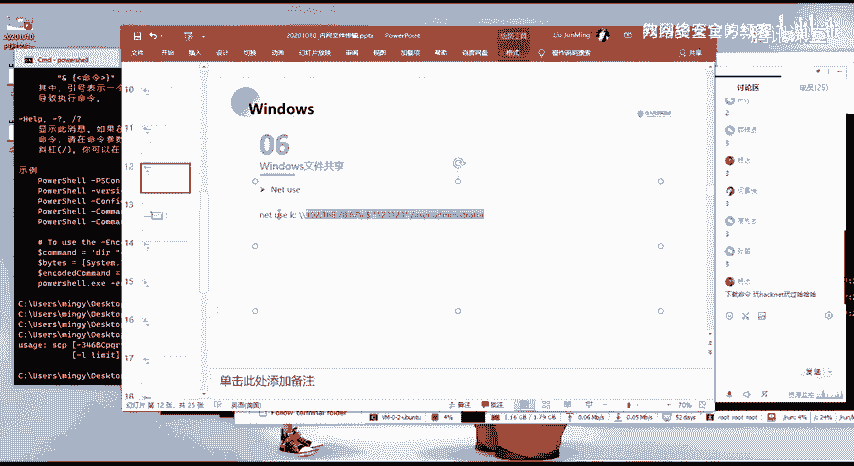
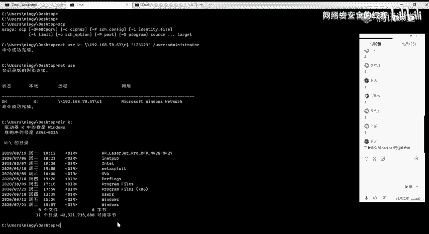
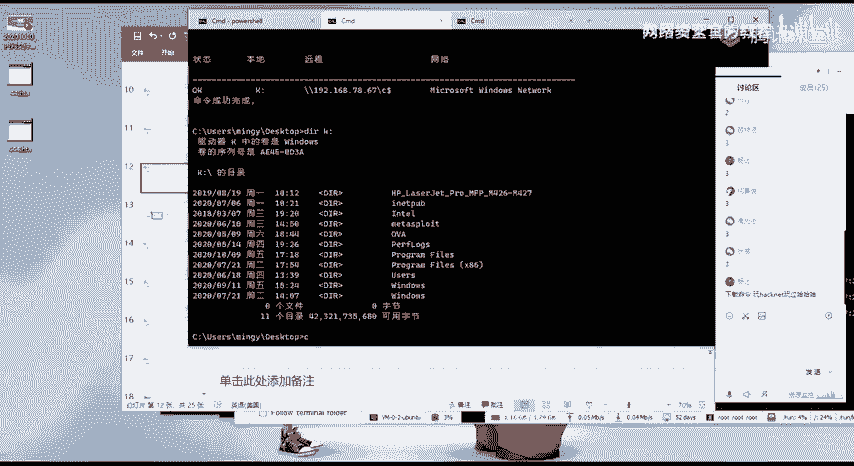
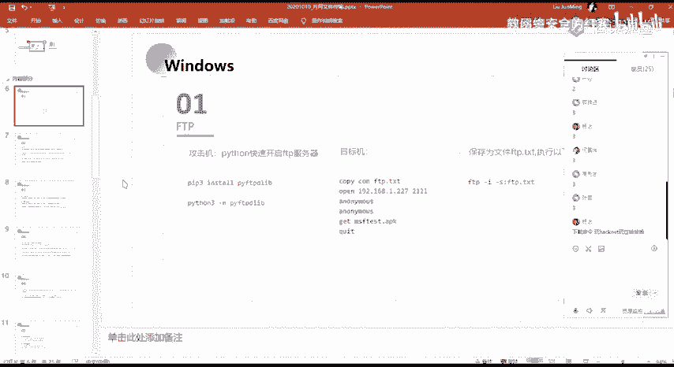

# 网络安全系统教程：P58：内网文件传输方法详解

在本节课中，我们将学习在Windows系统环境下，利用系统自带工具进行内网文件传输的几种核心方法。这些方法在渗透测试和横向移动中至关重要，能够帮助我们在不依赖额外上传工具的情况下，完成文件的上传与下载。

上一节我们介绍了基础的文件操作命令，本节中我们来看看几种专门用于内网文件传输的高级技巧。

## SCP命令传输文件 🚀

SCP（Secure Copy）是一个基于SSH协议的安全文件传输命令。在Windows系统中，如果安装了OpenSSH客户端，同样可以使用SCP命令。它的作用本质上是安全的远程文件复制。

以下是SCP的两种基本用法：

*   **文件上传**：将本地文件复制到远程Linux系统的指定目录。
    *   命令格式：`scp <本地文件路径> <用户名>@<远程IP>:<远程目录路径>`
*   **文件下载**：将远程Linux系统上的文件下载到本地。
    *   命令格式：`scp <用户名>@<远程IP>:<远程文件路径> <本地目录路径>`

实际使用时，我们可以从本地的Windows系统，通过SCP命令连接并操作远程的VPS或Linux服务器。使用 `-r` 参数可以进行递归复制，即复制整个目录及其下的所有文件。

## Windows文件共享传输 📁

Windows文件共享是另一种常见的文件传输方式，它允许我们将远程机器上的共享目录映射到本地，像操作本地磁盘一样进行文件读写。这在信息收集阶段也曾提及。

我们可以使用 `net use` 命令来挂载远程共享目录。

以下是操作步骤：

1.  **映射网络驱动器**：使用命令将远程主机的C盘映射到本地的K盘。
    *   命令示例：`net use K: \\192.168.78.67\C$ /user:<用户名> <密码>`
2.  **访问远程目录**：映射成功后，可以通过 `dir K:` 命令查看远程C盘的内容。
3.  **文件操作**：之后便可像操作本地盘一样，使用 `copy` 等命令进行文件的上传、下载或写入。

在文件资源管理器中，也会出现对应的K盘，其内容即为远程机器的文件。这种方法的前提是**需要知道目标机器的有效账号和密码**。

这里延伸一个高级概念：在渗透测试中，如果我们通过漏洞（例如，利用CS框架获得了一个Shell）获取了目标机器的密码哈希（Hash）或访问令牌（Token），即使不知道明文密码，也可以通过**令牌窃取（Token Theft）** 或**哈希传递（Pass-the-Hash）** 等技术，模拟该用户的身份和权限。这样，我们就能访问该用户有权访问的其他内网机器（如文件共享），实现横向移动。关于令牌的生成、窃取和注入，我们将在后续课程中详细讲解。

## 课程总结 📝

本节课我们一起学习了在Windows内网环境中进行文件传输的两种主要方法：
1.  **SCP命令**：适用于与Linux系统间进行安全的文件传输，支持上传和下载。
2.  **Windows文件共享**：利用 `net use` 命令映射网络驱动器，实现对远程Windows共享目录的便捷文件操作。

这些方法的核心优势在于**利用了操作系统自带的命令行工具**，无需额外上传第三方软件，降低了在受限环境中的操作难度和暴露风险，是内网渗透测试中必备的技能。