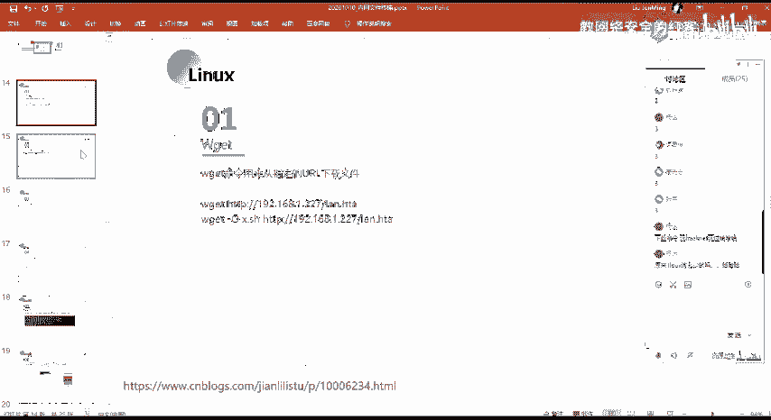
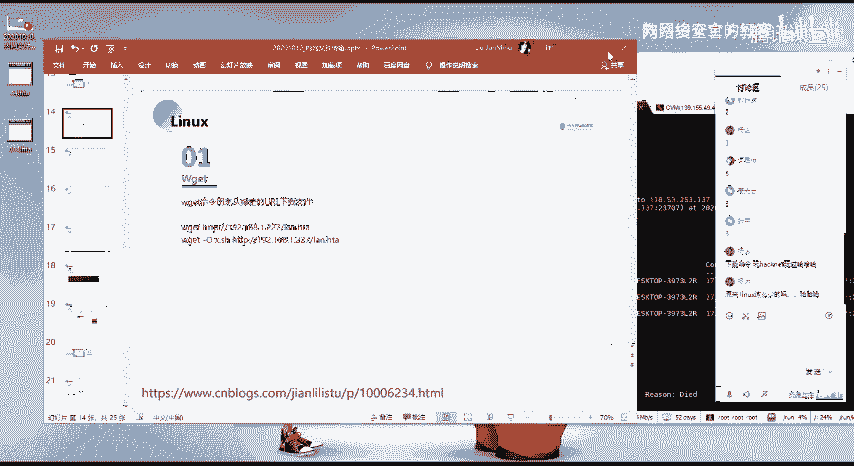
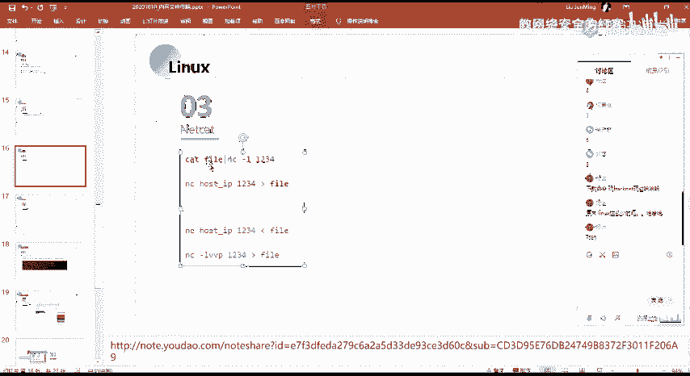
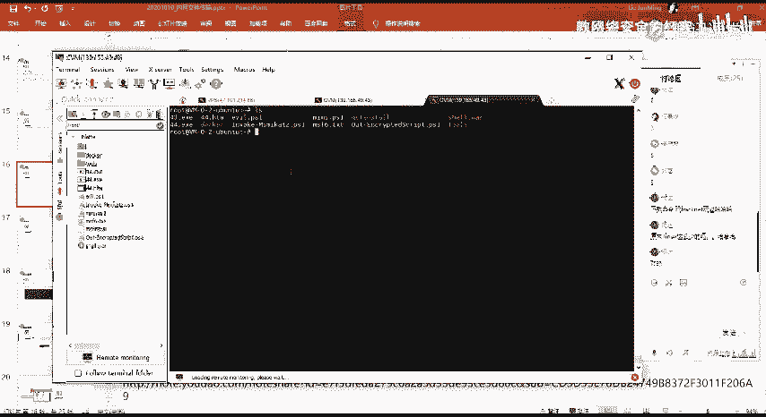
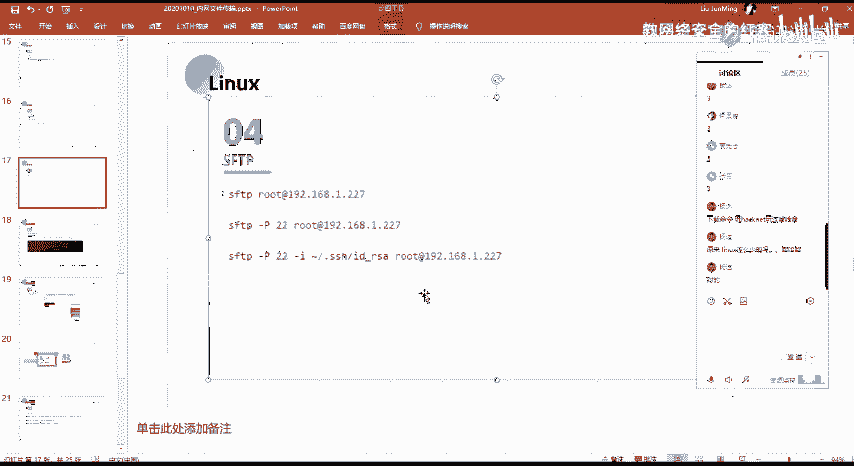

# 网络安全系统教程：P59：46. Linux文件下载命令详解

在本节课中，我们将学习在Linux系统中常用的几种文件下载和传输命令。相比Windows，Linux的命令行工具提供了强大而灵活的文件操作方式。掌握这些命令对于进行渗透测试、漏洞挖掘等网络安全工作至关重要。



上一节我们介绍了SCP上传文件和Windows文件共享，本节中我们来看看在Linux环境下如何高效地下载和传输文件。



## 📥 wget 命令

`wget` 是一个简单且强大的非交互式网络下载器，常用于从网络上下载文件。

以下是 `wget` 命令的基本用法：

*   **基本下载**：通过 `wget` 后接下载链接，可以直接下载资源。
    ```bash
    wget http://example.com/file.zip
    ```
*   **指定输出文件名**：使用 `-O`（大写字母O）参数，可以将下载的文件保存为指定的文件名。
    ```bash
    wget -O myfile.zip http://example.com/file.zip
    ```

`wget` 命令的详细参数和使用方法，请参考课程提供的预习材料。这些内容通过自行阅读和实践即可快速掌握。

## 🌐 curl 命令

`curl` 是一个功能丰富的命令行工具，用于与Web服务器进行数据交互。它支持多种协议，常用于发送HTTP请求。

以下是使用 `curl` 进行文件下载的示例：

*   **下载文件**：`curl` 也可以直接用于下载文件。
    ```bash
    curl -O http://example.com/file.zip
    ```
*   **发送POST请求**：`curl` 可以模拟各种HTTP请求，例如POST请求。
    ```bash
    curl -X POST -d “data=example” http://example.com/api
    ```

`curl` 的功能非常强大，除了下载，它还常用于测试API接口、调试网络问题等场景。

## 🔗 nc (Netcat) 命令



`nc`（Netcat）被誉为网络工具中的“瑞士军刀”，它使用TCP或UDP协议读写网络连接中的数据。它常用于端口监听、反弹Shell，也可以用于文件传输。



以下是使用 `nc` 进行文件传输的原理和示例。其核心在于利用Linux的管道（`|`）和重定向功能。

*   **从发送方传输到接收方**：
    1.  在接收方机器上启动监听，并将接收到的数据保存到文件。
        ```bash
        nc -l 1234 > received_file
        ```
    2.  在发送方机器上，使用 `cat` 命令读取文件，并通过管道传给 `nc` 发送到接收方。
        ```bash
        cat file_to_send | nc 接收方IP 1234
        ```
*   **从接收方拉取发送方的文件**：
    1.  在发送方机器上启动监听，并将文件内容输出到网络。
        ```bash
        cat file_to_send | nc -l 1234
        ```
    2.  在接收方机器上，连接发送方并获取数据。
        ```bash
        nc 发送方IP 1234 > received_file
        ```

简单来说，`cat file` 命令会输出文件内容到标准输出（屏幕），管道符 `|` 将这个输出作为下一个命令 `nc` 的输入，`nc` 则负责通过网络将数据发送出去。在接收端，`nc` 接收数据，并通过重定向符 `>` 将数据写入本地文件。

## 🔐 sftp 命令

`sftp`（SSH File Transfer Protocol）是一种基于SSH协议的安全文件传输工具。它使用与SSH相同的22号端口，提供了加密的文件传输通道。

以下是 `sftp` 连接远程服务器的常用方式：

*   **基本连接**：使用用户名和服务器地址进行连接。
    ```bash
    sftp username@remote_host
    ```
*   **指定端口**：如果SSH服务不在默认的22端口，使用 `-P` 参数指定。
    ```bash
    sftp -P 2222 username@remote_host
    ```
*   **使用密钥登录**：使用 `-i` 参数指定私钥文件路径，进行免密码登录。
    ```bash
    sftp -i /path/to/private_key username@remote_host
    ```

连接成功后，会进入 `sftp>` 交互提示符，可以使用 `get`（下载）、`put`（上传）、`ls`、`cd` 等命令操作文件。



本节课中我们一起学习了Linux下的四种文件下载与传输工具：简单直接的 `wget`、功能强大的 `curl`、网络瑞士军刀 `nc` 以及安全可靠的 `sftp`。理解并熟练运用这些命令，是进行Linux系统管理和网络安全渗透测试的基础技能。