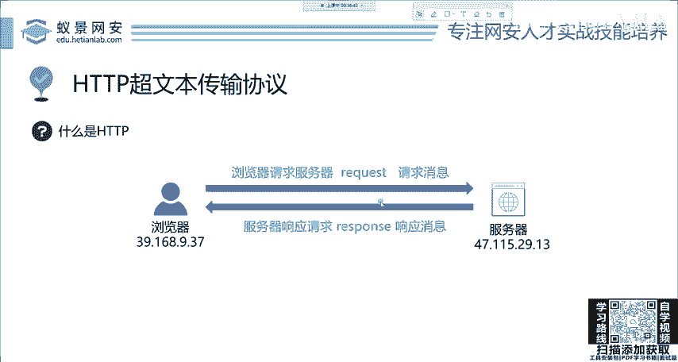
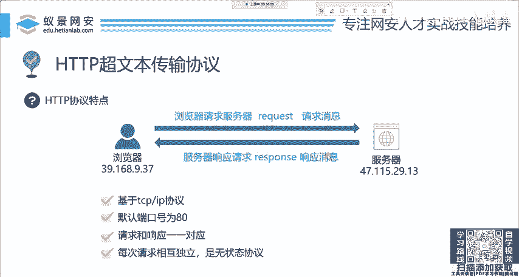

# 网络安全入门：5：HTTP基础-HTTP的特点 🧩

在本节课中，我们将学习HTTP协议的核心特点。理解这些特点是后续深入学习Web安全、渗透测试等技术的基础。

---

上一节我们介绍了HTTP协议的基本概念，本节中我们来看看HTTP协议具体有哪些重要的特点。

首先，HTTP协议是基于TCP的应用层协议。这意味着HTTP依赖于TCP提供的可靠、有序的数据传输服务来工作。

其次，HTTP协议的默认端口号是**80**。这是Web服务器监听客户端请求的标准端口。

```
默认服务地址示例：http://example.com:80
```



当然，服务器管理员可以修改这个端口号，只要新端口未被其他服务占用即可。

---

接下来，我们需要理解HTTP的请求-响应模型。以下是其核心机制：

HTTP协议遵循严格的“请求-响应”模型。客户端发起一个请求（Request），服务器就会返回一个对应的响应（Response）。

*   **一一对应**：不存在一次请求触发多次响应的情况，也不存在合并多次请求为一次响应的情况。每次通信都是独立的“一问一答”。

---

最后，也是HTTP一个非常重要的特性：它是一个**无状态**协议。

每次HTTP请求都是完全独立的，服务器不会记住上一次请求的任何信息。这就像每次对话都是初次见面一样。

```
// 无状态意味着每次请求都需携带完整信息
请求1: GET /pageA  (服务器处理)
请求2: GET /pageB  (服务器不记得请求1)
```

这种设计简化了服务器结构，提高了可靠性，但也带来了不便。例如，用户登录后，如何让服务器知道后续请求来自同一个人？为此，开发者引入了Cookie、Session等技术来“弥补”无状态的缺点，在后续课程中我们会详细讲解。



---

本节课中我们一起学习了HTTP协议的四个基本特点：基于TCP、默认端口80、请求响应一一对应以及无状态。理解这些特点是分析Web应用和挖掘安全漏洞的第一步。