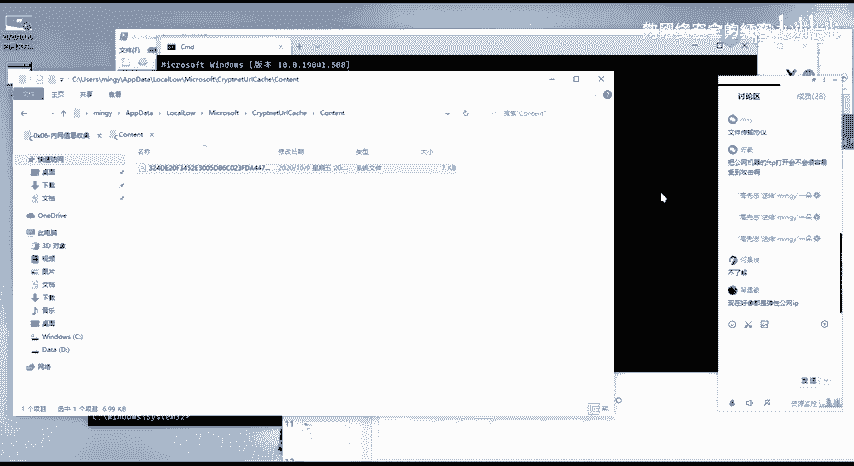
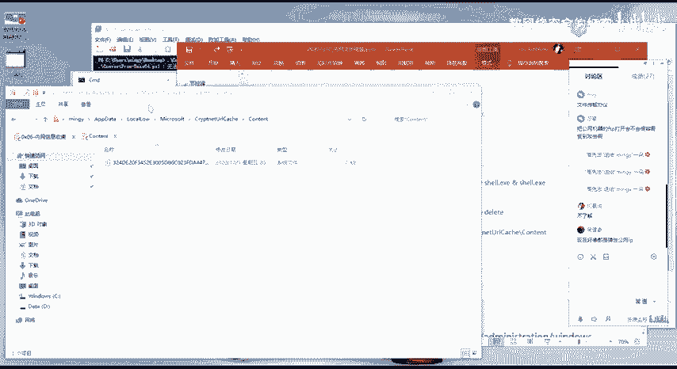
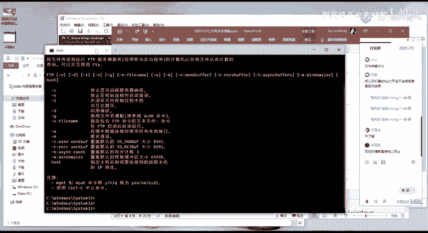
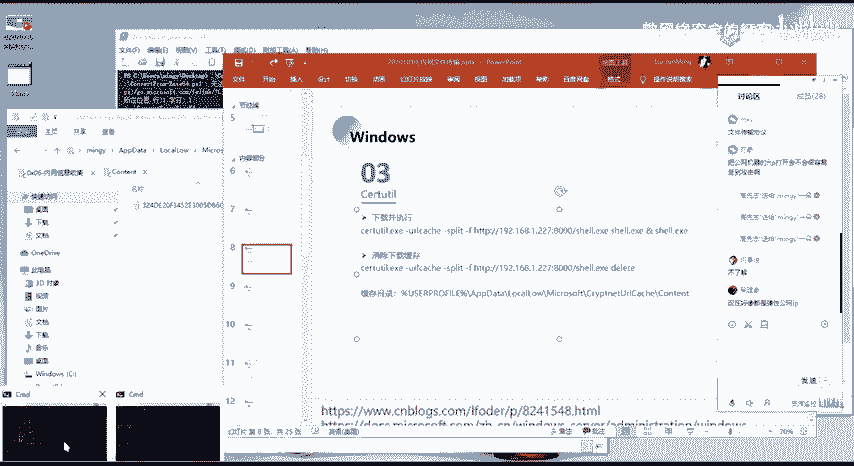
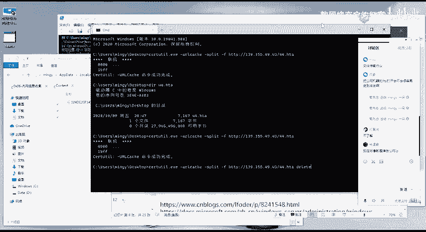
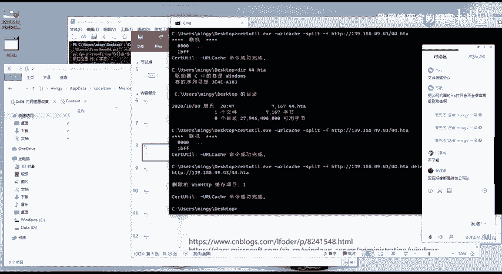
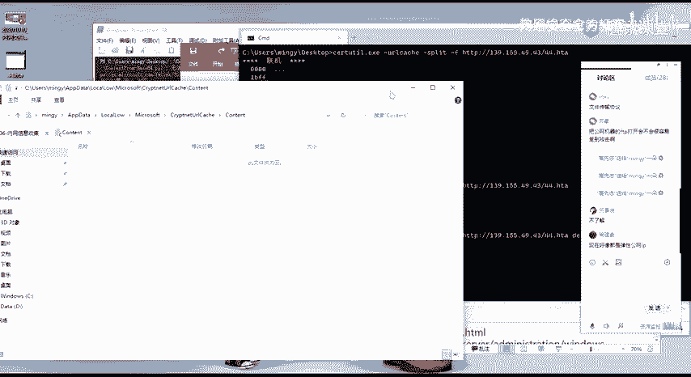
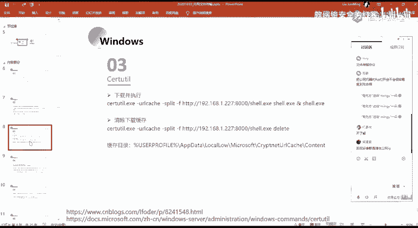

# 网络安全系统教程：P61：48. 脚本语言上传文件

## 概述
在本节课中，我们将学习在渗透测试或漏洞利用过程中，如何清除服务器上的操作痕迹。具体来说，我们将了解为何需要清除缓存文件，以及如何使用特定的命令来删除这些可能暴露我们所用木马或攻击方法的缓存记录。

---

上一节我们介绍了文件上传与脚本执行的基本方法。本节中，我们来看看如何在上传并执行脚本后，安全地清除留下的痕迹。

执行完脚本后，我们需要执行一个命令来清除缓存。清除缓存的目的，是为了隐藏我们使用了何种木马，以及使用了何种方法进行攻击。

因为缓存文件记录了我们所使用木马的内容。在渗透测试之后，管理员进行溯源等操作时，他可以在该目录中查找我们使用过的木马。

管理员可以对该文件进行分析。

我们可以通过一个命令来把这个缓存清除掉。

清除的命令很简单，就是在该命令后面添加一个 `DELETE` 参数。`DELETE` 就是删除的意思。

执行该命令后，原本目录下存在的缓存文件现在已经没有了，痕迹已被清除。

这是第三个步骤。

---

## 总结
本节课中，我们一起学习了渗透测试后期的一个重要环节——痕迹清除。我们了解到缓存文件可能记录攻击所用的木马信息，并学习了使用带 `DELETE` 参数的特定命令来清除这些缓存，从而避免在管理员溯源时暴露攻击行为。这是维护攻击隐蔽性的关键一步。