# 网络安全系统教程：P64：Socks代理简介 🚀

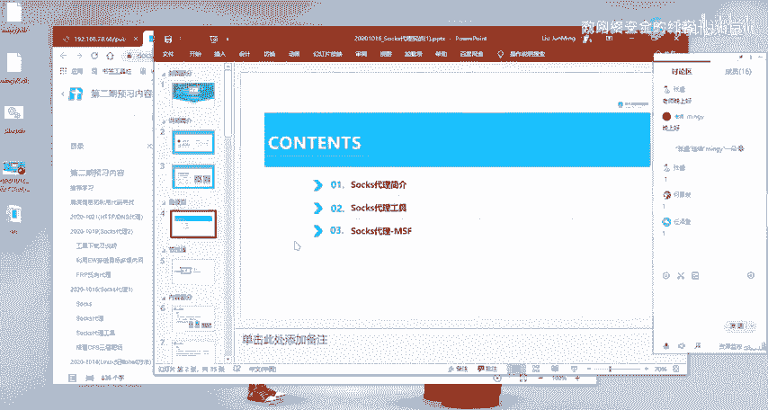

在本节课中，我们将要学习Socks代理的基本概念、常用工具以及一个初步的实战演示。Socks代理是内网穿透技术中的关键一环，掌握它对于理解后续的渗透测试和横向移动至关重要。

上一节我们介绍了内网穿透的基本思路，本节中我们来看看如何利用Socks代理这一具体技术来实现目标。

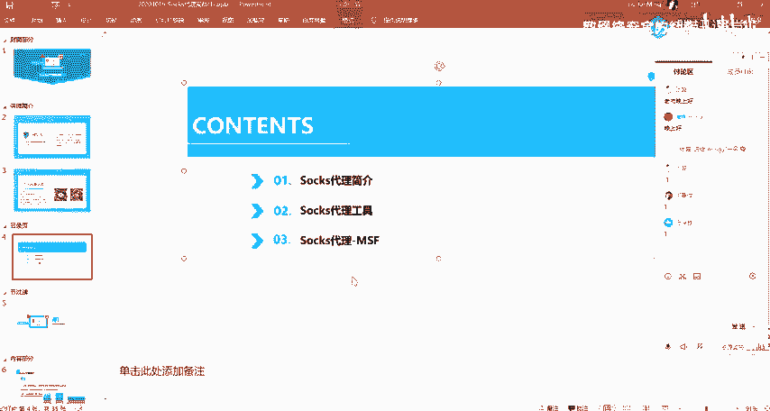

## 什么是Socks代理？ 🤔

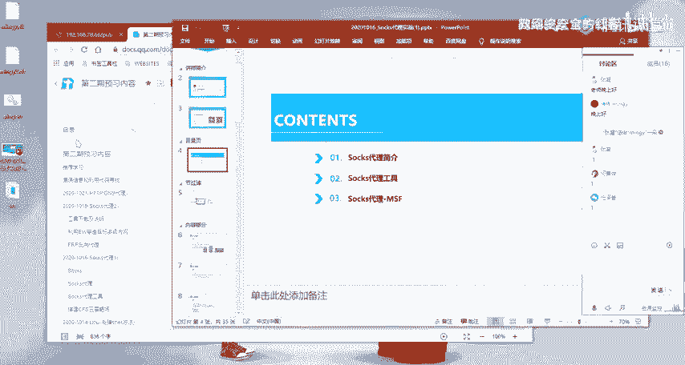

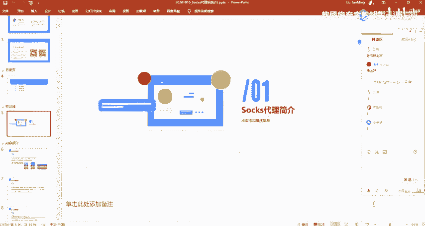

Socks是一种网络传输协议，主要用于在客户端与外网服务器之间充当通信的中间传递角色。它相当于在内网客户端和外网服务器之间建立了一条数据传输通道。

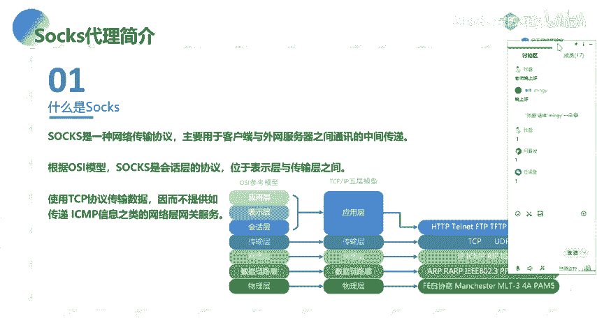

根据OSI七层模型或TCP/IP五层模型，Socks会话协议位于表示层和传输层之间。它使用TCP协议来传输数据。

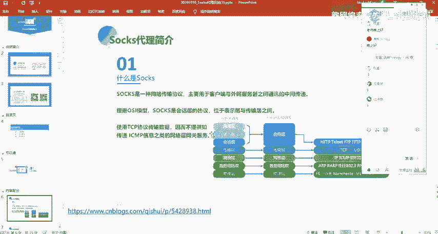

需要特别注意的一点是，Socks协议不提供传递ICMP信息这类网络层网关的服务。ICMP协议（例如我们常用的`ping`命令）位于网络层，而Socks工作在更高层并通过TCP/IP传输数据。因此，在后续使用Socks通道时，**无法直接通过`ping`命令来探测内网其他主机的存活状态**。

## 为什么使用Socks代理？ 🛡️

在现代网络架构中，内部网络与外部网络之间通常存在隔离，例如通过防火墙设备。防火墙会限制外部网络直接访问内部资源，同时也可能管控内部网络访问外部的协议和方法。

防火墙通常以应用层网关的形式工作，可以对HTTP、FTP、SMTP等协议的访问进行控制。Socks代理则提供了一个框架，使得这些受限制的协议能够安全、透明地穿过防火墙，从而实现受控的内外网通信。

## Socks代理版本简介 🔄

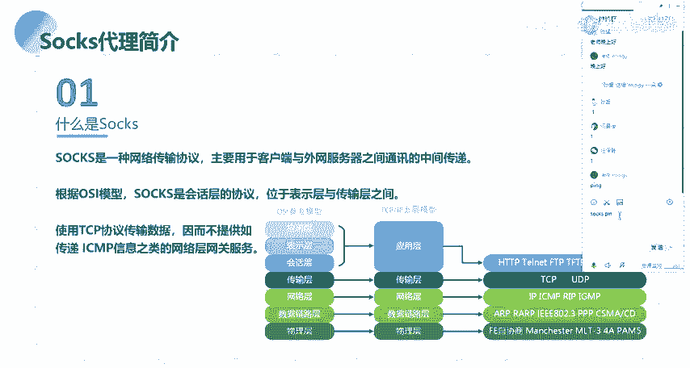

以下是Socks4与Socks5两个主要版本的特点和区别：

*   **Socks4**： 它是HTTP代理协议的增强，不仅代理HTTP协议，而是代理所有向外的连接。它没有协议鉴别性。
*   **Socks5**： 它是Socks4的扩展版本，主要增加了对UDP协议的支持以及身份验证机制。同时，Socks5采用了更完善的地址解析方案，支持域名和IPv6地址的解析。

在使用Socks代理时，需要明确以下三点信息：
1.  **Socks服务器的IP地址**： 即代理服务器所在的地址。
2.  **Socks服务器的端口**： 通常默认端口是**1080**。
3.  **身份验证需求**： 需要确认连接Socks服务是否需要用户名和密码（特别是Socks5协议）。

## 常用Socks代理工具 🛠️

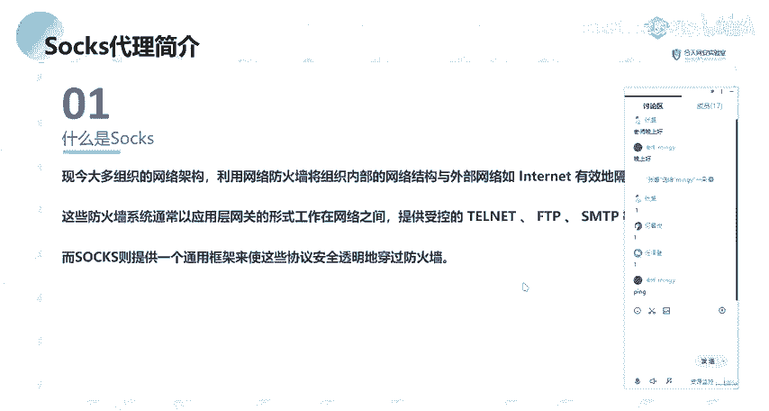

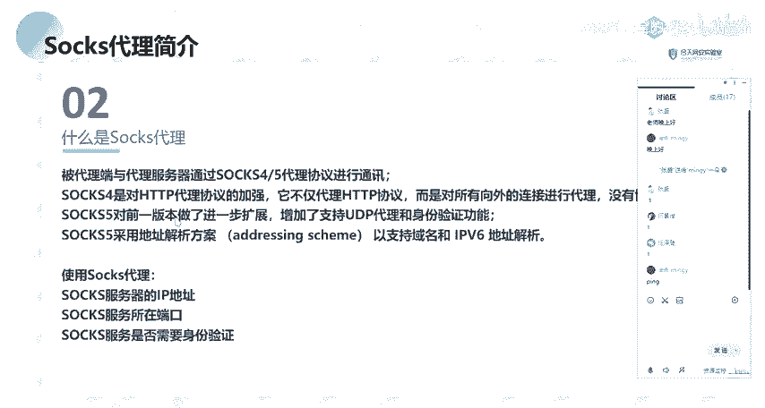

在实战中，我们会用到多种工具来建立Socks代理通道。以下是部分常用工具简介，我们将在后续课程中具体演示其用法：
*   **Metasploit Framework (MSF)**： 功能强大的渗透测试框架，内置了创建Socks代理的模块。
*   **EarthWorm (EW)**： 一款轻量级、功能强大的网络穿透工具。
*   **reGeorg**： 利用Web服务器（如通过上传特定脚本）建立Socks代理的工具。
*   **Proxifier / Proxychains**： 代理客户端配置工具，用于将应用程序的流量导向我们建立的Socks代理。

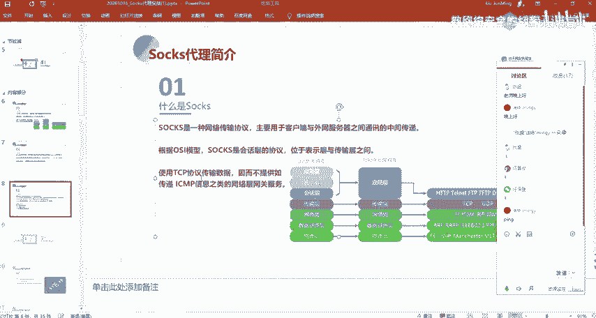

## Socks代理实战演示（MSF初步） ⚔️

本节课我们将通过Metasploit Framework (MSF)来演示一个简单的Socks代理建立过程。请注意，这只是一个初步演示，更复杂的环境和工具使用将在下节课展开。

（*实战演示部分通常涉及具体操作步骤，例如在MSF中搜索`socks`模块、设置参数、执行等。由于原视频内容在此处主要为概念讲解，具体操作步骤未详细展开，因此教程中保留此节标题，明确本节课的实战环节定位。*）

当我们无法使用MSF时，就需要掌握其他代理工具进行内网穿透，这将是下节课的重点内容。

---

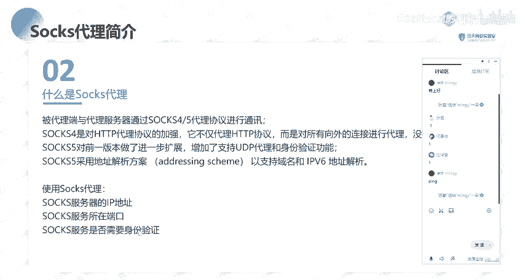

本节课中我们一起学习了Socks代理的核心概念。我们了解了Socks协议的工作原理、它相较于传统代理的优势、以及Socks4和Socks5版本的区别。同时，我们也明确了使用Socks代理必须掌握的三个关键信息：服务器IP、端口和认证方式。最后，我们预览了常用的Socks工具，并明确了本节课通过MSF进行初步实战演示的定位。理解这些基础知识，是后续深入进行内网渗透测试的坚实第一步。