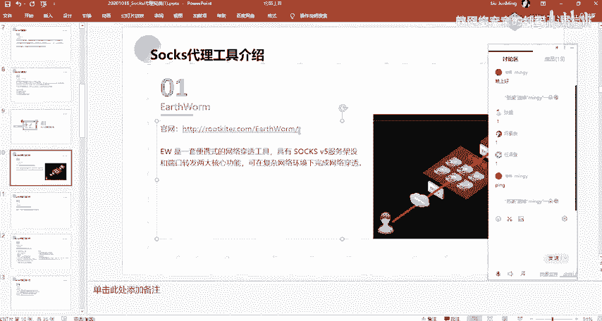
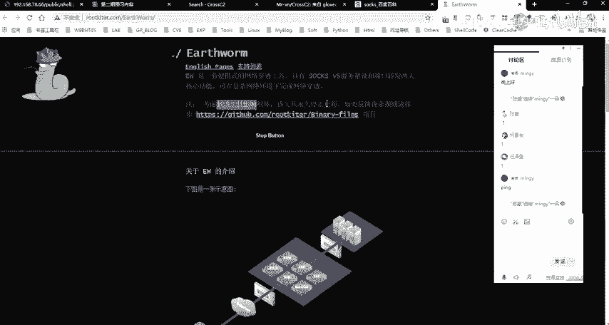
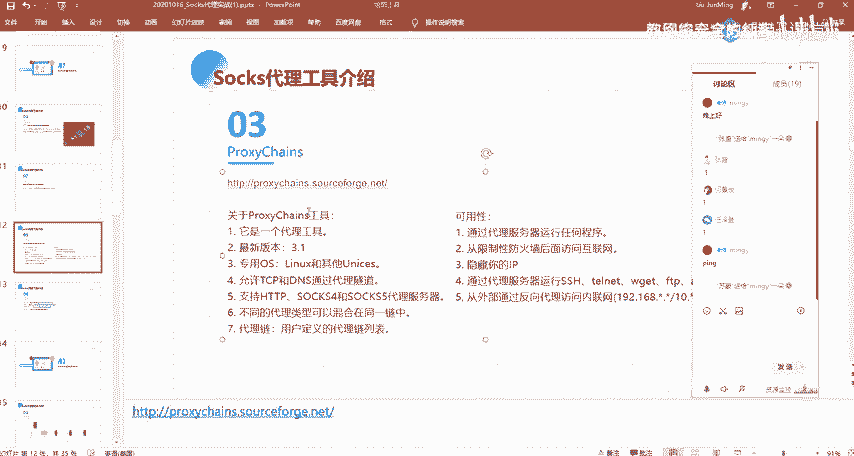
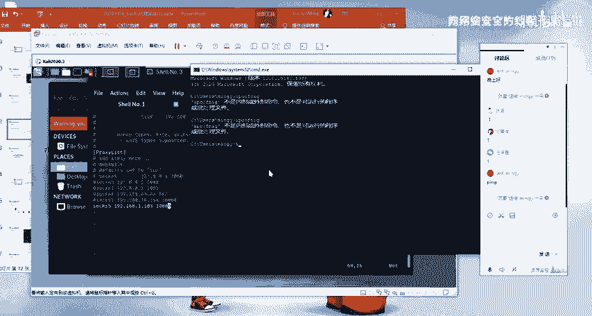
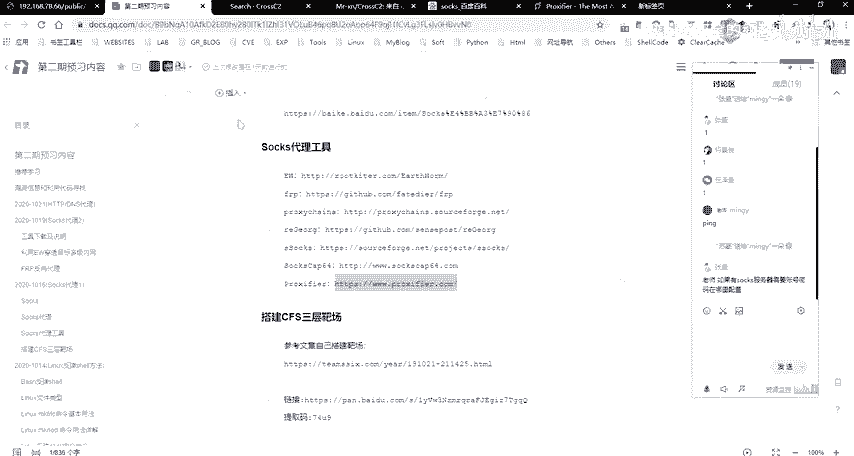
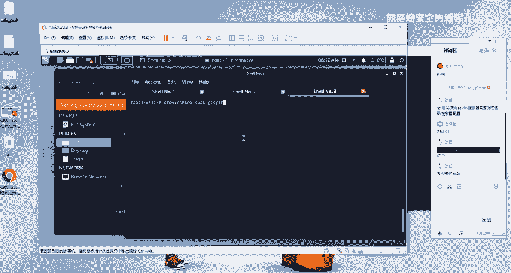
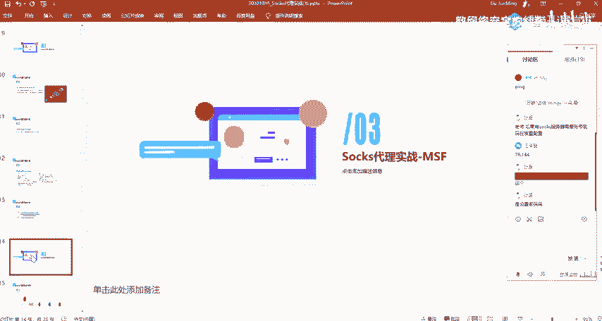

# 网络安全系统教程：P65：Socks代理工具 🛠️

在本节课中，我们将学习几种常用的Socks代理工具。这些工具对于内网穿透、流量转发和匿名访问至关重要，是渗透测试和网络安全工作中的常用手段。

## 概述

上一节我们介绍了代理的基本概念。本节中，我们来看看几种具体的Socks代理工具，包括它们的功能、特点和使用场景。

## Socks代理工具介绍

以下是几种常见的Socks代理工具。

### 1. Earthworm (EW)

Earthworm（EW）是一个比较老但功能强大的便携式网络穿透工具。它的主要作用是进行内网穿透。该工具具备架设Socks5服务器和进行端口转发的功能。这意味着我们可以通过EW工具建立Socks5服务器，创建Socks5代理通道，并进行端口转发。

其官网地址可供参考，但该工具已停止更新。在提供的工具包中应该包含此工具。如果没有，可以在群内索取或自行在网络上查找。

### 2. FRP

FRP是一个用于内网穿透的高性能反向代理应用。在后续课程中，当MSF（Metas攻击框架）不适用时，我们会介绍如何使用FRP、EW等代理工具进行内网穿透。我个人比较喜欢使用这个工具，因为它的功能和配置都比较好用。

### 3. Proxychains

Proxychains是另一个我们经常使用的工具。在Linux系统中，我们通常使用Proxychains来配置代理。

例如，假设我有一台位于国内的Kali Linux机器，想要访问国外网站，就需要配置代理（如VPN）。这时就可以使用Proxychains这类工具。

配置方法通常如下：首先指定代理类型（如Socks5或Socks4），然后填写代理服务器的IP地址和端口号。例如，一个基本的配置格式是：
`socks5 192.168.1.100 1080`

如果代理服务器需要认证，在某些工具（如MSF或Proxychains的某些版本）中可能不支持直接配置用户名和密码。对于Windows系统，我推荐使用一个名为“SocksCap”的全局代理工具。它可以将本机的应用程序流量导入配置好的代理通道中。

使用Proxychains后，我们可以让Kali Linux中的工具（如Nmap）的扫描流量通过代理通道，从而访问目标内网进行扫描。其他工具如IEGOG（将在讲解HTTP代理时介绍）以及另外两个与前述类似的Socks代理工具也值得尝试。

## 总结

本节课我们一起学习了三种主要的Socks代理工具：Earthworm (EW)、FRP和Proxychains。我们了解了它们各自的特点和基本用途，为后续在实际渗透测试中应用内网穿透技术打下了基础。