# 网络安全系统教程：P66：53.内网渗透场景流程 🎯

在本节课中，我们将学习内网渗透的基本场景与流程。我们将以一个具体的靶场环境为例，理解如何从外网突破到内网，并利用跳板机对内网其他主机进行渗透。

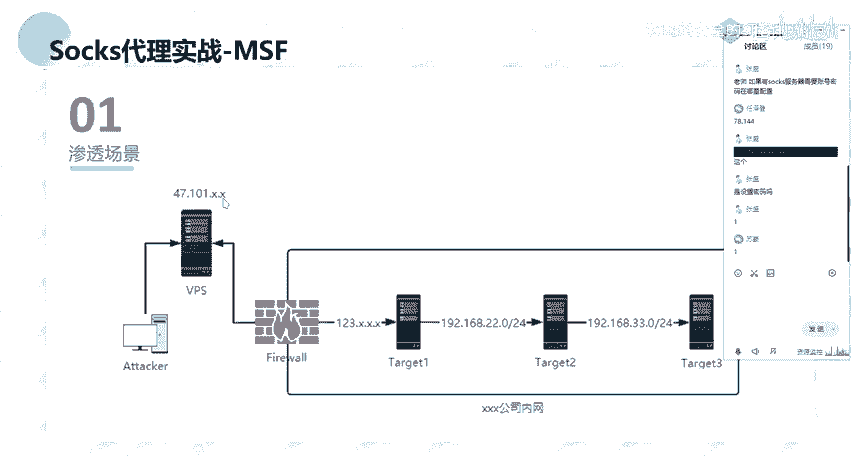

## 概述

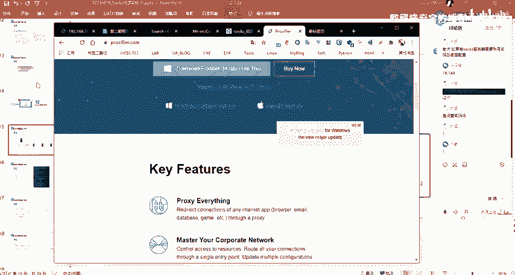

上一节我们介绍了代理与端口转发的基础知识。本节中，我们来看看一个典型的内网渗透实战场景。我们将使用一个预先搭建好的多层内网靶场，模拟攻击者从外网进入公司内网，并逐步深入的过程。

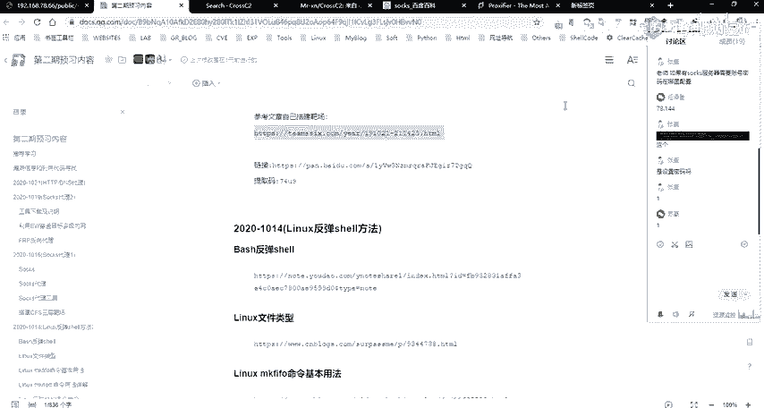

## 靶场环境介绍

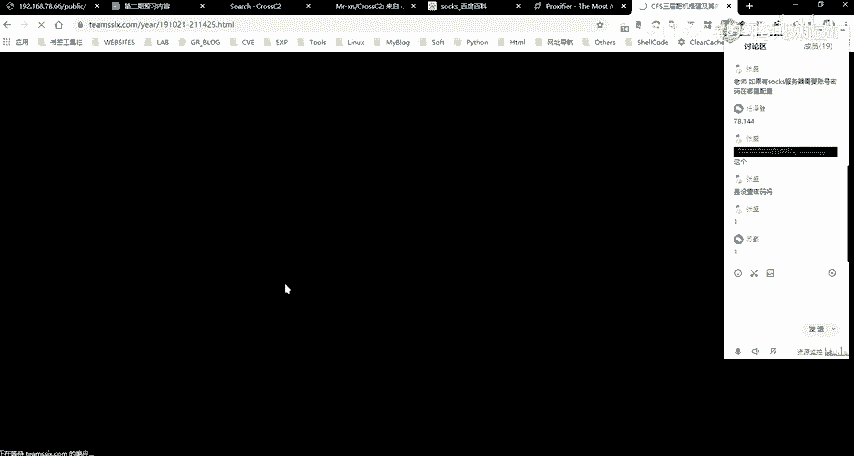

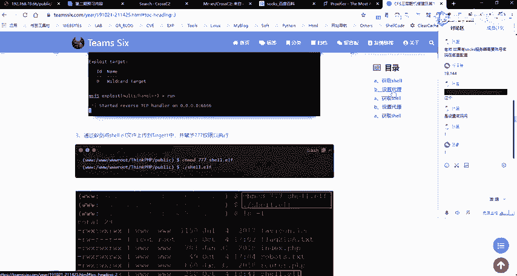

我们使用的靶场是由“CFS”团队搭建的一个三层网络靶场。这个环境已经预先配置好，便于我们直接进行学习和实践，无需自己手动搭建复杂的网络环境。

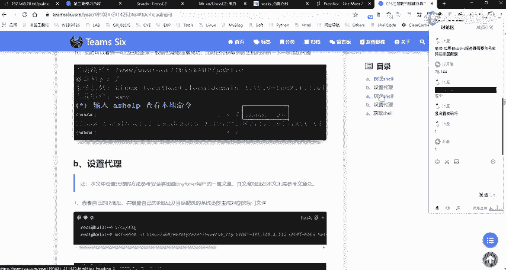

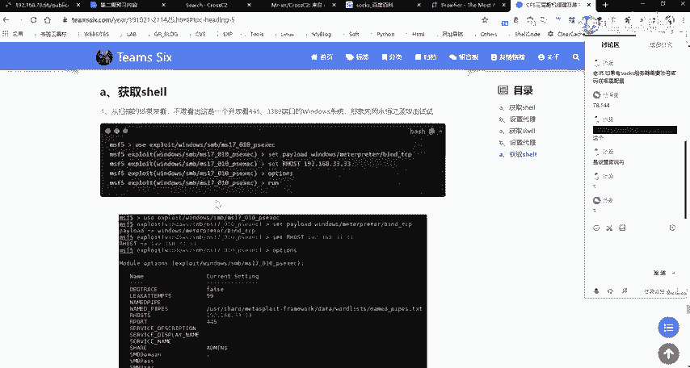

以下是关于该靶场的一些关键信息：
*   **来源**：由“CFS”团队搭建并提供。
*   **用途**：非常适合用于讲解和理解内网穿透技术。
*   **优势**：环境已集成，节省自行搭建时间，方便学习者复现和练习。
*   **学习建议**：课程中我将演示主要流程，但建议大家课后将此靶场作为作业，亲手操作一遍，以加深理解。

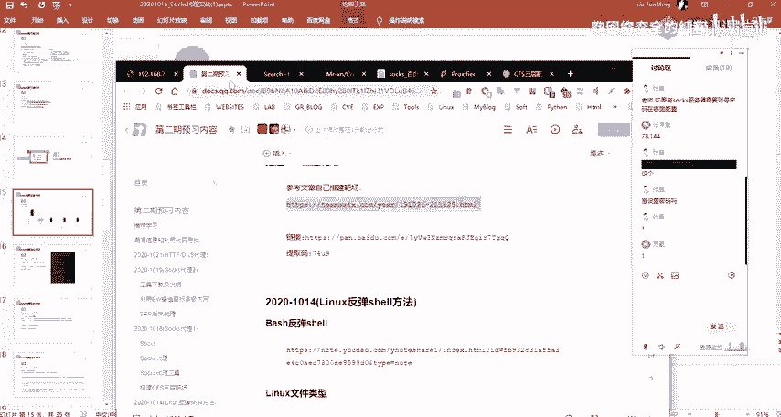

靶场的详细搭建步骤和攻击方法，作者在其文档中已有说明。我们的重点是理解整个渗透的逻辑和流程。

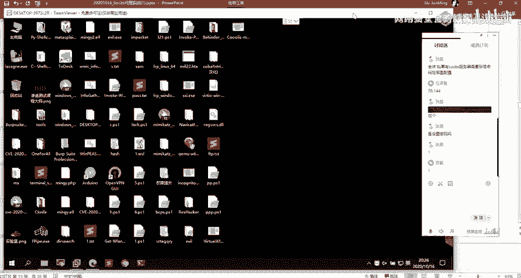

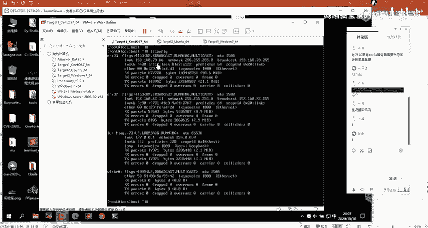

## 实验环境配置

我的实验环境运行在虚拟机中，包含三台主要机器，模拟了不同的网络区域：
*   **攻击机 (Attacker)**： 位于外网，用于发起攻击。
*   **VPS (虚拟专用服务器)**： 位于公网，在某些场景下可作为流量中转。
*   **靶场网络**： 模拟某公司内网，包含三台主机。

在实际攻击公网目标时，通常需要一个公网VPS来接收反弹Shell，因为我们的攻击机可能位于内网，无法直接被外网目标连接。为了简化演示和理解，本次课程中我们暂不深入使用VPS中转的复杂场景，而是聚焦于核心的内网穿透思路。

## 渗透场景详解

现在，让我们详细分析本次课程要模拟的渗透场景。整个网络结构可以理解为以下几个部分：

1.  **公网区域**： 包含我们的攻击机和VPS。我们已知一个公网IP目标（即靶场的入口点）。
2.  **公司网络边界**： 通常存在防火墙，划分出DMZ（隔离区）和内部网络。
3.  **靶场内网**： 分为两层子网。
    *   **第一层 (Target 1)**： 这是公司对外提供服务的服务器（例如Web服务器），拥有公网IP，处于DMZ区。它既是外网可访问的入口，也是内网的一部分。
    *   **第二层 (Target 2 & Target 3)**： 这是纯粹的内网主机，位于公司内部网络，外网无法直接访问。

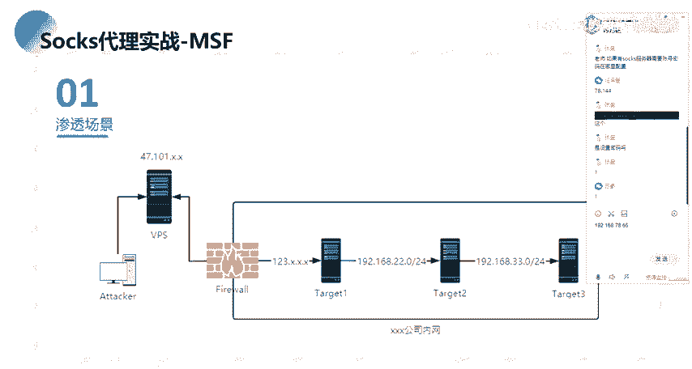

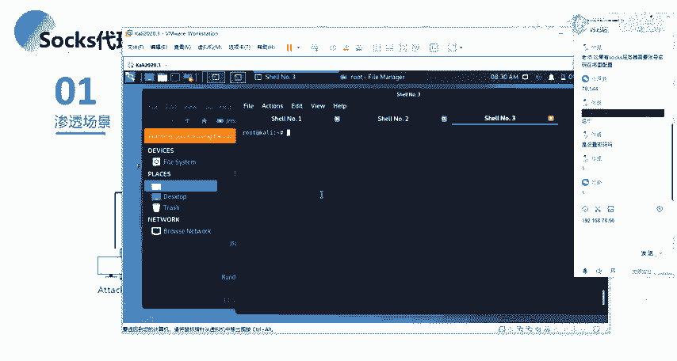

它们之间的网络关系可以概括为：
*   `Attacker/VPS` <-> `Target 1` (公网可达)
*   `Target 1` <-> `Target 2` (内网可达，例如 `192.168.22.0/24` 网段)
*   `Target 2` <-> `Target 3` (更深层内网，例如 `192.168.33.0/24` 网段)

## 渗透核心流程

我们的攻击目标非常明确：**穿透多层内网**。以下是达成此目标的核心步骤：

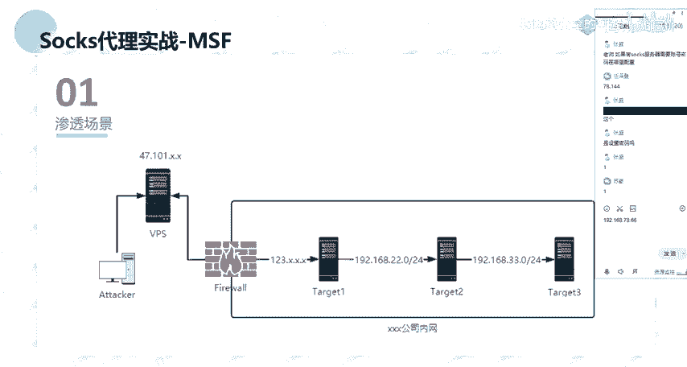

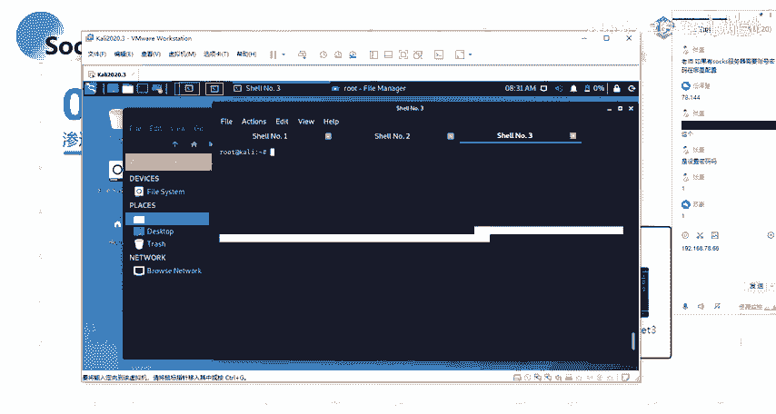

1.  **外网突破**： 首先，我们需要在公网目标 `Target 1` 上寻找漏洞（例如Web应用漏洞、服务漏洞等），并利用该漏洞获取它的控制权（即拿到一个Shell）。
2.  **建立跳板**： 成功控制 `Target 1` 后，这台主机就成为了我们的“跳板机”或“立足点”。
3.  **内网探测**： 以 `Target 1` 为基地，开始探测其所在内网 (`192.168.22.0/24`) 的其他存活主机和开放服务。
4.  **横向移动**： 利用内网协议（如SMB、WMI等）、密码复用、漏洞等手段，尝试攻陷同一网段的主机 `Target 2`。
5.  **深度渗透**： 控制 `Target 2` 后，将其作为新的跳板，继续向更内层的网络 (`192.168.33.0/24`) 进行探测和攻击，最终目标是控制 `Target 3`。

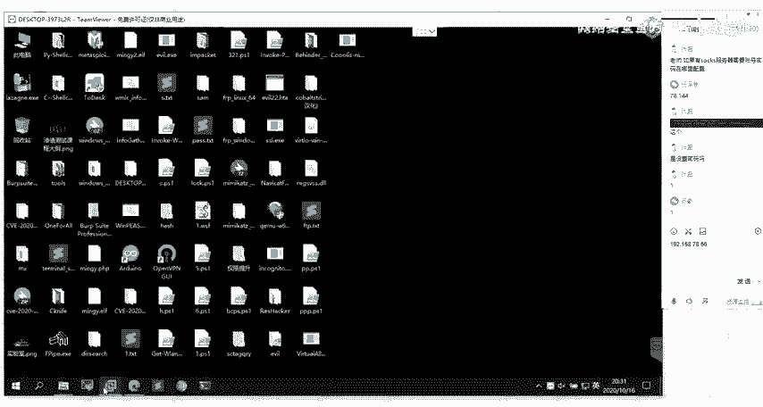

这个过程形象地展示了攻击者如何由外至内、层层递进地突破网络边界。

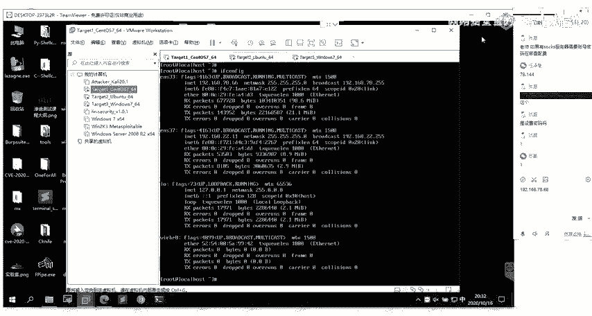

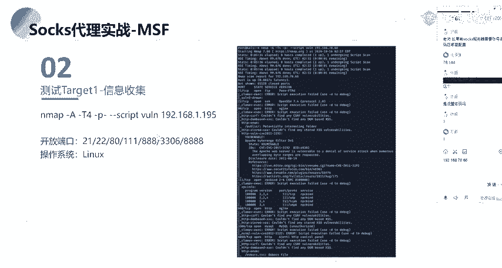

## 总结

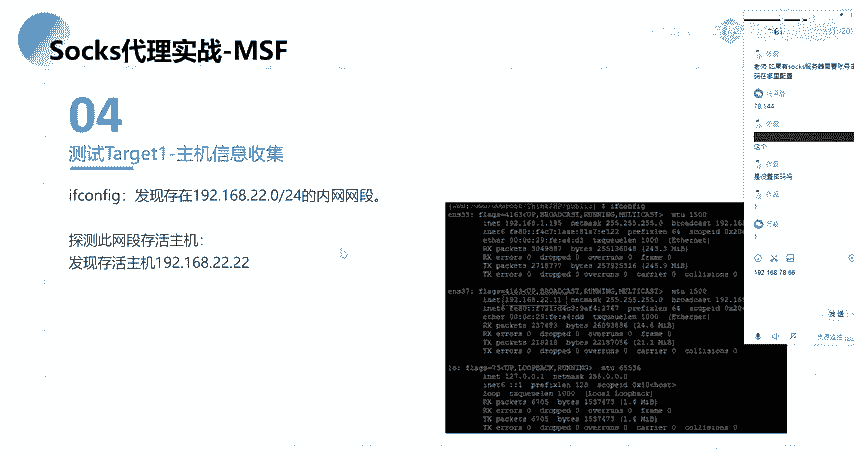

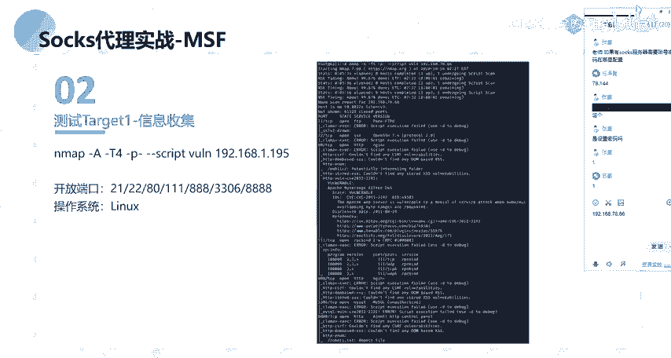

本节课中我们一起学习了内网渗透的标准场景与流程。我们介绍了一个三层内网靶场环境，并明确了攻击路径：从外网公服服务器 (`Target 1`) 切入，将其作为跳板，逐步向内网深处 (`Target 2`, `Target 3`) 横向移动。这个“突破边界 -> 建立跳板 -> 横向移动”的循环，是内网渗透的核心思想。在接下来的课程中，我们将进入实战操作环节，一步步演示如何利用工具实现上述流程。