# 网络安全系统教程：P67：54.信息收集 🎯

## 概述
在本节课中，我们将学习网络安全渗透测试的第一步——信息收集。我们将以一个已知的IP地址为例，详细讲解如何对其进行初步的侦察，重点是端口扫描的概念、工具使用以及后续的分析思路。

---

## 端口扫描：进入计算机的“门”

上一节我们提到了信息收集的重要性，本节中我们来看看具体如何对一个IP地址进行侦察。当你获得一个目标IP地址，无论是内网还是外网，第一步通常是对其进行端口扫描。

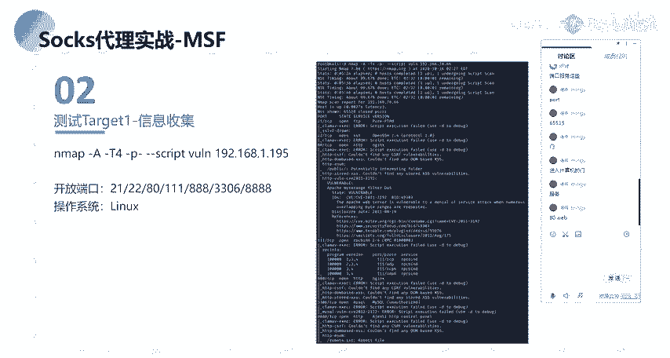

端口可以理解为进入计算机的“门”。一台计算机有65535个端口，每个开放的端口背后都运行着一个特定的服务。了解目标开放了哪些端口，就等于知道了有哪些“门”可以进入，以及门后运行着什么服务。

例如，**80端口**通常对应Web服务。当我们访问一个IP地址时，浏览器默认访问的就是80端口。如果目标服务器开放了**8080端口**，并且运行着Tomcat服务，那么我们就需要通过 `IP:8080` 这样的格式来访问该服务。

因此，信息收集的核心任务之一就是探测目标IP开放了哪些端口，进而识别出这些端口对应的服务，为后续的漏洞挖掘和攻击提供切入点。

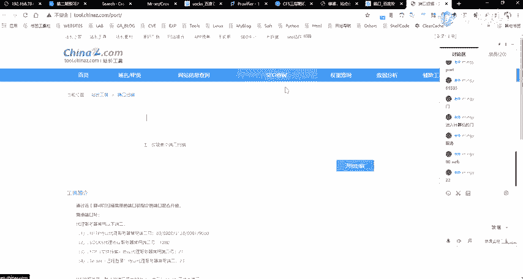

---

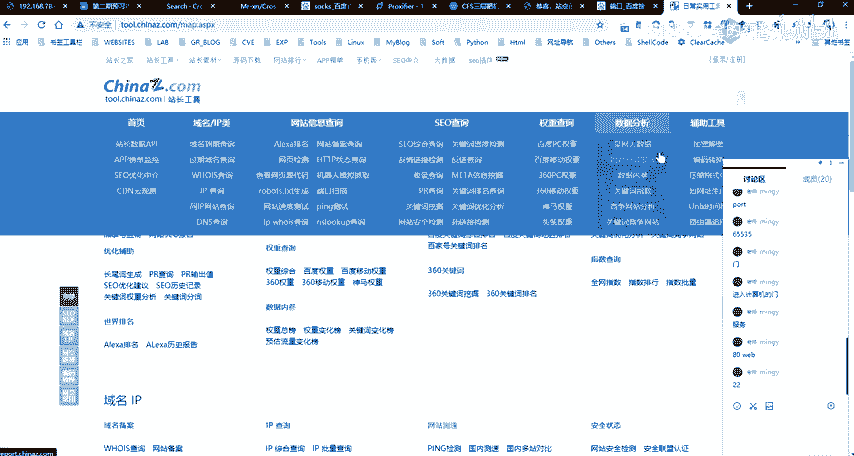

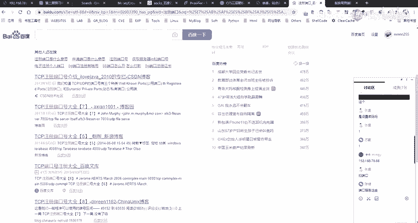

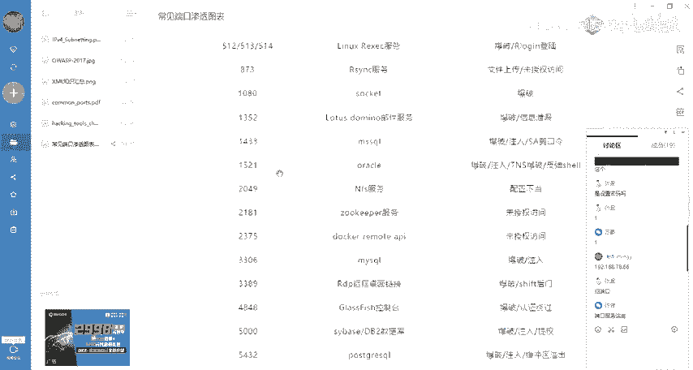

## 常见端口与服务对应关系

以下是网络安全中一些常见的端口号及其默认对应的服务，了解这些有助于我们有针对性地进行测试和攻击。

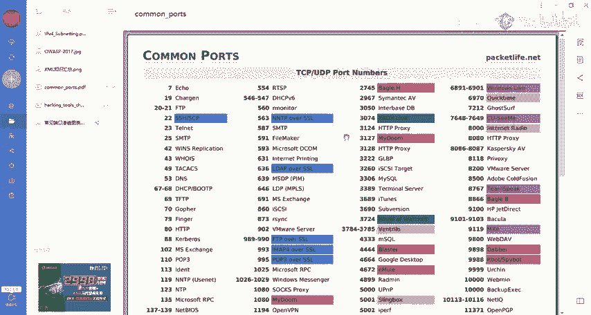

*   **21端口**：FTP（文件传输协议）服务。可能存在弱口令爆破、匿名访问等漏洞。
*   **22端口**：SSH（安全外壳协议）服务。常见攻击方式包括口令爆破和OpenSSH相关漏洞利用。
*   **53端口**：DNS（域名系统）服务。可能涉及DNS劫持、域传送漏洞等。
*   **80/443端口**：HTTP/HTTPS（Web）服务。这是漏洞挖掘的主要战场，包括SQL注入、XSS、文件上传、命令执行等。
*   **3306端口**：MySQL数据库服务。常见攻击为SQL注入攻击。
*   **3389端口**：Windows远程桌面（RDP）服务。常见攻击为弱口令爆破。
*   **7001端口**：WebLogic应用服务器。存在多种反序列化等历史漏洞。

---


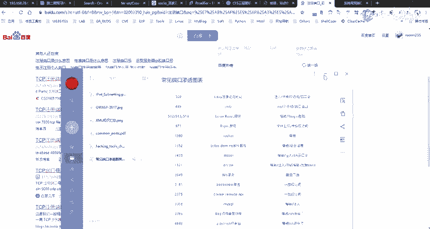

## 端口扫描工具：Nmap与Masscan

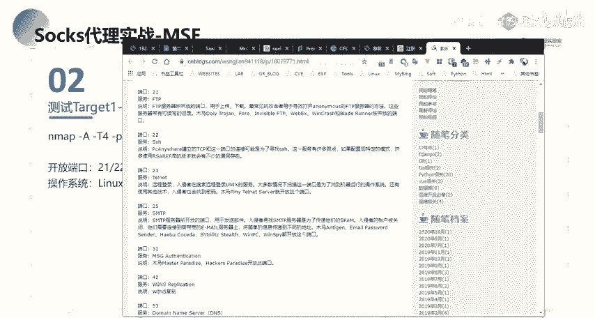

探测端口需要使用专门的工具。在网络安全领域，最著名的两款端口扫描工具是 **Nmap** 和 **Masscan**。

*   **Masscan**：特点是扫描速度极快，适合在需要快速获取目标开放端口概况时使用。
*   **Nmap**：特点是扫描结果非常详细和强大。它不仅能探测端口开放状态，还能识别服务版本、操作系统，甚至利用内置脚本（NSE）进行基本的漏洞检测。

通常，我们会结合使用这两个工具：先用Masscan进行快速扫描，定位开放的端口；再针对这些开放的端口，使用Nmap进行深入、详细的信息收集。

以下是一个使用Nmap进行综合扫描的示例命令：
```bash
nmap -A -T4 -p- --script=http-enum 192.168.1.1
```
*   `-A`：启用操作系统检测、版本检测、脚本扫描和路由追踪。
*   `-T4`：指定扫描速度（0-5级），数字越大速度越快，但可能影响准确性。
*   `-p-`：扫描所有端口（1-65535）。默认情况下，Nmap只扫描最常见的1000个端口。
*   `--script=http-enum`：调用`http-enum`脚本，用于枚举Web服务的常见目录。
*   `192.168.1.1`：目标IP地址。

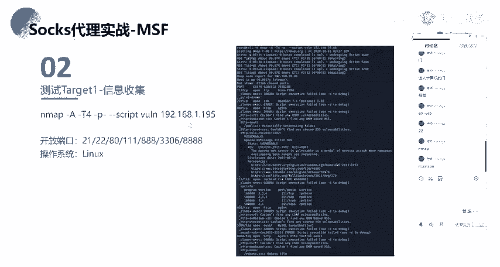

执行该命令后，我们可以获得目标IP的端口开放列表、服务版本信息，甚至可能发现一些Web目录结构。

---

## 针对Web服务的深入信息收集

通过扫描，我们发现目标IP开放了80端口，访问后仅显示一个默认页面（如Apache/IIS的欢迎页），没有其他明显内容。

面对这样一个“简单”的Web服务，我们下一步应该做什么？这是渗透测试中一个关键的问题。单纯的默认页面并不意味着安全，我们需要进行更深入的信息收集。

常见的下一步操作包括：
1.  **目录/文件枚举**：使用工具（如`dirb`, `gobuster`）或Nmap脚本，暴力探测网站是否存在隐藏的目录、备份文件（如`index.php.bak`）、配置文件等。
2.  **子域名探测**：查找该IP或关联域名下的其他子域名，扩大攻击面。
3.  **Web技术指纹识别**：识别网站使用的编程语言（如PHP/Java/Python）、框架（如ThinkPHP/Spring）、中间件（如Nginx/Apache/Tomcat）及其具体版本，寻找已知漏洞。
4.  **关联信息搜索**：在互联网上搜索与该IP、域名相关的信息，如GitHub代码泄露、历史漏洞报告、员工信息等。

这些深入的侦察工作，往往能发现那些表面之下容易被忽视的攻击入口。

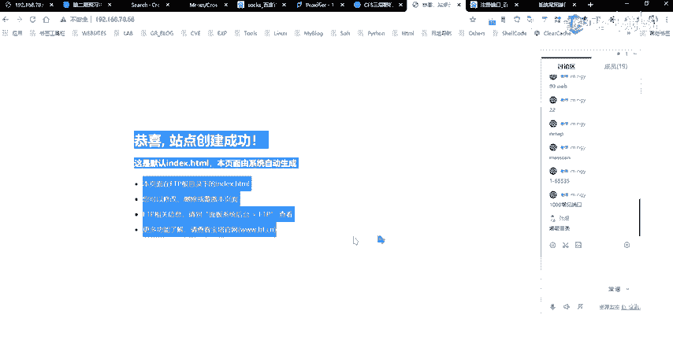

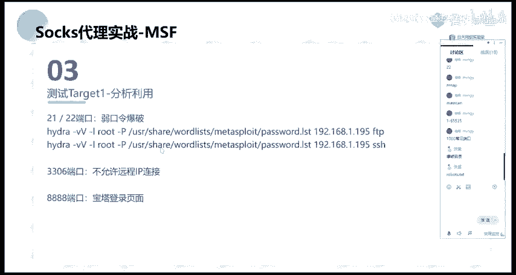

---


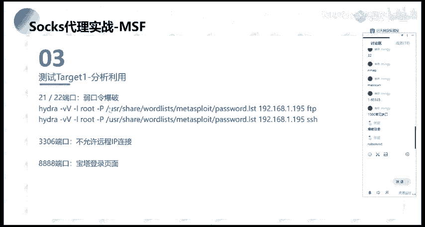

## 总结
本节课中，我们一起学习了信息收集阶段的核心——端口扫描。
我们首先将端口比喻为计算机的“门”，理解了扫描端口的意义。
接着，我们回顾了常见端口与服务的对应关系，并介绍了`Nmap`和`Masscan`这两款核心扫描工具及其基本用法。
最后，我们以一个开放的Web服务为例，探讨了在发现表面“简单”的目标后，应如何开展更深入的信息收集工作，为后续的渗透测试打下坚实基础。
记住，充分的信息收集是成功渗透的一半。