# 网络安全系统教程：P69：56.收集服务器信息

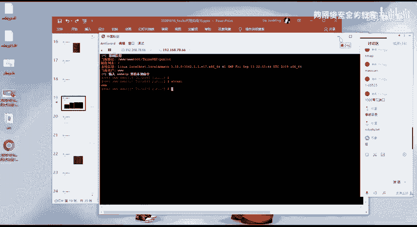

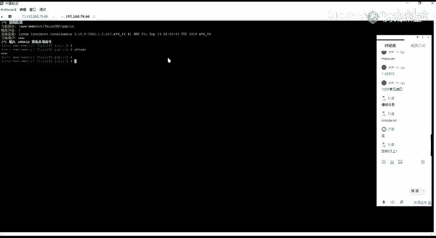

## 概述
在本节课中，我们将学习在成功获取服务器权限后，如何进行后续的信息收集工作。信息收集是渗透测试中至关重要的一步，它决定了我们后续的行动方向。我们将重点学习如何对已控制的主机进行信息收集，并以此为基础，探测和访问其所在的内网环境。

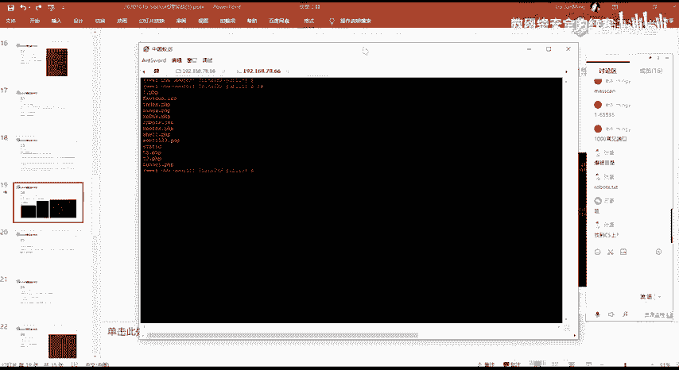

## 主机信息收集
上一节我们介绍了如何获取服务器权限，本节中我们来看看获取权限后的第一步：主机信息收集。只有充分了解目标主机的信息，才能进行有效的后续测试和操作。

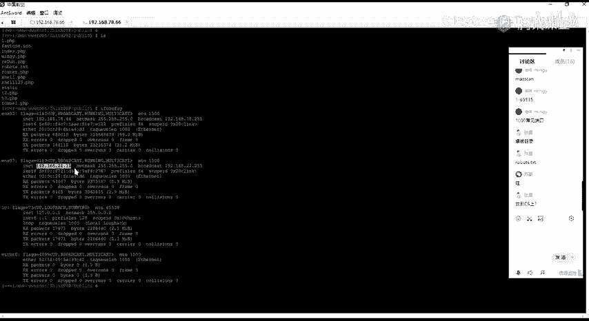

以下是主机信息收集的几个关键方面：

*   **网络配置**：使用 `ifconfig` 命令查看网卡信息，确认主机所处的网络环境，例如是否存在内网网卡。
*   **系统进程**：查看当前运行的进程，了解主机上运行的服务和应用程序。
*   **用户与权限**：确认当前用户的权限级别，为可能的提权操作做准备。
*   **网络连接**：检查主机的网络连接状态，了解它与哪些其他主机有通信。

## 发现内网环境
在对当前Linux主机执行 `ifconfig` 命令后，我们发现它拥有两个网卡：`eth0`（外网IP）和 `eth1`（内网IP `192.168.22.1`）。这意味着这台服务器不仅可以被外网访问，还能访问 `192.168.22.0/24` 这个内网网段。

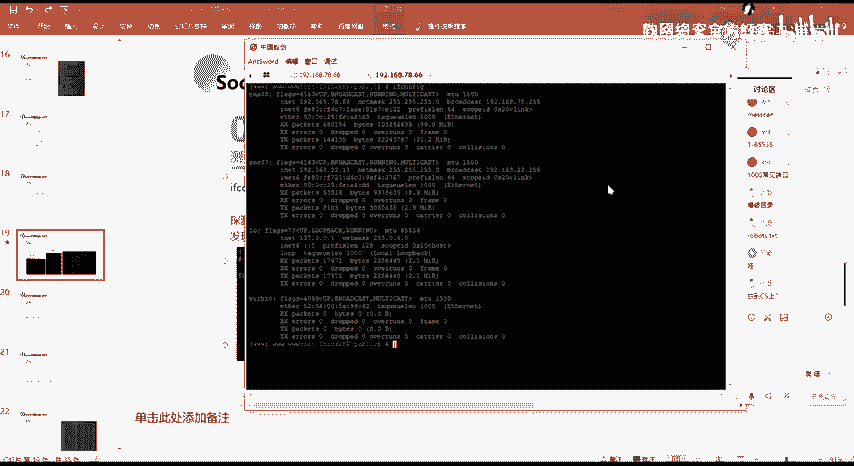

这个发现至关重要，它告诉我们，可以将这台已控制的服务器作为“跳板机”，通过它来探测和访问原本无法直接到达的内网。


## 内网存活主机探测
既然发现了内网网段（`192.168.22.0/24`），下一步就是探测该网段内有哪些主机是存活的（即开机并分配了IP地址）。一个网段通常有254个可能的IP地址（1-254），我们需要找出其中活跃的主机。

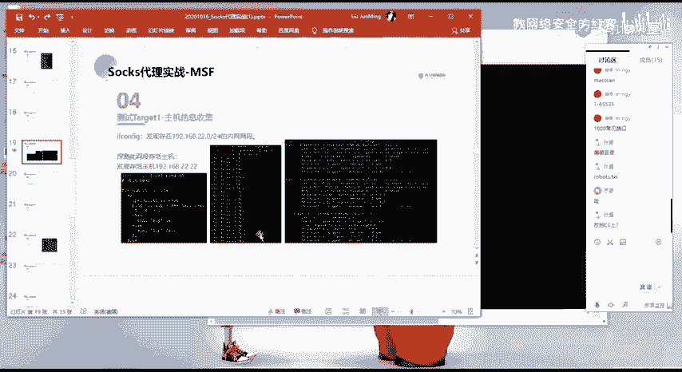

在内网环境中，使用 `ping` 命令进行存活探测是一种快速有效的方法。当然，如果目标网络禁用了ICMP协议（禁ping），则需要采用其他技术。

以下是使用Shell脚本进行内网ping扫描的一个简单示例：

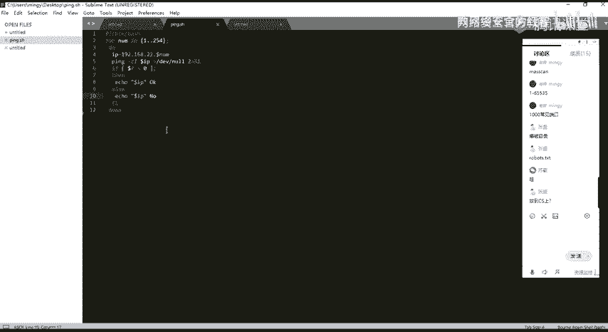

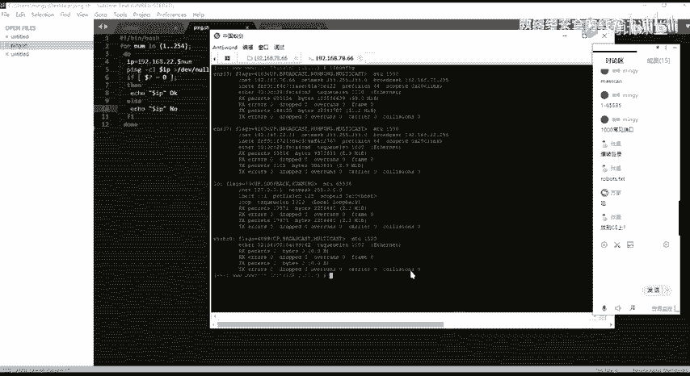

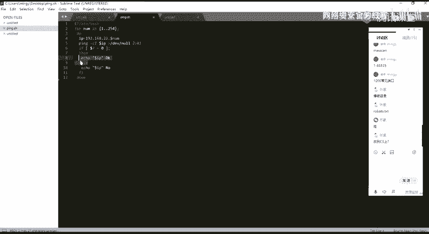

```bash
#!/bin/bash
for ip in {1..254}
do
    ping -c 1 -W 1 192.168.22.$ip > /dev/null 2>&1
    if [ $? -eq 0 ]; then
        echo “192.168.22.$ip is OK”
    else
        echo “192.168.22.$ip is NO”
    fi
done
```

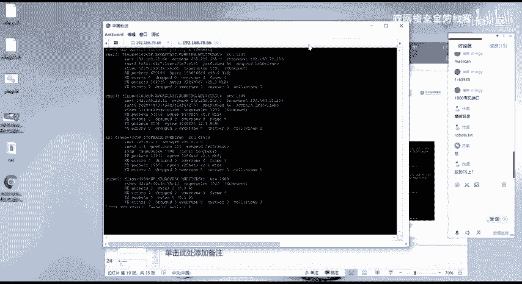

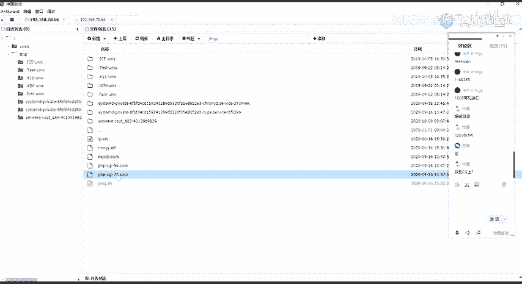

**脚本解释**：
*   `for ip in {1..254}`：循环遍历1到254。
*   `ping -c 1 -W 1`：向每个IP发送1个数据包，等待1秒。
*   `> /dev/null 2>&1`：将命令的标准输出和错误输出都重定向到空设备，不显示在终端上。
*   `if [ $? -eq 0 ]`：判断上一条命令（ping）的返回值，如果为0（表示成功），则执行`then`后面的语句。

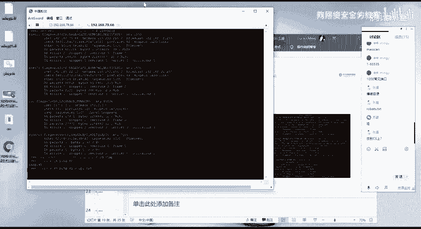

## 实践操作与注意事项
我们将写好的Shell脚本上传到已控制的服务器上并执行。执行命令如下：
```bash
./ping.sh > ip_list.txt
```
此命令会将扫描结果保存到 `ip_list.txt` 文件中。

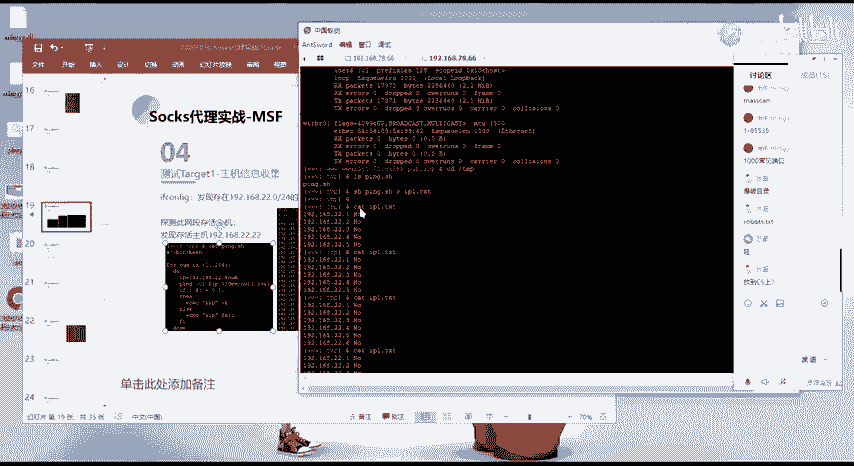

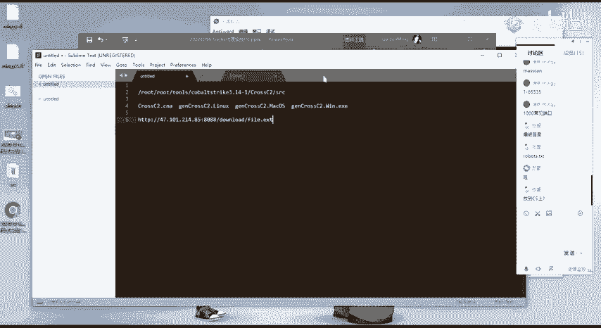

**一个重要注意事项**：在Windows系统上编写的Shell脚本，如果直接上传到Linux系统执行，可能会因为**换行符格式（CRLF vs LF）** 或**编码问题**而报错。建议在Linux环境下直接编写脚本，或使用专业的文本编辑器（如VS Code、Notepad++）确保文件格式为Unix（LF）。

执行脚本后，我们得到了存活主机列表，例如发现了 `192.168.22.2` 这台主机。接下来，我们就需要以当前控制的服务器为跳板，对 `192.168.22.2` 进行进一步的渗透测试，例如端口扫描。

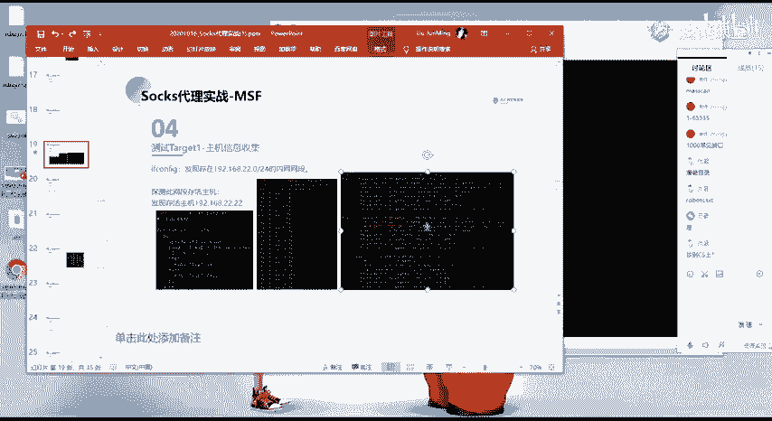

## 面临的挑战与后续思路
当我们试图在跳板机上使用像 `nmap` 这样的工具扫描内网主机时，可能会遇到问题：跳板机上可能没有安装我们需要的工具，而安装这些工具通常需要 `root` 权限。

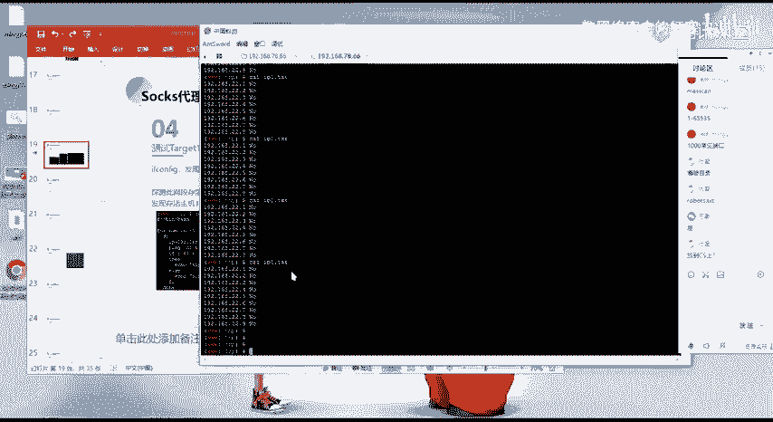

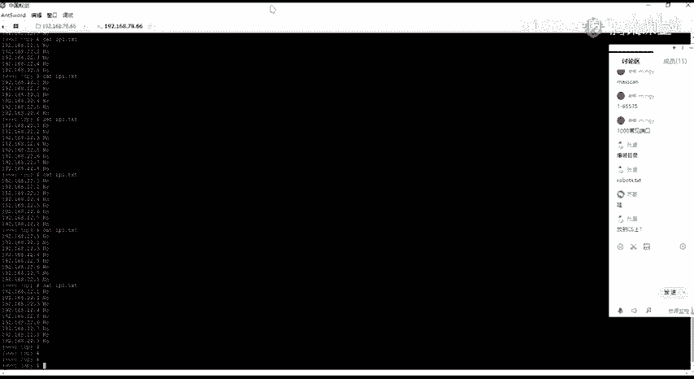

这引出了两个常见的后续方向：
1.  **权限提升**：尝试将当前的shell权限提升为 `root` 权限，以便在跳板机上自由安装和使用工具。
2.  **建立反向代理**：将跳板机的网络流量代理到我们自己的攻击机上，这样我们就可以直接使用自己机器上强大的工具集（如Metasploit, nmap等）来扫描和攻击内网。这是一种更常用和灵活的方法。

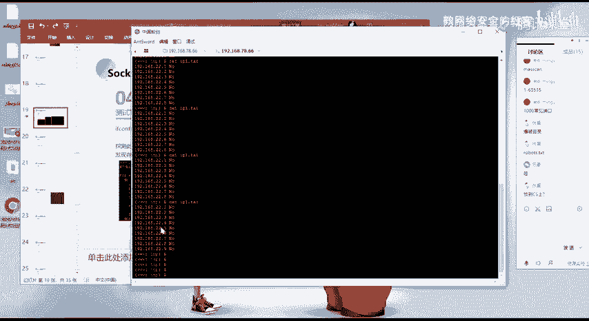

## 总结
本节课中我们一起学习了获取服务器权限后的标准流程。核心在于**持续的信息收集**：首先收集当前主机信息，进而发现内网入口，接着探测内网存活主机。整个过程环环相扣，信息是决策的基础。同时，我们实践了简单的内网探测脚本，并了解了后续渗透测试中可能遇到的挑战（如工具缺失）和解决思路（提权、建立代理）。记住，耐心和细致的信息收集是成功渗透的关键。