# 网络安全系统教程：6：HTTP基础-请求消息

在本节课中，我们将学习HTTP协议中“请求消息”的构成。理解请求消息是分析网络通信、进行Web安全测试的基础。我们将拆解请求消息的各个部分，并学习如何解读它们。

上一节我们介绍了HTTP协议的基本概念，本节中我们来看看浏览器向服务器发送的“请求消息”具体包含哪些内容。

## 请求消息的结构

当我们访问一个网页时，浏览器会向服务器发送一条请求消息。这条消息有固定的格式，服务器能够理解并据此做出响应。作为安全工程师，我们也必须能看懂它。

一条标准的HTTP请求消息主要包含三个部分：**请求行**、**请求头**和**请求体**（可能为空）。它们之间由空行分隔。

以下是请求消息各部分的详细说明：

*   **请求行**：位于消息的第一行，规定了本次请求的核心信息。
    *   **格式**：`请求方式 请求的URI HTTP协议版本`
    *   **示例**：`GET /index.html HTTP/1.1`
    *   **含义**：使用GET方式，请求服务器上`/index.html`这个资源，使用的HTTP协议版本是1.1。

*   **请求头**：从第二行开始，到第一个空行之前的所有内容。它包含了关于客户端环境和请求的附加信息。
    *   **示例**：
        ```
        Host: www.example.com
        User-Agent: Mozilla/5.0 (Windows NT 10.0; Win64; x64)
        Accept-Language: zh-CN
        ```
    *   **含义**：告诉服务器我要访问`www.example.com`，我的浏览器是Windows系统上的Mozilla，并希望接收中文内容。

*   **请求空行与请求体**：请求头之后必须有一个空行，标志着请求头的结束。空行之后的内容就是**请求体**。
    *   **注意**：空行在计算机中是一个明确的结束标志，不等于“没有”。
    *   **请求体**：用于携带需要发送给服务器的数据。在GET请求中，请求体通常为空；在POST请求中，数据就放在这里。

## 核心请求方式：GET与POST

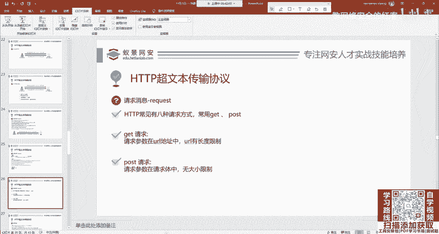

HTTP协议定义了多种请求方式，但在实际应用中，**GET**和**POST**覆盖了99%以上的场景。理解它们的区别至关重要。

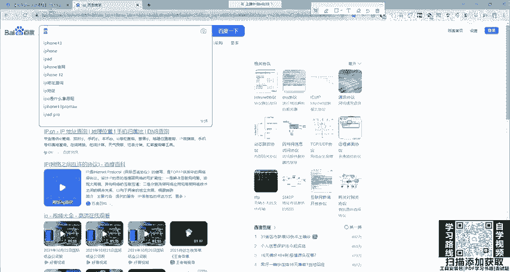

### GET请求

GET请求的参数会直接附加在URL（网址）之后。

*   **特点**：请求参数在URL中可见。
*   **格式**：`URL?参数名1=值1&参数名2=值2`
*   **示例**：在百度搜索“网络安全”，URL会变为：
    ```
    https://www.baidu.com/s?wd=网络安全
    ```
    `wd=网络安全`就是GET请求携带的参数。
*   **应用场景**：获取数据，如搜索、跳转页面、点击链接。

### POST请求

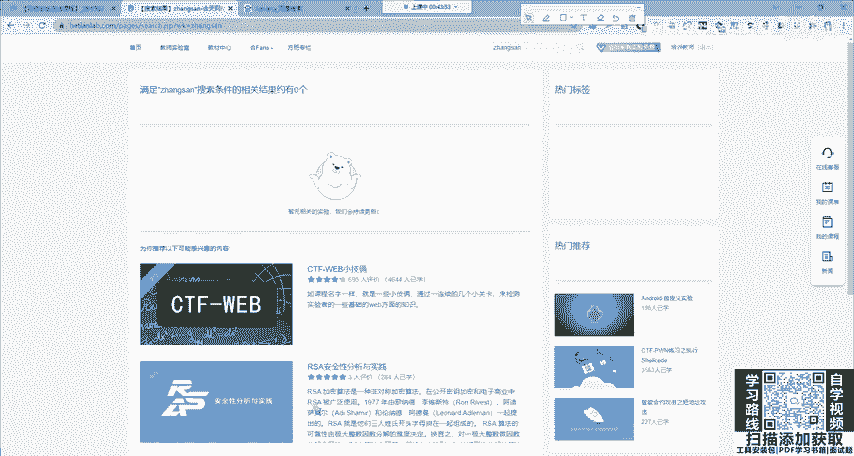

POST请求的参数放在**请求体**中，URL上看不到。

*   **特点**：请求参数在请求体中，相对更安全（非绝对），可传输较大数据。
*   **与GET的关键区别**：
    1.  **参数位置不同**：GET在URL，POST在请求体。
    2.  **请求行中的方式不同**：GET变为POST。
    3.  **必须的请求头**：POST请求通常需要在请求头中通过`Content-Type`字段声明请求体的数据类型。
*   **`Content-Type`示例**：
    *   表单数据：`Content-Type: application/x-www-form-urlencoded`
    *   JSON数据：`Content-Type: application/json`
    *   文件上传：`Content-Type: multipart/form-data`
*   **应用场景**：提交数据，如登录、注册、上传文件。

> **安全提示**：在渗透测试中，尝试将GET请求改为POST请求（或反之）是绕过某些安全检查的常见方法，但务必注意同步修改`Content-Type`等必要头部，否则请求可能无效。

## 常见请求头详解

请求头包含了丰富的客户端信息。以下是几个关键字段：

以下是几个必须了解的常见请求头：

*   **Host**：指定请求要发送到哪个服务器（域名或IP）。这是HTTP/1.1中**必须**的头部。
    *   `Host: www.hetianlab.com`

*   **User-Agent**：包含客户端浏览器和操作系统的详细信息。网站常据此进行差异化显示（如PC版与手机版）。
    *   `User-Agent: Mozilla/5.0 (Windows NT 10.0; Win64; x64) AppleWebKit/537.36`

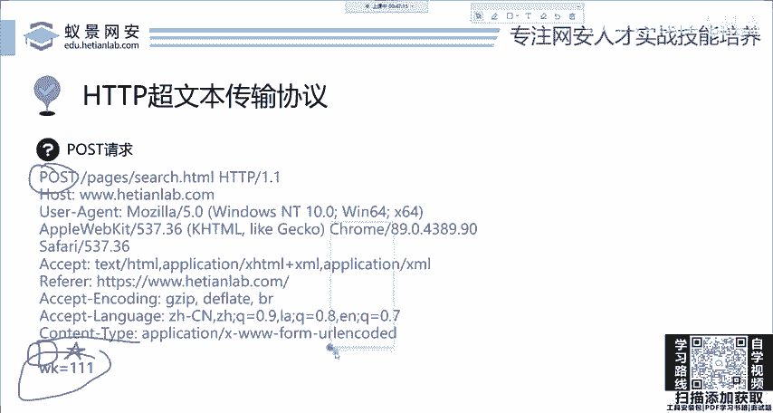

*   **Content-Type**：仅用于POST等有请求体的方法，声明请求体的媒体类型。
    *   `Content-Type: application/x-www-form-urlencoded`

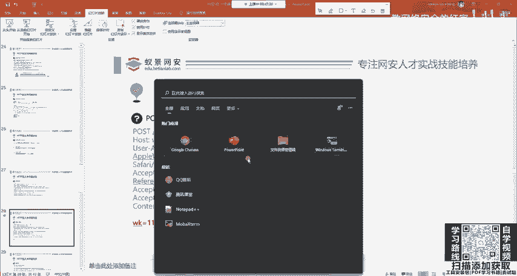

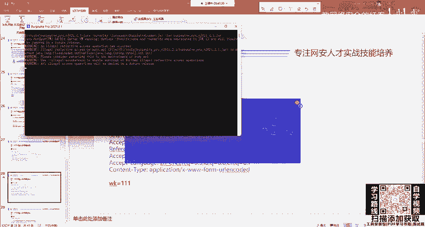

*   **Cookie**：携带服务器之前设置在客户端的会话信息，用于身份维持。
    *   `Cookie: session_id=abc123`

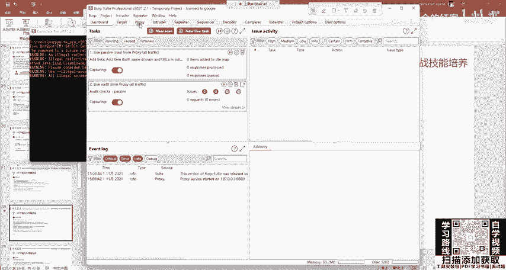

*   **Referer**：表示当前请求是从哪个页面链接过来的。可用于统计分析，但也可能泄露来源隐私。

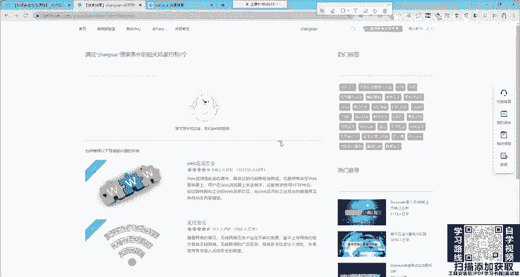

## 如何查看请求消息

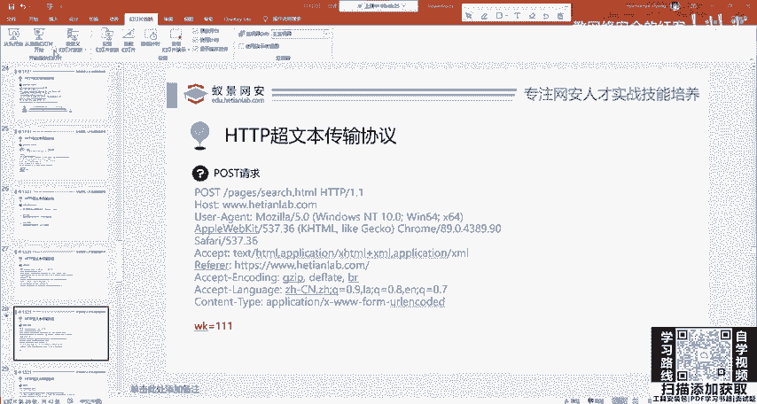

作为安全工程师，我们需要工具来捕获和分析这些“看不见”的网络流量。

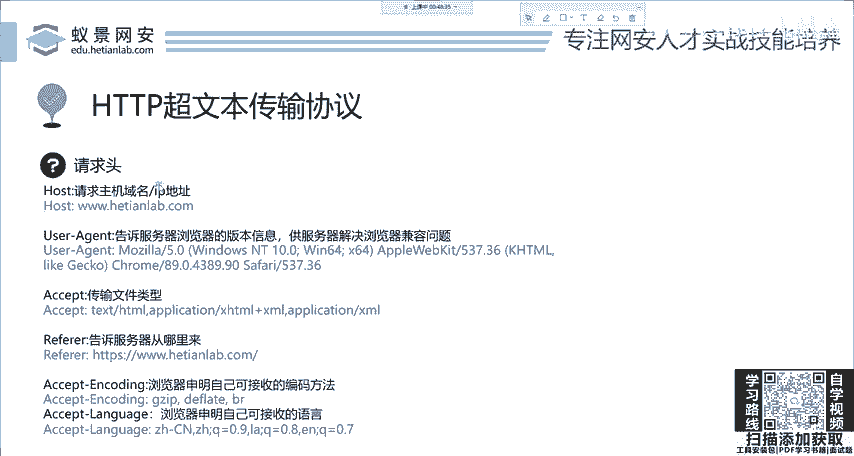

*   **推荐工具**：Burp Suite、Fiddler、浏览器开发者工具（F12）。
*   **查看方法**（以浏览器开发者工具为例）：
    1.  打开浏览器，按`F12`键。
    2.  切换到 **“网络”(Network)** 标签页。
    3.  刷新页面或进行任意操作（如点击、搜索）。
    4.  在请求列表中点选任意一条记录，在右侧即可查看详细的**请求头**(Headers)和**请求体**(Payload)信息。

通过工具，你可以清晰地看到我们上面所讲的所有组成部分，并能够手动修改它们进行安全测试。

---

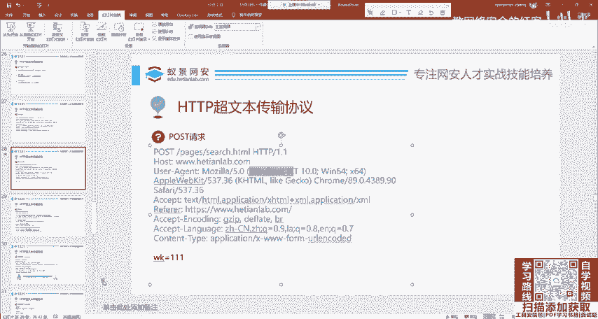

本节课中我们一起学习了HTTP请求消息的完整结构。我们拆解了**请求行**、**请求头**和**请求体**，重点对比了**GET**与**POST**两种核心请求方式的区别，并介绍了几种关键的请求头字段。最后，我们知道了可以使用专业工具（如Burp Suite）来查看和操作这些请求消息。这是你迈向Web渗透测试实践的第一步，请务必理解并掌握。