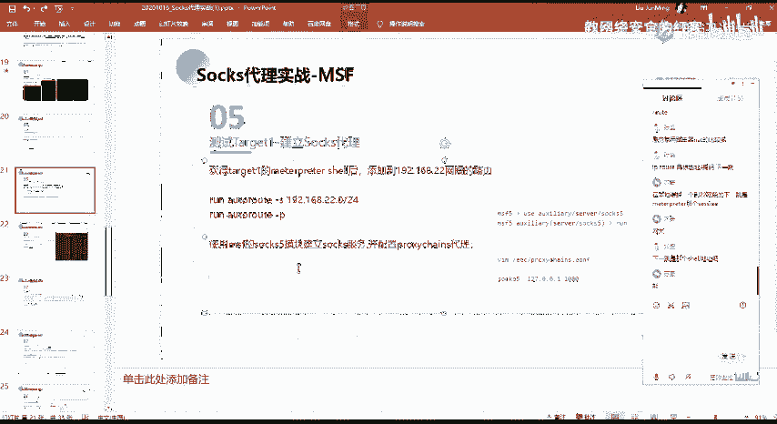
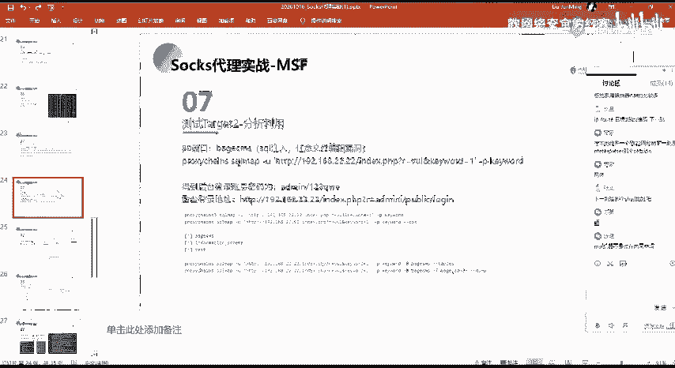

# 网络安全系统教程：P71：58.内网信息收集



## 概述
在本节课中，我们将学习在成功实现内网穿透后，如何对内网目标进行信息收集。我们将重点介绍通过代理通道使用工具进行端口扫描的方法及注意事项。

---

## 通过代理进行内网端口扫描

上一节我们介绍了如何建立内网穿透通道。本节中，我们来看看如何利用这个通道对内网主机进行信息收集，特别是端口扫描。

我们已经能够通过代理服务器访问内网网段。接下来，我们需要对该网段内的主机进行信息收集操作。这类似于我们之前学过的外部信息收集流程。

我们可以使用 Nmap 工具对目标进行端口扫描。在代理环境下，你可以直接使用命令行执行扫描。

以下是执行扫描的基本命令格式：
```bash
proxychains nmap -sT -Pn <目标IP>
```

请注意，在通过 Socks 代理进行扫描时，必须为 Nmap 加上 `-Pn` 参数。这个参数的意思是禁止进行 ICMP ping 扫描。

因为之前提到过，ICMP ping 扫描使用的流量无法通过 Socks 代理通道进行传输。如果不禁止 ping 扫描，会导致错误，并且扫描流量也无法正常通过代理，从而影响扫描结果。

## 扫描结果分析

现在，我们主要来看一下扫描结果。

扫描过程显示，流量通过本地的 1080 端口（即 Socks 代理端口）发出，经由 Socks 通道转发到目标内网 IP 的指定端口。这实质上是将 Nmap 探测端口的流量，通过 Socks 通道转发到了内网目标。

在结果中，`time out` 表示该端口探测超时。这可能意味着端口不存在，或者暂时没有探测到。

而像 `8888`、`22`、`80`、`21` 这样的端口后面标记为 `open`，则表示这些端口是存活的、开放的。通过这种方法，我们就能探测到内网主机（例如 `192.168.2.2`）上开放的端口。

## 后续步骤

成功获取到目标开放的端口信息后，我们的工作就又回到了熟悉的环节：针对这些开放的端口和服务，进行漏洞分析与利用。

---



## 总结
本节课中，我们一起学习了在内网穿透后如何进行信息收集。核心内容是**通过 Socks 代理使用 Nmap 进行端口扫描**，关键点在于必须使用 **`-Pn`** 参数来绕过无法代理的 ICMP 扫描。掌握这一方法后，我们便能发现内网主机的开放端口，为后续的漏洞利用打下基础。