# 网络安全实战：P75：FRP通过Socks渗透内网

## 概述
在本节课中，我们将学习如何利用FRP工具建立Socks代理通道，实现对内网环境的逐步渗透。我们将从一个已控制的内网主机出发，通过代理访问更深层的内网网段，并演示如何配置和使用FRP进行多层网络穿透。

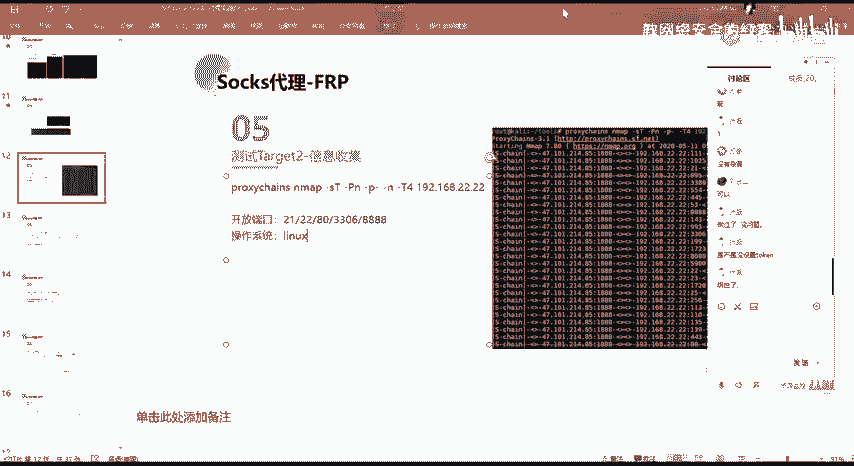

---

## 代理通道验证与信息收集

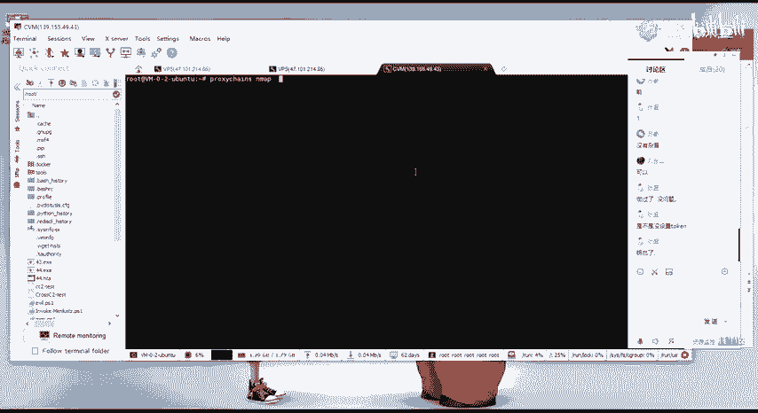

上一节我们介绍了建立代理通道的基本思路，本节中我们来看看如何验证通道并开始信息收集。

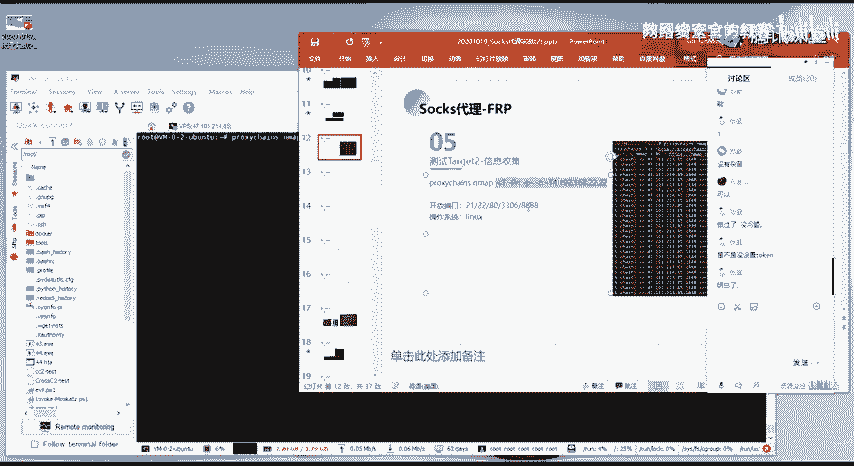

首先，需要验证我们建立的Socks代理通道是否正常工作。可以通过代理对目标网段进行端口扫描来确认。


例如，通过 `proxychains` 工具调用 `nmap` 进行基础扫描。

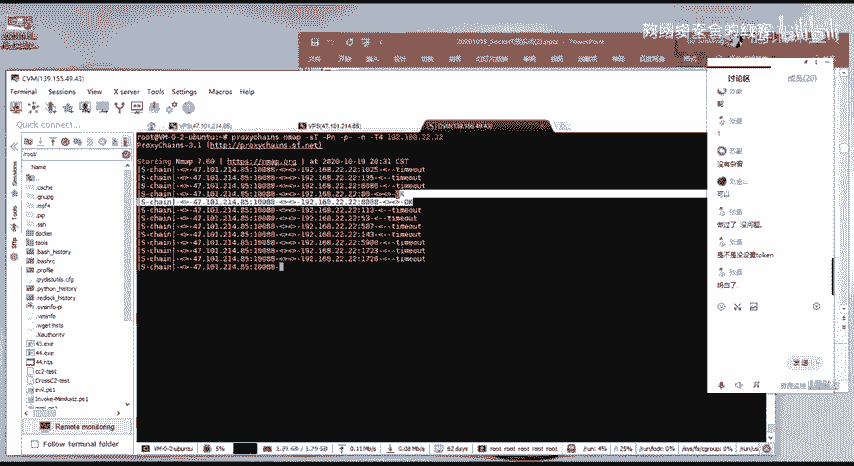


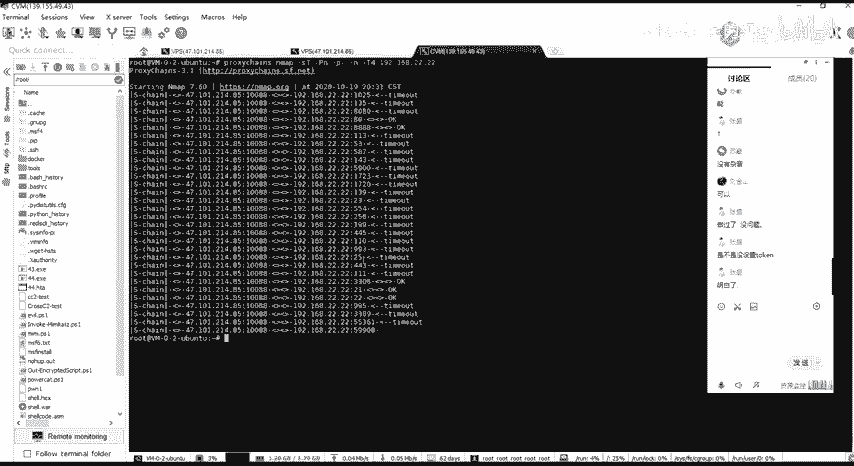

执行命令验证代理通道。


如果代理通道建立成功，扫描结果中会显示部分端口处于开放状态，而非全部超时。全部超时可能意味着目标主机未开机，或代理通道建立失败。当前扫描结果显示有开放端口。


这说明我们的代理通道没有问题。接下来，我们将通过这个代理通道，对目标网段（例如 `192.168.2.0/24`）进行信息收集，发现存活主机。

---

## 利用代理进行内网渗透

在发现存活主机后，下一步就是尝试渗透。例如，我们通过代理发现 `192.168.2.2` 主机80端口存在CMS漏洞。

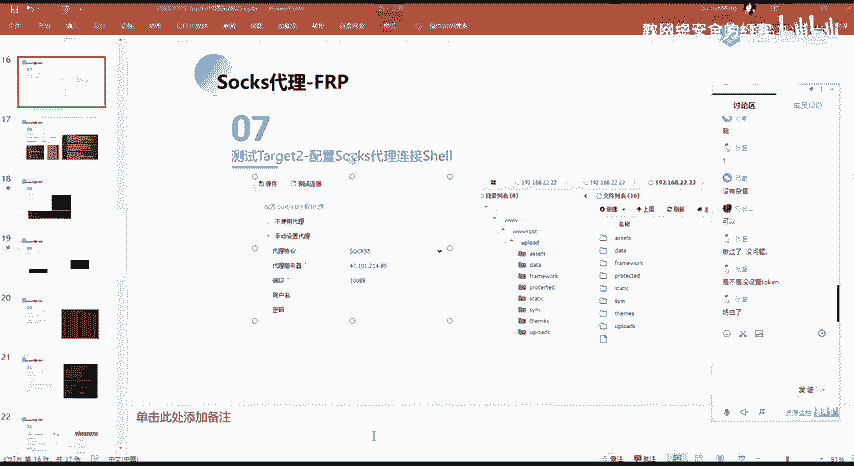

利用该漏洞，我们成功获取了该机器的Webshell权限。


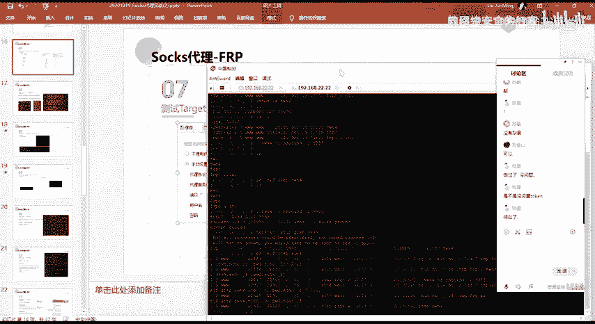

由于获取的Webshell位于内网，外网无法直接连接。但我们之前已经建立了Socks代理通道，可以通过该通道与内网的Webshell进行数据交互。

以下是连接内网Webshell的方法：
许多Webshell连接工具（如蚁剑、冰蝎等）都支持代理设置。我们只需在工具中配置代理服务器为之前建立的Socks代理。


完成设置后，即可成功连接位于内网 `192.168.2.2` 机器的Webshell。获得Webshell后，可以在此机器上进行进一步的信息收集。

---

## 发现并穿透更深层内网

通过已控制的 `192.168.2.2` 主机进行信息收集，我们发现了另一个内网网段，例如 `192.168.33.0/24`，并且该网段下有存活主机。

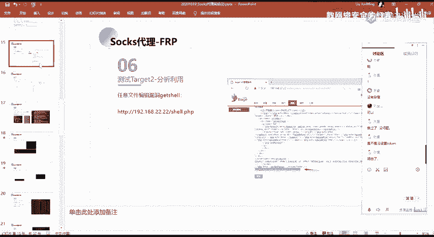

在实战中，一个网段下通常有多台主机，测试目标会更丰富。目前，我们只能通过 `192.168.2.2` 主机的Webshell来访问 `192.168.33.0/24` 网段。

为了能直接从我们的攻击机方便地操作更深层的内网，我们需要将 `192.168.33.0/24` 这个网段也代理出来。


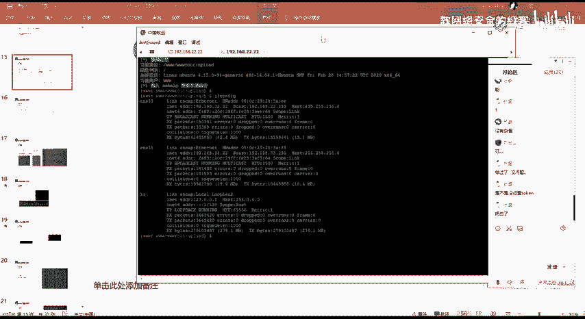

思路是：在已控制的 `192.168.2.2` 主机上，利用FRP再建立一层Socks代理，将 `192.168.33.0/24` 网段的流量转发出来。


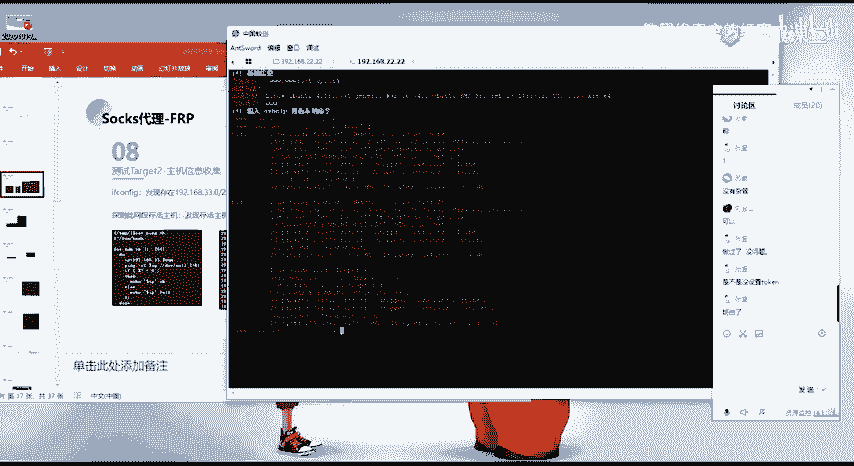

具体操作分为两步，配置如下所示。

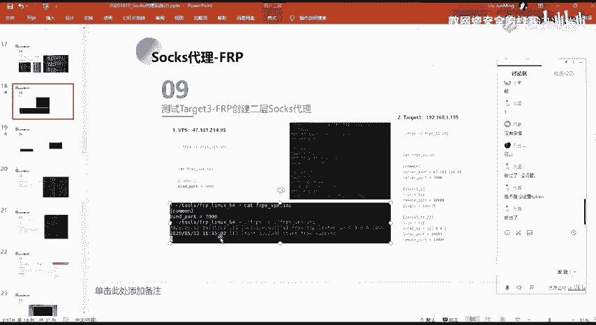


第一步，在VPS（攻击者服务器）上配置FRP服务端（frps），通常只需监听一个端口，等待客户端连接。

**VPS上的 frps.ini 配置示例：**
```ini
[common]
bind_port = 7000
```


第二步，在已控制的 `192.168.2.2` 主机（即第一层内网跳板）上配置FRP客户端（frpc）。这里的配置更为关键，需要建立通向新网段的Socks代理。

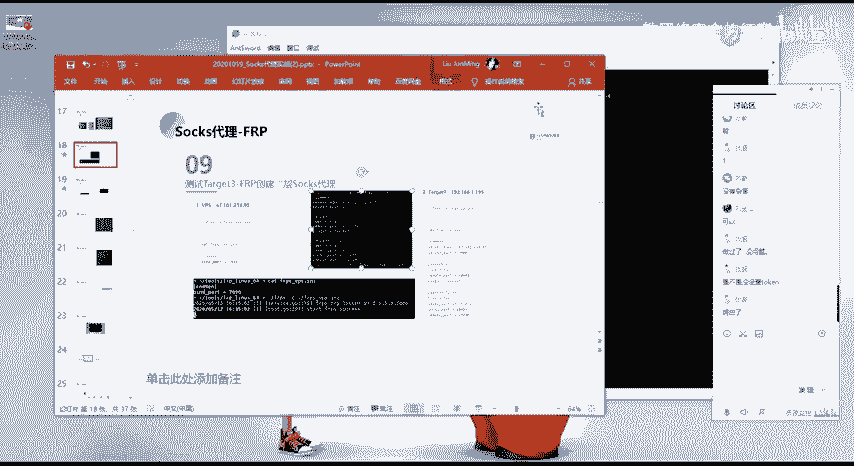


**内网跳板机上的 frpc.ini 配置示例：**
```ini
[common]
server_addr = [你的VPS公网IP]
server_port = 7000

[socks_proxy_to_33net]
type = tcp
remote_port = 1080
plugin = socks5
```

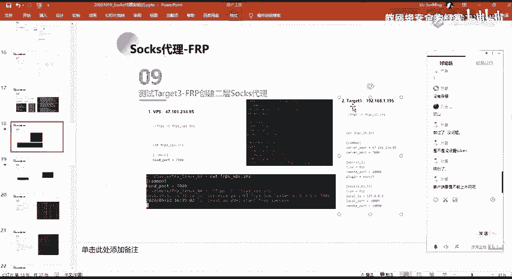

配置完成后，启动服务端和客户端。此时，通过连接VPS的 `1080` 端口，即可建立一个Socks5代理通道，直接访问 `192.168.33.0/24` 网段。

---

## 总结
本节课中我们一起学习了利用FRP进行多层内网渗透的技术。关键步骤包括：
1.  **验证代理通道**：通过代理扫描确认通道有效性。
2.  **通过代理渗透**：利用代理访问内网服务（如Webshell），并以此主机为跳板。
3.  **建立多层代理**：在已控制的跳板机上配置FRP客户端，将更深层的内网网段代理出来，形成链式穿透。


掌握这种方法，可以有效地在复杂的多层内网环境中进行横向移动和渗透测试。